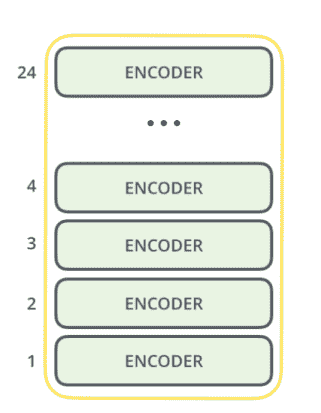
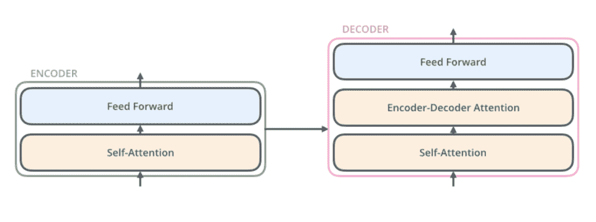
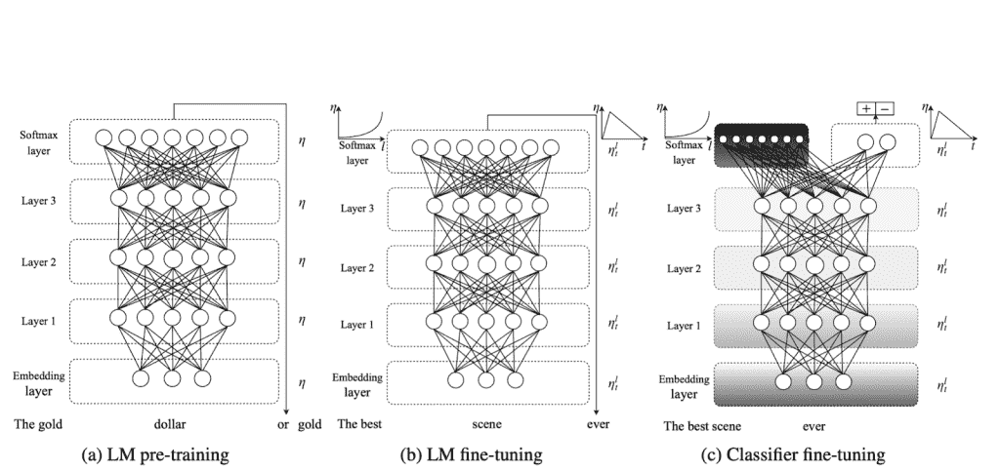
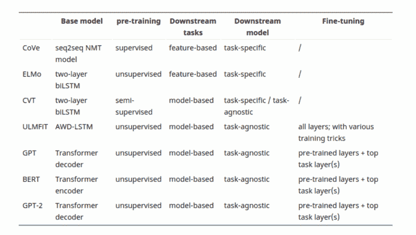
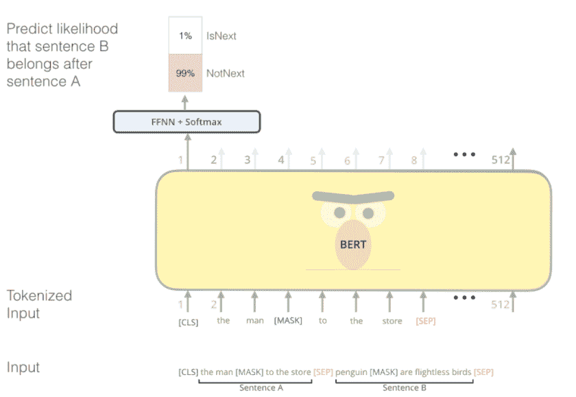
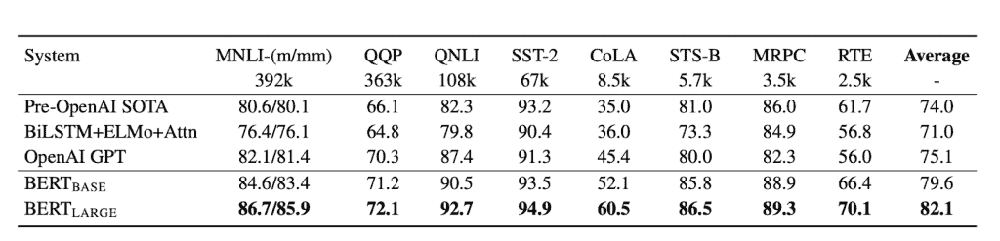
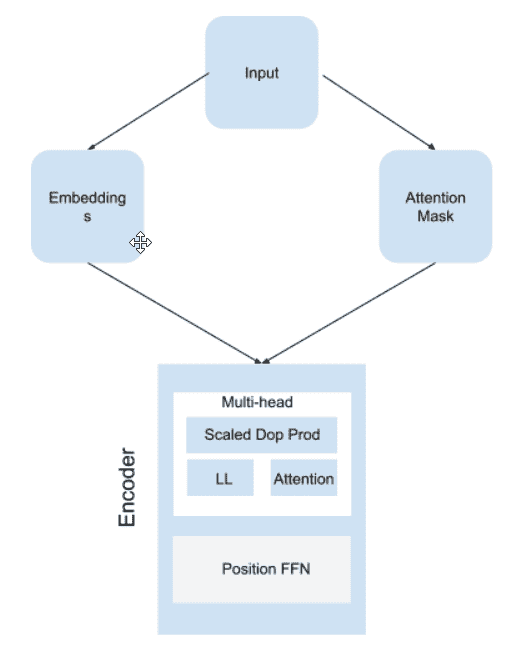

# 使用 PyTorch 实现 BERT

> 原文：<https://medium.com/geekculture/implement-bert-using-pytorch-40e3068639e6?source=collection_archive---------13----------------------->


Photo by [Osman Rana](https://unsplash.com/@osmanrana?utm_source=unsplash&utm_medium=referral&utm_content=creditCopyText) on [Unsplash](https://unsplash.com/s/photos/light?utm_source=unsplash&utm_medium=referral&utm_content=creditCopyText)

如果你对 NLP 感兴趣，你可能听说过 BERT。在这篇文章中，我们将看看伯特，看看它是什么。它是如何工作的？，以及如何用 PyTorch 来写。

谷歌在 2018 年发布了一篇名为“[深度双向转换器语言解释](https://arxiv.org/pdf/1810.04805.pdf)的预训练”的论文。在这项研究中，他们描述了 BERT(带转换器的双向编码器表示)，这是一种语言模型，在问答、自然语言推理、分类和一般语言理解评估等任务中实现了最先进的性能。

BERT 版本是在三个架构发布之后发布的，这三个架构也实现了最先进的性能。这些模型是:

*   乌尔姆-菲特(1 月)
*   埃尔莫(二月)，
*   GPT 公开赛(6 月)
*   伯特(十月)。

开放的 GPT 和伯特使用变压器设计，不使用递归神经网络。这使得该架构能够通过自我关注机制来考虑长期关系，这自然改变了我们对顺序数据建模的方式。它介绍了一种用于包括图片制作在内的计算机视觉应用的编码器-解码器架构。

那么，是什么让 BERT 从 2018 款的其余车型中脱颖而出呢？为了回答这个问题，我们必须首先理解什么是 BERT 以及它是如何工作的。

那么，我们开始吧。

# 伯特是什么？

“带变压器的双向编码器表示”或 BERT 是“带变压器的双向编码器表示”的首字母缩写换句话说，通过编码器运行数据或单词嵌入，BERT 提取模式或表示。编码器由许多层叠的变压器组成。这是一个双向转换器，这意味着它在训练过程中同时检查左右上下文。



BERT 使用两种训练范式:**预训练**和**微调**。

该模型在一个巨大的数据集上进行训练，以在预训练期间提取模式。这通常是一个无监督的学习任务，其中模型是在无标签的数据集上训练的，如来自维基百科等大规模语料库的数据。

在微调期间，该模型为下游任务(如分类、文本生成、语言翻译、问题回答等)进行了训练。你基本上可以下载一个预先训练好的模型，然后在你的数据上进行迁移学习。

# BERT 的核心组件

伯特借用了以前发布的 SOTA 模型的想法。让我们详细阐述一下那句话。

## 变形金刚

变压器架构是 BERT 最重要的部分。编码器和解码器是构成转换器的两个组件。自注意层和前馈神经网络是编码器的两个组成部分。

自我注意层接受输入，将每个单词转换成中间编码表示，随后输入到前馈神经网络。自我注意层、编码器-解码器注意和前馈神经网络都是前馈网络的一部分，前馈网络将这些表示发送给解码器。



转换器设计的优点是允许模型保留无限长的序列，这在以前用常规的 rnn、LSTMs 和 gru 是不可能的。然而，尽管它可以建立长期依赖关系，但它缺乏上下文意识。

## 工程与后勤管理局

BERT 的灵感来自 ELMo(来自语言模型的嵌入)，它代表来自语言模型的嵌入。2017 年，Peters 等人发表了 ELMo，其中涉及了语境理解的概念。

BERT 借用了 ELMo 的另一个概念，即语言模型嵌入。埃尔莫是由[彼得斯等人介绍的。艾尔。](https://arxiv.org/abs/1802.05365)2017 年，涉及语境理解的思想。ELMo 的工作方式是使用双向 LSTM 来理解这种情况。因为它从两个方向考虑单词，所以它可以对拼写相同但具有不同含义的单词进行各种单词嵌入。

例如，“你们这些孩子应该在黑暗中团结在一起”，并不等同于“把那根棍子递给我。”尽管事实上同一个词在两个句子中使用，但其含义因上下文而异。

因此，ELMo 通过考虑来自左右两个方向的单词来分配嵌入，而不是像早期的模型那样只包括来自左边的单词。使用了 RNNs、LSTMs 和其他单向模型。

这允许 ELMo 从序列中提取上下文信息，但与 transformers 不同，ELMo 并不长期依赖于序列，因为它使用了 LTSM。

到目前为止，我们已经看到，由于 transformers 中存在的注意机制，BERT 可以访问文档中的序列，即使序列中当前单词后面的单词也是如此，即它可以保持长期依赖性，并且由于 ELMo 中存在的双向机制，它还可以实现对句子的上下文理解。

## 乌尔姆拟合

杰瑞米·霍华德和塞巴斯蒂安·鲁德在 2018 年发表了一项名为通用语言模型微调或 ULM-FiT 的研究，他们在研究中表示，迁移学习可能会在自然语言处理中使用，就像它在计算机视觉中一样。

以前，对于单词嵌入，我们使用的预训练模型只针对整个模型的第一层，即嵌入层，整个模型都是从头开始训练的，这非常耗时，而且收效甚微。另一方面，Howard 和 Ruder 提出了三种文本分类方法:

*   第一步包括在更大的数据集上训练模型，以便模型学习表示。
*   在第二步中，使用特定于任务的数据集对模型进行微调以进行分类，在此期间，他们包括两种额外的方法:判别微调和倾斜三角学习率(STLR)。在网络的传输层，前一种方法旨在微调或优化每个参数，而后一种方法控制每个优化步骤中的学习速率。
*   分类器在特定于任务的数据集上进行微调，用于第三阶段的分类。



由于 ULM-FiT 的引入，NLP 从业者现在可以在他们的 NLP 挑战中练习迁移学习方法。ULM-FiT 迁移学习方法的主要问题是，它需要微调网络的所有层，这非常耗时。

## GPT 开放大学

OpenAI 的拉德福德、纳拉西姆汉、萨利曼斯和苏茨基弗介绍了 GPT(预训练生成变压器)。在单向方法中，他们提供了一个只使用转换器中的解码器而不是编码器的模型。因此，它在各种任务中的表现优于所有以前的型号，例如:

*   分类
*   自然语言推理
*   语义相似度
*   问题回答
*   多项选择。

尽管 GPT 只使用了解码器，但它仍然可能具有长期依赖性。此外，与 ULM-FiT 相比，它将微调减少到最低限度。

下表从预培训、下游任务以及最重要的微调方面比较了各种模型。



以下是 GPT 论文的摘录:“与循环网络等替代方案相比，这种模型选择为我们提供了更好的结构化记忆，以解决文本中的长期依赖性，从而在各种任务中实现稳定的传输性能。”在转换过程中，我们利用从遍历式方法中派生出来的特定于任务的输入适应，这种方法将结构化的文本输入作为一个连续的记号序列来处理。正如我们在实验中所展示的，这些适应使我们能够有效地进行微调，对预训练模型的架构进行最小的改变。

# 为什么是伯特？

伯特是一个自我监督的典范。也就是说，在没有人类明确编程的情况下，它可以从原始语料库中产生输入和标签。请记住，它所训练的数据是非结构化的。

掩蔽语言模型和下一句预测是 BERT 预先训练的两项任务，前者使用掩蔽输入，如“那个人[掩蔽]到商店”，而不是“那个人去了商店”。这限制了 BERT 看到它旁边的单词，这允许它尽可能多地学习双向表示，使它对几个下游任务更加灵活和可靠。后者预测这两个句子是否在上下文中相互分配。


例如，如果句子 A 是“[CLS]那个人[面具]去商店”，句子 B 是“企鹅[面具]是不会飞的鸟[SEP]”，那么 BERT 将能够区分这两个句子是否是连续的。

在训练过程中，BERT 使用特殊类型的标记，如[CLS]、[屏蔽]、[分离]等，这些标记允许 BERT 区分一个句子何时开始，哪个单词被屏蔽，以及两个句子何时分开。我已经在**预处理**部分以表格的形式解释了这些令牌。

**由于我们之前讨论过的特性，BERT 还可以用于特征提取**，并将这些提取提供给你现有的模型。



在最初的 BERT 论文中，它与 GPT 在[通用语言理解评测基准](https://gluebenchmark.com/)上进行了比较，下面是结果。



正如你所看到的，伯特在所有的任务中都超过了 GPT，平均比 GPT 高出 7%。

# 建筑模型

BERT 是一个复杂的模型，如果你接近它的速度足够慢，你就会失去逻辑。因此，一个接一个地检查每个组件及其功能是有意义的。

BERT 具有以下组件:

1.  嵌入层
2.  注意力屏蔽
3.  编码器层
4.  多头注意力
5.  比例点产品关注度
6.  位置式前馈网络
7.  伯特(组装所有部件)

为了便于学习，你可以随时参考这个图表。



## 嵌入层

BERT 中的第一层是嵌入，它接受输入并构建一个查找表。嵌入层参数是可学习的，这意味着一旦学习过程完成，嵌入将把相关单词聚集在一起..

嵌入层还保留单词之间的不同关系，如语义、句法和线性联系，以及上下文交互，因为 BERT 是双向的。

在 BERT 的例子中，它为

*   令牌，
*   分段和
*   位置。

我们还没有编写一个函数来接收输入并为位置嵌入进行格式化，但是标记和段的格式化已经完成了。因此，我们将获取数据，并为序列中的每个单词分配一个位置。它看起来像这样:

```
print(torch.arange(30, dtype=torch.long).expand_as(input_ids))
```

# 损失和优化

虽然原始论文计算了所有词汇的概率分布，但我们可以使用 softmax 近似值。但是一个简洁的方法是使用 ***交叉熵损失*** 。它是 *softmax* 和*负对数似然*的组合。

因此，在构建模型时，您不必包括 softmax，而是从没有 softmax 归一化的前馈神经网络获得清晰的输出。

说到优化，我们将使用 **Adam** 优化器。

```
criterion = nn.CrossEntropyLoss()
optimizer = optim.Adam(model.parameters(), lr=0.001)
```

# 结论

BERT 是一种前沿的自然语言处理模型。预训练模型是在大型语料库上训练的，您可以根据您的需求和任务在较小的数据集上对其进行微调。关于微调最好的部分是你不必做 1000 个纪元；根据参数和数据集处理的效率，它可以在 3 到 10 个时期内复制 SOTA 性能。

快乐阅读！！