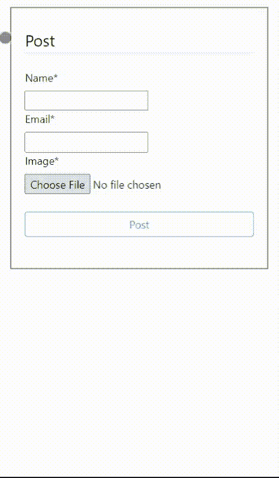
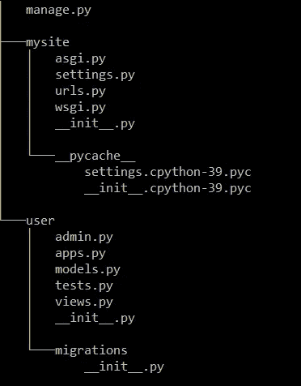
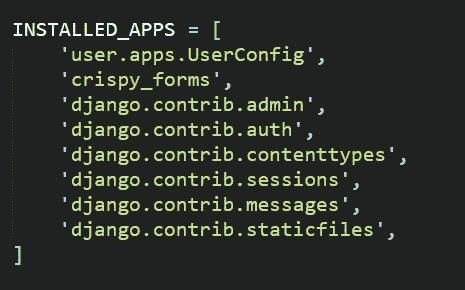

# 在 10 分钟内实现网站的裁剪功能| Cropper.js

> 原文：<https://medium.com/geekculture/implement-cropping-feature-on-your-website-in-under-10-min-cropper-js-46b90d860748?source=collection_archive---------2----------------------->


> js 是 jQuery Image Cropper 插件的 JavaScript 版本，它为任何图像提供了丰富的图像裁剪功能。

在本文中，我们将研究如何在一个非常简单的网站上实现 cropper.js 插件，这样当用户在 HTML 表单上输入图像时，他们将被提示首先裁剪图像，在成功裁剪后，表单中的原始图像将被裁剪后的图像所替换，用户可以提交表单。

**最终项目演示:**



> ***注意*** *:出于本文的演示目的，示例项目是使用 Django 框架作为后端实现的，但是使用任何其他框架或技术栈实现项目的读者也可以跟随，因为该插件的核心实现细节依赖于只使用基本的 HTML、CSS 和 JS。*

# 我们开始吧

我们将建立一个如上所示的非常基本的项目，其中任何用户都可以在一个表单上发布其个人资料详细信息(姓名，电子邮件和个人资料图片)，上传个人资料图片后，将显示裁剪视图功能，在裁剪图像后，用户可以发布其更新的个人资料与裁剪图像作为输入。

> **注意:读者已经使用其他框架或技术实现了他们的项目，并且正在考虑如何在他们的网站中集成裁剪功能，那么他们可以直接跳转并从步骤 6.2 继续。**

# 制作 Django 应用程序

## 步骤 1:安装基本库

*   创建并激活您的[虚拟环境](https://packaging.python.org/guides/installing-using-pip-and-virtual-environments/)，并使用，

```
$ pip install django
$ pip install django-crispy-forms
$ pip install Pillow
```

*   [django-crisp-forms](https://pypi.org/project/django-crispy-forms/)是一个允许我们在前端轻松设计表单样式的库。
*   [Pillow](https://pillow.readthedocs.io/en/stable/) 库需要处理我们的数据库模型中接收到的图像

## 步骤 2:设置 Django 项目

*   让我们首先创建我们的 django 项目，它将包含网站的所有不同的应用程序和模块。
*   打开控制台，在工作目录中启动一个新项目，

```
$ django-admin startproject mysite
```

*   在这之后，进入您新创建的项目文件夹“mysite ”,从那里开始一个新的应用程序，

```
$ python manage.py startapp user# user is the app name 
```

*   在这之后，您的工作项目文件夹(mysite)结构必须看起来像这样，



*   现在在你的 mysite/mysite 文件夹中打开你的 settings.py 文件，在 INSTALLED_APPS 列表中添加我们的用户应用程序名和 crisp-form 库名，这样 django 就可以在运行时访问它们



## 步骤 3:创建数据库模型

*   现在，在 mysite/user/models.py 文件中，我们将定义我们的数据库模式，该模式由一个名为 Profile 的表组成，该表以 name、email、datePosted 和 profileImage 为列，

*   upload_to= "profile_pics "参数将使该模型中接收到的所有图像存储到名为 profile_pics 的文件夹中。
*   现在，通过使用这些命令，将这个配置文件表提交到我们默认的 sqlite3 数据库(在 settings.py 中提到过),

```
$ python manage.py makemigrations
$ python manage.py migrate
```

## 步骤 4:创建配置文件表单

*   在 Django 中，我们可以很容易地将用户将前端数据上传到数据库模型的表单绑定起来。
*   在 mysite/user/文件夹中，创建一个名为“forms.py”的文件，并在其中添加以下代码，该代码将概要文件数据库模型与概要文件表单链接起来。

## 步骤 5:创建视图和 URL

*   在这一步中，我们将为网站的主页定义后端逻辑，比如当用户上传一些数据时会发生什么，以及哪些数据将被传递到主页以在前端显示。
*   在 mysite/user/views.py 文件中添加以下代码，它将处理我们网站的所有传入 URL 请求。

*   index 是用户访问主页 url 时将调用的函数。
*   当主页 url 上的浏览器发出 GET 请求时，user/home.html 文件将作为呈现的 html 页面返回。将在下一步创建该文件。
*   现在让我们编写代码将主页 url 与这个索引函数连接起来，在 mysite/mysite/urls.py 中添加以下代码，

## 步骤 6.1:创建前端—home.html

*   这将是该过程的最后一步，我们将编写前端 HTML、CSS 和 JS 代码，其中包括表单如何在主页上显示以及如何在其中集成 cropper.js 插件的逻辑。
*   在 mysite/user/中创建一个名为 templates 的文件夹，该文件夹下有一个名为 user 的子文件夹，其中包含名为 home.html 的文件。
*   在这之后，你的用户应用程序文件夹结构必须看起来像这样，

```
-user
  -admin.py
  -app.py
  -forms.py
  -models.py
  -tests.py
  -views.py
  -__init__.py
  -migrations
  -templates
    -user
      -home.html
```

*   打开 home.html 文件并添加以下代码，该代码将显示发布详细信息的表单和所有已发布帖子的列表，

*   第 1 行:导入了 crispy 表单库
*   第 8 行:添加了引导样式表
*   第 17 行:定义了保存从 views.py 传递的表单的表单标记
*   第 21 行:使用了从 view.py 文件传递来的表单参数以及 crispy filter，它会自动为表单添加一些 CSS 样式。
*   第 23 行:一个提交类型按钮，单击它将表单数据和 POST 请求一起提交回我们的索引函数。
*   第 26 行:我们遍历 posts 列表变量，该变量包含从 views.py 文件中的配置文件数据库获取的所有 posts 对象。

## 步骤 6.2:创建前端—home.html

*   对于使用不同框架实现了自己的项目并直接进入这一步的读者来说，让我们通过一个非常基本的例子来理解如何在模板中实现 cropper.js。
*   假设我们有一个名为“home.html”的 HTML 模板，其中有一个包含姓名、电子邮件和图片等字段的表单，如下所示。

*   这是一个非常基本的形式，当用户上传一些数据并点击 post 按钮时，这些数据将被传递到后端。

## 步骤 7:实现裁剪功能

*   现在，我们将使用 cropper.js 添加裁剪功能，这样在提交帖子之前，将显示一个裁剪图像的弹出窗口。

在你的 home.html 里面做如下的改变，

*   在 head 标签部分导入这些 cropper.css 和 cropper.js 文件，

*   现在，在 submit 按钮上方添加一个 id 为“image-box”的 div 元素，类为“image-container ”,它将是 cropper.js 插件视图的容器，同时在它上方添加一个 crop 按钮，它将用于用裁剪后的图像 onclick 替换表单中的原始图像。

*   现在，在结束主标签()下，添加脚本标签，它将保存关于如何实现 cropper.js 插件以及如何用裁剪后的图像替换原始图像的所有逻辑。

*   **这样我们就完成了！**现在，每当用户上传任何图像时，都会提示他们选择先裁剪图像，然后在裁剪后，当他们单击裁剪按钮时，表单中的原始图像将被裁剪后的图像替换，用户可以照常提交帖子。

> 注意:如果你想为这个 cropper 插件库提供一些 CSS 样式，那么你也可以使用他们的 cropper.css 和 cropper.js 文件，这些文件可以在他们的官方 [GitHub repo](https://github.com/fengyuanchen/cropperjs) 下载，而不是使用这些 cdn。

*   运行您的网站使用，

```
$ python manage.py runserver# Your website will be serving locally at [http://127.0.0.1:8000/](http://127.0.0.1:8000/)
```

# 结论

*   在此基础上，我们使用 cropper.js 插件制作了一个非常基本的 Django 应用程序，其中集成了裁剪功能，这样用户就可以用裁剪后的图像来裁剪和替换表单中的原始图像。
*   欢迎在评论区提出你对这篇文章的疑问。
*   在 [LinkedIn 上与我联系。](https://www.linkedin.com/in/RG2021/)
*   该项目的 GitHub 回购:[https://github.com/RG2021/mysite](https://github.com/RG2021/mysite)