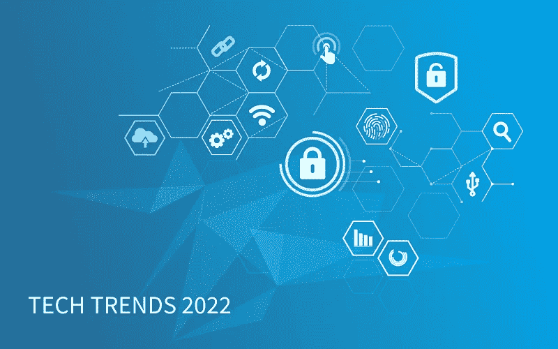

# 在商业中实施创新:2022 年技术趋势— NIX United

> 原文：<https://medium.com/geekculture/implement-innovations-in-business-tech-trends-2022-nix-united-f71fa1c83b4c?source=collection_archive---------26----------------------->

领导者是第一个发现、相信和行动的人。在第四次工业革命中，占主导地位的是技术和商业创新。这意味着，成为现代商业环境中的领导者需要成为第一个采用创新、杰作原则的人，甚至是第一个向市场提出解决方案的人。在这篇文章中，我们分析了现有的趋势，并预测了即将到来的变化，同时考虑到了领先的知名咨询公司麦肯锡、德勤和高德纳的报告中的见解。让我们弄清楚未来等待我们的是什么。商业中创新的原因太多了，也许改变并不遥远。

# 关闭未来趋势

世界发展的速度如此惊人，以至于在接下来的十年里，我们将经历比过去 100 年加起来还要多的技术变革。由于世界各地越来越多的人通过数字解决方案联系在一起，这些创新旨在改革运营和促进业务增长。此外，创新让公司更加灵活，并为创造力提供了空间——例如，让它们能够在金融或医疗服务中实现游戏化元素。

为什么创新在商业中很重要？如果我们不想被整体自动化、数字化和人工智能的应用所困扰或处于不利地位，我们需要迎头赶上。理解这种变化的影响可以帮助个人和组织习惯新的系统。

仔细看看下面的信息图。它展示了一些趋势及其对未来关键行业的影响:

简而言之，主要趋势与数据管理有关。根据关键技术和任务解决方案，我们在不久的将来会遇到的一些趋势可以划分为这样的巨大群体-物联网、云、人工智能、网络安全及其协同作用。让我们仔细看看排名靠前的那些，弄清楚你的企业是否有足够的理由进行创新。

# 连接的未来

5G 和物联网基础设施已经以这样或那样的形式出现在我们的生活中。统计数据显示，这种趋势正在加强，已经成为未来十年最受期待的技术趋势之一。根据麦肯锡的数据，仅在移动、医疗保健、制造和零售技术这四个领域使用连接解决方案就可以使全球 GDP 增加 1.2 万亿美元，到 2030 年将达到 2 万亿美元。利用现有的高级连接技术，可以实现高达 80%的效率。

这意味着，如果得到有效实施，高速移动网络和互联设备有可能极大地改变未来的经济活动。这些变化可以加速所有商业领域的业务增长——例如，通过无线控制移动工具、机器和机器人使制造业更加数字化，优化能源供应，使远程患者监护更加普遍。

医药是积极实施互联技术的行业之一。医疗技术市场已经非常庞大，而且由于新冠肺炎的推动，越来越多的人希望不用亲自去诊所就能了解自己的健康状况。医疗物联网解决方案领域尤为突出。这些技术帮助医生全天候访问患者健康数据，远程诊断，甚至执行机器人手术。此外，患者可以实时监控他们的健康指标，获得药物治疗，并在需要时采取其他紧急措施来挽救生命。

作为一家世界级的软件工程公司，我们在创建远程医疗解决方案方面拥有丰富的经验。其中一个是 iOS 和 Android 应用程序,让用户不用去医院就能咨询不同的医学专家。

世界将受益于物联网架构，包括收集必要数据的设备，以适合进一步使用的形式呈现数据，并能够根据特定信号采取行动。这可以是智能家居系统和照明电器、医疗传感器和可穿戴设备、安全系统和联网汽车。物联网设备之间的相互关系使操作和数据处理更加有效和有益，鼓励世界各地的组织实施创新。因此，到 2026 年，全球物联网市场将超过 13 亿美元。

物联网基础设施已经得到广泛应用，前景巨大。作为实现的例子之一，自动化系统通常用于开发、生产和管理物流链。NIX 开发人员已经设计了一个类似的解决方案——一个[物联网监控和分析系统](https://nix-united.com/success_stories/iot-monitoring-and-analysis-system-for-logistics-company/)——一个多操作物联网系统，提供实时位置、状态数据和关键活动警报，以实现对世界任何地方的每批货物的主动管理。通过云技术，它连接、收集和处理来自设备的遥测数据。它可以监控货物移动过程中的温度变化-当不必要的加热或冷却发生时，管理员和司机会立即得到通知。此外，温度测量有助于构建更准确的路线和防止偏差，以及检测和避免犯罪风险。

# 分布式基础设施

企业重组其业务并使数据和信号的交换更快、更安全的新方法在于互连。这是构建分布式基础架构的一个新趋势——在一个系统中，组件服务于一个目的并相互通信，但相互独立并在不同的机器之间分配。该系统可以包括容器、API 和云解决方案，如私有云和公共云以及两者的组合。

> 这一技术趋势将帮助企业提高速度和灵活性，降低复杂性，节约成本，并加强网络安全防御。
> 
> *麦肯锡*

分布式基础设施最突出的例子是互联网。然而，分布式系统的创新优势和潜力要大得多，目前还没有得到充分利用。这种基础设施的未来依赖于云解决方案。

这里的可能性之一是构建一个广泛的云基础设施。[据麦肯锡称，到 2022 年，70%的公司将实施混合云或云平台，作为分布式 IT 基础设施的一部分](https://www.weforum.org/agenda/2021/10/technology-trends-top-10-mckinsey/)。访问不同的云系统将使数据交换和分析更快。

更复杂的解决方案是单一云环境-数据结构。这是一个完整的信息管理体系结构，在分布式数据环境中具有完整、灵活、无摩擦的访问和数据共享。数据结构在收集和处理海量信息的领域创造了元宇宙，从而节省了数据管理的成本。此外，此类创新的有效实施可最大化您数据的价值，并加速数字化转型。数据结构集成了大数据、人工智能和 ML 技术，优化了数据管理算法，解决了复杂的业务问题，无论公司拥有何种应用、平台和数据存储，它都是有效的。这是他们的优势——这也是他们即将实现的原因。

> *到 2024 年，数据结构部署将使数据利用率提高四倍，同时将人工驱动的数据管理任务减半。*
> 
> *高德纳公司*

# 垂直云架构

随着业务任务的加速，即使是现有的云架构集成领域也在发生变化。例如，云走向垂直——这意味着公司将更经常地寻求创新利益，因此选择有助于自动化人工操作的云解决方案，更加关注竞争性数字差异化，以及尽可能快地扩展。例如，这涉及到创建基础设施即服务(IaaS)或平台即服务(PaaS)系统，这些系统可以精确地满足公司在技术能力方面的业务需求。

# 可组合架构和企业

由于基于模块化的可组合解决方案，云技术甚至可以帮助那些后端编码技能不足的人构建定制的高功能应用程序。

> *到 2024 年，新 SaaS 和定制应用的设计口号将是“可组合的 API 优先或仅 API”，将传统的 SaaS 和定制应用视为“遗产”*
> 
> *高德纳*

可组合架构是一种灵活的原则，它将独立的应用程序块组合在一起，企业可以在其中扩展存储、数据库、网络和计算功能。这种方法是为特定需求设计业务逻辑和创建应用程序的绝好机会，可以节省时间和额外的开发成本，从而将其呈现给市场。这种可组合解决方案的基本场景是基础设施即应用(IaaS)、基础设施自动化和多云方法。所有这些都将 API 作为其生态系统的核心元素。

# 应用人工智能

我们每天都听到人工智能的应用和改变行业的可能性。这是 2022 年及未来几年的一个巨大技术趋势，现代企业没有充分发挥其潜力。

在未来几十年中，人工智能的应用将会成熟并继续扩大规模。它将成为新应用模型的一部分，为开发人员提供更多工具来快速构建应用架构，并使公司能够更深入地了解用户行为和体验。此外，它将有助于最大限度地减少手工重复的任务，如归档，文件准备和索引。

> *到 2025 年，10%建立了人工智能工程最佳实践的企业将从其人工智能工作中产生至少三倍于 90%没有这样做的企业的价值。*
> 
> *高德纳*

应用人工智能还将使工业部门自动化和数字化，如使工程师能够在地面的石油钻井平台上工作，以及医疗保健。从积极方面来说，人工智能架构适合健康领域——它的功能非常广泛，其中[包括](https://nix-united.com/blog/machine-learning-in-healthcare-12-real-world-use-cases-to-know/)医疗信息的排名和智能重组、建议、疾病的分类和预测，以及异常检测。

人工智能应用已经融入到智能可穿戴设备、设备和应用中，[并被各公司高度采用](https://nix-united.com/blog/a-brief-guide-to-ai-in-healthcare/) -46%的服务运营人员、28%的产品和服务开发人员、19%的风险管理人员、21%的供应链管理人员以及 17%的营销和销售人员。

尽管如此，在全球范围内，公司刚刚开始熟悉全能的人工智能基础设施。

# 网络人工智能——一种新的安全方式

随着网络犯罪的成本和频率不断上升，人工智能的应用将改变数据安全问题的常规[方法](https://nix-united.com/blog/artificial-intelligence-in-cybersecurity-strengthening-the-defenses/)。尽管目前网络人工智能技术仍处于采用的早期阶段，但预计到 2025 年，全球市场将增长 190 亿美元。

人工智能技术，尤其是机器学习(ML)算法，擅长检测、遏制和响应恶意操作。[根据德勤的说法，网络人工智能](https://www2.deloitte.com/content/dam/insights/articles/US164706_Tech-trends-2022/DI_Tech-trends-2022.pdf)不仅可以帮助企业更快地应对攻击，还可以预见攻击并提前做出反应。此外，人工智能可以作为一种力量倍增器。ML 和深度学习算法，特别是与自然语言处理和其他决策人工智能解决方案配对，可以帮助安全团队自动化手动耗时的活动，检测精简的遏制措施，并更快地响应复杂的威胁。

网络威胁还会干扰和破坏车辆应用和网络。在这种情况下，基于人工智能的解决方案是一个有效的选择。NIX 开发人员在开发防止车辆遭受网络攻击和故障的软件方面经验丰富。该团队创建了[vs entry](https://nix-united.com/success_stories/vsentry-ai-web-app/)-一个经过 ML 训练的系统，使用原始车辆数据，可以精确地检测异常并降低假阳性警报的几率。因此，汽车企业主可以降低保修成本，最大限度地减少车辆停机时间，降低总拥有成本，并优化车辆性能。

# 信任架构和区块链

区块链不仅仅是加密货币和 NFT。事实上，这项技术在处理数据并需要解决方案来保护其公司系统免受数据泄露、欺诈和污染的行业中非常有效。这意味着它可以成为许多现代和下一代行业不可或缺的一部分，在这些行业中，确保此类操作的数据保护和透明度至关重要。

> 除了降低违规风险之外，信任架构还降低了遵守安全法规的成本，降低了与网络安全相关的运营和资本支出，并实现了更具成本效益的交易，例如买卖双方之间的交易。
> 
> *麦肯锡*

分布式账本技术(DLTs)等基于区块链的技术正在改变做生意的性质，并帮助公司以更有效的方式处理有形和数字资产。在不久的将来，共享账本可能成为业务运营中[不可或缺的一部分，允许公司创建新的交付模式和价值流，并提高标准和数据交易速度。](https://context.reverso.net/%D0%BF%D0%B5%D1%80%D0%B5%D0%B2%D0%BE%D0%B4/%D0%B0%D0%BD%D0%B3%D0%BB%D0%B8%D0%B9%D1%81%D0%BA%D0%B8%D0%B9-%D1%80%D1%83%D1%81%D1%81%D0%BA%D0%B8%D0%B9/it+is+an+integral+part+of)

区块链架构的可能性是多维的，对于所有处理海量数据流的企业都是有益的。使用案例包括:

*   自主数据和数字个人身份
*   第三方之间可信的数据共享
*   拨款资助
*   公司间会计
*   供应链透明度
*   客户和粉丝互动
*   创作者货币化

例如，金融服务领域的公司已经广泛部署了区块链技术。当数十个组织访问和共享相同的数据并需要事务历史的可见性时，DLT 的好处是非常明显的。尽管如此，区块链用例还是更加多维的。

另一个用例是在我们自己的实践中。NIX 工程团队为科学和学术研究创造了一个解决方案- [工件平台](https://nix-united.com/success_stories/artifacts-a-blockchain-platform/)。学者和研究人员从中受益，因为他们可以获得正式认可并看到他们的科学工作成果——通过在区块链认证来保护书面材料的出处，通过创建已发表或未发表的论文、算法、数据、协议等无可争议的引用证据来提高可信度。，并使隐藏数据可访问。

# 网络安全网

按需网络安全——这就是 2022 年等待我们的。这是一种数据管理模型，其中每个接入点的安全性都由一个集中的授权点控制，从而允许分布式企业通过集中接入网格来实施安全策略。这是企业在数字化转型中需要确保可靠、灵活和可扩展的网络安全时想到的。据 Gartner 称，到 2024 年，采用网络安全网状架构来集成安全工具以作为合作生态系统的组织将获得明显的创新优势- [将单个安全事件的财务影响平均降低 90%](https://emtemp.gcom.cloud/ngw/globalassets/en/publications/documents/2022-gartner-top-strategic-technology-trends-ebook.pdf)

# 超自动化及其发展

全球的组织都在思考如何更快地扩展、更平稳地数字化，以及实施创新以带来更好的运营结果。他们转向高度自动化，这包括多种技术、工具和平台，包括 RPA、低代码平台和流程挖掘工具。自动化有助于公司变得敏捷并转变商业模式。据 Gartner 称，在短短两年内，[分散的超自动化支出将超过总拥有成本的 40 倍](https://emtemp.gcom.cloud/ngw/globalassets/en/publications/documents/2022-gartner-top-strategic-technology-trends-ebook.pdf)，适应性治理将成为企业绩效的主导因素。

> *到 2025 年，超过 500 亿台设备将连接到工业物联网(IIoT)，“机器人、自动化、3D 打印等每年将产生约 79.4 吉字节的数据。*
> 
> 麦肯锡

# 遥远的未来和现在如何准备

并不是所有的技术变革在商业运作中的实施都是公平的。改革是一个持久的过程，未来不会在几周内改变。创新采用有许多阶段，其中一个阶段被否定了。尽管如此，企业应该跟上技术趋势，预测未来 50 年企业的发展方向。因此，事先做好准备。

这里有一些技术趋势将会形成我们的未来，但不是明天。

下一代计算。随着数据处理变得越来越复杂，下一代计算能力将集成量子密码算法，例如，模拟分子级过程，减少经验专家，测试数十种应用，并以快几倍的速度创建高质量的自动驾驶车辆。因此，最终的产品和服务将更加个性化，在网络攻击方面更加安全，更加自主——不管这个行业是在[第一波产业](https://www.weforum.org/agenda/2021/10/technology-trends-top-10-mckinsey/)还是依赖于敏感的商业秘密。

下一代计算伴随着未来编程，也称为软件 2.0，它开发了编写软件的新方法，并降低了这一过程的复杂性，使公司能够更快地扩展。

**生物革命。**重大变化也将影响传统市场领域，如制造业、工业、能源、制药、运输、卫生和半导体。例如，更常用的是石墨烯和二硫化钼，石墨烯很薄，比构成蜂窝晶格结构的单层碳原子的钢铁材料强 200 倍，二硫化钼的纳米粒子已经用于柔性电子产品。这些变化也将影响生物科学，有望发展基因疗法、高度个性化的药物以及基于遗传学的饮食和锻炼指导。

**总经验。随着运营、计算和技术变得越来越复杂，经验也在发展，变得越来越全面。总体体验，作为一种效果，将用户体验、客户体验、多重体验和员工体验学科联系起来。这改善了与产品或服务互动的印象和过程，并带来了变革性的业务成果。最终，到 2026 年，60%的大型企业将[整合](https://emtemp.gcom.cloud/ngw/globalassets/en/publications/documents/2022-gartner-top-strategic-technology-trends-ebook.pdf)整体经验来发展他们的商业模式，并达到更好的客户和员工倡导水平**

> *到 2025 年，生成性人工智能将占所有产生的数据的 10%,高于目前的不到 1%。高德纳公司*
> 
> *高德纳公司*

# 技术趋势影响所有行业

技术趋势影响所有行业，但变化的严重程度、创新的原因和最终影响将因行业、商业领袖的保守主义和特定市场的现有力量分配而异。总体情况是，大多数经济部门都将受到自动化的影响——它们已经受到了影响。人工智能、计算和编程实施的新方法将主要影响医疗保健、移动和电信领域，而清洁技术和下一代使用的材料将是工业 4.0 的重中之重，尤其是在化学和先进工业等领域。

# 尼克斯联合公司如何适应技术趋势

作为世界一流的软件供应商，我们 NIX United 不断掌握新技术，并密切关注即将到来的变化，因为我们需要为客户提供最现代的技术解决方案和业务创新。为了做到这一点，我们有一个内部的 R&D 中心，工程师们在那里调查、开发和测试新技术和方法，然后将它们应用到我们客户的项目中。

在追求领先组织的过程中，企业预期的技术创新已经在我们的投资组合中。我们在众多领域的云原生平台、可组合应用、数据结构、人工智能工程和智能业务自动化解决方案的设计方面拥有丰富的经验，并取得了显著的成果。

我们不会停止。在不久的将来，作为 R&D 集团的一部分，我们将处理垂直云系统、生成式人工智能以及加强我们的区块链专业知识。

*原载于 2022 年 2 月 15 日*[*【https://nix-united.com】*](https://nix-united.com/blog/future-tech-trends-why-business-implements-innovations/)*。*