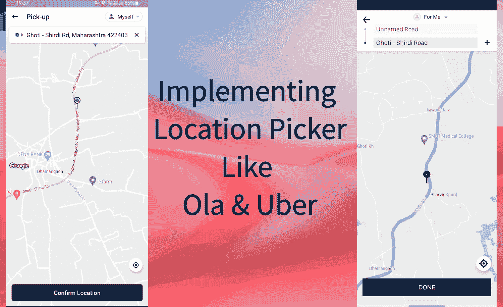
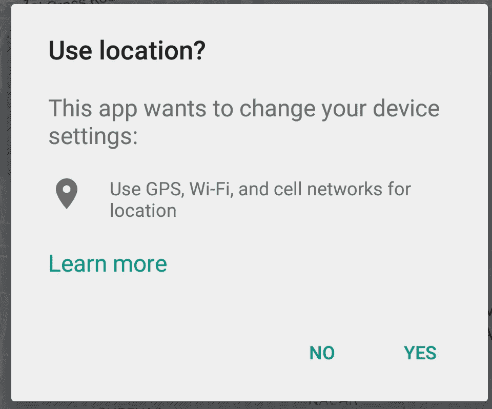
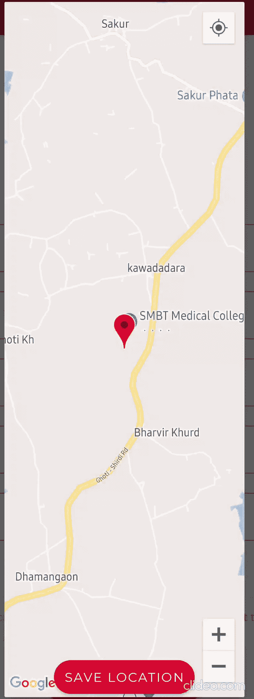

# 毫不费力地实现位置选择器，如安卓系统中的奥拉和优步

> 原文：<https://medium.com/geekculture/implement-location-picker-like-ola-and-uber-in-android-effortlessly-1c3f7728f49?source=collection_archive---------2----------------------->

Preview Of Location Pickers

我们都遇到过这样的应用或想法，我们可能希望用户从地图上选择他们的位置。从 UX 的角度来看，**选择一个位置比手动输入给定的字段**更方便。

另外，**从开发者的角度来看**精确定位用户有助于更精确地完成定位工作。

# 那么，如何实施呢？

嗯，**这很简单**，你只需要调用几个谷歌地图 API，精确设置位置权限，并为位置选择器创建你的布局就可以了！！！

但是阅读上面的要点可能看起来有点多，但是如果你简明地遵循下面的所有步骤，你的实现**将会像魔咒**一样工作。

要将谷歌地图添加到我们的应用程序中，我们需要 **API 密钥**，要获取您的密钥，请参考这篇关于 [Android 谷歌地图集成](https://developers.google.com/maps/documentation/android-sdk/start#enable-api-sdk)的博客。

虽然某些权限部分可能看起来更长，但每当我们处理位置时，我们必须考虑所有可能发生或发生的极限情况，并满足每个权限，因为*位置被视为敏感权限之一* ( **所以你必须忍受☹** )。

# 第一步:

**将 API 密钥**添加到您的清单文件中。在这里，我将我的密钥存储为一个字符串资源，您可以选择自己存储 API 密钥的方法。

然后将下面的依赖关系添加到您的**应用程序级渐变文件**。

# 第二步:

让我们**创建我们的 UI** 来显示我们的位置选择器。

> 我们将在一个对话框中展开这个布局，这样我们就不必将用户带到一个不同的活动或片段。

# 第三步:

让我们从按钮的 **onClick 事件调用这个函数来选择位置。**

在接下来的步骤中，我们将实现我们上面调用的所有功能，以协调一切。

# 步骤 4:设置权限

为了方便读者，我们将在**的三个部分**中实现这一步。

## 4.1

要获取用户设备的位置，请检查 GPS 是否已启用，如果未启用,**会显示一条提示消息以启用 GPS。**

提示看起来像这样。

让我们为我们的应用程序实现这一点。

## 4.2

现在，我们有了位置访问权限**，我们将检查设备是否已经存储了任何以前的位置**，如果没有，我们将预先获取这些位置，并将其显示在我们的选取器中。

## 4.3

在这里，我们在继续之前检查是否启用了所有其他位置权限，即清单或设备。

# 第五步:

我们将重写两个方法来获得权限的回调。

# 第六步

让我们设置对话框来显示选取器和保存位置。

预览应该是这样的。

在这里，您可以获得用户位置的纬度和经度，并且可以对它执行任何想要执行的操作。

> *对话框已经使用* `***View binding***` *一个 Jetpack 库进行了膨胀。在这里阅读* [*了解更多*](/androiddevelopers/use-view-binding-to-replace-findviewbyid-c83942471fc#:~:text=findViewById%20is%20the%20source%20of%20many%20user-facing%20bugs,easy%20to%20ship%20code%20that%20calls%20findViewById%3CTextView%3E%20%28R.id.image%29) *。*
> 
> 在左边，我们有上面我们写的代码的演示。

# 现在我们有了地理点，如何从中获取地址呢？

从开发人员的角度来看，保存地理点更有效，并且使用它来跟踪或测量点的距离。

但是用户永远不会明白这些数字意味着什么，或者他们是否在地图上选择了正确的位置。

所以，这是个问题！☹

**如何兼顾开发者和用户，又不产生数据冗余？**

幸运的是，Google 用它的地理编码 API 帮助我们解决了这个问题，它给我们提供了地理点的位置或地址，可以存储在一个字符串中并显示给用户。

# 下面是实现:

GeoCoder 类有许多方法来获取道路、城市、国家、邮政编码等。你可以在这里 **阅读更多关于它的方法 [**。**](https://developers.google.com/maps/documentation/geocoding/overview)**

> 在这里，如果您在获取地址时选择了海洋、河流、湖泊中的某个位置，您可以获得一个`NULLPOINTER`，并且您应该通过检查`addresses`的**大小**是否小于 1 来分别处理这种情况。

希望有所帮助。快乐编码😀

在 [**GitHub**](https://github.com/Iltwats) 和 [**LinkedIn**](https://www.linkedin.com/in/1220atul/) 上和我联系，如果你喜欢构建一些很酷的 app。