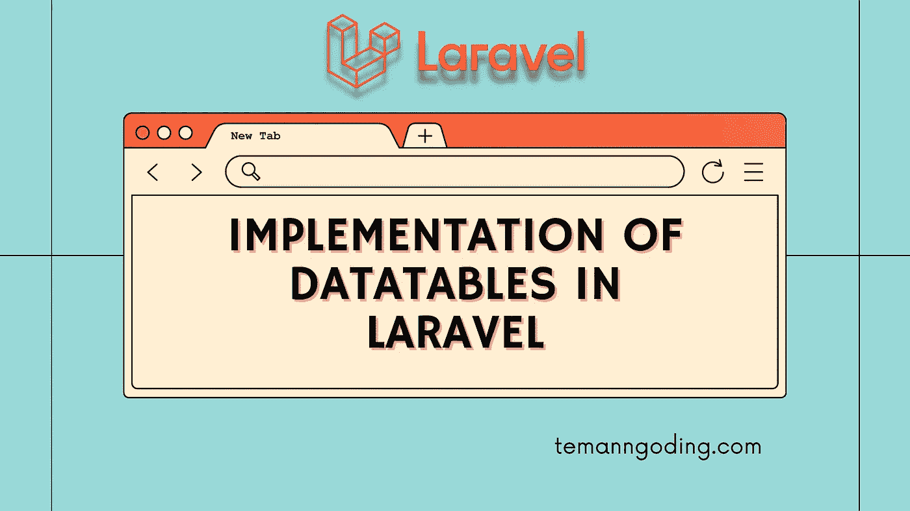
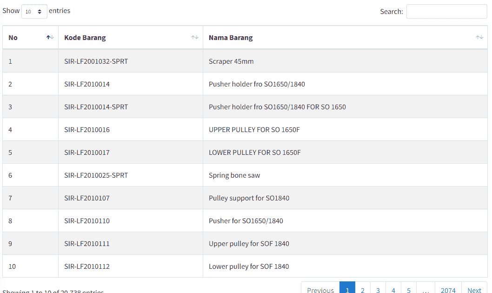

# Laravel 中数据表的实现

> 原文：<https://medium.com/geekculture/implementation-of-datatables-in-laravel-cd284d74bf1c?source=collection_archive---------4----------------------->



你好，朋友们，这次我们将再次讨论拉勒维尔。为了便于理解，您可以在 Laravel 中实现数据表。

我们将使用的 Laravel 包是 [**Yjra 数据表服务器端**](https://yajrabox.com/docs/laravel-datatables/master/installation) 。当你有成千上万的数据，并且你真的想有一个更加用户友好的外观时，这个包是非常有用的，所以我们必须使用 laravel 包。这一次，我们将显示具有分页和搜索等特性的动态数据。

DataTables 是一个由 jQuery 支持的插件，通常被称为 Javascript 库。这是一个非常灵活和动态的工具。

让我们开门见山:

1.  安装 Laravel
2.  创建数据库和设置。包封/包围（动词 envelop 的简写）
3.  安装 Laravel 数据表
4.  设置模型和迁移
5.  创建数据表控制器
6.  设置路线
7.  用 Yajra 数据表显示数据

您可以在此了解更多教程:

[Laravel 的社交媒体分享整合](https://temanngoding.com/en/social-media-share-integration-in-laravel/)

[Paypal 支付网关与 Laravel 的集成](https://temanngoding.com/en/paypal-payment-gateway-integration-with-laravel/)

[Laravel 中的错误处理](https://temanngoding.com/en/error-handling-in-laravel/)

# 安装 Laravel

```
laravel new laravel-datatables
```

我们做的第一步是安装 laravel 项目。或者使用下面的命令来安装。

```
composer create-project laravel/laravel laravel-datatables
```

您已经使用 composer 安装了 laravel 项目。接下来，您将配置数据库。

# 创建数据库和设置。包封/包围（动词 envelop 的简写）

```
DB_CONNECTION=mysql
DB_HOST=127.0.0.1
DB_PORT=3306
DB_DATABASE=laravel_datatables
DB_USERNAME=root
DB_PASSWORD=
```

这一次，您必须首先创建数据库并在. ENV 中设置数据库配置。

# 安装 Laravel 数据表

该插件通过 AJAX 选项处理 jQuery 数据表插件的服务器端工作，考虑到了雄辩的 ORM、流畅的查询构建器或集合。

输入下面的命令安装 datatables 包。

```
composer require yajra/laravel-datatables-oracle
```

或者

```
composer require yajra/laravel-datatables-oracle:"^10.0"
```

安装包后，在 **config/app.php** 中输入下面的服务提供商。

```
.....
.....
'providers' => [
	....
	....
	Yajra\DataTables\DataTablesServiceProvider::class,
]
'aliases' => [
	....
	....
	'DataTables' => Yajra\DataTables\Facades\DataTables::class,
]
.....
.....
```

运行下面的命令:

```
php artisan vendor:publish --provider="Yajra\DataTables\DataTablesServiceProvider"
```

# 设置模型和迁移

创建产品数据库。

```
php artisan make:migrations create_products_table
```

打开**数据库/迁移/timestamp _ create _ products _ table . PHP**文件。并将代码调整如下:

```
public function up()
{
    Schema::create('students', function (Blueprint $table) {
        $table->bigIncrements('id');
        $table->string('product_code');
        $table->string('product_name');
        $table->timestamps();
    });
}
```

下一步是创建产品模型。

```
php artisan make:model Products -m
```

并将代码调整如下:

```
<?phpnamespace App\Models;use Illuminate\Database\Eloquent\Factories\HasFactory;
use Illuminate\Database\Eloquent\Model;class Product extends Model
{
    use HasFactory; /**
     * The attributes that are mass assignable.
     *
     * @var array
     */
    protected $fillable = [
        'product_code','product_name'
    ];
}
```

使用以下命令运行迁移命令:

```
php artisan migrate
```

在数据库中迁移并创建产品表后，您必须输入数据或创建尽可能多的虚拟数据。因为我们将对我们制作的应用程序进行测试。

# 创建数据表控制器

下一步我们创建一个控制器来显示数据，我们将数据发送到数据表。创建一个控制器，如下所示。

```
php artisan make:controller ProductController
```

打开**app/Http/Controllers/student controller . PHP**中的控制器文件，按照如下代码。

```
<?php
namespace App\Http\Controllers;
use Illuminate\Http\Request;
use App\Models\Product;
use DataTables;
class StudentController extends Controller
{
    public function index()
    {
        return view('welcome');
    } public function index()
    {
        if(\request()->ajax()){
            $data = Product::latest()->get();
            return DataTables::of($data)
                ->addIndexColumn()
                ->addColumn('action', function($row){
                    $actionBtn = '<a href="javascript:void(0)" class="edit btn btn-success btn-sm">Edit</a> <a href="javascript:void(0)" class="delete btn btn-danger btn-sm">Delete</a>';
                    return $actionBtn;
                })
                ->rawColumns(['action'])
                ->make(true);
        }
        return view('products.index');
    }
}
```

# 设置路线

在我们创建了一个控制器之后，我们就创建了一个路由。打开 **routes/web.php** 文件，调整代码。

```
<?php
use Illuminate\Support\Facades\Route;
use App\Http\Controllers\ProductController;
/*
|--------------------------------------------------------------------------
| Web Routes
|--------------------------------------------------------------------------
|
| Here is where you can register web routes for your application. These
| routes are loaded by the RouteServiceProvider within a group which
| contains the "web" middleware group. Now create something great!
|
*/
Route::resource('products', ProductController::class);
```

# 用 Yajra 数据表显示数据

最后一步，我们创建一个刀片来显示我们之前创建的数据库。我添加了一些插件来支持吸引人的显示。

打开文件**resources/views/welcome . blade . PHP**在下面输入代码。

```
<!DOCTYPE html>
<html>
<head>
    <title>Laravel Datatables Tutorial</title>
    <meta name="csrf-token" content="{{ csrf_token() }}">
    <link rel="stylesheet" href="https://stackpath.bootstrapcdn.com/bootstrap/4.5.0/css/bootstrap.min.css"/>
    <link href="https://cdn.datatables.net/1.10.21/css/jquery.dataTables.min.css" rel="stylesheet">
    <link href="https://cdn.datatables.net/1.10.21/css/dataTables.bootstrap4.min.css" rel="stylesheet">
</head>
<body>

<div class="container mt-5">
    <h2 class="mb-4">Laravel Yajra Datatables Example</h2>
    <table id="myTable" class="table table-bordered">
        <thead>
            <tr>
                <th>No</th>
                <th>Kode Barang</th>
                <th>Nama Barang</th>
            </tr>
        </thead>
        <tbody>
        </tbody>
    </table>
</div>

</body>
<script src="https://ajax.googleapis.com/ajax/libs/jquery/1.9.1/jquery.js"></script>  
<script src="https://cdnjs.cloudflare.com/ajax/libs/jquery-validate/1.19.0/jquery.validate.js"></script>
<script src="https://cdn.datatables.net/1.10.21/js/jquery.dataTables.min.js"></script>
<script src="https://stackpath.bootstrapcdn.com/bootstrap/4.5.0/js/bootstrap.min.js"></script>
<script src="https://cdn.datatables.net/1.10.21/js/dataTables.bootstrap4.min.js"></script>
<script type="text/javascript">
    $(function () {
          var table = $('#myTable').DataTable({
              processing: true,
              serverSide: true,
              ajax: "{{ route('products.index') }}",
              columns: [
                  {data: 'DT_RowIndex', name: 'DT_RowIndex'},
                  {data: 'product_code', name: 'product_code'},
                  {data: 'product_name', name: 'product_name'},
              ]
          }); });
</script>
</html>
```

接下来，我们运行 php artisan serve 命令来查看您使用浏览器的进度结果。

```
php artisan serve
```

[http://127.0.0.1:8000/](http://127.0.0.1:8000/products) 产品



以上是我这次可以传达的教程，希望有用。如果你有什么想问的，请在下面评论。

***谢了。***