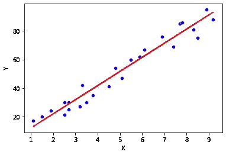
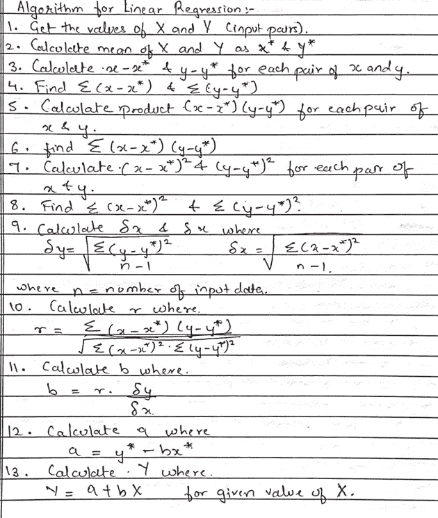
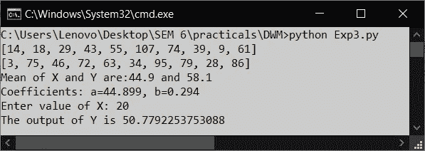

# 用 Python 实现线性回归。

> 原文：<https://medium.com/geekculture/implementation-of-linear-regression-using-python-81686df66e53?source=collection_archive---------31----------------------->

我是计算机工程的本科生，我们最近开始研究数据挖掘。在第一次实践中，我们被告知使用 python 实现线性回归。我在网上搜索了一下，但是没有找到任何使用 python 实现线性回归的例子；除了在[machinelearningmastery.com](https://machinelearningmastery.com/implement-simple-linear-regression-scratch-python/)。但是当我浏览的时候，我觉得对于数据挖掘的第一次实验来说有点复杂。所以我仔细研究了教授给我们的算法并用 python 编码。

我写这篇文章是因为我发现很难在网上找到它。

我希望这能帮助任何面临同样问题的人。

所以在我们开始之前，这里有一些理论。

# 什么是数据挖掘？

数据挖掘是从大型数据库中提取有用信息的过程。

它是一个强大的工具，有助于组织从可用的数据仓库中检索有用的信息。

# 什么是数据挖掘中的回归？



*Image by author*

回归是用于预测未来值或未知事件的方法。例如，商品价格、利率、受全球参数影响的资产价格变动等。

它模拟连续值函数。

回归用于寻找变量之间的数学关系。它包括预测变量(已知值)和响应变量(待预测值)。

因变量和自变量之间的关系用直线来描述。

> **Y = A + BX**
> 
> 在哪里
> 
> **Y** 是 **X** 和的线性函数；
> 
> **A** 和 **B** 是分别指定 **y 轴截距**和**直线**斜率的两个参数。

随着 X 值的变化，Y 值以线性方式增加或减少。

那么我们在这里要做什么呢？

这里我们要画一条 Y 和 X 的关系线，它符合给定的数据集。

理想的情况是所有数据点的直线拟合良好，并且预测没有误差。

如果数据点随机变化，不符合直线，那么我们需要构建一个与 X 和 y 相关的概率模型。

# **线性回归的算法是什么？**

下图显示了数据挖掘中的线性回归算法。



*Image by author*

现在让我们开始实施。

# 用 python 实现数据挖掘中的线性回归。

```
import numpy as np
from math import sqrtx = [14, 18, 29, 43, 55, 107, 74, 39, 9, 61]  *# step 1*
y = [3, 75, 46, 72, 63, 34, 95, 79, 28, 86]
n = len(x)
print(x)
print(y)
mean_X = np.mean(x)  *# step 2*
mean_Y = np.mean(y)
print("Mean of X and Y are:"+str(mean_X)+" and "+str(mean_Y))
*# step 3*
for i in range(n):
    x[i] = x[i] - mean_X
    y[i] = y[i] - mean_Y*# step 5 & 6*
summation_prod_XY = 0.0
for i in range(n):
    summation_prod_XY += (x[i] * y[i])*# step 7 & 8*
summation_sqr_X = 0.0
summation_sqr_Y = 0.0
for i in range(n):
    summation_sqr_X += x[i] ** 2
    summation_sqr_Y += y[i] ** 2# step 9
delta_X = sqrt(summation_sqr_X / n - 1)
delta_Y = sqrt(summation_sqr_Y / n - 1)*# step 10*
r = summation_prod_XY / sqrt(summation_sqr_X * summation_sqr_Y)b = (r * delta_Y) / delta_X  *# step 11*a = mean_Y - b * mean_X  *# step 12*
print('Coefficients: a=%.3f, b=%.3f' % (a, b))
inputX = int(input('Enter value of X: '))
outputY = a + b * inputX  *# step 13*
print("The output of Y is "+str(outputY))
```

下面是上述程序的输出。



*Image by author*

# 结论

因此，我们现在已经使用 python 实现了数据挖掘中的线性回归。但是我们实现的是一个非常简单的基于算法的线性回归。

如果你想了解更多关于机器学习中使用的线性回归(就像在 scikit learn 中一样)，我想推荐你去看看[machinelearningmastery.com](https://machinelearningmastery.com/)。

它拥有几乎所有用 python 编写的用于机器学习的算法。

这是我的第一篇文章，所以如果你想补充什么或者我写错了什么，请给我发消息。

也欢迎有帮助的评论。感谢您的阅读。