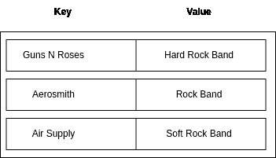
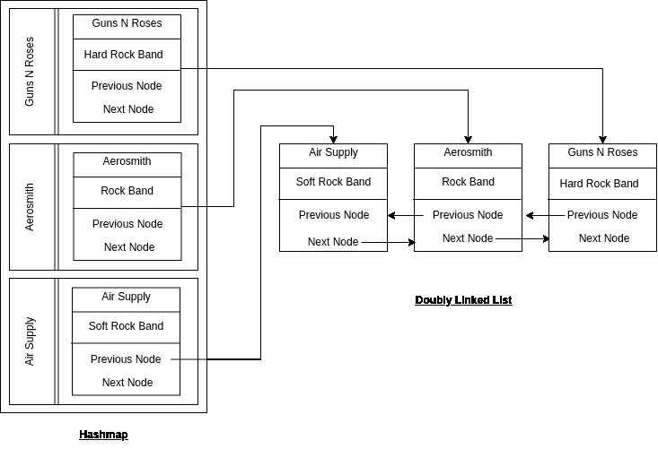
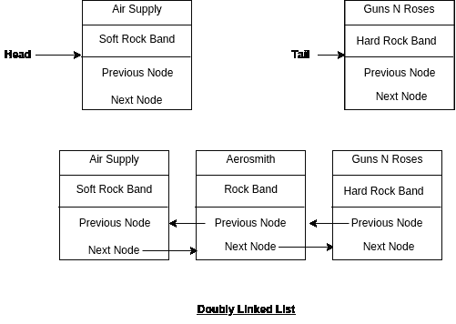
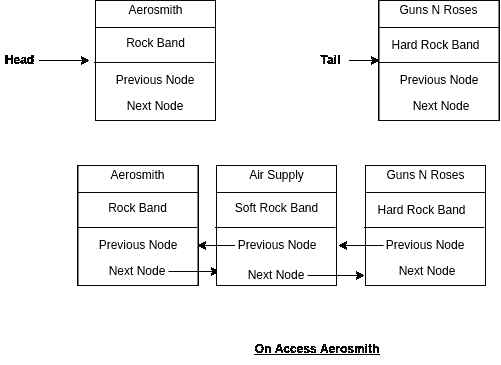

# LRU:实现缓存失效策略

> 原文：<https://medium.com/geekculture/implementing-a-cache-invalidation-in-distributed-cache-engine-lru-with-code-implementation-1f4d3e204b52?source=collection_archive---------12----------------------->


*最初发表于*[T5【https://blog.shams-nahid.com】](https://blog.shams-nahid.com/implementing-a-cache-invalidation-in-distributed-cache-engine-lru-with-code-implementation)*。*

在互联网上，有一句非常流行的菲尔·卡尔顿的名言，

> *计算机科学只有两个硬东西:缓存失效和事物命名。*

使用内存存储访问数据速度极快，减少了重复计算。但是我们要考虑取舍，内存有限，成本高。因此，对于我们来说，找出何时以及如何从高速缓存中删除/无效数据是一项至关重要的工作。

# 缓存失效策略

是时候看看如何从分布式缓存系统中取消缓存了。根据应用需求，我们可以采用各种方法来处理无效缓存，

*   **最近最少使用的**替换之前使用时间最长的数据。
*   **最不常用的**替换使用率很低的数据。
*   **最近使用的**替换最近使用的数据。在这种情况下，数据根据可能被访问的预测进行缓存。只有当数据到达客户端时，缓存中才不再需要这些数据。
*   **FIFO** 通过缓存最新数据来替换缓存中最旧的数据。

其中，最受欢迎的一项政策是`LRU`。使用这种方法，当我们的内存达到最大值时，我们将删除最早访问的数据。

# 普通键值散列表的限制

通常，为了更快地访问，我们将键值存储在内存中，如下所示:



这里，作为键，我们存储乐队名称，作为值，保存他们的流派。问题是，每当我们访问数据时，我们需要确保数据最近被访问过。同样，我们必须跟踪哪些数据在最长时间内没有被访问。

因此，在跟踪最近和最早访问的数据时，我们不能简单地使用键/值对。

现在，如果我们利用一个链表来跟踪最近的和最老的数据，我们可以采用下面的体系结构，



在这里的`Hashmap`键中，我们保存的是照常键。对于 hashmap 的值，我们存储一个链表节点。

所以我们可以用 O(1)使用 hashmap 中的键来访问数据。

但是神奇的是链表。这是一个双向链表，任何时候如果我们有一个节点，我们可以用 O(1)做移除/插入/移动。

链表的头部总是指向最近的数据，节点的尾部总是指向最早访问的数据。



现在，如果使用 hashmap，任何数据被访问，我们将把最近访问的数据放到头中。

比如现在，头节点是`Air Supply`键。在散列表中，如果我们访问`Aerosmith`，那么`Aerosmith`将成为头部。



考虑到这一点，我们可以很容易地检测出哪一个是最近访问的数据，哪一个是最早访问的数据。

# 代码实现

我们的链表实现就像，

```
class LinkedList {
    constructor() {
        this.head = null;
        this.tail = null;
    } insert(node) {
        if (!this.head) {
            this.head = node;
            this.tail = node;
            return;
        }
        this.head.prev = node;
        node.next = this.head;
        this.head = node;
    } makeHead(node) {
        // when linked list is empty
        if (!this.head) {
            this.head = node;
            this.tail = node;
            return;
        } // node is already head
        if (node === this.head) {
            return;
        } // node is a tail node
        if (node.next === null) {
            const previousNode = node.prev;
            previousNode.next = null;
            node.prev = null;
            node.next = this.head.next;
            this.head = node;
            this.tail = previousNode;
            return;
        } // node is in the middle, so remove it
        node.prev.next = node.next;
        node.next.prev = node.prev; // make the node as head
        node.next = this.head.next;
        node.prev = null;
        this.head = node;
    } remove(node) {
        // when the list is empty
        if (!this.head) {
            return;
        }
        // when the list has only head, removing head node
        if (node === this.head && !this.head.next) {
            this.head = null;
            this.tail = null;
            return;
        }
        // removing the tail node
        if (node === this.tail) {
            this.tail = this.tail.prev;
            this.tail.next = null;
            return;
        } // removing the middle node
        const previousNode = node.prev;
        const nextNode = node.next;
        previousNode.next = nextNode;
        nextNode.prev = previousNode;
    } removeLast() {
        this.remove(this.tail);
    } get(node) {
        let currentNode = this.head;
        while (currentNode) {
            if (currentNode === node) {
                return node;
            }
            currentNode = currentNode.next;
        }
        return null;
    }}class Node {
    constructor(data) {
        this.data = data;
        this.next = null;
        this.prev = null;
    }
}module.exports = {
    Node,
    LinkedList
}
```

我们的 Hashmap 实现就像，

```
const { LinkedList, Node } = require('./doubly-link-list');const MAX_HASHMAP_SIZE = 3;class HashMap {
  constructor() {
    this.linkedList = new LinkedList();
    this.size = 0;
    this.dataMap = {};
  } insert({ key, value }) {
    // When we are max size and inserting a new data
    // remove the last data from hash map
    // remove the last one from linked list
    if (!this.dataMap[key] && this.size === MAX_HASHMAP_SIZE) {
      // get oldest used data
      const lastNode = this.linkedList.tail; // remove oldest from hashmap
      if (lastNode) {
        delete this.dataMap[lastNode.data.key];
      } // remove oldest node from linked list
      this.linkedList.removeLast(); this.size--;
    } this.linkedList.insert(new Node({ key, value }));
    this.dataMap[key] = this.linkedList.head; this.size++;
  } remove() { } get(key) {
    if (!this.dataMap[key]) {
      return null;
    }
    // make head first
    console.log(this.dataMap[key])
    this.linkedList.makeHead(this.dataMap[key])
    return this.dataMap[key].data.value;
  }
}module.exports = {
  HashMap
}
```

请在 [github](https://github.com/bmshamsnahid/System-Design-Study-Note/tree/master/resources/Distributed-Cache) 中找到完整的代码。

了解更多关于[分布式缓存系统](https://blog.shams-nahid.com/deep-dive-inside-a-distributed-cache-engine)的信息。

也让我知道任何疑问或额外的解释。