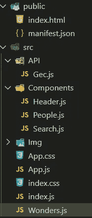

# 用 React 实现自定义搜索栏

> 原文：<https://medium.com/geekculture/implementing-a-custom-search-bar-with-react-c09cba90ae99?source=collection_archive---------6----------------------->


所以你想用钩子在 React 中制作一个搜索栏？太好了！

我将用最流行的 web 应用程序框架之一[](https://reactjs.org/)****来构建一个搜索栏。**搜索栏功能是用户界面开发中常见的一种有用的图形小部件。 [**点击这里**](https://github.com/deep-0301/Wonders/) 下载完整代码，查看 [**现场演示。**](https://deep-0301.github.io/Wonders/) 我不是盖 CSS 文件的。请在此下载 [CSS 文件。](https://github.com/deep-0301/Wonders/blob/master/src/App.css)**

# **开始之前**

**要安装基础项目，请在终端中运行以下命令:**

```
npx create-react-app wonders
```

****

**然后在 VS 代码中打开 wonders 文件夹。创建一个文件夹，如左图所示。搜索栏需要的三个主要组件是**标题、**和**搜索**。**

**[**Gec.js**](https://github.com/deep-0301/Wonders/blob/master/src/API/Gec.js) 文件代表 API 文件，包括人名、手机、邮箱等信息。[点击这里](https://github.com/deep-0301/Wonders/blob/master/src/API/Gec.js)下载 [Gec.js](https://github.com/deep-0301/Wonders/blob/master/src/API/Gec.js) 文件。**

# **步骤 1:创建 Wonders.js 文件**

**在这个文件中，我们从 Gec.js 文件中获取数据，设置项目，并将 loading 设置为 false。**

****代码解释**:**

**异步函数 fetchData()用于通过 res.json()获取数据。useEffect 用于调用 fetchData()。容器 div 包括带有 isLoading 属性和 item 属性的标题和搜索组件。**

# **步骤 2:创建搜索组件**

**搜索组件包含将输入文本与 API 文本进行匹配的搜索逻辑。**

****

**Search**

****代码解释**:**

**handleChange()函数用于从输入字段获取输入文本。用 React 钩子获取输入文本，并将数据与 API 数据进行匹配。过滤器被设置为带有输入文本的结果数据。_ 数据。映射方法将人员组件映射到唯一的键属性，并将项目映射到键。**

# **步骤 3:创建人员组件**

**人物组件包含与人物相关的信息以及他们的图像和所有其他相关信息。**

****

**People**

****代码解释:****

**People.js 包含上一个组件的道具。在这个组件中，主要的 HTML 内容显示这个人的名片以及他的信息，比如手机、电子邮件等。**

# **步骤 4:创建标题组件**

**页眉部分覆盖了世界七大奇迹的标志。**

****

**Header**

****代码解释:****

**对于 header 元素，我们添加了带有 src 徽标的 img 标记。这个徽标是从 img 文件夹中随 wonders.jpg 文件一起导入的。**

**最后在制作这个文件后，将 wonders.js 文件引用到 [App.js](https://github.com/deep-0301/Wonders/blob/master/src/App.js) 文件中，并导入到 [App.js](https://github.com/deep-0301/Wonders/blob/master/src/App.js) 文件中。**

**[**点击此处**](https://github.com/deep-0301/Wonders/) 下载****完整代码**并查看 [**现场演示。**](https://deep-0301.github.io/Wonders/)****

****就是这样！希望这篇文章对你有用。****

*****更多内容请看*[*plain English . io*](http://plainenglish.io/)****