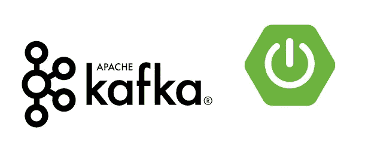
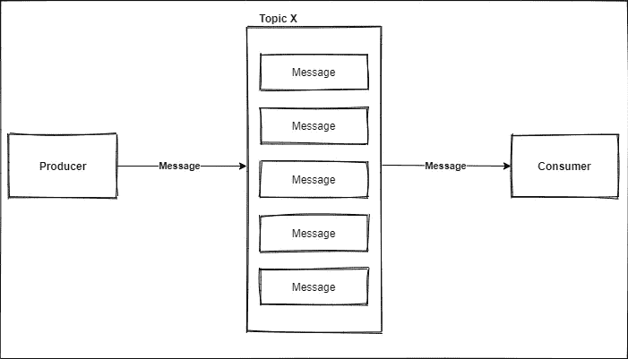
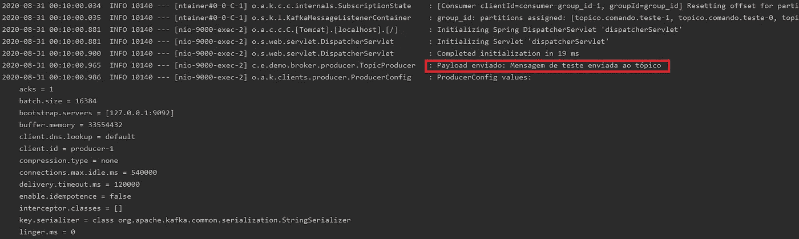
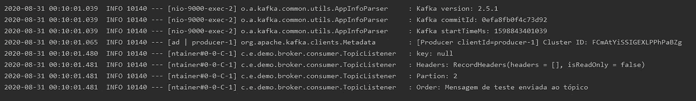

# 用 Spring Boot 实现 kafka 消费者和 kafka 生产者

> 原文：<https://medium.com/geekculture/implementing-a-kafka-consumer-and-kafka-producer-with-spring-boot-60aca7ef7551?source=collection_archive---------1----------------------->



这篇文章有更多的信息[在这里](/@mmarcosab/a-tour-of-kafka-visiting-concepts-and-implementing-applications-locally-with-spring-boot-and-40951ead996)，比如如何使用 Python 和 GUI。

这是我的第一篇英文文章，所以我在此为最终的错误道歉。

前几天我要开发一些在 kafka 话题中消费/生产的微服务。我决定在这里留下一些笔记，以便随时查阅。我把这篇文章分成两部分:

*   创造一个消费者；
*   创造一个生产者；

一些基本信息:
我用 Java 编写了这段代码，使用了 Springboot、Lombok、Hibernate 和管理与 Maven 的依赖关系。

# 关于阿帕奇卡夫卡

**这是什么？**

这是一个分布式消息和流平台。

它没有澄清一切，对不对？另一个问题。

**是为了什么？**

它用于在不同系统之间移动和转换大量数据。

这意味着这种移动和转换可以在数据库中读取和写入，在流上具体化数据，在系统(生产者和消费者)之间发送信息等。右[这里](https://kafka.apache.org/uses)有一个卡夫卡的用例列表。

使用 kafka 的简单解决方案是如何工作的:



生产者生成一条附加到主题的消息，消费者接收该消息并做任何必须做的事情。

**概念:**

**生产者**:负责产生特定主题的消息。

**消费者**:负责阅读制作人对某个话题的留言。

**主题**:主题是一组分类的消息。

**消息**:我认为卡夫卡所有的事件都可以用消息来概括。一个消息可以包含一个简单的文本，比如“Hello World ”,或者一个 json 格式的对象。

## 实现 Kafka 生成器:

知识库链接:[https://github.com/mmarcosab/kafka-producer](https://github.com/mmarcosab/kafka-producer)

对 pom.xml 的依赖性:

```
<dependency>
   <groupId>org.apache.kafka</groupId>
   <artifactId>kafka-streams</artifactId>
</dependency>
<dependency>
   <groupId>org.springframework.kafka</groupId>
   <artifactId>spring-kafka</artifactId>
</dependency>
```

之后，我们必须配置应用程序。属性:

```
# Producer properties
spring.kafka.producer.bootstrap-servers=127.0.0.1:9092
spring.kafka.producer.key-serializer=org.apache.kafka.common.serialization.StringSerializer
spring.kafka.producer.value-serializer=org.apache.kafka.common.serialization.StringSerializer
spring.kafka.producer.group-id=group_id
topic.name.producer=topico.comando.teste

# Common Kafka Properties
auto.create.topics.enable=true
```

起初，我使用 StringSerializer 类来序列化消息，只是为了发送一些文本。

auto.create.topics.enable = true 属性自动创建注册到这些属性的主题。在这种情况下，我将 topic . name . producer = topico . comando . test

那我们就去看代码吧。

在主类中，我放置了注释“@ EnableKafka”，这使得连接到一个主题成为可能。

```
@EnableKafka
@SpringBootApplication
public class DemoApplication {

    public static void main(String[] args) {
        SpringApplication.run(DemoApplication.class, args);
    }

}
```

还有我的制片人班

```
@Slf4j
@Service
@RequiredArgsConstructor
public class TopicProducer {

    @Value("${topic.name.producer}")
    private String topicName;

    private final KafkaTemplate<String, String> kafkaTemplate;

    public void send(String message){
        log.info("Payload enviado: {}", message);
        kafkaTemplate.send(topicName, message);
    }

}
```

KafkaTemplate 类是向主题发送消息的类，第一个字符串是主题，第二个是信息的类型。

最后，我创建了一个控制器来进行测试:

```
@RequiredArgsConstructor
@RestController
@RequestMapping(value = "/kafka")
public class KafkaController {
    private final TopicProducer topicProducer;
    @GetMapping (value = "/send")
    public void send(){
        topicProducer.send("Mensagem de teste enviada ao tópico");
    }
}
```

简单来说就是这样。

## 实现消费者卡夫卡:

知识库链接:[https://github.com/mmarcosab/kafka-consumer](https://github.com/mmarcosab/kafka-consumer)

对 pom.xml 的依赖性:

```
<dependency>
   <groupId>org.apache.kafka</groupId>
   <artifactId>kafka-streams</artifactId>
</dependency>
<dependency>
   <groupId>org.springframework.kafka</groupId>
   <artifactId>spring-kafka</artifactId>
</dependency>
```

之后，我们必须配置应用程序。属性:

```
# Kafka Consumer properties
spring.kafka.consumer.bootstrap-servers=127.0.0.1:9092
spring.kafka.consumer.group-id=group_id
spring.kafka.consumer.auto-offset-reset=earliest
spring.kafka.consumer.key-deserializer=org.apache.kafka.common.serialization.StringDeserializer
spring.kafka.consumer.value-deserializer=org.apache.kafka.common.serialization.StringDeserializer
topic.name.consumer=topico.teste
```

这里我有与生产者相同的观察:StringDeserialize 用于处理文本和 auto.create.topics.enable = true。

在主类中，我放置了注释“@ EnableKafka”，这使得连接到一个主题成为可能。

```
@EnableKafka
@SpringBootApplication
public class DemoApplication { public static void main(String[] args) {
        SpringApplication.run(DemoApplication.class, args);
    }}
```

消费者类看起来是这样的:

```
@Slf4j
@RequiredArgsConstructor
@Service
public class TopicListener {

    @Value("${topic.name.consumer")
    private String topicName;

    @KafkaListener(topics = "${topic.name.consumer}", groupId = "group_id")
    public void consume(ConsumerRecord<String, String> payload){*log*.info("Tópico: {}", topicName);
        *log*.info("key: {}", payload.key());
        *log*.info("Headers: {}", payload.headers());
        *log*.info("Partion: {}", payload.partition());
        *log*.info("Order: {}", payload.value());

    }

}
```

很简单，注释“@ KafkaListener”允许连接到一个主题来接收消息。

运行项目时，只需调用生产者项目上的测试控制器，您就可以在日志中看到结果:

**监制:**



**消费者:**



成功了。

