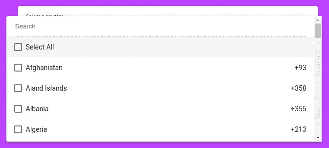

# 在 Angular 中实现一个搜索栏来过滤下拉选择列表中的选项

> 原文：<https://medium.com/geekculture/implementing-a-search-bar-for-filtering-select-dropdowns-in-angular-63b1f2033737?source=collection_archive---------2----------------------->


在我的一个项目中，需要实现一个下拉列表来显示国家和他们各自的拨号代码，用户应该能够搜索它们。这是为了使手机号码的格式正确。

不幸的是，我开始知道角状材料不提供这种功能。所以，我想如果我能有一个使用 matAutoComplete 的解决方法。我看过一些 Github 关于这个变通办法的评论，但是它们不够强大，而且有点复杂。

这个问题在很久以前就已经通过 Github 问题向 angular material 团队提出了。该团队表示，他们正在寻找解决方案，并将实施该方案，是的，他们可能有更重要的问题要解决。你可以在这里查看:【https://github.com/angular/material2/issues/5697

所以像往常一样，我尝试搜索库来做这项工作，直到 angular 团队实现了这个特性，我找到了几个，但是它们要么太简单而不强大，要么太复杂而冗长而不方便。

就是这个时候我想到了尝试开发一个库来解决这个问题。我想让它简单易用，同时又应该功能强大，这就是 MatSelectSearch 的发展方向。所以这个问题终于有解决的办法了。

# MatSelectSearch

npm 链接:【https://www.npmjs.com/package/mat-select-search 

MatSelectSearch 是一个 Angular 组件，提供搜索/过滤 Angular 素材库 MatSelect 选项的功能，该组件使用简单，比目前旨在解决该问题的任何其他库都更强大。搜索功能也得到了优化，也就是说 MatSelectSearch 能够比当前的库更快地搜索长列表。

# 怎么用？

在您的项目中安装 mat-select-search

```
npm install mat-select-search
```

将 mat-select-search 导入 app 模块。如果使用了延迟加载，将其导入到需要库的特定模块中。

将 lib-mat-select-search 组件放在 mat-select 的 mat-option 中。

要启用搜索，需要传递两个输入:

*   [列表]
*   [搜索属性]

过滤 mat-options 后，触发了一个事件

*   (已过滤)

# [列表]

通过[list]输入将要过滤的数组传递给 lib-mat-select-search。

```
[list]="countries"
```

# [搜索属性]

将要搜索的属性传递给[searchProperties]输入。现在，mat-select-search 提供了一个目前其他图书馆所没有的独特功能。

mat-select-search 支持多属性搜索。考虑这样一种情况，您有一个国家列表:

```
[
  {
    name: "India",
    dialCode: "+91",
    code: "IN"
  },
  {
    name: "Indonesia",
    dialCode: "+62",
    code: "ID"
  },
..............and goes on
```

现在，假设有一个用例，在这个用例中，不仅要根据姓名进行搜索，还要根据拨号代码和代码进行搜索。因此，即使用户键入国家的拨号代码或国家代码，搜索也应该发生。在 mat-select-search 中启用该属性没有额外的开销。

[searchProperties]接收字符串数组。字符串是搜索应该依据的属性。因此，如果仅通过姓名进行搜索，请提供:

```
[searchProperties]="['name']"
```

如果要通过姓名、拨号代码和代码进行搜索，只需提供:

```
[searchProperties]="['name', 'dialCode', 'code']"
```

就这么简单。

现在，属性提供的顺序有点重要。如果以上述方式提供属性，搜索词“India+91”仍将给出正确的结果，但不是“+91India”。如果您有任何重要的特定用例，请考虑订单。在大多数情况下，这并不重要。所以属性的顺序并不重要。

# (已过滤)

(已过滤)是在过滤 mat-options 后触发的事件。将这个过滤后的数组存储到另一个变量中。

```
//Storing the filtered array in filteredCountries
(filtered)="filteredCountries = $event"
```

仅此而已。现在 mat-select-search 已经准备好了，您可以执行搜索了！！！

[list]和[searchProperties]是搜索工作所需的输入。也有可选的输入，提供一些定制。

# [清除搜索输入]

[clearSearchInput]默认设置为 false。当设置为 true 时，在 mat-select 关闭后搜索栏将被清除，这样当 mat-select 重新打开时，搜索栏将是空的。

# [固定桌面]

[fixOnTop]默认情况下设置为 false。当设置为 true 时，搜索栏的位置固定在顶部，并且不随 mat-options 一起滚动，因此即使在滚动时也是可见的。

那么，为什么不默认设置为 true 呢？。这是因为搜索栏永远不会失去焦点。因此，即使它向上滚动并且不可见，只要按下任何键，搜索栏就会出现，搜索就会发生。因此，没有必要在顶部固定它。特别是对于移动设备，最好是让它滚动，这样就节省了不需要的空间，并且会在它的位置显示一个 mat-option。

此外，如果用户喜欢滚动而不是打字，搜索栏纯粹是浪费空间。因此，默认情况下，[fixOnTop]被设置为 false，如果有人希望它保持在顶部，这仍然是可能的，只需将[fixOnTop]设置为 true。

# [hasSelectAll]



[hasSelectAll]默认设置为 false。当设置为 true 时，它提供了在多选中选择所有 mat 选项的功能。

此外，为“Select All”提供一个 mat 选项，并将其放在 lib-mat-select-search 的 mat 选项下面。

```
<mat-option>Select All</mat-option>
```

# 如何让 MatSelectSearch 和 formArray 一起工作？

在使用 formArray 时，仅仅存储一个经过筛选的数组是不够的。每个表单都应该有一个经过筛选的数组。

假设有多个表单，每个表单都有一个 mat-select 来选择国家。使用与上面相同的逻辑，无论用户最初与哪个 mat-select 交互，搜索都将完美地工作，但是当与另一个 mat-select 交互时，第一个 mat-select 的值将消失。这是因为变量“filteredCountries”由所有 mat-select 共享。

因此，要解决所有这些问题，请将“filteredCountries”制作成一个二维数组，并将该数组存储在“filteredCountries”的相应索引中。

如果您喜欢这个组件，或者它对您解决问题有所帮助，请启动回购:[https://github.com/shafi-sahal/MatSelectSearch](https://github.com/shafi-sahal/MatSelectSearch)。

贡献、反馈和建议总是受欢迎的。

你可以从这里下载这个库:【https://www.npmjs.com/package/mat-select-search 