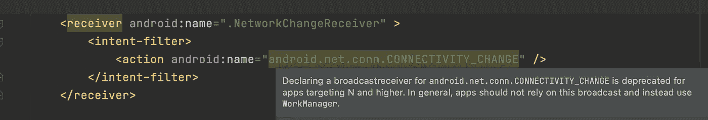

# 在 Android 中实现主动网络状态监视器

> 原文：<https://medium.com/geekculture/implementing-an-active-network-state-monitor-in-android-dbbc24cf2bc5?source=collection_archive---------0----------------------->

Photo by [Jonathan](https://unsplash.com/@isodme?utm_source=medium&utm_medium=referral) on [Unsplash](https://unsplash.com?utm_source=medium&utm_medium=referral)

每一年，谷歌都会推出一个有趣的 Android 更新。它包括新的特性、对现有 API 的优化和修改以及对旧 API 的摒弃。

大多数 Android 应用程序都与互联网有关。如果你曾经在 Android Nougat (API 24)之前的设备上工作过，试图实现一种机制来监听你的应用程序中的网络变化，你必须在*‘Android manifest . XML’*文件中添加一段类似的代码。

上面的代码是在清单中注册的广播接收器“NetworkChangeReceiver”的代码。它会在检测到(比如说)Wifi 和移动设备的网络连接发生变化时发送广播。但是，如果您尝试在 Marshmellow 之后的设备中实现相同的功能，Android studio 中的 lint 会抛出一个警告，如下所示:

> 为 Android . net . conn . connectivity _ CHANGE 声明广播接收器对于面向 N 和更高版本的应用程序来说是不推荐的。一般来说，应用程序不应该依赖这种广播，而应该使用工作管理器。

因此，从牛轧糖开始，我们将不会收到任何网络连接变化的广播。结果上面这段代码就没用了。然而，lint 建议我们使用 WorkManager 来解决这个问题。这正是我们将在本文中实现的。

Active network state monitor application preview

*你可以在这里* *找到 GitHub 项目* [***的链接。***](https://github.com/ranitraj/ActiveNetworkStateObserver)

# 概述:

我们将实现一个主动网络状态监视器(显示在上面的视频中),它执行以下操作:

1.  监听网络状态的变化。
2.  在整个应用程序中保持当前状态。
3.  根据网络状态更新用户界面。
4.  奖金部分。

# **1。监听网络状态的变化:**

## 添加必要的权限

在 *'AndroidManifest.xml'* 中，添加' ACCESS_NETWORK_STATE '权限。

## 创建网络监控实用程序类

**步骤 1:** 我们的实用程序类扩展了 *'ConnectivityManager。NetworkCallback'* 接收网络连接状态变化的系统更新。

**步骤 2:** 我们初始化构造函数中的“网络请求”和“连接性管理器”实例。

“网络请求”是一个构建器模式，我们在其中指定我们感兴趣观察的“传输类型”。为了让这篇文章尽可能简单，我注册只观察与 Wifi 相关的事件。

如果您对注册其他事件感兴趣，如蜂窝、以太网等。这是添加它们的地方。

**步骤 3:** 重写“onAvailable()”和“onLost()”方法

如果设备连接到互联网，Android 系统将触发“onAvailable()”方法。同样，一旦设备失去与互联网的连接，就会触发“onLost()”。

**步骤 4:** 我们创建一个方法，将网络请求“注册”到 Android 系统。

使用“ConnectivityManager”实例，我们将“NetworkRequest”(来自步骤 2)注册到网络回调。

*我们只注册一次以防止重复回调，这一点非常重要。“应用程序”类的 onCreate()方法是它的理想位置。*

## **合并步骤 1 至 4:**

# 2.在整个应用程序中保持当前网络状态(实时数据救援):

每当系统观察到网络状态发生变化时，Android 系统都会触发“onAvailable()”和“onLost()”方法。一旦被触发，我们的工作就是在整个应用程序中保持和更新这种状态。让我们试着用一个例子来理解它。

假设我们已经开发了一个购物应用程序，每当连接到互联网出现问题时，我们希望向最终用户显示一个弹出消息/对话框。此外，一旦重新连接，我们希望再次获取页面的内容(通过触发一个 API)。

通常，购物应用程序是由多个屏幕(活动和片段)组成的复杂应用程序。每个屏幕可能具有不同的功能，需要在连接和断开互联网时执行。因此，我们需要一种机制来轻松处理它。这就是“Livedata”为我们提供帮助的地方。

我们创建了一个‘Singleton’类，它有一个‘Boolean’类型的‘mutable live data’来在应用程序的整个生命周期中维护它的实例。

这个可变的实时数据有一个 getter 和一个 setter。

在以下情况下调用*设置器*:

1.*' on available()'*' networkmonitoringuit '类的回调。这里，它被设置为*真*。

2. *'onLost()'* 回调。这里，它被设置为*假*。

# 3.根据当前网络状态更新用户界面:

为了在相应“视图”组件的用户界面中进行更改，调用 *getter* 。

查看 *getter* 方法，我们看到它的返回类型是‘LiveData’

这种“实时数据”在相应的视图(例如，MainActivity.java)中被*【观察】*，并且根据当前的网络状态对用户界面进行改变。

# 奖金部分:

上面的实现足够智能，可以发现网络状态的变化，例如断开连接，甚至是有限的网络场景。但是，有一个问题。

## 问题是

如果你仔细总结一下实现，我们只在‘on available()’和‘on lost()’方法中更新‘动态数据’。此外，这些事件使用在“Application onCreate()”中调用的*' registerNetworkCallbackEvents()'*方法进行注册。

*花一点时间想一想这里的问题是什么！*

仅当网络状态发生变化时，才会调用“onAvailable()”和“onLost()”回调。因此，如果在我们的应用程序使用期间网络状态没有变化，那么*‘activeNetworkStatusMLD’*将永远不会被初始化，从而导致重大问题。我们怎么解决？

## 解决方案

我们需要考虑一种机制，在我们通过*' registerNetworkCallbackEvents()'*注册事件之前，通过调用其 *'setter'* 方法来更新我们的 *'activeNetworkStatusMLD'*

因此，在我们的*' networkmonitoringutil . Java '*类中，我们添加了另一个方法:

此方法使用“NetworkInfo”类提供的*“is connected()”*API 获取连接状态。在*‘应用 onCreate()’中注册之前，它通过检查网络状态将*‘activeNetworkStatusMLD’*更新为*真*或*假*。*

这就是我们如何在 Android post-marshmelle(API-23)中实现主动网络状态监视器。

如果您想看到整个代码的运行，可以从这里的*随意克隆我的 GitHub 库。*