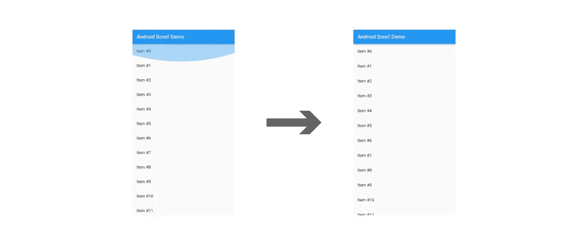
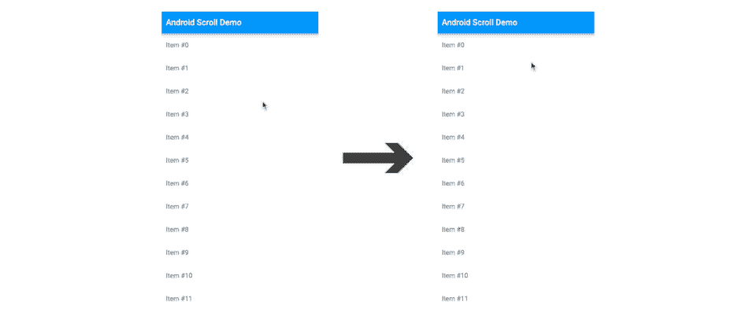

# 在 Flutter 中实现 Android 12 的过卷指示器效果

> 原文：<https://medium.com/geekculture/implementing-android-12s-overscroll-indicator-effect-in-flutter-b8e558d8566c?source=collection_archive---------2----------------------->



**更新:**这个方法在 Flutter 3 中已经被弃用。请阅读我的新[文章](https://lp3.medium.com/properly-implementing-android-12s-overscroll-indicator-in-flutter-a1f1a11ce249)来了解实现这个特性的更新方法。

你可能知道也可能不知道，Android 12 将过度滚动指示器从*发光*效果改为*拉伸*效果。区别可以从下面看出来。



记住，当使用 Flutter 时，框架处理我们所有的 UI 外观和行为。这意味着我们享受不到 Android 版本(或 iOS，或 Windows 等)之间自动行为更新的好处。).因此，当操作系统版本之间的默认外观或行为发生变化时，我们必须更新我们的应用程序，使其行为适当。幸运的是，Flutter 有一个解决方案。

我们现在可以在我们的`Theme`中定义 Android 过度滚动行为。

```
ThemeData(
  androidOverscrollIndicator: AndroidOverscrollIndicator.stretch,
)
```

如果你提供了浅色和深色主题，请确保为这两种主题都定义了过度滚动指示器。

现在，虽然这很容易实现，但有一个小问题…这将在所有版本的 Android 上应用 *stretch* 行为，而不仅仅是在 Android 12+上。为了让我们的应用程序在每个 Android 版本上都感觉自在，我们需要首先确定版本，然后根据这些信息定义 overscroll 指示器。我们将使用`device_info_plus`包来查找 Android 版本，所以将下面的内容添加到`pubspec.yaml`中并运行`pub get`。

```
device_info_plus: any
```

然后，将以下代码添加到`main`方法中。我们需要让`main` *异步*并检测 Android 版本，因为这样做的方法是异步的。

```
void main() async {
  WidgetsFlutterBinding.ensureInitialized();
  final androidInfo = await DeviceInfoPlugin().androidInfo;
  final sdkVersion = androidInfo.version.sdkInt ?? 0;
  final androidOverscrollIndicator = sdkVersion > 30
      ? AndroidOverscrollIndicator.stretch
      : AndroidOverscrollIndicator.glow; runApp(MyApp(
    androidOverscrollIndicator:androidOverscrollIndicator,
  ));
}class MyApp extends StatelessWidget {
  const MyApp({
    Key? key,
    this.androidOverscrollIndicator =
            AndroidOverscrollIndicator.glow,
  }) : super(key: key);final AndroidOverscrollIndicator androidOverscrollIndicator;... theme: ThemeData(
    androidOverscrollIndicator:androidOverscrollIndicator,
  ),...
```

需要注意的事项:

*   `WidgetsFlutterBinding`需要在使用`DeviceInfoPlugin`前初始化。
*   `androidInfo.version.sdkInt`可以返回`null`如果应用运行在 Android 以外的东西上(即 iOS)。如果是，我们将该值设置为`0`。
*   Android 12 的 SDK 版本是 31，因此我们使用 *stretch* 来处理 30 以上的内容。
*   这里，我们通过构造函数将指示器作为参数传递给我们的根小部件`MyApp`。您可以使用您喜欢的任何方法在小部件之间传递数据。(查看我关于简单国家管理的[文章](/geekculture/simple-performant-state-management-without-an-external-library-786f5d2b34a8)，或者相关的[回购](https://github.com/theLee3/simple_state_management)，寻找一个可能的解决方案。)

这就是全部了！现在，在所有版本的 Android 上滚动你的应用程序都会感觉很舒服。

感谢您的阅读！如果你喜欢这篇文章，请鼓掌并跟随。