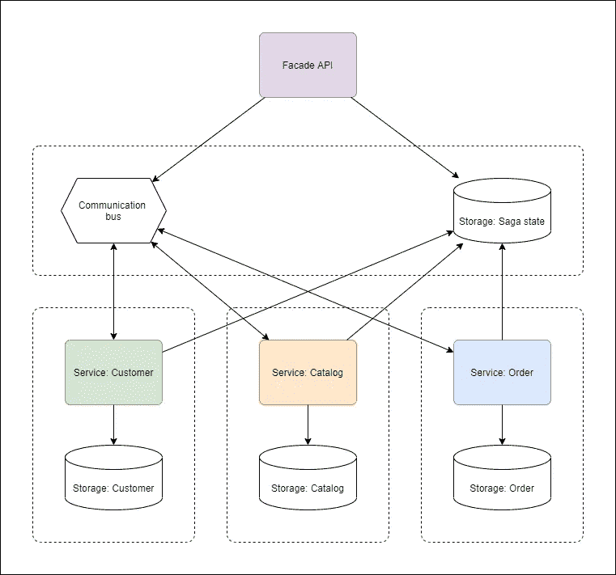
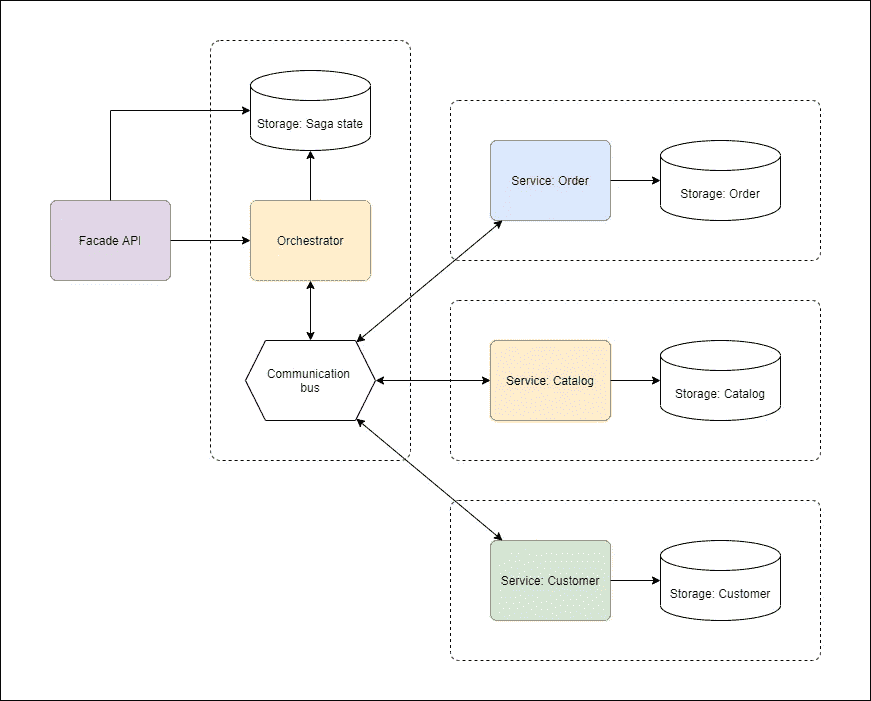
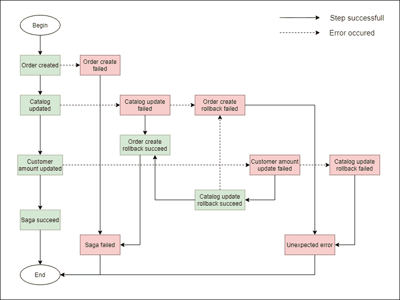
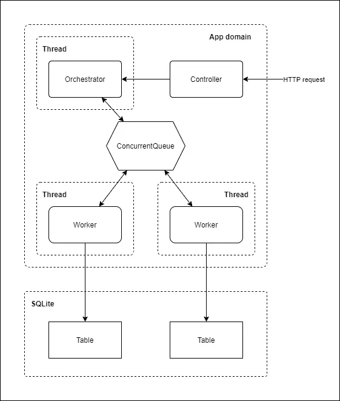
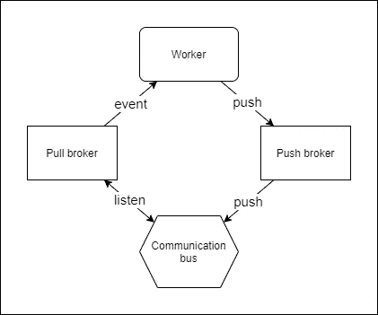
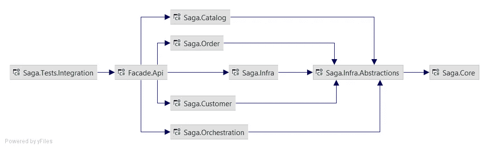
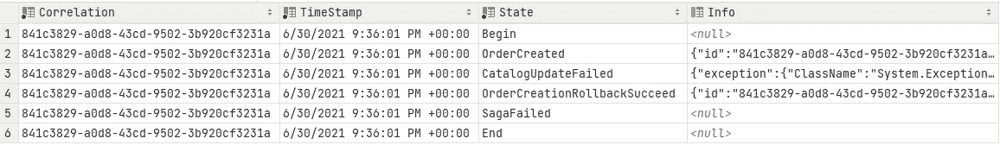
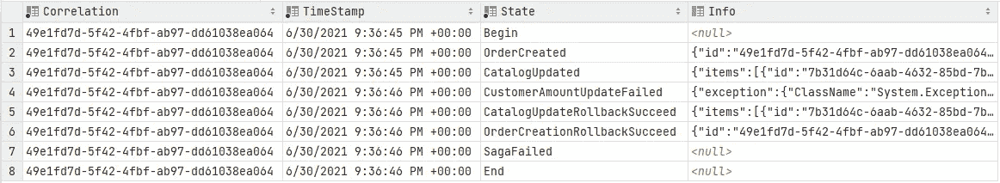

# 在中实现分布式事务。NET 使用 Saga 模式

> 原文：<https://medium.com/geekculture/implementing-distributed-transaction-in-net-using-saga-pattern-1641172c122?source=collection_archive---------7----------------------->

# 问题

假设我们正在开发一个在线商店，并选择了微服务架构方法，这实际上意味着为不同的应用环境提供独立的服务。比方说，我们的应用程序中有 3 个上下文:

*   **订单** —订单数据
*   **目录** —商品目录
*   **客户** —客户数据

每一个都假设一个独立的数据存储—这是一种常见的方法，允许处理诸如弹性、故障/分区容错、可用性、独立可伸缩性等系统质量属性。但是这种方法有一个严重的缺点，那就是数据的一致性。

嗯，只要我们使用单个服务(例如**目录**)，这没什么大不了的——所有操作都是原子的，可以很容易地撤销。但是，如果我们必须在不同的上下文中进行多个操作，但是作为单个事务，该怎么办呢？

让我们考虑以下情况:客户在我们的商店订购了一双运动鞋，我们想确定该订单的金额(例如，用于忠诚度计划)。这就是我们要做的:

*   添加订单(**订单**上下文)
*   更新商品目录中的运动鞋数量(**目录**上下文)
*   增加客户的订单总额(**客户**上下文)

所有操作都应该在一个事务中完成，这意味着，例如，如果目录更新失败，我们必须删除在上一步中创建的订单，等等。

当我们使用内部带有事务机制(例如关系数据库)的单块存储时，这显然不是问题，但是在分布式存储的情况下该怎么办呢？

# 解决办法

当然，这个任务并不罕见，有一个架构模式允许解决它，叫做 **Saga** 。

Saga 的基本概念是上下文相关的**服务**(或**工作者**)的顺序调用，使用共享通信总线和**事件驱动方法**。这些调用可以有两种类型:**常规**和**回滚**(撤销常规调用所做的更改)。

Saga 实现有两种方式:**编排**和**编排**。

# 舞蹈编排

没有单一控制点，所有服务在责任方面都是平等的。请参见下面说明这种方法的图表:



这种方法的好处是，我们不需要额外的 orchestrator 服务，每个服务自己负责自我编排。但这也是一个缺点:通信变得太复杂——每个服务都应该监视由其他服务产生的事件。

只有当我们有少量的工人服务时，这种方法才是可接受的(不同的人给出不同的数字，3–5；从我的角度来看，应该考虑的事情是，事件生产者/监听器的数量随着每个新工人的增加而急剧增加。

# 管弦乐编曲

另一种方式称为**编排**，因为它采用单点控制，称为**编排**。请考虑下图:



orchestrator 服务的主要职责是通过接收和产生适当的事件来管理工作人员的工作。

这种方法的好处显而易见——服务之间的低耦合、简化的通信、不需要自我编排。Orchestrator 完成了所有的管理工作——但这也是一个缺点，因为它变成了某种“上帝的对象”。

然而，这种方法是更可取的，如果你有多个步骤(超过 5 个服务)——这就是我们在解决方案中遵循的方法。

# 状态机

这个传奇可以被描述为一个**国家机器**。**节点**描述当前的传奇状态，而**边**是传奇步骤。几乎每一步(不包括具体的系统)都可能导致两种结果:**成功**和**错误**。基本上，**错误**步骤结果意味着应该遵循回滚步骤。

请参见下图:



# 体系结构

由于本文的主要目标是通过一个简单的例子来展示 Saga 的能力，我们将尽可能地保持对基础设施的不可知。我们将尝试构建一个可以用于任何通信总线和数据存储的解决方案。

对于特定的实现，我们使用**SQLite**——一种简单、轻量级的基于文件的关系存储和**concurrent queue**——内存中的数据结构进行通信。基于**的解决方案本身。NET 5.0** 并用 **C#语言**编写。

由于这个例子非常简单，我们不使用分布式托管:所有服务都位于应用程序域内的共享内存中，使用多线程模型。请参见下图，以便更好地理解:



如您所见，每个 worker 服务都使用自己的表，但是它们都位于同一个 DB 中。

但是，当然，在现实世界中，我们更喜欢分别托管 orchestrator 和 workers，使用专用存储和分布式消息服务( **RabbitMQ** 、 **Azure Service Bus** 、 **Apache Kafka** 等)。).

# 数据存储

呈现以下关系表:

用于**订单**上下文:

*   命令
*   Order details——订单的子表，包含实体细节

用于**目录**上下文:

*   目录

在**客户**环境中使用:

*   顾客

由**指挥者**使用:

*   SagaState-saga 步骤跟踪

# 信息发送

这里的关键点是，我们不希望我们的服务监听通信总线本身，因为这会增加系统耦合。让我们考虑一下**代理**方法，它允许我们使用特定的**代理**对象以事件驱动的方式与总线通信:



示例代理接口:

```
public interface IPullMessageBroker<TMessage>
{
    event EventHandler<TMessage> MessageReceived;

    public void Run();
}

public interface IPushMessageBroker<in TMessage>
{
    void PushMessage(TMessage e);
}
```

# 代码库

请记住，我们仍然希望我们的系统是低耦合的，依赖于抽象，并且与基础设施无关的。考虑下面的项目依赖关系图:



让我们快速浏览一下项目:

*   **核心** —业务领域模型、DTO 和一些扩展工具
*   **目录**、**订单**和**客户** —特定工人上下文
*   **编排** —编排器上下文
*   在下文中。抽象概念 —这里的关键点。它是一组抽象，描述 Saga 基础设施，但不实现它。如您所见，所有的上下文服务都引用了这个项目
*   **下文** —实施，具体针对我们的示例项目
*   **门面。Api** —托管和入口点
*   **测试。集成**——一小组集成测试，涵盖基本的传奇案例

解决方案源代码可以在这里找到: [GitHub](https://github.com/denislevinskiy/saga-pattern-example/) 。您可以下载它并运行集成测试——它们涵盖了 saga flow 的几个案例，将在下一节中进行描述。

# 示例流程

# 成功运行

**测试等级** : `SagaSucceedTest.cs`

**假设**:所有输入数据都有效

**预期结果** : saga 成功，带有适当的跟踪。

**实际结果**:


# 由于目录数量无效，运行失败

**测试等级** : `SagaFailedInCaseInvalidCatalogQtyTest.cs`

**假设**:

*   订单输入数据有效
*   订单中的商品数量超过目录中的数量

**预期结果** : saga 因回滚而失败。

**实际结果**:



# 由于客户订单金额无效，运行失败

**测试等级** : `SagaFailedInCaseInvalidCustomerOrdersAmountTest.cs`

**假设**:

*   订单输入日期有效
*   目录输入数据有效
*   客户的订单金额无效(负值)

**预期结果** : saga 失败，回滚。

**实际结果**:



可以在这里找到: [GitHub](https://github.com/denislevinskiy/saga-pattern-example/) 。该解决方案功能齐全。

就是这样。希望这篇文章对你有用。NET 开发人员，他们研究分布式架构模式。