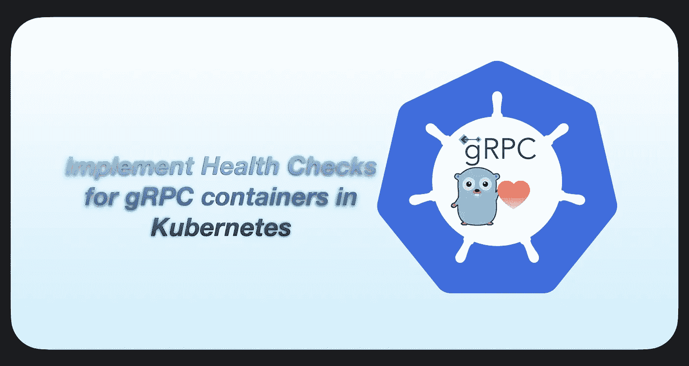

# 在 gRPC 容器中为 Kubernetes 实现健康检查

> 原文：<https://medium.com/geekculture/implementing-healthchecks-in-grpc-containers-for-kubernetes-d5049989ab12?source=collection_archive---------0----------------------->

## K8s 中 gRPC 容器的启动、就绪和活性探测

GoLang gRPC Health Check within kubernetes

当一个容器被部署在 [*Kubernetes*](https://kubernetes.io/) 平台中时，它将假定该容器在被容器运行时创建后立即准备好接受流量。这对一个“*你好世界”来说再好不过了*应用*；*但不是为了生产…