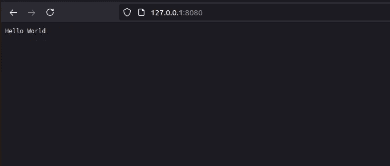

# 从套接字实现 HTTP

> 原文：<https://medium.com/geekculture/implementing-http-from-socket-89d20a1f8f43?source=collection_archive---------2----------------------->

*利用 TCP 套接字用 Python 实现 HTTP 服务器和客户端*

HTTP 代表超文本传输协议。它是一种应用层协议，用于使用浏览器在客户端和服务器之间进行数据通信。我们可以使用套接字来实现 HTTP。我们必须根据 HTTP 规范( [RFC2616](http://www.w3.org/Protocols/rfc2616/rfc2616.html) )对消息进行解码/编码，它只是一个文本。在本文中，我们将实现 HTTP 协议的基础。

## HTTP 服务器

我们将创建一个 TCP 套接字。HTTP 的默认端口是 80。但是我们将使用 8080 来运行我们的测试。

您可以使用请求模块接收来自自定义 HTTP 服务器的响应。

```
>>> import requests
>>> data = requests.get("[http://127.0.0.1:8080](http://127.0.0.1:8080)")
>>> data.status_code
200
>>> data.text
'Hello World'
>>> data.headers
{}
```

在服务器上，您可以看到:

```
*GET / HTTP/1.1
Host: 127.0.0.1:8080
User-Agent: python-requests/2.22.0
Accept-Encoding: gzip, deflate
Accept: */*
Connection: keep-alive*
```

> 请求

HTTP 请求由以下内容组成。

1.  `***Request line***` *:一行标识请求类型和路径。*
2.  `***Headers***` *:一组可选的 RFC-822 样式报头*
3.  `***Data***` *:可选数据。*

**请求行**

概括地说，我们可以说请求行包括

`METHOD REQUEST-URL HTTP-VERSION CRLF`

上述请求的请求行是:`GET / HTTP/1.1`

方法是`GET`。也就是说我们想从服务器上获取数据。请注意，该方法区分大小写。这里资源的路径是`/. HTTP/1.0`是我们正在使用的 HTTP 协议版本。而`\r\n`是 CRLF。CR-LF 表示回车。它表示线路结束。

**标题**

`Host, User-Agent, Accept, Accept-Encoding, Connection` 是请求头字段。

**数据**

在上面的请求中，我们没有发送任何数据。让我们发送另一个请求来更好地理解事情。

```
>>requests.**post**(url=”[http://127.0.0.1:8080?a=1](http://127.0.0.1:8080?a=1)", headers= **{“header1”: “value1”, “header2”: “value2”**},data=**{“key1”: “value1”, “key2”: “value2”}**)
```

在印刷品中我们可以看到:

```
***POST******/?a=1*** *HTTP/1.1
Host: 127.0.0.1:8080
User-Agent: python-requests/2.22.0
Accept-Encoding: gzip, deflate
Accept: */*
Connection: keep-alive* ***header1: value1
header2: value2*** *Content-Length: 23
Content-Type: application/x-www-form-urlencoded****key1=value1&key2=value2***
```

此处，方法已更改为 post。我们可以看到请求 url 已经被修改为`?a=1`。添加了我们的自定义标题 `header1`和`header2`。我们发送的数据`key1`和`key2`也存在。

> 浏览器

我们可以从浏览器访问服务器。打开浏览器，输入`127.0.0.1:8080`



在终端中，您将看到以下结果。

```
*GET / HTTP/1.1
Host: 127.0.0.1:8080
User-Agent: Mozilla/5.0 (X11; Ubuntu; Linux x86_64; rv:89.0) Gecko/20100101 Firefox/89.0
Accept: text/html,application/xhtml+xml,application/xml;q=0.9,image/webp,*/*;q=0.8
Accept-Language: en-US,en;q=0.5
Accept-Encoding: gzip, deflate
Connection: keep-alive
Upgrade-Insecure-Requests: 1
Cache-Control: max-age=0*
```

## HTTP 客户端

我们可以使用相同的原理实现我们自己的 HTTP 客户端。这是一个简单的套接字程序。

上面的代码将打印出来:

```
HTTP/1.1 200 OKHello World
```

*   `HTTP/1.1`是我们正在使用的协议。
*   `200`是表示请求成功的状态代码。状态代码是三位数。
*   `OK`这是一个简单的单线阶段，说明原因。
*   `Hello World`是消息的正文。它是被修改的部分。

> 反应

回应是:

1.  *一行给出响应代码*
2.  *一组可选的 RFC-822 样式的报头*
3.  *可选数据*

结论:

这是简单的裸骨。更多信息，我发现 C python 源代码很有用。[https://github . com/python/cpython/blob/main/Lib/http/client . py](https://github.com/python/cpython/blob/main/Lib/http/client.py)