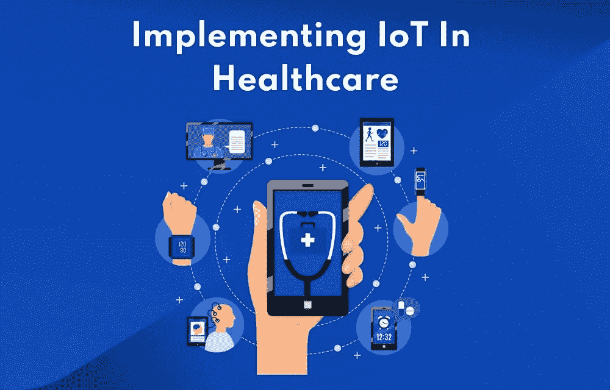

# 在医疗保健 2022 中实施物联网

> 原文：<https://medium.com/geekculture/implementing-iot-in-healthcare-2022-b608a0023ab?source=collection_archive---------10----------------------->

## 预计 CAGR 将增长 13.20%，从 2019 年的 1137.5 亿美元增长到 2027 年的 3326.7 亿美元。

它是一个由物理设备组成的网络，通过连接允许数据在它们之间流动。它还用于医疗保健领域，以收集、分析和监控电子健康记录。包含个人身份信息、受保护的健康信息和其他机器生成的医疗保健数据。

*   到 2025 年，物联网医疗保健技术市场预计将达到**4000 亿美元。**
*   **预计 CAGR 将增长 13.20%，从 2019 年的 1137.5 亿美元增长到 2027 年的 3326.7 亿美元。**

**此外，医疗保健领域的物联网应用有助于履行重要职责。包括改善病人的结果和减轻医疗服务提供者的部分压力。**

**物联网正在生活的各个方面迅速发展，包括医疗保健。简而言之，这项技术使几个相连的设备能够收集和共享数据。**

# **这对医疗系统意味着什么？**

**应用程序如此多样，以至于你很难相信这些是真实的例子。这里有几个例子:**

*   **症状跟踪应用程序可以提醒医生患者对癌症治疗反应的变化，并帮助他们避免住院治疗。**
*   **连接到互联网的医院技术告诉医生他们的当前位置，通知医院管理人员更换需求，并评估员工的表现。**
*   **远程温度监控确保了疫苗的安全运输和储存。**
*   ****两个例子:**是提醒患者补充药物的医疗保健系统。如果患者忘记在正确的时间得到药物，可消耗的传感器会提供信息。**
*   **连续血糖监测仪和智能胰岛素笔可以记录并推荐胰岛素注射的时间和剂量，为糖尿病患者提供帮助。**
*   **患有哮喘和肺病的人可以使用与应用程序关联的智能吸入器，更好地了解导致他们症状的原因，并预测过敏。**

# **物联网在医疗领域的应用**

**得益于物联网(IoT ),设备可以在一个集中的网络中进行交互和交换数据。可以实时收集所有数据，从而收集大量分析材料。由于医疗设施的增强，标准医院可能会成为智能医院。**

**该设施技术先进，所有数据都得到实时整合和跟踪。现代医院有各种选择来利用这些技术元素提高他们的效率、便利性，甚至降低成本。**

**[**物联网应用还有许多其他优势，可以增强医疗保健设备的未来应用**](https://www.groovyweb.co/blog/iot-app-development-the-next-big-technology/) 。在医学上，这项技术有着广泛的用途。让我们看几个例子。**

# **物联网在医疗保健领域的使用案例如下**

## **通过互联网进行患者监护**

**作为卫生和社会关怀部的非部门公共实体，英国国民医疗服务体系(NHS)表示愿意在 2018 年之前促进远程糖尿病治疗。在 2018 年世界糖尿病日，宣布了这一消息。CGMs(连续葡萄糖监测器)可能是一种选择。该设备被放置在患者的手臂上，持续检测血糖水平。**

**使用 Android 或 iOS 智能手机，您可以查看监测数据。其中一些产品，如 Freestyle Libre 和 Eversense，随处可见。智能健康监测小工具对糖尿病研究和治疗具有重大影响。**

## **可摄取传感器**

**根据 2003 年世界卫生组织的研究，几乎一半的处方药要么服用不当，要么被忽视。Proteus 的可摄取传感器解决方案就是解决这一问题的一个例子。这些传感器代替处方，并在胃中溶解后向接收设备发出信号。Proteus 的智能药丸是令人难以置信的技术进步，无疑将有助于减少关键医疗药物的不当和浪费摄入率。这些都是尖端的药物管理技术。**

**尽管是一项尖端的医疗技术，Porteus 智能药丸与传统药丸大小相同。还可以买到带有微型摄像头的智能药丸，允许用户查看他们身体的内部环境。**

## **智能医院**

**通过将物联网技术集成到医疗保健行业，它几乎可以扭转所有这些场景。使用区块链和智能合约的自动化中央数据库可以取代笨重庞大的纸质登记簿。**

**一个包罗万象的管理系统可以通过智能手机实时接收提交内容、控制队列和跟踪员工。所有设备都可以使用区块链和智能合同进行远程监控和管理(例如，在紧急情况下关闭)。**

**投资此类开发可以帮助医院节省资金、维护森林，并让病人和医务人员的生活更轻松。复杂的自动化解决方案也将提高生产率，因为它可以快速检测健康问题。相比之下，医生的实时诊断需要几个月时间。**

## **移动医疗**

**因为几乎每个人都拥有智能手机，移动健康，包括通过手机监测和控制个人健康，可以成为现代患者的真正救星。移动医疗业务对急诊和常规治疗场景都有很大贡献。如“远程患者监护”一节所述，还可以通过移动应用程序控制健康跟踪设备。**

**只有少数初创公司通过应用程序获得市场份额。这些应用程序可以作为一个成熟的医疗保健中心。允许您查看重要的医疗数据，分析生物模式，管理附加的身体佩戴物联网传感器，并通过简单的滑动联系您的医生。**

## **慢性病治疗哪种更有效**

**在可穿戴设备、传感器、数据分析和移动技术的帮助下，使用 IOT 有助于更高效和有效地治疗疾病。**

**问题是，随着时间的推移，必须记录和检查反复出现的健康问题。它可以使用这种策略来确定疾病波动的趋势，并对它们进行比较，以建立最有效的治疗方法。**

**所有这些技术都有可能实现这一点，区块链和人工智能的结合增加了一系列新的功能。**

# **物联网在医疗保健领域最显著的优势**

**医疗保健软件解决方案的重要性怎么强调都不为过，因为技术有望改善医疗保健服务，减轻医疗保健提供商的负担。鉴于人口老龄化和慢性病病例的增加，这一点至关重要。**

# **物联网在医疗保健领域的优势**

*   ****远程监控:**在医疗紧急情况下，通过联网的物联网设备和智能通知进行实时远程监控，可以帮助诊断疾病、治疗疾病和挽救生命。**
*   ****预防:**智能传感器监测健康状况、生活方式选择和环境，以建议预防措施，限制疾病和急性状态的传播。**
*   ****医疗保健领域的成本削减:**物联网消除了昂贵的医生出诊和住院需求，使检测更加便宜。**
*   ****医疗数据可访问性:**它允许患者接受高质量的护理，同时还帮助医疗服务提供者做出最佳的医疗决策，避免困难。**
*   ****改善治疗管理:**物联网设备有助于跟踪药物输送和治疗反应，并减少医疗差错。**
*   ****改善医疗保健管理:**医疗保健机构可以通过利用物联网设备获得重要设备和员工的工作效率。然后他们可以提出改进建议。**
*   ****研究:**由于物联网设备可以收集和分析大量数据，因此它们在医疗研究方面有着巨大的潜力。**

# **物联网在医疗保健领域的劣势**

*   ****数据安全**:由于所有链接的设备都实时传输数据，隐私是物联网的最大问题。如果端到端连接不安全，个人数据就会被窃取。犯罪分子可以从他人的个人信息中获利。**
*   ****精度**:由于实时处理如此大量的数据，可能会出现精度问题。**
*   ****成本**:虽然物联网可能会降低患者的诊疗成本，但所有设备的安装和维护都相当昂贵。**

# **医疗保健中的物联网:威胁与挑战**

**尽管物联网在医疗保健方面有很大的潜力，但在全面实施之前仍有许多障碍需要克服。以下是在医疗保健中使用联网设备的风险和缺点:**

*   ****安全和隐私:**医疗监控解决方案有被入侵或被黑的可能。因此，安全性和隐私仍然是阻碍客户将物联网技术用于医疗目的的重大担忧。窃取关于患者健康和行踪的敏感信息，以及篡改传感器数据，可能会产生深远的影响，抵消物联网的优势。**
*   ****故障风险:**传感器和连接设备的性能可能会受到硬件故障和断电的影响，从而给医疗保健操作带来风险。此外，错过计划中的软件更新可能比错过医生的预约风险更大。**
*   ****集成:**由于物联网协议和标准没有达成共识，不同厂商的小工具可能不兼容。缺乏一致性阻碍了物联网的全面集成，限制了它的潜在用途。**
*   ****成本:**虽然从长远来看，物联网(IoT)可以削减医疗成本，但在医院和员工培训中实施物联网的成本相对较高。**

# **医疗保健领域物联网的未来**

**到 2022 年，成熟的智能医院、全球移动医疗将成为常规。此外，更少的物理医院访问将成为常态——这是物联网成功的粗略图像。然而，尽管它还很年轻，但这个概念在今天的医院中并不新鲜。它要么正在实施主要的物联网方法和功能，要么已经拥有已经升级和正在校准的组件。**

**预计到 2022 年底，全球近 90%的医疗保健机构和组织将采用物联网作为常规内部工具。医疗保健领域的物联网现在生机勃勃，前景更加光明。**

# **摘要**

**物联网有可能成为医疗保健等关键领域的一场革命。还有几个障碍需要克服，尤其是在技术方面。尽管现在有一些缺点和优点，这个概念看起来运作良好。**

**我们相信，如果你询问大多数医学专家对此事的看法。此外，他们会告诉你，完全融入和适应 IoMT 是医学进步的唯一逻辑路径。**

**然后你就可以利用大规模技术进步带来的拯救生命和改善健康的好处。我希望您了解物联网及其在医疗保健领域的重要性。要了解医疗保健 app 开发的一切，是通过从市场上聘请一家 [**顶级移动 app 开发公司**](https://www.groovyweb.co/service/mobile-app-development) 来完成的。**