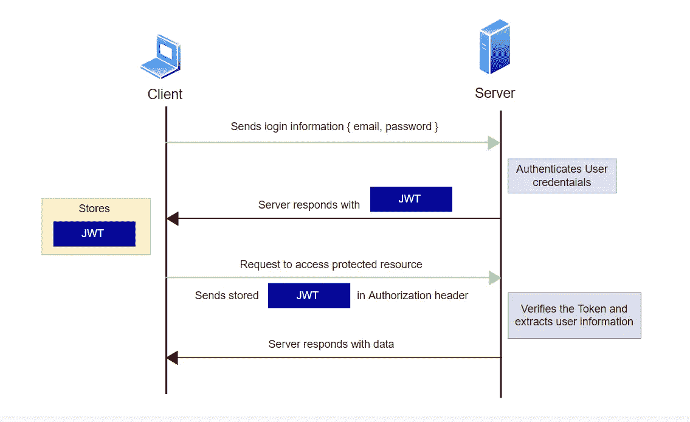
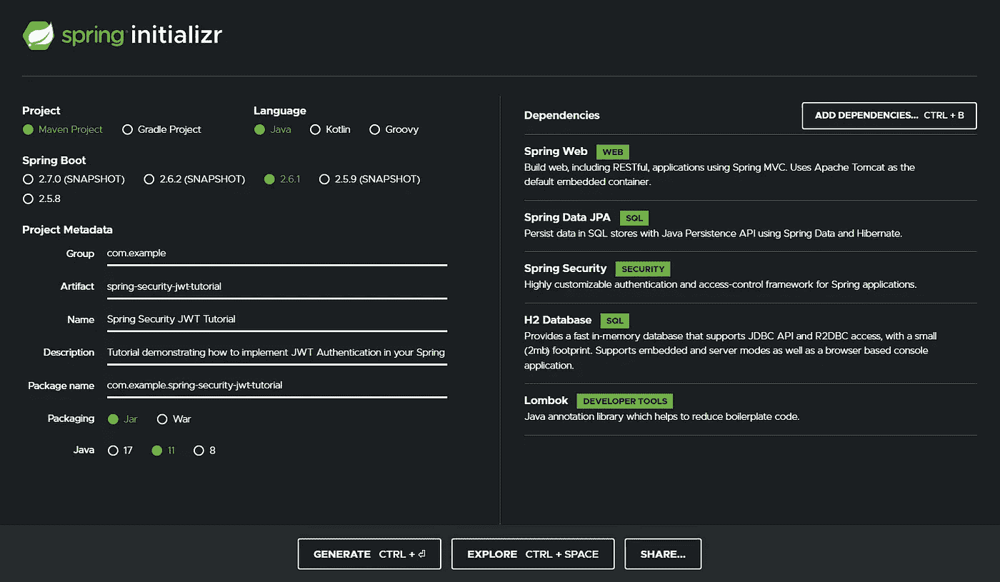
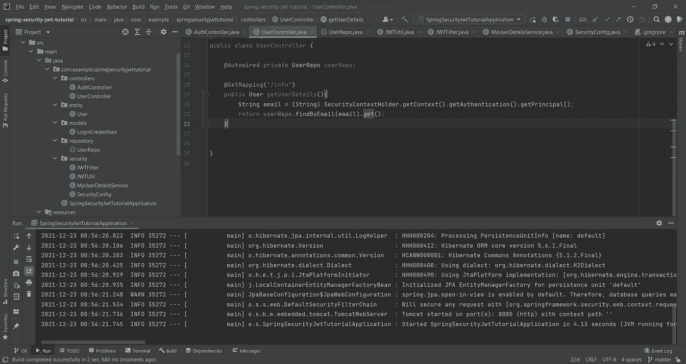
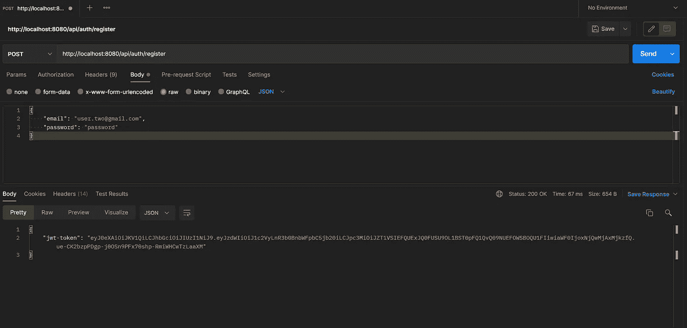
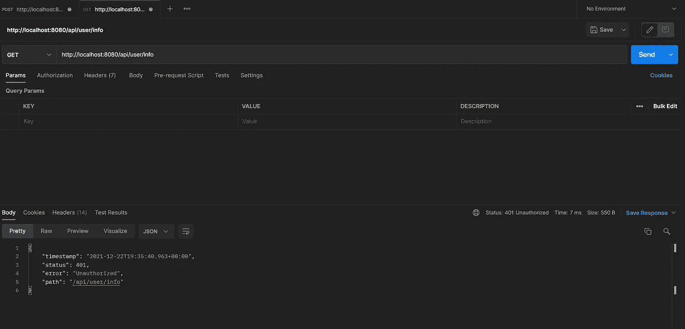
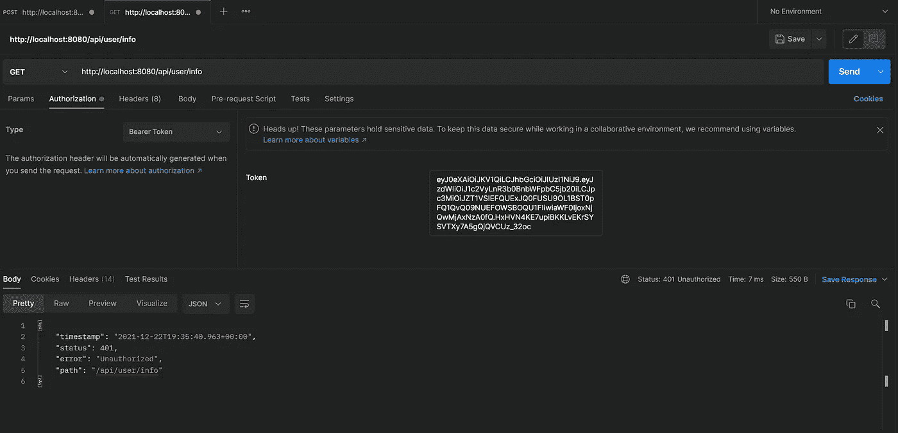
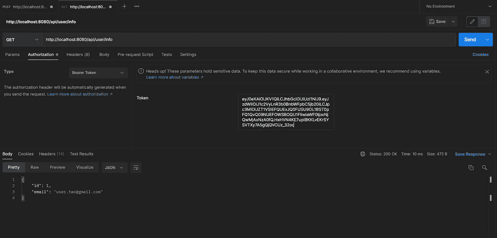

# 使用 Spring Security 实现 JSON Web Token (JWT)身份验证|详细演练

> 原文：<https://medium.com/geekculture/implementing-json-web-token-jwt-authentication-using-spring-security-detailed-walkthrough-1ac480a8d970?source=collection_archive---------0----------------------->


Photo by [FLY:D](https://unsplash.com/@flyd2069?utm_source=medium&utm_medium=referral) on [Unsplash](https://unsplash.com?utm_source=medium&utm_medium=referral)

# 介绍

在本教程中，您将学习使用 Spring Boot 和 Spring Security 实现 Json Web Token ( JWT)认证。首先，您将了解一些关于 JWTs 的基本理论，然后您将切换到动手模式，并在您的 Spring 应用程序中实现它。我会详细解释每一步，所以坚持到最后。

> **必读:**如果你是 JWTs 新手，那就继续读下去。然而，如果你已经使用过 jwt 或者对它们有所了解，并且想要开始实现，那么点击[这里](#b0bf)。


# WJWT 的帽子是什么？

JSON Web Token (JWT)是一个开放的互联网标准，用于在双方之间共享安全信息。这个令牌包含一个 JSON“有效负载”,它使用加密算法进行了数字签名(使用私有秘密或公共/私有密钥)。数字签名使令牌不会被篡改，因为被篡改的令牌会失效。

JWT 看起来像这样

**eyjhbgcioijiuzi 1 NII SINR 5 CCI 6 ikpxvcj 9 . eyjzdwiiixmjm 0 nty 3 odkwiiwibmftzsi 6 ikpvag 4g rg 9 liiwiawf 0 ijo xnte 2 mjm 5 mdiyfq . fgk 5 PCL 49k 3 jfncq 6 wztn 6t-ug 9 dv 4 hoyim 55 xtux8w**

一段令人畏惧的文字，是吧？

如果你仔细观察，你会注意到两个句号(。)JWT 中的符号。这些周期符号将 JWT 分成三个部分— **报头、有效载荷和签名**。

JWT 的一般形式是->**header . payload . signature .**

## 页眉

令牌的第一部分，头是一个 JSON 对象，包含两个属性， **typ** (表示令牌的类型，即 JWT)和 **alg** (用于签名的算法)。

```
{
"typ": "JWT",
"alg": "HS256"
}
```

这个 JSON 对象是 Base64Url 编码的，构成字符串的第一部分。

## 有效载荷

令牌的第二部分，即有效载荷，包含您希望使用此 JWT 传输的数据或“声明”。有一些明确的声明，如

*   **子** —令牌的主题
*   **iss** —令牌的发行者
*   **exp** —令牌的到期时间
*   **aud** —代币的受众

您还可以添加两端都同意的自定义声明，并提供有关令牌的共享额外信息。在下面的例子中，“角色”是一个自定义声明。

```
{   
  "sub": "john.doe@gmail.com",   
  "iss": "ABC Pvt Ltd",   
  "role": "ADMIN"
}
```

## 签名

签名是通过获取前两部分的编码字符串并将其与您的秘密一起传递给签名算法来创建的。

```
HMACSHA256(   
 base64UrlEncode(header) + "." + base64UrlEncode(payload),   
 secret
)
```

输出是您之前看到的 JWT

# JWT 认证流程

下图显示了 JWT 认证的流程。正如您在下图中看到的，服务器端没有存储任何东西。



# 行动（或活动、袭击）计划

您将构建一个公开三个端点的 REST API

1.  `**/api/auth/register**` —创建并保存一个`User`实体对象，并使用使用该实体构建的 JWT 进行响应。
2.  `**/api/auth/login**` —验证用户凭证并生成 JWT
3.  `**/api/user/info**` —受保护的路由，为认证用户响应用户信息

> **必读:在这里** **可以找到这个 GitHub 资源库中完整的文档化代码- >** [**。我建议您下载该项目，并仔细阅读几乎与每一行相关的注释，因为这些注释提供了“一切”的详细解释(包括作为先决条件您应该知道的基本内容)。你可以在上面分享的 GitHub 链接中找到下载和使用源代码的说明。**](https://github.com/senshiii/Spring-Security-JWT-Authentication)

# 设置项目

是时候动手做一些事情了，看看所有这些都是如何操作的。要设置您的 Spring Boot 项目，请访问[入门网站](https://start.spring.io/)。确保您已经选择了 **Maven** 项目和最新版本的 Spring Boot(没有快照)。

添加以下依赖项:-

1.  **Spring Web** :用于构建 Web 应用

2. **Spring Security** :为您的应用程序增加安全性

3.春季数据 JPA :持续性

4. **H2 数据库**:内存数据库，用于存储我们的应用程序数据

5. **Lombok** :使用注释帮助减少样板代码

您可以随意填写**神器**、**名称**和**描述**字段。最后，它应该看起来像这样。



Setting up Spring Boot project

点击 Generate，它会下载一个包含启动文件的档案。提取文件，并在您喜欢的 IDE 中打开它们。这将是项目的文件结构

```
com
    └───example
        └───springsecurityjwttutorial
            │   SpringSecurityJwtTutorialApplication.java
            │
            ├───controllers
            │       AuthController.java
            │       UserController.java
            │
            ├───entity
            │       User.java
            │
            ├───models
            │       LoginCredentials.java
            │
            ├───repository
            │       UserRepo.java
            │
            └───security
                    JWTFilter.java
                    JWTUtil.java
                    MyUserDetailsService.java
                    SecurityConfig.java
```

# 计划的执行

## 实体

首先让我们创建我们的用户实体。创建一个新的包`**entity**`和一个类`**User**`。这个类用 id、email 和密码字段定义了`**User**` POJO。`**@Entity**`注释将该类标记为一个实体，其他注释是 Lombok 注释，以减少样板代码(例如添加 getters、setters、constructors 等。).

> **注意:**`**@JsonProperty(access = JsonProperty.Access.WRITE*_ONLY*)**`**防止密码字段包含在 JSON 响应中。**

```
package com.example.springsecurityjwttutorial.entity;

import com.fasterxml.jackson.annotation.JsonProperty;
import lombok.Getter;
import lombok.NoArgsConstructor;
import lombok.Setter;
import lombok.ToString;

import javax.persistence.Entity;
import javax.persistence.GeneratedValue;
import javax.persistence.GenerationType;
import javax.persistence.Id;

@Entity
@Getter
@Setter
@ToString
@NoArgsConstructor
public class User {

    @Id
    @GeneratedValue(strategy = GenerationType.*AUTO*)
    private Long id;

    private String email;

    @JsonProperty(access = JsonProperty.Access.WRITE*_ONLY*)
    private String password;

}
```

## **贮藏室ˌ仓库**

**现在我们有了实体，让我们创建一个持久化它的方法。新建一个`**repository**` 包，新建一个`**UserRepo**` **接口。**我们定义了一个自定义方法`**findByEmail(String email)**` ，它根据用户的电子邮件来检索用户实体。(有点不言自明，嗯？\_(*.*)_/ )**

```
package com.example.springsecurityjwttutorial.repository;

import com.example.springsecurityjwttutorial.entity.User;
import org.springframework.data.jpa.repository.JpaRepository;

import java.util.Optional;

public interface UserRepo extends JpaRepository<User, Long> {
    public Optional<User> findByEmail(String email);
}
```

**现在让我们转到最重要的部分—安全性**

## **安全性**

**在我们做任何与安全相关的事情之前，让我们首先创建一个类来处理 jwt 的创建和验证。创建一个`**security**` 包，并在其中创建一个`**JWTUtil**` 类。要执行与 JWT 相关的操作，我推荐您使用 **java-jwt** 包。要将包包含在您的项目中，请将以下依赖项添加到您的`**pom.xml**`文件中，然后重新构建项目。**

```
<dependency>
    <groupId>com.auth0</groupId>
    <artifactId>java-jwt</artifactId>
    <version>3.18.2</version>
</dependency>
```

> ****注意:**最好从 github 站点复制依赖项，因为在您阅读本文时，最新版本可能会有所不同。你可以在这里 **找到包 [**的 github 站点。**](https://github.com/auth0/java-jwt)****

```
package com.example.springsecurityjwttutorial.security;

import com.auth0.jwt.JWT;
import com.auth0.jwt.JWTVerifier;
import com.auth0.jwt.algorithms.Algorithm;
import com.auth0.jwt.exceptions.JWTCreationException;
import com.auth0.jwt.exceptions.JWTVerificationException;
import com.auth0.jwt.interfaces.DecodedJWT;
import org.springframework.beans.factory.annotation.Value;
import org.springframework.stereotype.Component;

import java.util.Date;

@Component
public class JWTUtil {

    @Value("${jwt_secret}")
    private String secret;

    public String generateToken(String email) throws IllegalArgumentException, JWTCreationException {
        return JWT.*create*()
                .withSubject("User Details")
                .withClaim("email", email)
                .withIssuedAt(new Date())
                .withIssuer("YOUR APPLICATION/PROJECT/COMPANY NAME")
                .sign(Algorithm.*HMAC256*(secret));
    }

    public String validateTokenAndRetrieveSubject(String token)throws JWTVerificationException {
        JWTVerifier verifier = JWT.*require*(Algorithm.*HMAC256*(secret))
                .withSubject("User Details")
                .withIssuer("YOUR APPLICATION/PROJECT/COMPANY NAME")
                .build();
        DecodedJWT jwt = verifier.verify(token);
        return jwt.getClaim("email").asString();
    }

}
```

**`**generateToken**`方法创建一个带有主题、发布者、发布时间和自定义声明“电子邮件”的令牌，第二种方法验证该令牌并提取电子邮件。为了让这个工作，你需要提供一个秘密。秘密是一个字符串(专用于您的项目/团队/公司),用于签署您的令牌。永远不要分享你的秘密。打开`**resources/application.properties**`文件，添加以下属性。**

```
jwt_secret=REPLACE_THIS_WITH_YOUR_SECRET
```

**确保您选择一个随机的长字符串作为您的密码，以确保您的令牌的安全。一个行之有效的方法是让你的猫在键盘上跑(开个玩笑；p)**

**现在让我们创建用户详细信息服务。使用一个`**UserDetailsService**`来提供定制的实现，以获取试图在应用程序中进行身份验证的用户的详细信息。这在`**loadUserByUsername**`方法中完成。如果没有找到这样的用户，就会抛出一个`**UsernameNotFoundException**`。创建一个类`**MyUserDetailsService**` ，它将实现`**UserDetailsService**` 接口。**

```
package com.example.springsecurityjwttutorial.security;

import com.example.springsecurityjwttutorial.entity.User;
import com.example.springsecurityjwttutorial.repository.UserRepo;
import org.springframework.beans.factory.annotation.Autowired;
import org.springframework.security.core.authority.SimpleGrantedAuthority;
import org.springframework.security.core.userdetails.UserDetails;
import org.springframework.security.core.userdetails.UserDetailsService;
import org.springframework.security.core.userdetails.UsernameNotFoundException;
import org.springframework.stereotype.Component;

import java.util.Collections;
import java.util.Optional;

@Component
public class MyUserDetailsService implements UserDetailsService {

    @Autowired private UserRepo userRepo;

    @Override
    public UserDetails loadUserByUsername(String email) throws UsernameNotFoundException {
        Optional<User> userRes = userRepo.findByEmail(email);
        if(userRes.isEmpty())
            throw new UsernameNotFoundException("Could not findUser with email = " + email);
        User user = userRes.get();
        return new org.springframework.security.core.userdetails.User(
                email,
                user.getPassword(),
                Collections.*singletonList*(new SimpleGrantedAuthority("ROLE_USER")));
    }
}
```

**如果你想了解更多关于`**UserDetailsService**`是如何工作的，以及 Spring Security 中的一般身份验证是如何工作的，请查看这里的>。**

**接下来让我们创建一个`**JWTFilter**`。通过实现`**OncePerRequestFilter**`接口，`**JWTFilter**`将为每个请求运行，并检查授权头中是否存在承载令牌。如果令牌存在，将验证令牌，并通过使用`**SecurityContextHolder**` 设置`**SecurityContext**` 的认证属性，为该请求的用户设置认证数据。这就是 JWT 发挥作用的地方，它确保您已经过身份验证，并且可以访问需要您登录/身份验证的受保护资源。**

```
package com.example.springsecurityjwttutorial.security;

import com.auth0.jwt.exceptions.JWTVerificationException;
import org.springframework.beans.factory.annotation.Autowired;
import org.springframework.security.authentication.UsernamePasswordAuthenticationToken;
import org.springframework.security.core.context.SecurityContextHolder;
import org.springframework.security.core.userdetails.UserDetails;
import org.springframework.stereotype.Component;
import org.springframework.web.filter.OncePerRequestFilter;

import javax.servlet.FilterChain;
import javax.servlet.ServletException;
import javax.servlet.http.HttpServletRequest;
import javax.servlet.http.HttpServletResponse;
import java.io.IOException;

@Component
public class JWTFilter extends OncePerRequestFilter {

    @Autowired private MyUserDetailsService userDetailsService;
    @Autowired private JWTUtil jwtUtil;

    @Override
    protected void doFilterInternal(HttpServletRequest request,
                                    HttpServletResponse response,
                                    FilterChain filterChain) throws ServletException, IOException {
        String authHeader = request.getHeader("Authorization");
        if(authHeader != null && !authHeader.isBlank() && authHeader.startsWith("Bearer ")){
            String jwt = authHeader.substring(7);
            if(jwt == null || jwt.isBlank()){
                response.sendError(HttpServletResponse.*SC_BAD_REQUEST*, "Invalid JWT Token in Bearer Header");
            }else {
                try{
                    String email = jwtUtil.validateTokenAndRetrieveSubject(jwt);
                    UserDetails userDetails = userDetailsService.loadUserByUsername(email);
                    UsernamePasswordAuthenticationToken authToken =
                            new UsernamePasswordAuthenticationToken(email, userDetails.getPassword(), userDetails.getAuthorities());
                    if(SecurityContextHolder.*getContext*().getAuthentication() == null){
                        SecurityContextHolder.*getContext*().setAuthentication(authToken);
                    }
                }catch(JWTVerificationException exc){
                    response.sendError(HttpServletResponse.*SC_BAD_REQUEST*, "Invalid JWT Token");
                }
            }
        }

        filterChain.doFilter(request, response);
    }
}
```

**要将这些放在一起并配置应用程序的安全性，创建一个类`**SecurityConfig**`**

```
package com.example.springsecurityjwttutorial.security;

import com.example.springsecurityjwttutorial.repository.UserRepo;
import org.springframework.beans.factory.annotation.Autowired;
import org.springframework.context.annotation.Bean;
import org.springframework.context.annotation.Configuration;
import org.springframework.security.authentication.AuthenticationManager;
import org.springframework.security.config.annotation.web.builders.HttpSecurity;
import org.springframework.security.config.annotation.web.configuration.EnableWebSecurity;
import org.springframework.security.config.annotation.web.configuration.WebSecurityConfigurerAdapter;
import org.springframework.security.config.http.SessionCreationPolicy;
import org.springframework.security.crypto.bcrypt.BCryptPasswordEncoder;
import org.springframework.security.crypto.password.PasswordEncoder;
import org.springframework.security.web.authentication.UsernamePasswordAuthenticationFilter;

import javax.servlet.http.HttpServletResponse;

@Configuration
@EnableWebSecurity
public class SecurityConfig extends WebSecurityConfigurerAdapter {

    @Autowired private UserRepo userRepo;
    @Autowired private JWTFilter filter;
    @Autowired private MyUserDetailsService uds;

    @Override
    protected void configure(HttpSecurity http) throws Exception {
        http.csrf().disable()
                .httpBasic().disable()
                .cors()
                .and()
                .authorizeHttpRequests()
                .antMatchers("/api/auth/**").permitAll()
                .antMatchers("/api/user/**").hasRole("USER")
                .and()
                .userDetailsService(uds)
                .exceptionHandling()
                    .authenticationEntryPoint(
                            (request, response, authException) ->
                                    response.sendError(HttpServletResponse.*SC_UNAUTHORIZED*, "Unauthorized")
                    )
                .and()
                .sessionManagement()
                .sessionCreationPolicy(SessionCreationPolicy.*STATELESS*);

        http.addFilterBefore(filter, UsernamePasswordAuthenticationFilter.class);
    }

    @Bean
    public PasswordEncoder passwordEncoder() {
        return new BCryptPasswordEncoder();
    }

    @Bean
    @Override
    public AuthenticationManager authenticationManagerBean() throws Exception {
        return super.authenticationManagerBean();
    }
}
```

**在配置中，需要注意的重要部分是**

*   **“auth”路由请求被所有人授予访问权(这是很明显的，因为您需要访问登录和注册路由)**
*   **“用户”路由请求只能由`**MyUserDetailsService**`中设置的“用户”角色的认证用户访问**
*   **UserDetailsService 是用定制的`**MyUserDetailsService**` bean 配置的**
*   **服务器被配置为在到达入口点时以未授权为由拒绝请求。如果达到这一点，则意味着当前请求需要身份验证，并且没有发现附加到当前请求的授权头的 JWT 令牌。**
*   **JWTFilter 被添加到过滤器链中，以便处理传入的请求。**
*   **为密码编码器创建 bean**
*   **在`**AuthController**`中暴露将用于运行认证过程的认证管理器的 bean**

## **模型**

**创建一个包`**models**` 和创建一个类`**LoginCredentials**` 。该类将用于接受来自请求主体的登录数据。这个类有两个简单的属性——email 和 password 以及相关的 Lombok 注释。**

```
package com.example.springsecurityjwttutorial.models;

import lombok.*;

@Getter
@Setter
@AllArgsConstructor
@NoArgsConstructor
@ToString
public class LoginCredentials {

    private String email;
    private String password;

}
```

**最后，让我们一起来看看。创建一个`**controllers**` 包。在包中，创建两个类**

*   **`**AuthController**` —处理授权路由注册和登录。**

```
package com.example.springsecurityjwttutorial.controllers;

import com.example.springsecurityjwttutorial.entity.User;
import com.example.springsecurityjwttutorial.models.LoginCredentials;
import com.example.springsecurityjwttutorial.repository.UserRepo;
import com.example.springsecurityjwttutorial.security.JWTUtil;
import org.springframework.beans.factory.annotation.Autowired;
import org.springframework.security.authentication.AuthenticationManager;
import org.springframework.security.authentication.UsernamePasswordAuthenticationToken;
import org.springframework.security.core.AuthenticationException;
import org.springframework.security.crypto.password.PasswordEncoder;
import org.springframework.web.bind.annotation.PostMapping;
import org.springframework.web.bind.annotation.RequestBody;
import org.springframework.web.bind.annotation.RequestMapping;
import org.springframework.web.bind.annotation.RestController;

import java.util.Collections;
import java.util.Map;

@RestController
@RequestMapping("/api/auth")
public class AuthController {

    @Autowired private UserRepo userRepo;
    @Autowired private JWTUtil jwtUtil;
    @Autowired private AuthenticationManager authManager;
    @Autowired private PasswordEncoder passwordEncoder;

    @PostMapping("/register")
    public Map<String, Object> registerHandler(@RequestBody User user){
        String encodedPass = passwordEncoder.encode(user.getPassword());
        user.setPassword(encodedPass);
        user = userRepo.save(user);
        String token = jwtUtil.generateToken(user.getEmail());
        return Collections.*singletonMap*("jwt-token", token);
    }

    @PostMapping("/login")
    public Map<String, Object> loginHandler(@RequestBody LoginCredentials body){
        try {
            UsernamePasswordAuthenticationToken authInputToken =
                    new UsernamePasswordAuthenticationToken(body.getEmail(), body.getPassword());

            authManager.authenticate(authInputToken);

            String token = jwtUtil.generateToken(body.getEmail());

            return Collections.*singletonMap*("jwt-token", token);
        }catch (AuthenticationException authExc){
            throw new RuntimeException("Invalid Login Credentials");
        }
    }

}
```

**`**register**` 方法持久化实体，然后用 JWT 响应，`**login**` 方法验证登录凭证，然后用 JWT 响应。**

*   **`**UserController**` —处理用户路线**

```
package com.example.springsecurityjwttutorial.controllers;

import com.example.springsecurityjwttutorial.entity.User;
import com.example.springsecurityjwttutorial.repository.UserRepo;
import org.springframework.beans.factory.annotation.Autowired;
import org.springframework.security.core.context.SecurityContextHolder;
import org.springframework.web.bind.annotation.GetMapping;
import org.springframework.web.bind.annotation.RequestMapping;
import org.springframework.web.bind.annotation.RestController;

@RestController
@RequestMapping("/api/user")
public class UserController {

    @Autowired private UserRepo userRepo;

    @GetMapping("/info")
    public User getUserDetails(){
        String email = (String) SecurityContextHolder.*getContext*().getAuthentication().getPrincipal();
        return userRepo.findByEmail(email).get();
    }

}
```

**请注意，用户的电子邮件不作为输入。从`**SecurityContext**` 中提取，作为`**JWTFilter**`中设置的邮件**

# **执行时间**

****

**在 [**上运行应用程序时，IntelliJ IDEA**](https://www.jetbrains.com/idea/) ，这是我得到的输出。看起来一切都很好。**

****

**Starting the Spring Boot App**

**现在让我们提一些要求。为了发出请求，我将使用 [**邮递员**](https://www.postman.com/downloads/?utm_source=postman-home) 。**

**首先，让我们走登记路线。**

****

**HTTP Request for Registering a User and generating JWT**

****万岁！！您刚刚使用 Spring Security 生成了您的第一个 JWT。现在让我们测试受保护的端点- >用户端点。复制这个令牌，因为你很快就会需要它。****

**让我们在一个新的选项卡中创建一个对用户端点的请求，而不添加令牌。**

****

**如您所见，请求被拒绝，状态为“**未授权**”。**

**现在让我们添加令牌。为此，请转到“授权”选项卡，从下拉列表中选择“不记名令牌”,然后将复制的令牌粘贴到提供的框中。**

****

**现在，如果您再次发送请求，您将看到以下内容**

****

**瞧吧！！现在你得到了用户数据。可以自行测试登录路径。**

# **结论**

****原来如此**。现在，您可以使用 Spring Boot 安全性和 Spring Boot 完全实现 JWT 认证流程。**

# **支持**

**如果你喜欢这篇文章，请跟随并鼓掌👏🏻因此，如果这篇文章对你有所帮助，请考虑给我买杯咖啡来支持我。这将帮助我写更多与技术和编码相关的文章，并尽我所能回馈社区。**

# **那么…再见…下次见！！🙋🏻‍♂️**

# **我的更多文章**

1.  **[揭秘 React 应用的文件夹结构](/swlh/demystifying-the-folder-structure-of-a-react-app-c60b29d90836) ( 58k+视图)**
2.  **[Spring 安全认证流程](/geekculture/spring-security-authentication-process-authentication-flow-behind-the-scenes-d56da63f04fa)**
3.  **[React Redux 深潜](https://javascript.plainenglish.io/react-redux-deep-dive-state-management-in-react-with-redux-b9af8b039bcc)**