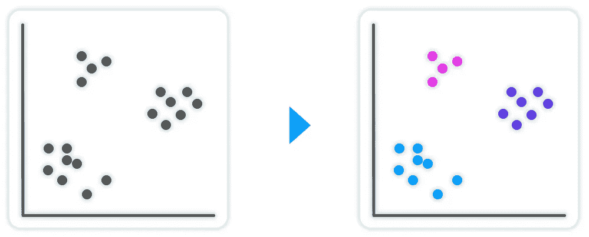
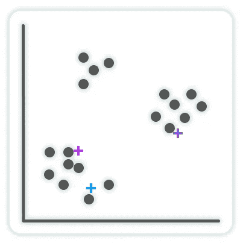
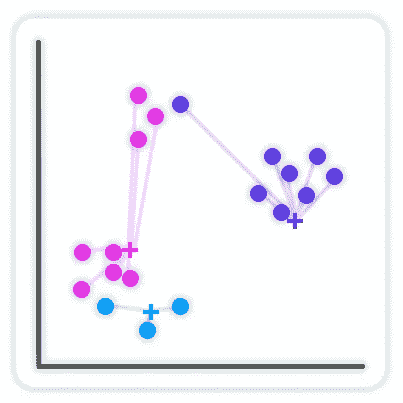
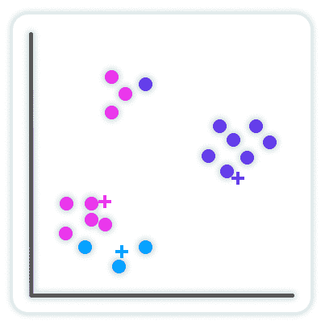
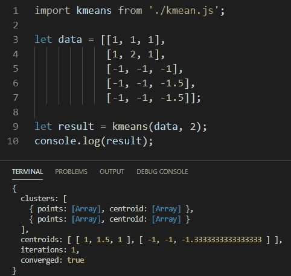
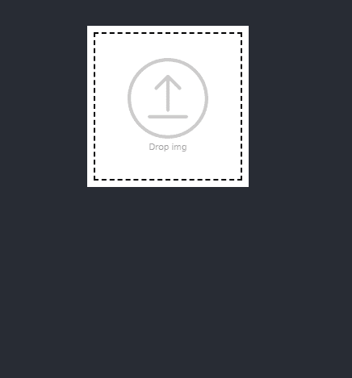

# 在 JavaScript 中从头开始实现 K-Means 集群

> 原文：<https://medium.com/geekculture/implementing-k-means-clustering-from-scratch-in-javascript-13d71fbcb31e?source=collection_archive---------2----------------------->

在本文结束时，您将理解 k-means 聚类算法的内部工作原理，并能够自己实现它。

# 什么是 k-means 聚类？

K-means 聚类是一种无监督的机器学习算法，用于在数据集中查找组。k-means 聚类的目标是将一个数据集分成相似项目的组(聚类)。

要使用 k-means 聚类，您需要为“k”提供一个数据集和一个数值:

```
k = 3
result = kmeans(dataset, k)
```

k-means 中的“k”是要将数据集分成的组的数量。在上面的例子中，你说“将这个数据集分成 3 组，每组的项目彼此相似。
另一种理解方式是“将相似的项目分成三个不同的组”。



K-means 是一种在数据中寻找模式的有用算法。对具有相似性的项目进行分组，并查找彼此不同的项目。
你甚至可以用 k-means 构建一个分类器，k-means 可以从中构建一个分类器。并将新数据分类到新发现的组中。

# k-means 聚类是如何工作的？

现在我们知道了 k-means 聚类的目标，让我们看看如何创建它。

**第一步:**我们从选择数据集中的随机点开始。这些将是初始质心(群集的中心点)。



**第二步:**现在我们检查每个点，并将其分配到一个簇中。我们希望将该点分配给最近的质心。我们通过计算该点和所有质心之间的欧几里德距离，然后将该点分配给最近的一个质心来实现这一点。



**步骤 3:** 在所有的点都被分配到一个聚类之后，我们重新计算聚类的质心。我们通过计算组平均值来做到这一点。这将把质心移动到簇的中心:


我们重复步骤 2 和 3，直到质心已经收敛(质心与前一次迭代中的质心相同)或者已经达到最大迭代次数。

**总之:
1:选择初始质心
2:将点分配到最近的质心
3:重新计算质心
重复步骤 2 和 3，直到收敛**



通过基于聚类平均值重新计算质心，在每次迭代中，质心将移动并逐渐收敛。创建相似项目的组。

# Javascript 实现

**选择初始质心:** 这里我从数据集中随机选择 3 个数据点。这是选择初始质心的更简单的方法之一，但是存在更好的方法([https://en . Wikipedia . org/wiki/K-means _ clustering # initial ization _ methods](https://en.wikipedia.org/wiki/K-means_clustering#Initialization_methods))。

**将点分配到最近的质心:
(** 出于优化原因，我使用平方欧几里得距离。)

**重新计算质心** 通过计算聚类的平均值来重新计算聚类的质心。

# 将所有这些整合在一起:

现在，对于完整的 k 均值聚类实现。
初始质心对 k-means 的收敛能力以及到达那里需要多长时间有很大影响。因此，不建议从完全随机选择的点开始。在最终的实现中，我添加了一个更复杂的初始化方法，叫做 Naive Sharding([https://www . kdnugges . com/2017/03/Naive-Sharding-centroid-initial ization-method . html](https://www.kdnuggets.com/2017/03/naive-sharding-centroid-initialization-method.html))。

我们在一个循环中运行前面的步骤，直到质心收敛，或者达到最大迭代次数。

最后，我们返回最终的质心和每个聚类中的数据点列表。

现在我们可以运行一个简单的例子来测试算法:



而且成功了！:)

现在你对 k-means 聚类和如何实现有了更好的理解！

一定要把你的新知识付诸实践，并创造性地应用它！
您可以在各种数值数据中应用 k-means。例如，我创建了一个应用程序，它可以拍摄一幅图像，并将像素颜色值聚集成五种主色:



现在让我看看你能用它做什么！

我希望你喜欢这篇文章！如果你用 k-means 做了很酷的事情，请告诉我。我很想看看你创造的东西！