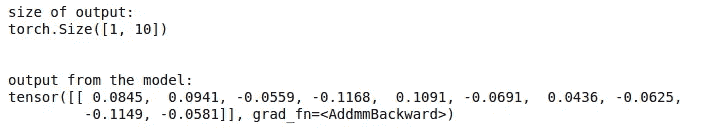

# 使用研究论文实施 LeNet 架构

> 原文：<https://medium.com/geekculture/implementing-lenet-architecture-using-the-research-paper-d780acf02e1e?source=collection_archive---------28----------------------->

阅读研究论文可能非常具有挑战性。这种语言本身很难理解，更糟糕的是，它可能包含一些方程式和算法，看起来像是某种莫名其妙的手稿。别担心，我会保护你的(很明显！).我们将看看 LeNet(特别是 LeNet-5)CNN 架构，并使用其研究论文从头开始实现它。

# 我 **简介**

LeNet 是第一个推广卷积神经网络概念的 CNN 架构之一。它的最终版本 LeNet-5 是由人工智能巨头 Yann LeCun，Yoshua Bengio，Leon Bottou 和 Patrick Haffner 在 1998 年推出的。该研究论文名为“基于梯度的学习应用于文档识别”。点击可以阅读[原文。我强烈建议你浏览一下报纸。](http://yann.lecun.com/exdb/publis/pdf/lecun-98.pdf)

# **LeNet 的影响**

LeNet 被认为是所有 convnets 之父。它是在 1989 年提出的，经过多年的研究，最终版本在 1998 年以 LeNet-5 的名称发布。它被用来识别每天数百万张支票上的手写数字。

当时，深度学习领域非常休眠，没有人再对神经网络感兴趣。神经网络研究的所有资金都被切断了，那段灰暗的时期被称为人工智能冬天。但是 LeNet-5 的成功再次启动了深度学习领域的研究。人们开始对神经网络感兴趣，并开始意识到它的潜力。LeNet 是第一个将反向传播算法用于实际应用的神经网络架构。

我们今天认为理所当然的所有概念，如反向传播、共层和共网等。因为 LeNet 而成为焦点。在某种意义上，我们可以说现代深度学习时代的灵感和真正的基础都来自于 LeNet。

# **建筑**

LeNet-5 的架构非常简单。它由 3 个卷积层(1 个输入层)、2 个汇集层和 3 个密集层(1 个输出层)组成。它接受一个 28x28 的图像作为输入，并给出一个大小为 10 的列表的输出，该列表由每个类别的概率组成。

因为 LeNet 主要用于识别手写数字，所以它可以识别数字 0-9。因此，模型的输出中有 10 个类。

**激活功能:** Tanh

**集中:**平均集中

**内核大小** : 5x5

**步幅:** 1，1

**填充:** 0，0

# **代号**

在本教程中，我们将使用 Pytorch 库。你可以使用任何你选择的深度学习库。

importing the torch library

我们已经导入了火炬库。 ***torch.nn*** 拥有构建架构所需的所有层和激活功能。

defining the network

在这里，我们正在建立我们的神经网络。因为 Pytorch 是建立在 OOPs 概念之上的，我们需要为我们的神经网络定义一个类。

__init__(self)构造函数将帮助我们在一个地方定义卷积层、线性层、池层和激活函数。一旦完成了层的定义，我们将继续实现我们的向前传递。

为了实现向前传递，我们需要定义一个 forward()函数。函数名必须是“forward ”,这一点很重要，因为这是 Pytorch 隐式使用的名称。

testing the output

现在，我们将测试我们的模型，看看它是否产生了预期的输出。我们定义了一个 1x32x32 尺寸的数组，其中 1 是通道，32x32 是图像的高 x 宽。由于这个图像是用随机数生成的，所以会很嘈杂。事实上，我们也可以使用任何大小为 32x32 的真实图像。 ***model = LeNet()*** 将创建我们模型的一个实例。 ***x = model(x)*** 将我们的图像馈送给模型，模型应该生成一个大小为 10 的数组。

printing the size and values of the output

我们可以看到我们的模型生成了一个大小为 10 的数组。在打印数组时，我们看到它是一个包含 10 个输出概率的张量。张量只不过是数组的一般形式。一个整数，二维数组，三维数组或者任何一个 n 维数组都可以称为张量。在这种情况下，它是一个 1x10 张量。

下面是本教程的完整代码。

the complete code

# 后续步骤

在这段代码中，我们只定义了 LeNet-5 的架构。我鼓励你从这个代码中创建一个成熟的培训管道。

1.  向此代码添加训练循环
2.  使用 MNIST 手写数字数据集进行训练
3.  从头开始训练网络
4.  创建一个实时数字分类工具

完成上面提到的步骤会让你大量接触深度学习的应用方面，希望你会在这个过程中学到很多。

# 遗言！

我希望你喜欢这篇教程，并学会了如何用代码实现一篇研究论文。LeNet 不仅仅是一个神经网络，它也是像我们这样的新手进入应用研究领域的入门。让我们花一分钟时间来欣赏一下这个看似简单的模型是如何一劳永逸地改变了深度学习领域的。