# 用 React 钩子实现进度条

> 原文：<https://medium.com/geekculture/implementing-progressive-bar-with-react-hooks-24e45ba7f6ce?source=collection_archive---------23----------------------->


Photo by [Jakub Dziubak](https://unsplash.com/@jckbck?utm_source=medium&utm_medium=referral) on [Unsplash](https://unsplash.com?utm_source=medium&utm_medium=referral)

游戏节目《谁想成为百万富翁》是游戏节目中的一个，它将价格进程整合到一个问题的每一个正确答案上。

一旦用 **REACTJS** 正确回答了一个问题，我将指导你如何整合这个价格进程。

在本教程中，我将使用 Visual studio 代码(VSCode)。

**先决条件**

*   安装 npm 或纱线
*   了解 Javascript
*   React 的基础

让我们开始吧。让我们到终端运行以下命令:

```
cd Desktop
npx create-react-app game-application
cd game-application
code .
```

我在桌面文件夹中创建了一个名为 game-application 的 react 项目，并在 vscode 中打开了这个项目。

让我们进入 src 文件夹，在终端中运行以下命令:

```
mkdir component util pages
```

我在 src 文件夹中创建了三个新文件夹。让我们进入组件文件夹，创建以下组件:

```
DisplayGame.js PriceProgress.jsx
```

在 DisplayGame 组件中，我将添加以下内容:

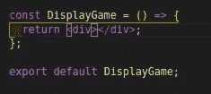

game display

我刚刚创建了一个钩子，它将呈现将在浏览器中显示的问题。同时，让我们进入之前创建的 util 文件夹，创建一个名为 container.js 的 util 文件，它将保存我们所有的容器(问题和价格数组),并向其中添加以下内容:

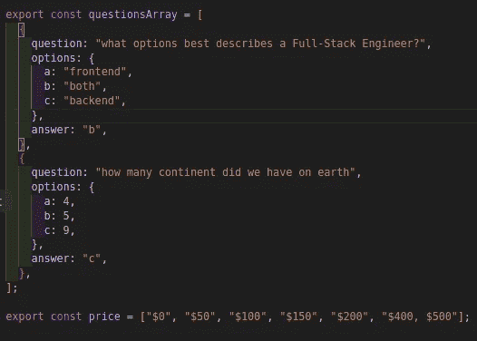

在上面的代码片段中，我导出了两个变量，一个是问题数组，另一个是每个正确答案的价格。

让我们进入显示游戏组件，将第一个问题设置为页面安装时的状态，如下所示:

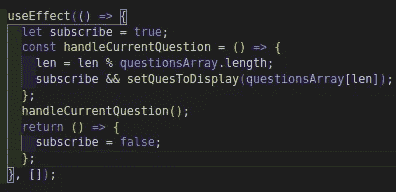

我使用 useEffect 钩子从问题数组中获取第一个问题，并将其订阅到一个状态，该状态在每个进度中都保存当前问题。最后，每当页面被卸载时，我都会取消订阅状态。

现在，让我们看看当前问题将如何在下面呈现:

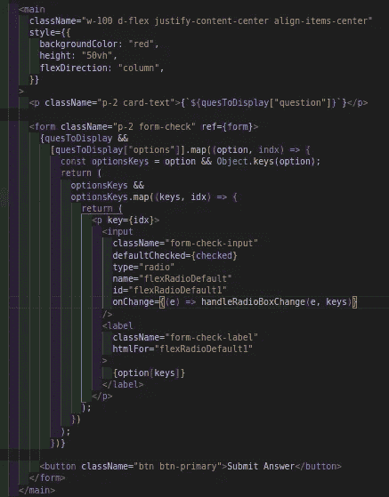

在上面的代码片段中，我遍历了 questo display——这是一个在每个进度中保存当前问题的状态。一个段落元素用于显示每个进度的问题，一个表单用于呈现用户必须从中选择的问题选项，一个按钮用于处理每个正确问题的价格进度。

注意:我将所有选项键都放入了 options keys 变量中，这样我就可以根据键动态地设置选项。所以 option[key(a|b|c)]保存选项的每个值。

如果仔细观察上面的代码片段，您会注意到在 radio 输入中添加了一个 handle change 函数，以获取事件和用户检查任何输入时选择的当前选项。

让我们在下面的代码片段中处理当选择一个答案时会发生什么。

同时，让我们声明一个状态来处理选中的无线电输入，另一个状态来处理选中的选项(a|b|c ),如下所示:

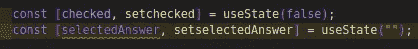

state variables


onchange handler

每当收音机输入发生变化时，当前检查的收音机和选择的选项将被设置为状态。

是处理用户提交响应时发生的事情的时候了。下面，让我们添加 handleSubmit 函数:

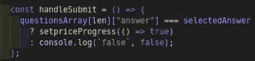

submit function

在上面的片段中，我检查了所选答案是否与该问题的正确答案相匹配。如果匹配，我将 setpriceProgress(一个保存正确答案标志的状态)设置为 true。否则，错误值将被打印到控制台。

将 priceProgress 设置为 true 后，让我们在 useEffect 中将它设置为 true 两秒钟后，将其重置回 false，如下所示:

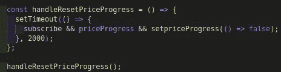

让我们进入 PriceProgress 组件并添加以下内容:

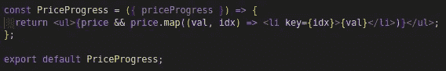

price progress component

价格集合是从 util 导入的，我遍历它，并将各种价格呈现在一个列表元素中。priceProgress 状态是从 price progress 属性中析构的。

今后，一旦用户的答案是正确的，我将处理价格如何进展。

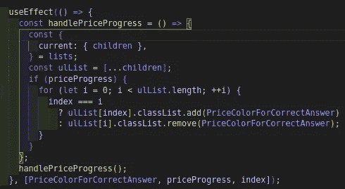

price progress handler

我给保存价格列表的 UL 元素分配了一个引用。我在价格中循环，添加了一个样式，它将颜色保存在任何正确答案的价格中，并将颜色从其他价格中删除。

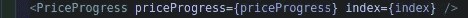

价格进度组件已导入到 DisplayGame 组件中。PriceProgress 和当前问题的索引作为道具传递给它。

在 DisplayGame 组件中，让我们添加一个按钮，它将为我们提供下一个问题和一个处理程序，如下所示:

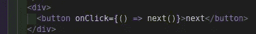

next button handler

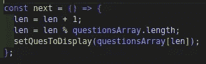

next function

在上面的代码片段中，我在 form 元素后面添加了一个按钮，还添加了一个从问题数组中获取下一个问题的处理程序，并将其设置为呈现问题的状态。

在之前创建的页面文件夹中，我们在其中创建一个名为 View.js 的组件，并将 DisplayGame 组件导入其中，如下所示:

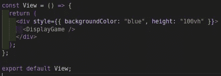

View component

那么让我们进入浏览器，看看下面的 [***演示***](https://res.cloudinary.com/hobbyluv07/video/upload/v1633346230/Screencast_from_04-10-2021_11_42_23_fvuxfb.webm) 中游戏应用是如何工作的

随着演示，我想我可以称之为成功。当问题回答正确时，我现在可以指定用户的当前价格。

最后，这是这篇牛逼文章的结尾。点击下面的 [***为来源***](https://github.com/chibuike07/price-progress-game-application)

告诉我，你的下一个应用程序会是什么样的？如果这篇文章对你有帮助，别忘了点击拍手图标，分享这篇文章，关注我的 [***中的***](https://princewillchime43.medium.com/) 和[***Linkedin***](https://www.linkedin.com/in/chime-princewill-3a2b1b192/)以查看我的更多文章。

请放弃任何评论或建议。如果你有一个基于 JavaScript/React.js 生态系统的主题，请随时联系我，我很乐意就此进行写作。谢了。