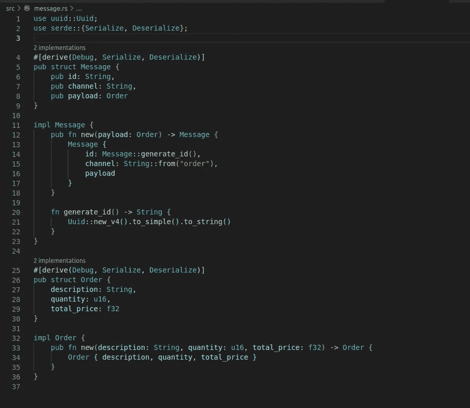
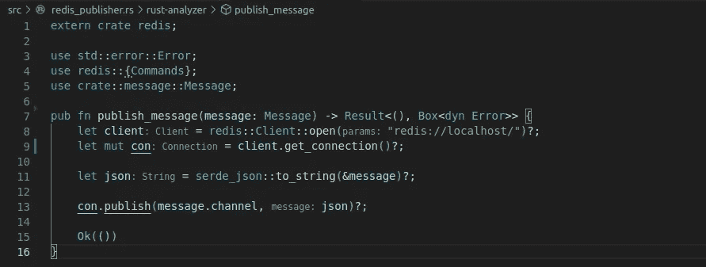
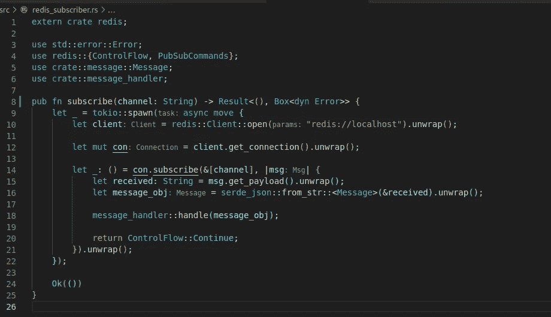
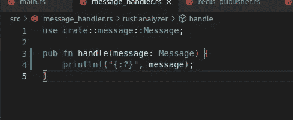

# Rust 中的微服务:在 Redis 中发布和订阅消息

> 原文：<https://medium.com/geekculture/implementing-pub-sub-pattern-in-rust-with-redis-publish-f0eeac3354b1?source=collection_archive---------7----------------------->


Photo by [Kate Macate](https://unsplash.com/@katemacate?utm_source=medium&utm_medium=referral) on [Unsplash](https://unsplash.com?utm_source=medium&utm_medium=referral)

发布/订阅模式，也称为发布/订阅，是一种广泛使用的模式，它需要以异步和分离的方式在服务之间创建通信。

如您所知，Redis 是内存中的数据结构存储，主要用于缓存和存储数据，它还为我们提供了发布/订阅功能，这为这个令人惊叹的工具又增加了一个实用工具。

在本文中，我们实现了发布消息的方法，并生成了一个线程来监听 Redis 中推送的消息。

为此，我们将使用不可思议的、全世界都喜爱的语言:Rust！

完整代码是 github 上的 [repo，如果有对你有用的部分欢迎克隆！](https://github.com/paoloposso/rust_redis_pubsub/blob/main/src/redis_publisher.rs)

我假设您的机器上安装了 Redis、Rust 和 Cargo(软件包管理器)。但不管怎样，链接来了:

[](https://www.rust-lang.org/tools/install) [## 安装铁锈

### 关于 Rust 安装的注意事项如果您刚刚开始使用 Rust，并且想要更详细的演示，请参见…

www.rust-lang.org](https://www.rust-lang.org/tools/install) [](https://redis.io/download) [## 雷迪斯

### 稳定版本完全遵循通常的 major.minor.patch 语义版本模式。不稳定这是所有的…

redis.io](https://redis.io/download) 

要创建项目，请选择您的首选文件夹，打开终端(或 cmd)并执行命令。

```
cargo new rust_pubsub --bin
```

之后，将使用 main.rs 文件创建该结构。

转到 Cargo.toml 文件并添加依赖项:

```
[dependencies]tokio = { version = "*", features = ["full"] }redis = "*"uuid = { version = "0.8.2", features = ["v4"] }serde_json = "*"serde = {version = "*", features = ["derive"]}
```

现在让我们创建消息结构。这个结构将是发布在 Redis 上的消息。注意，我们有一个 Order 结构作为有效载荷。



在这种情况下，Message 作为包装器工作，Order 是有效负载。当然，在不同的项目中，我们可能有不同的有效载荷。泛型可以让事情变得更加灵活。

注意，该消息还有一个 channel 属性，用于标识要订阅的 Redis 通道并推送消息。

Message 还有一个自动生成的 UUID，可用于跟踪、调试或识别消息。

*派生*属性对于序列化、反序列化和打印(调试)结构非常重要。

下面的文件 redis_publisher.rs 包含发布功能。它连接到 Redis，在本例中是在 localhost 上，并将消息发布到通道。



在这种情况下，我使用 serde 来序列化对象，因此它可以作为 json 发布。

下面的代码在 Redis 上创建了一个频道订阅。



请注意， [Tokio](https://tokio.rs/tokio/tutorial) 在这里用于生成一个线程，该线程将监听 Redis 上“订单”频道上发布的每条消息。

接收到的消息被反序列化为一个消息对象，并发送给消息处理程序，如下所示。



在这种情况下，我只打印对象信息，但是当然这对于订阅者来说是一个重要的部分，在这里接收到的消息将被处理、验证、记录等等…

现在让我们完成代码，使用 main.rs 文件来模拟微服务调用。


tokio::main 属性必须添加到 main 函数中，还有 async 标记，否则前面描述的 async 特性将不起作用，程序将会死机。

在 main 函数中，我们调用 subscribe 函数，它将运行在前面看到的衍生线程上，然后我们调用 *publish_message* 函数，创建一个消息对象并传递给该函数。

现在，为了测试我们的程序，在您的终端中执行“货物运行”。订单应按其发布和接收的顺序显示。

```
Message { id: "2fa21d130e1042eba88d2611bb274aef", channel: "order", payload: Order { description: "T-Shirt", quantity: 3, total_price: 24.0 } }
Message { id: "1b027c9dc6874c32ad8976b60b1f9a91", channel: "order", payload: Order { description: "Sneakers", quantity: 1, total_price: 230.0 } }
published
Message { id: "041b78207fb54939aa3ad4ebda7733ff", channel: "order", payload: Order { description: "Milka Bar", quantity: 10, total_price: 50.0 } }
```

好了，就这些，希望你喜欢！