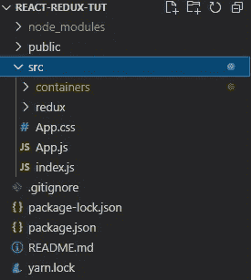
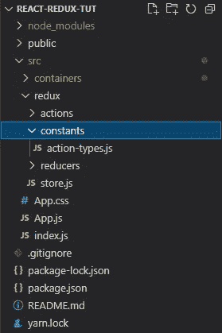
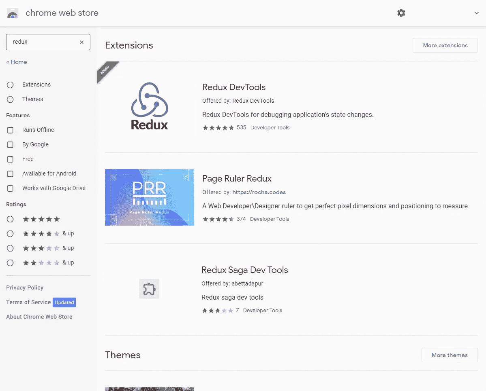
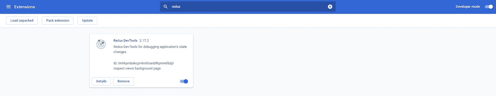
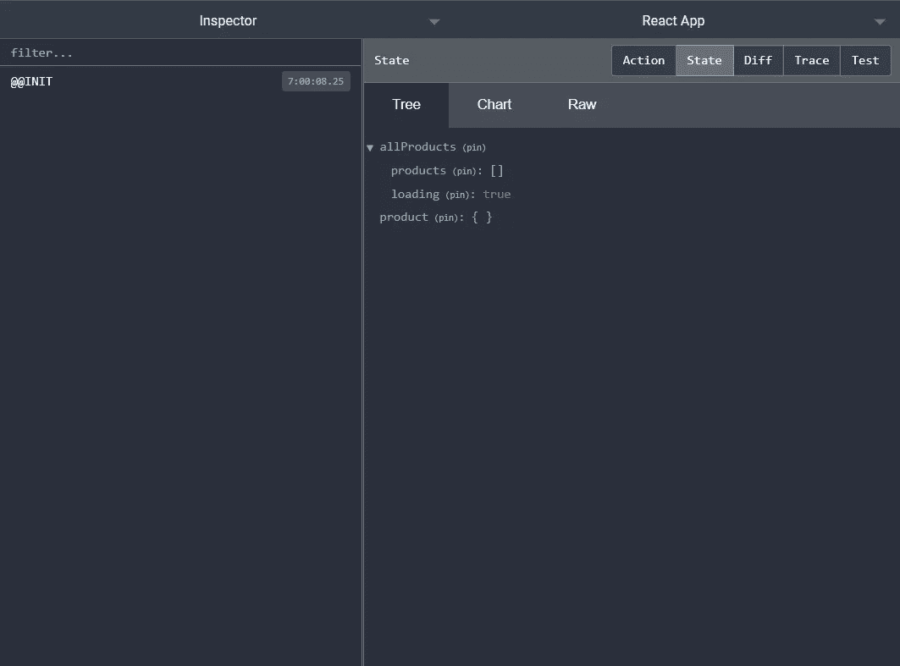
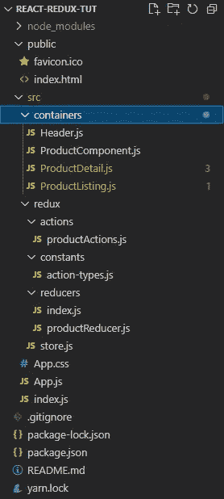

# 用 axios 以正确的方式实现 React hooks/Redux 第 1 部分

> 原文：<https://medium.com/geekculture/implementing-react-hooks-redux-with-axios-the-right-way-part-1-34ceab44de4f?source=collection_archive---------2----------------------->


嘿，伙计们，所以在这个教程中，我们将学习如何正确地使用 react 钩子和 redux。关于如何实现这一点有很多教程，但大多数最终都让它看起来很复杂，因此，我们将以最简单易懂的方式实现 Redux 样板，我们还将使用 **Axios** 以及一些 react 挂钩(如 **useDispatch** 、 **useSelector** 和 **useEffect** )来发出 Http 请求。我们将使用来自 [**fakestoreapi**](https://fakestoreapi.com/) 的假数据来获取产品列表，当我们单击一个产品时，我们也将获得产品详细信息(第 2 部分)并显示在我们的项目中。说得够多了，让我们深入研究一下。

# 要求

*   [axios](https://www.npmjs.com/package/axios)
*   [redux](https://www.npmjs.com/package/redux)
*   [react-redux](https://www.npmjs.com/package/react-redux)
*   [Redux 开发工具](https://chrome.google.com/webstore/detail/redux-devtools/lmhkpmbekcpmknklioeibfkpmmfibljd?hl=en)

1.  首先，我假设您已经创建了一个 react 应用程序。如果没有，请从您的终端键入以下命令。我将把我的应用程序命名为**“react-redux-tut”**你可以随意命名你的应用程序。

```
npx create-react-app react-redux-tut
```

2.通过运行以下命令安装所有必需的依赖项。

```
npm install redux react-redux axios
```

3.现在转到 src 目录，创建两个名为 **containers** 和 **redux 的目录。我现在知道你在想什么了😉**。而且**你说得对！👍。**我们的组件将放在**容器**目录中，而与 redux 有关的所有内容都将放在 **redux** 目录中。



4.现在转到你的 **redux** 目录，创建 **store.js** 。另外，创建另外三个目录，名称分别为**动作、减少器和常量**，并在常量目录中创建**动作类型. js** 文件**。**



5.现在我们在我们的**action-types . js**文件中声明一些类型。所以打开文件并粘贴下面的代码。

**SET_PRODUCTS** 用于获取产品列表。

**SELECTED_PRODUCT** 监控选中的产品，

**REMOVE_SELECTED_PRODUCT** 是在选择新产品时，从商店中删除之前选择的产品。我们将在本文的后面部分对此进行更多的讨论，

**PRODUCTS_ERROR** 告诉我们在向我们的 API 发出请求时是否发生了错误。

6.现在是时候配置我们的商店了。所以打开你的 **store.js** 文件，粘贴下面的代码。请注意，我们有**窗口。_ _ REDUX _ dev tools _ EXTENSION _ _&&窗口。_ _ REDUX _ dev tools _ EXTENSION _ _()**让我们能够从浏览器监控我们的商店。您可以查看此 [**链接**](https://github.com/zalmoxisus/redux-devtools-extension#installation) 了解更多详情。

我们首先导入 **createStore** 方法来创建我们的商店。我们还从我们的 **reducer** 目录中导入了**索引**，我们将在**第 8 步**中创建该目录。

7.接下来，为了能够在浏览器中查看和监控我们的 redux 商店，我们需要安装 chrome 网络商店的扩展。



redux-chrome-web-store-extension

一旦成功安装，当我们在搜索栏中键入**“redux”**时，我们应该会在我们的扩展列表中看到类似这样的内容。



8.现在转到您的 **reducers** 目录，创建一个名为 **index.js** 的文件，并粘贴下面的代码。

这个文件在一个地方包含了我们所有的减速器。我们首先从 redux 导入我们的**combiner reducerss**方法，这样我们就可以合并我们正在导入的所有 reducer。我们还导入了 **productReducer** 和 **selectedProductReducer** ，我们将在下一步中创建它们。

9.在你的 **reducer** 文件夹中创建一个名为 **productReducer.js** 的文件，并粘贴下面的代码。

所以这里我们首先从我们的 **action-types.js** 文件导入我们的 **ActionTypes** ，它包含我们的常量 **SET_PRODUCTS** 和 **SELECTED_PRODUCT** 。之后，我们为我们的产品初始化一些默认状态，然后我们创建一个函数，在这个函数中，我们使用 javascript [switch case](https://developer.mozilla.org/en-US/docs/Web/JavaScript/Reference/Statements/switch) 。 **SET_PRODUCTS** 案例首先返回我们使用 [spread 操作符](https://developer.mozilla.org/en-US/docs/Web/JavaScript/Reference/Operators/Spread_syntax) ( **…state** )声明的所有先前状态的对象，之后 PRODUCTS 对象包含我们的操作数据(action.payload)。现在，如果假设 API 没有响应，或者调用 API 时出现错误，那么 **PRODUCTS_ERROR** case 会将 loading 设置为 false，并且错误会显示我们将从操作文件中发送的错误消息。默认情况下，我们调用包含初始状态的状态。现在，我们将在下一步中创建我们的动作文件，但在进入下一步之前，我们将看到我们的 chrome devtool 是否正在工作，因此打开您的根 **index.js** 文件，从 react-redux 导入**提供者**并从 **store.js** 文件存储，然后用**提供者**包装您的**应用程序**组件，并将**存储**作为道具进行存储。

现在启动你的应用程序`npm start`，打开你的 chrome 开发者工具`ctrl + shift + c`，进入 **redux** 标签，点击 **state** 查看我们在 **productReducer.js** 文件中声明的初始状态。



10.现在打开 actions 文件夹，创建一个名为 **productActions.js** 的文件，粘贴下面的代码。

这个文件负责创建我们所有的动作，就像这里一样，它正在创建一个动作，这个动作将帮助我们使用 Axios 库从 API 获取数据，我们接下来将展示这个库。所以这里我们从 **action-types.js** 文件中导入我们所有的 **ActionTypes** 常量。

`Note: the payload contains the data which will be passed to the productReducer which is then getting imported to the index.js file which contains products object inside combineReducer method. So ultimately products object inside our combineReducers method contains all our data.`

我们的 redux 样板已经设置好了，现在是时候实际使用我们的数据了。

11.现在是时候开始创建我们的组件了。我们需要添加 [SemanticUI](https://semantic-ui.com/) 进行造型。去你的公共目录，打开你的 index.html 文件。在**链接**部分，粘贴语义提示 **CDN**

```
<link rel=”stylesheet” href=”https://cdnjs.cloudflare.com/ajax/libs/semantic-ui/2.4.1/semantic.min.css" integrity=”sha512–8bHTC73gkZ7rZ7vpqUQThUDhqcNFyYi2xgDgPDHc+GXVGHXq+xPjynxIopALmOPqzo9JZj0k6OqqewdGO3EsrQ==” crossorigin=”anonymous” referrerpolicy=”no-referrer” />
```

12.请记住，在第 3 步中，我们创建了一个名为 **containers g** o 的目录，并创建了 **Header.js** (它将保存我们在应用程序中的头)、 **ProductListing.js** (它将包含从 API 中获取 redux 存储中的产品的逻辑。)、 **ProductComponent.js** (它是保存产品项目的初始组件)和 **ProductDetails.js** (我们将在本文的第 2 部分中处理它)



现在打开 **Header.js** 并粘贴下面的代码。(注意:类都是 SemanticUI 类。点击此 [**链接**](https://semantic-ui.com/) 查看更多关于 SemanticUI

13.接下来，打开 **ProductListing.js** 并粘贴下面的代码

所以这里我们从 react-redux 导入**used dispatch**和 **useSlector** 钩子，从我们的 **productActions** 文件导入我们的 **setProducts** 函数。现在，在我们的功能组件内部，我们正在将我们的**used dispatch**钩子传递给 **dispatch** 变量。

之后，我们创建了一个异步函数 **fetchProducts** ，它将 **dispatch** 作为参数传递，然后使用 Javascript try catch 来捕捉来自 API 的响应。如果 API 发送响应时没有错误，它将在 try 中被捕获，数据将被传递给有效负载，如果有任何错误，它将在 catch 中被捕获，响应将被传递给有效负载。

这个**调度**然后在我们的 react **useEffect** 钩子中调用，第一个参数是 **setProducts** 作为参数。这将呈现我们的 fetchProducts 函数以从 API 获取数据。记住 **setProducts** 从我们的 **productActions.js** 中获取一个 **products** 的参数，它应该是从 API 响应中获取的有效负载。之后，我们使用 **useSelector** 钩子从存储中提取数据。所以我们将我们的**状态**传递给**产品**变量。现在，如果我们控制我们的 **products** 变量，我们将找到所有的状态，如 loading 和 products。

然后，为了能够在我们的 **ProductComponent.js** 中使用这些数据，我们需要将它放在来自 **ProductListing.js** 的返回语句中

`Note: **state** inside useSelector is declared in our reducer **index.js** file. This holds all our products state. If we console.log the state inside useSelector: **useSelector(state => console.log(state))** you will get all the states declared in our **combineReducer.** So this way you can get data from the store to any of your component just call the action file function to that component and use useSelector to call the state to that component.`

14.接下来，我们需要获取从 **ProductListing.js** 导出的数据，这样我们就可以在 out **ProductComponent.js 中使用它了。**打开 **ProductComponent.js** 并粘贴下面的代码。

这里，我们使用 **useSelector** 钩子从存储中提取数据。然后我们析构我们的**产品**，并用 javascript map 函数迭代我们的产品数组。为了使用我们的产品项目，我们将它作为变量 **renderList** 传递，这样我们可以将它添加到 return 语句中，以显示在我们的 **App.js** 中

15.就这样，现在将您的产品组件导入到 **App.js** 并刷新浏览器以查看更改。


fakeshop-listing-image

**PS:** 在这个应用程序的第二部分，我将创建一个详细信息页面打开一个产品的详细信息页面，每当你点击该产品。此外，我将放弃回购的链接。

别忘了**关注我**看更多故事。谢谢😁😊尽情享受吧！！！