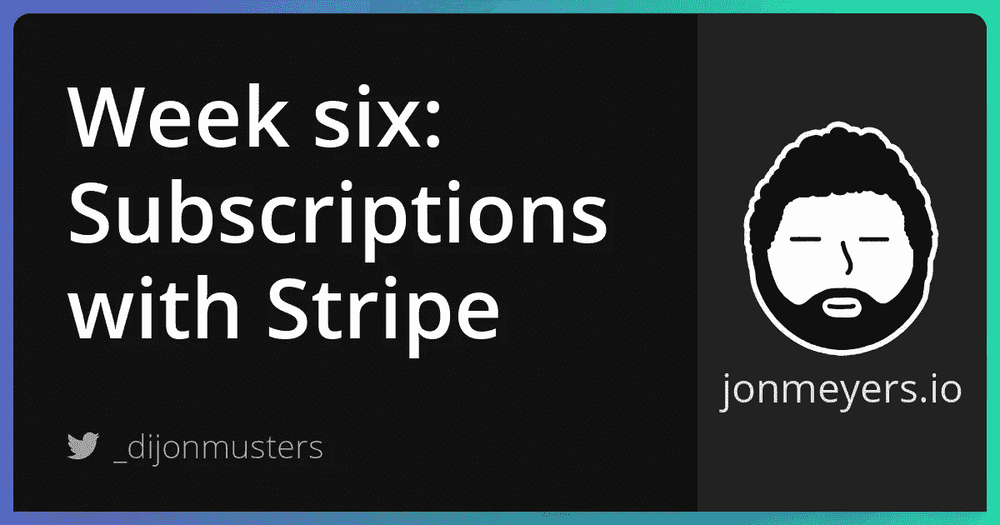
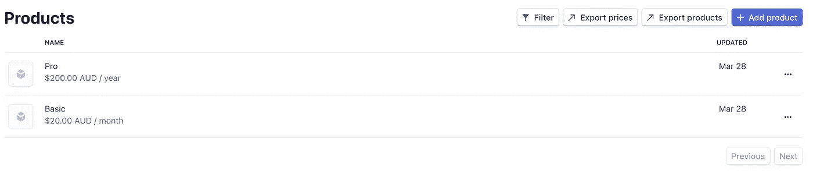
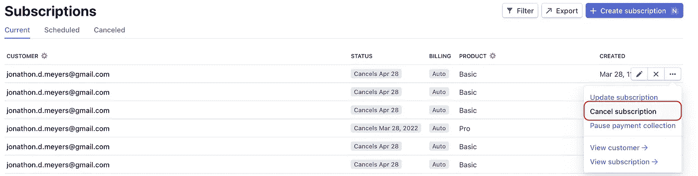
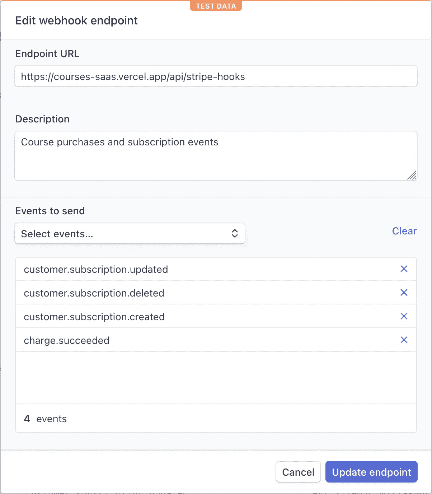
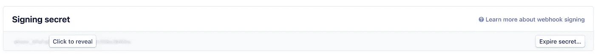
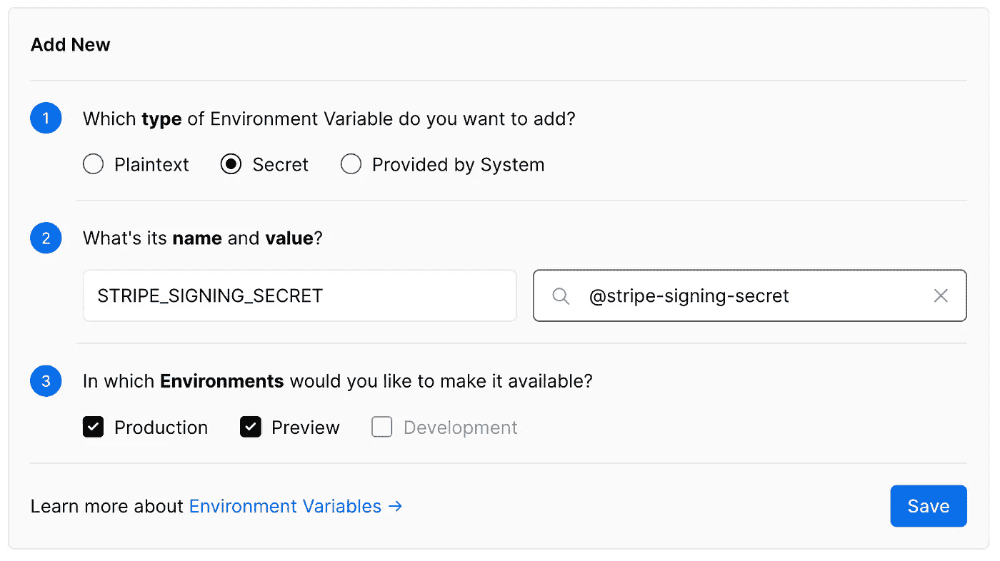

# 构建 SaaS 项目第六周:使用 Stripe 实现订阅

> 原文：<https://medium.com/geekculture/implementing-subscriptions-with-stripe-50a40b55acb6?source=collection_archive---------7----------------------->

## 本周，我们通过构建 Stripe 订阅来结束我们的 SaaS 项目。我们还将在 Next.js 应用程序中构建一个客户门户和创建门控内容。



[项目回购](https://github.com/dijonmusters/courses)

这是我们最后一周用 Next.js，Auth0，Vercel 和 Stripe 构建 SaaS 项目。到目前为止，我们已经谈了很多了！本周，我们将重点讨论如何使用 Stripe 实现订阅。这将允许我们的用户在订阅有效时访问所有高级课程。

## 扩展用户模式

为了跟踪用户当前是否订阅，让我们扩展我们的 Prisma 用户以包含一个“issued subscribed”字段。

```
// prisma/schema.prisma

model User {
  id           Int           @id @default(autoincrement())
  email        String        @unique
  courses      Course[]
  stripeId     String        @unique
  isSubscribed  Boolean     @default(false)
  createdAt    DateTime      @default(now())
}
```

这将是一个简单的布尔字段，以确定是否允许我们的用户看到优质内容。

在构建该功能时，我最初创建了一个单独的订阅模型，其中包含 Stripe 的所有相关数据，如订阅频率、下次付款日期等。然而，我意识到这只是不必要地复制了 Stripe 中已经可用的数据，并且需要大量的代码来保持同步。

将其简化为“已订阅”字段，大大减少了我需要编写的代码量，以及我试图消除的错误。这也是对我的应用程序真正重要的一部分数据。所有级别的订阅看到相同的内容，因此，我需要知道的是他们是否能够看到它！

让我们为我们的新变化创建一个迁移。

```
npx prisma migrate dev --name add-isSubscribed-to-user --preview-feature
```

## 订阅选项

从 Stripe 的控制面板导航到产品，并创建您想要的不同层。我创建了一个月订阅和一个年订阅。



接下来，我们希望在 Next.js 应用程序中显示这些选项。我已经创建了一个新的定价页面，并使用 Stripe 库来获取 getStaticProps 中的价格。请记住，当我们构建新版本的应用程序时，会调用这个函数，所以这种情况很少发生。

```
// pages/pricing.js

import initStripe from 'stripe'

const PricingPage = ({ prices }) => {
  console.log(prices)
  // display prices
}

export const getStaticProps = async () => {
  const stripe = initStripe(process.env.STRIPE_SECRET_KEY)
  const { data: prices } = await stripe.prices.list()

  return {
    props: {
      prices,
    },
  }
}

export default PricingPage
```

不幸的是，Stripe 的价格类型没有给出产品名称，例如 Basic 或 Pro。我们可以在前端对此进行硬编码，但我希望能够改变 Stripe 中的产品名称，并让它自动流向前端。

为了获得产品名称，我们将获取每个价格的产品，并创建一个新的 plan 对象，该对象包含我们从价格和产品中关心的数据的聚合集合。

```
// pages/pricing.js

export const getStaticProps = async () => {
  // other stripe stuff

  const productPromises = prices.map(async price => {
    const product = await stripe.products.retrieve(price.product)
    return {
      id: price.id,
      name: product.name,
      price: price.unit_amount,
      interval: price.recurring.interval,
      currency: price.currency,
    }
  })

  const plans = await Promise.all(productPromises)
}
```

这里我们迭代每个价格并创建一个新的承诺(请求对产品进行条带化)。然后，我们使用“Promise.all”来同时发送所有请求，并等待直到我们获得所有数据。

在这个函数的末尾,“计划”应该是一个聚集数据的数组，如下所示。

```
const prices = [
  {
    id: 'price-123',
    name: 'Basic',
    price: 2000,
    interval: 'month',
    currency: 'aud',
  },
  // other pricing options
]
```

最终的文件应该是这样的。

```
// pages/pricing.js

import initStripe from 'stripe'

const PricingPage = ({ plans }) => {
  // display plans
}

export const getStaticProps = async () => {
  const stripe = initStripe(process.env.STRIPE_SECRET_KEY)
  const { data: prices } = await stripe.prices.list()

  const productPromises = prices.map(async price => {
    const product = await stripe.products.retrieve(price.product)
    return {
      id: price.id,
      name: product.name,
      price: price.unit_amount,
      interval: price.recurring.interval,
      currency: price.currency,
    }
  })

  const plans = await Promise.all(productPromises)

  return {
    props: {
      plans,
    },
  }
}

export default PricingPage
```

## 创建订阅

我们将创建一个新的无服务器功能来启动订阅会话。这将看起来非常类似于“充值卡”功能。

```
// pages/api/subscription/[priceId].js

import initStripe from 'stripe'
import { withApiAuthRequired, getSession } from '@auth0/nextjs-auth0';
import { PrismaClient } from '@prisma/client'

const prisma = new PrismaClient()
const stripe = initStripe(process.env.STRIPE_SECRET_KEY)

module.exports = withApiAuthRequired(async (req, res) => {
  const { priceId } = req.query
  const { user: { email }} = getSession(req, res);

  const user = await prisma.user.findUnique({
    where: { email },
  })

  await prisma.$disconnect()

  const lineItems = [
    {
      price: priceId,
      quantity: 1,
    },
  ]

  const session = await stripe.checkout.sessions.create({
    customer: user.stripeId,
    mode: 'subscription',
    payment_method_types: ['card'],
    line_items: lineItems,
    success_url: `${process.env.CLIENT_URL}/success`,
    cancel_url: `${process.env.CLIENT_URL}/cancelled`,
    metadata: {
      userId: user.id,
    },
  })

  res.json({ id: session.id })
})
```

然后我们可以在前端的任何地方触发这个函数。

```
import { loadStripe } from "@stripe/stripe-js";
import axios from 'axios'

const processSubscription = async (priceId) => {
  const stripe = await loadStripe(process.env.NEXT_PUBLIC_STRIPE_PUBLIC_KEY);
  const { data } = await axios.get(`/api/subscription/${priceId}`);
  await stripe.redirectToCheckout({ sessionId: data.id });
}
```

现在我们需要扩展我们的 stripe-hooks API 路由来监听新的订阅事件。我们需要确定谁是 Stripe 客户，并更新他们的 Prisma 记录，以表明他们现在已订阅。这些将是我们正在添加的行。

```
// pages/api/stripe-hooks

const stripeId = event.data.object.customer

case 'customer.subscription.created':
  if (stripeId) {
    await prisma.user.update({
      where: {
        stripeId,
      },
      data: {
        isSubscribed: true,
      },
    })
  }
  break
```

整个文件应该是这样的。

```
// pages/api/stripe-hooks

import initStripe from 'stripe'
import { buffer } from 'micro'
import { PrismaClient } from '@prisma/client'

const stripe = initStripe(process.env.STRIPE_SECRET_KEY)
const prisma = new PrismaClient()

export const config = { api: { bodyParser: false } }

export default async (req, res) => {
  const reqBuffer = await buffer(req)
  const signature = req.headers['stripe-signature']
  const signingSecret = process.env.STRIPE_SIGNING_SECRET

  let event

  try {
    event = stripe.webhooks.constructEvent(reqBuffer, signature, signingSecret)
  } catch (err) {
    console.log(err)
    return res.status(400).send(`Webhook Error: ${err.message}`)
  }

  const { metadata } = event.data.object
  const stripeId = event.data.object.customer

  switch (event.type) {
    case 'charge.succeeded':
      if (metadata?.userId && metadata?.courseId) {
        const user = await prisma.user.update({
          where: {
            id: parseInt(metadata.userId)
          },
          data: {
            courses: {
              connect: {
                id: parseInt(metadata.courseId)
              }
            }
          },
        })
      }
      break
    case 'customer.subscription.created':
      if (stripeId) {
        await prisma.user.update({
          where: {
            stripeId,
          },
          data: {
            isSubscribed: true,
          },
        })
      }
      break
    default:
      console.log(`Unhandled event type ${event.type}`)
  }

  res.send({ received: true })
}
```

> 我们将需要通过应用程序再次测试这一点，因为我们需要知道哪个客户正在订阅。

太好了！现在我们的用户应该可以订阅了，但是当他们想要更改或取消订阅时怎么办？

## 条带客户门户

Stripe 再一次超越并为用户创建了一个客户门户来管理他们的支付细节和订阅。我们需要在条带控制面板中启用它，并告诉它我们希望提供哪些选项。

转到设置>计费>客户门户，并启用您希望客户能够管理的任何内容。

> 您需要为“服务条款”和“隐私政策”创建新页面。请确保将此设置为您的生产 URL，因为 Stripe 不知道您的“localhost”是什么。

现在，我们可以创建一个新的无服务器功能来启动客户门户。

```
// pages/api/customer-portal

import { withApiAuthRequired, getSession } from '@auth0/nextjs-auth0';
import initStripe from 'stripe'
import { PrismaClient } from '@prisma/client'

const stripe = initStripe(process.env.STRIPE_SECRET_KEY)
const prisma = new PrismaClient()

module.exports = withApiAuthRequired(async (req, res) => {
  const { user: { email } } = getSession(req, res);

  const user = await prisma.user.findUnique({
    where: {
      email,
    },
  })

  await prisma.$disconnect()

  const session = await stripe.billingPortal.sessions.create({
    customer: user.stripeId,
    return_url: process.env.CLIENT_URL,
  })

  res.send({
    url: session.url,
  })
})
```

这会返回会话的 url，所以当我们在前端编写一个函数来调用它时，我们需要手动将用户重定向到这个 URL。

```
import { loadStripe } from '@stripe/stripe-js'
import axios from 'axios'

const loadPortal = async () => {
  const stripe = await loadStripe(process.env.NEXT_PUBLIC_STRIPE_PUBLIC_KEY)
  const { data } = await axios.get('/api/customer-portal')
  window.location.href = data.url
}
```

太好了，现在我们的用户可以管理他们自己的支付和订阅设置，但我们如何知道他们已经更新或取消了他们的订阅？

WEBHOOKS！

## 向 webhook 添加事件

这个逻辑看起来应该非常类似于“customer.subscription.created”。我们只是想更新 Prisma 用户的条带 ID，如果他们正在更新订阅，则将 issued 设置为“true ”,如果他们正在取消订阅，则设置为“false”。这些是我们将要添加的行。

```
// pages/api/stripe-hooks

case 'customer.subscription.updated':
  if (stripeId) {
    await prisma.user.update({
      where: {
        stripeId,
      },
      data: {
        isSubscribed: true,
      },
    })
  }
  break
case 'customer.subscription.deleted':
  await prisma.user.update({
    where: {
      stripeId,
    },
    data: {
      isSubscribed: false,
    },
  })
  break
```

整个文件应该是这样的。

```
// pages/api/stripe-hooks

import initStripe from 'stripe'
import { buffer } from 'micro'
import { PrismaClient } from '@prisma/client'

const stripe = initStripe(process.env.STRIPE_SECRET_KEY)
const prisma = new PrismaClient()

export const config = { api: { bodyParser: false } }

export default async (req, res) => {
  const reqBuffer = await buffer(req)
  const signature = req.headers['stripe-signature']
  const signingSecret = process.env.STRIPE_SIGNING_SECRET

  let event

  try {
    event = stripe.webhooks.constructEvent(reqBuffer, signature, signingSecret)
  } catch (err) {
    console.log(err)
    return res.status(400).send(`Webhook Error: ${err.message}`)
  }

  const { metadata } = event.data.object
  const stripeId = event.data.object.customer

  switch (event.type) {
    case 'charge.succeeded':
      if (metadata?.userId && metadata?.courseId) {
        const user = await prisma.user.update({
          where: {
            id: parseInt(metadata.userId)
          },
          data: {
            courses: {
              connect: {
                id: parseInt(metadata.courseId)
              }
            }
          },
        })
      }
      break
    case 'customer.subscription.created':
      if (stripeId) {
        await prisma.user.update({
          where: {
            stripeId,
          },
          data: {
            isSubscribed: true,
          },
        })
      }
      break
    case 'customer.subscription.updated':
      if (stripeId) {
        await prisma.user.update({
          where: {
            stripeId,
          },
          data: {
            isSubscribed: true,
          },
        })
      }
      break
    case 'customer.subscription.deleted':
      if (stripeId) {
        await prisma.user.update({
          where: {
            stripeId,
          },
          data: {
            isSubscribed: false,
          },
        })
      }
      break
    default:
      console.log(`Unhandled event type ${event.type}`)
  }

  res.send({ received: true })
}
```

太好了，现在无论用户何时通过客户门户网站更新或取消订阅，我们都会收到来自 Stripe 的通知，这样我们就可以停止向他们显示优质课程，而不是他们直接购买的课程。

> “customer.subscription.deleted”事件是在用户的订阅过期时触发的，而不是在他们单击取消时触发的。根据您在客户入口网站设置中设置的配置，这可能是在他们已经付费的期限结束时。

我们可以通过 [Stripe 控制面板](https://dashboard.stripe.com)进行测试，方法是转到客户>订阅，点击更多选项点并选择“取消订阅”。



如果我们选择立即取消，事件应该被触发，我们的无服务器功能应该被调用，我们的 Prisma 用户应该被更新。

> 这需要运行 stripe forward 命令和我们的 next.js dev 服务器。

## 生产网钩

很好，现在我们已经在开发模式下运行了，但是我们的生产应用程序呢？

前往 [Stripe 仪表板](https://dashboard.stripe.com)并选择 Developers > Webhooks，然后添加一个端点。在这里，我们可以告诉它将事件发送到哪个 URL，以及哪些事件是我们真正关心的。



现在，在我们的端点控制面板中，我们可以复制我们的签名密码。



并且按照从[托管在 Vercel 上，用 GitHub 自动部署，配置自定义域](https://jonmeyers.io/blog/build-a-saas-platform-with-stripe/hosting-on-vercel-automatic-deploys-with-github-and-configuring-custom-domains)的步骤在 Vercel 中添加一个新的秘密。



厉害！现在我们的条纹挂钩功能也可以在 prod 中使用了！那么，我们实际上如何限制用户看到应用程序中的优质内容呢？

## 控制优质内容

因此，我们设置了所有这些复杂的后端东西，以了解用户何时购买了课程，以及他们是否有活动订阅，但我们实际上并没有在前端强制执行这一点。有很多方法可以做到这一点，但你应该记住的主要一点是:

**你不能相信客户！**

确保只有高级用户可以看到高级内容的一个好方法是确定他们可以在服务器上看到什么，并且只返回特定用户的位。例如，如果我有一个视频 URL 链接，我只希望付费的用户能够看到，那么我应该在“getServerSideProps”中进行检查，并且只返回“video URL”字段，如果他们有一个有效的订阅或已经为这个特定的课程付费。

```
export const getServerSideProps = withPageAuthRequired({
  async getServerSideProps({req, params}) {
    // fetch course and user from Prisma

    const userIsAllowed = course.price === 0 || user.isSubscribed || user.courses.find(course => course.id === lesson.course.id)

    if (!userIsAllowed) {
      course.videoUrl = null
    }

    return {
      props: {
        course
      }
    }
  }
})
```

然后，在页面组件本身中，如果允许他们查看该内容，您可以显示一个视频元素，如果不允许，则显示一个购买/订阅按钮。

```
const CoursePage = ({ course }) => course.videoUrl ? (
  <video src={course.videoUrl} />
) : (
  <button onClick={handleBuy}>Buy course</button>
)

export default CoursePage
```

这个逻辑的更全面的例子可以在[单元](https://github.com/dijonmusters/courses/blob/master/pages/lesson/%5Bslug%5D.js)中看到。

## 包扎

就是这样！我们做到了！我们用 Next.js、Prisma、Auth0 和 Stripe 在六周内构建了一个 SaaS 项目。查看[项目报告](https://github.com/dijonmusters/courses)以获得更完整的工作应用。现在怎么办？

我建议您采用本博客系列中的内容，尝试实现一些类似但有一点不同的东西。遵循教程中的步骤是了解如何使用特定库或技术的好方法，但是真正的学习来自于尝试做自己想做的事情和遇到问题！

## 跟我来

[网站](https://jonmeyers.io/)

[推特](https://twitter.com/_dijonmusters)

[YouTube](https://www.youtube.com/channel/UCPitAIwktfCfcMR4kDWebDQ)