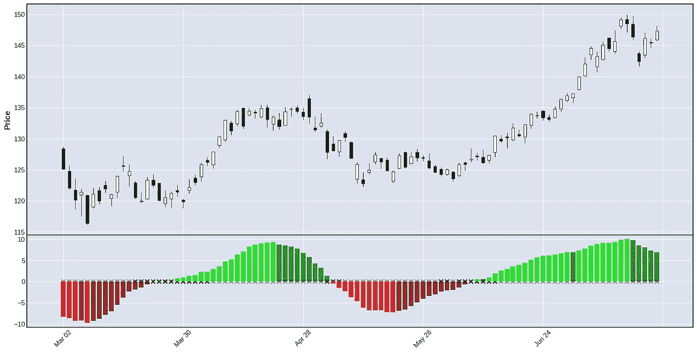

# 使用 Python 实现 TradingView 上最流行的指标

> 原文：<https://medium.com/geekculture/implementing-the-most-popular-indicator-on-tradingview-using-python-239d579412ab?source=collection_archive---------1----------------------->

## [挤压动量指示器](https://www.tradingview.com/script/nqQ1DT5a-Squeeze-Momentum-Indicator-LazyBear/)

Image by author

> 文末有完整代码和笔记本。

TradingView 是最强大的交易平台之一，拥有非常活跃的社区和广泛的交易指标和策略集合。

## [懒人挤压动量指示器](https://www.tradingview.com/script/nqQ1DT5a-Squeeze-Momentum-Indicator-LazyBear/)