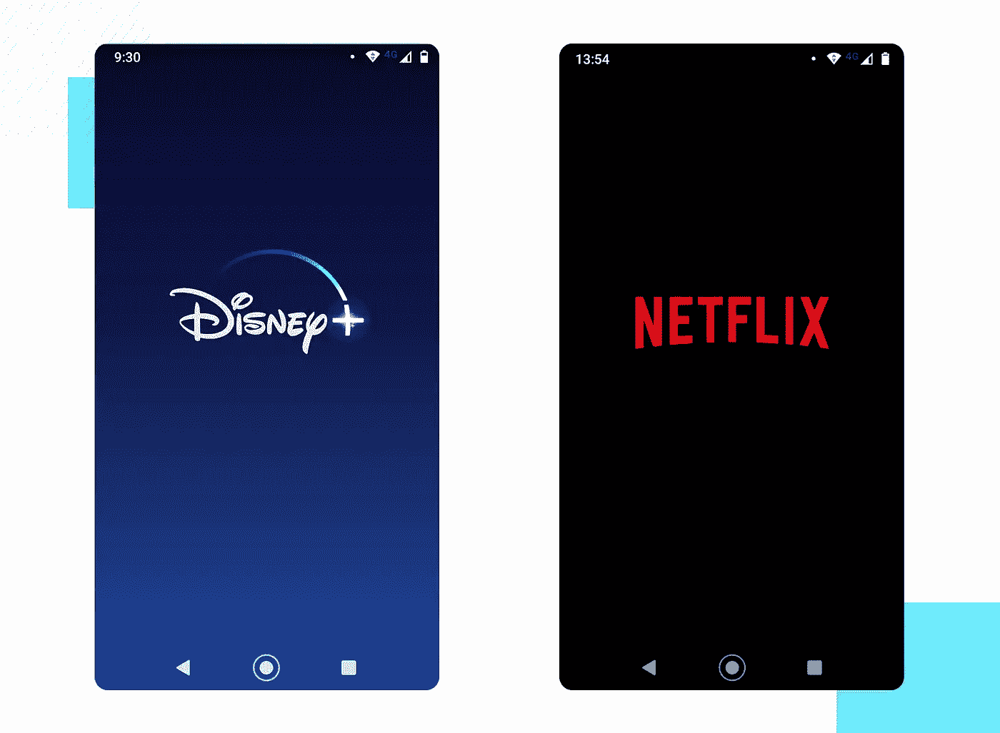
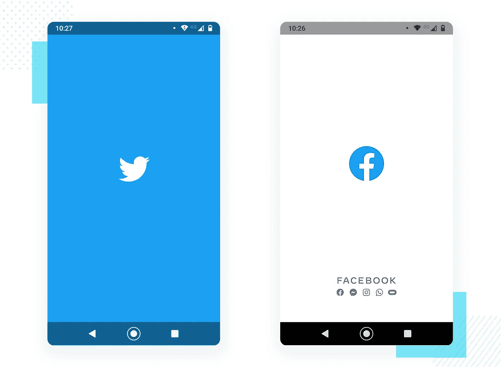

# 在 Android 中实现完美的闪屏

> 原文：<https://medium.com/geekculture/implementing-the-perfect-splash-screen-in-android-295de045a8dc?source=collection_archive---------0----------------------->

## 闪屏是应用程序启动时用户看到的第一个屏幕。这是一个至关重要的屏幕，可以让用户对应用程序有第一印象。

Sample Splash Screen Images

一个**闪屏**是当你在移动设备上打开一个应用时出现的屏幕。有时它被称为启动屏幕或启动屏幕，并在您刚打开应用程序后加载时显示。

当加载完成后，你会被带到一个更*的功能屏幕*，在那里你可以完成动作。

闪屏会在你的屏幕上出现一会儿——看别处，你可能会错过它们。闪屏是应用程序中最重要的屏幕之一，因为它是*用户对应用程序的第一次体验。*

# 有两种实现闪屏的常见方法，并且会找到正确的方法:

1.  使用定时器**(坏)**
2.  使用启动器主题**(正确的方式)**

使用定时器**(我们的第一个方法)**到您的活动中来显示 splash，我们创建一个 splash 活动并在`onCreate()`中创建一个线程来显示 2/3 秒，然后转到我们想要的活动。在这里，可以看到这个简单方法的实现:

上述方法不是正确的方法。这将导致冷启动。

闪屏的**目的是在应用程序获取相关内容(如果有的话，从网络调用/数据库)时快速显示一个漂亮的屏幕。使用上面的方法，`SplashActivity`创建它的布局会有额外的开销。**

这会导致应用程序启动缓慢，这对用户体验不利**(其中出现一个空白的黑/白屏)。**

出现冷启动是因为应用程序需要时间来加载 Splash 活动的布局文件。因此，我们将使用应用程序主题的力量来创建我们的初始布局**(我们的第二种方法)**，而不是创建布局。

`Application theme`在创建布局之前被实例化。我们将在主题中设置一个 drawable，包括活动的背景和一个使用图层列表的图标，如下所示。

> 你知道当一个活动被称为 Android OS 时，首先在清单中查看该活动是否有主题并从清单中加载主题吗？

因此，我们将在 Manifest 中为 splash 活动设置一个自定义主题。要为闪屏创建主题，请遵循以下流程。

## 第一步

在**drawable/Splash _ Background . XML 中为闪屏创建背景，**位图就是我们想要显示的图像。

## 第二步

在 **drawable/bg_gradient.xml 中创建渐变，您的应用徽标将置于其上，**背景可以是渐变或任何颜色，具体取决于您的应用。

## 第三步

在 **res/values/themes.xml** 中创建闪屏样式

## 第四步

创建一个名为`SplashScreenActivity`的空活动，并在 **AndroidManifest.xml** 中将样式设置为主题

## 第五步

把意图从**SplashScreenActivity.java**设定到你的*MainActivity.java*

> 由于我们是从 manifest 加载闪屏的，**不需要** `**setContentView()**`带有任何 xml 布局。如果你想让你的闪屏显示一段时间(比如五秒钟)你可以创建一个 T2，使用定时器也可以帮助你的主活动，这比在主屏幕上显示对话框更好。

**使用主题并从** `**SplashScreenActivity**` **中移除布局是创建闪屏的正确方法**🙌。

# 现在我们的 splash 开始工作了，我应该把多大的图片放到一个可绘制的文件夹中呢？

总是把你的`app_logo.png`放在`drawable-xxhdpi`文件夹中，这样在大多数情况下，你的 logo 会自动适应所有类型的手机屏幕。

另外，确保图像分辨率不超过`1000x1000 pixels`。它可以有更低的分辨率，这取决于你想要的。现在有不同类型的闪屏，在屏幕的不同部分有多个标志。这怎么可能呢？

> 在上面的例子中，我们实现了我们的方法来创建一个类似于 *Twitter* 的 splash，现在要创建一个类似脸书的 splash，我们只需对我们的**drawable/splash _ background . XML**做一点小小的改变。

只要把你想放在**闪屏中的`layer-list`加到你的`item`中。**

# 闪屏最佳实践

闪屏很简单。它们被用来提升品牌，并在用户等待时给他们一些好看的东西。在这方面，当你设计你自己的闪屏时，这里有一些最佳实践:

*   让它远离不必要的干扰
*   不要使用多种颜色或标志
*   谨慎使用动画

希望有所帮助。快乐编码😀

顺便说一句，我通过 ***构建有用的应用*** 来解决现实世界的问题。有个**看看我的** [**作品集**](https://iltwats.github.io/) **。**

在 [**GitHub**](https://github.com/Iltwats) 和 [**LinkedIn**](https://www.linkedin.com/in/1220atul/) 上和我连线。