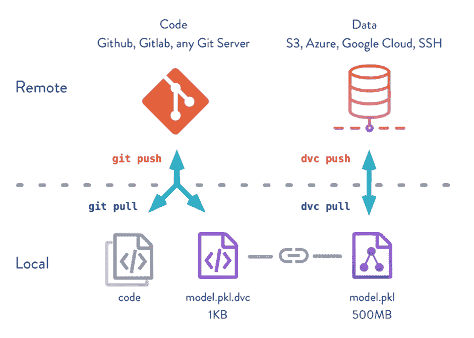
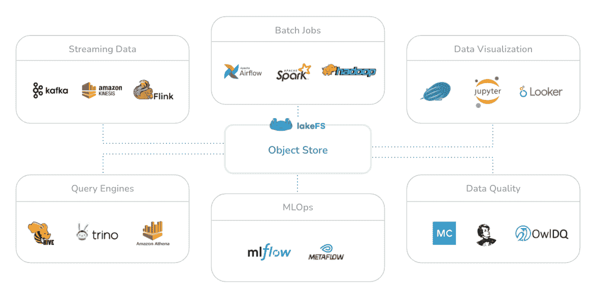

# 实施大数据项目的版本控制

> 原文：<https://medium.com/geekculture/implementing-version-control-for-big-data-projects-fb1a205bd3a0?source=collection_archive---------9----------------------->


# 0.介绍

版本是某事物的一种特殊形式，在某些方面不同于早期的形式或同类的其他形式。另一方面，在开发环境中，它指的是与软件或数据等资源相关的版本。如果资源的结构、内容或状态发生变化，可以考虑创建一个新版本。

操作数据集、纠正错误、漏洞或插入额外数据可能需要创建新版本。这也是一种跟踪动态数据中相关变化的实用方法。



# 1.什么是版本控制和数据版本控制？

版本控制是一种允许你跟踪和监控项目每个阶段的机制。它使团队能够检查对源代码的修改，并确保代码中的更改不会被忽略。

数据版本化是存储在不同时间间隔创建或修改的数据的相应版本的过程。

对数据集进行更改有许多合理的原因。数据专家可以测试机器学习( [ML](https://www.ibm.com/cloud/learn/machine-learning) )模型，以增加项目的成功率。为此，他们需要对数据进行重要的操作。由于来自不同资源的数据不断流入，数据集也可能随着时间的推移而更新。最后，保留旧版本的数据可以帮助组织复制以前的环境。

# 2.为什么数据版本控制很重要？

通常，在软件开发生命周期中，开发过程分布在很长的一段时间内，跟踪项目中的变更可能很困难。因此，软件项目的版本化使这个过程变得容易，并且使团队不必定期命名脚本的每个版本。

此外，在数据版本化的帮助下，历史数据集被保存并保存在数据库中。这一方面提供了如下一些优点。

# 3.数据版本化的好处

## **训练时保持最佳状态**

数据科学项目的主要目标是满足公司的业务需求。因此，数据科学家需要根据客户或产品要求开发许多 ML 模型。这种情况需要在每次尝试建模时向 ML 管道中插入新的数据集。然而，数据专家需要小心不要丢失在建模中给他们最好分数的数据集。这是在数据版本化系统的帮助下实现的。

## 提供新的业务增长指标

在当今的数字世界中，使用数据做出决策和制定战略的公司将会生存下来，这是一个事实。因此，重要的是不要丢失历史数据。

考虑一家做日用品的电商。应用程序中的每个事务都会更改销售数据。人们的需求和要求可能会随着时间而变化。因此，保留所有销售数据有利于洞察客户需求的新趋势，并确定正确的战略和活动。

最终，它给了公司一个新的商业标准来衡量他们的成功或表现。

## 关于数据隐私问题的保护

随着当今世界数字化转型的加速，产生的数据量也在快速增长。然而，这种情况带来了对保护个人数据的担忧。因此，政府制定的数据保护法规迫使公司存储一定量的数据。

在这种情况下，数据版本控制可以通过确保数据在特定时间存储来提供帮助。它还可以帮助组织满足此类法规的要求。

# 4.使用开源数据版本工具的快速演示

市场上有许多数据版本控制工具。它们为数据存储提供了相似的特性，但是其中一些比另一些有重要的优势。

[LakeFS](https://lakefs.io/) 是一个开源平台，使数据分析团队能够像管理源代码一样管理数据库或数据湖。它为整个数据生命周期的测试和 CI/CD 操作运行并行的 ML 管道。这以数据湖中对象存储的形式提供了灵活性和易控制性。

借助 LakeFS，从复杂的 ETL 流程到数据分析和机器学习步骤，每个流程都可以转化为自动化且易于跟踪的数据科学项目。lakeFS 的一些突出特点是:



*   支持云解决方案，如 AWS S3、谷歌云存储和微软 Azure Blob 存储
*   可轻松与大多数现代大数据框架和技术配合使用，如 Hadoop、Spark、Kafka 等。
*   提供类似 Git 的操作，如分支、提交和合并，从而借助云解决方案的力量实现数 Pb 数据的扩展
*   提供了在云中或本地部署以及使用任何与 S3 存储兼容的 API 的选项

## 安装和运行 LakeFS 环境

要在您的本地计算机上运行 LakeFS 会话，请确保您安装了版本为 1.25.04 或更高版本的 Docker 和 [Docker Compose](https://docs.docker.com/compose/) 。要使用 Docker 运行 LakeFS，请键入以下命令:

```
$ curl https://compose.lakefs.io | docker-compose -f - up
```

之后，从[http://127 . 0 . 0 . 1:8000/setup](http://127.0.0.1:8000/setup)查看您的安装和运行会话

## 用户注册和创建存储库

*   要创建新的存储库，请通过以下链接注册为管理员用户[http://127 . 0 . 0 . 1:8000/setup](http://127.0.0.1:8000/setup)。
*   对于这一步，确定用户名并保存您的凭证，即密钥 ID 和密钥。使用此信息登录到您的管理员用户配置文件。
*   单击管理面板中的创建存储库按钮，并输入存储库 ID、存储命名空间和默认分支值。之后，按下 Create Repository。您的初始存储库已经创建。

## 向新存储库添加数据

LakeFS 会话可以与 AWS CLI 一起使用，因为它有一个 S3 兼容的 API。但是请确保您的本地计算机上安装了 AWS CLI。

*   为了能够通过 AWS CLI 使用 LakeFS 凭证配置新的连接，请在终端中键入以下命令。之后，请在终端中输入您的密钥 ID 和密钥值。

```
$ aws configure --profile local
```

*   要查看连接是否工作，并列出工作区中的所有存储库，请在终端中键入以下命令:

```
$ aws --endpoint-url=http://localhost:8000 --profile local s3 ls# output:
# 2022-01-30 22:57:02 demo-repo
```

*   最后，要通过将数据写入主分支来向存储库添加新数据，请在终端中键入以下命令:

```
$ aws --endpoint-url=http://localhost:8000 --profile local s3 cp ./tweets.txt s3://demo-repo/main/
# output:
# upload: ./tweets.txt to s3://demo-repo/main/tweets.txt
```

*   现在，tweets.txt 文件已经写入 demo-repo 存储库的主分支。请在 LakeFS UI 上查看。

## 提交对添加数据的更改

多亏了 LakeFS，对数据所做的更改可以使用 LakeFS 的默认 CLI 客户机 lakectl 来提交。请确保您已在本地计算机上安装了最新版本的 CLI 二进制文件。

*   要配置 CLI 二进制设置，请在终端中键入以下命令:

```
$ lakectl config
```

*   要验证 lakectl 的配置，可以使用以下命令列出存储库中的所有分支:

```
$ lakectl branch list lakefs://demo-repo
```

*   要将添加的数据提交到存储库中，请在终端中键入以下命令:

```
$ lakectl commit lakefs://demo-repo/main -m 'added my first tweets data to repo!'
```

*   最后，要检查提交的消息，请在终端中键入以下命令:

```
$ lakectl log lakefs://demo-repo/main
```

# 5.结论

当今世界产生越来越多的数据。因此，数据驱动的公司必须正确安全地存储数据。企业需要确保他们利用正确的数据版本化平台/工具来帮助他们的业务增长。