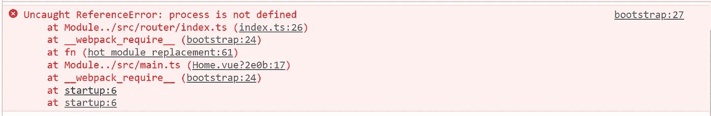
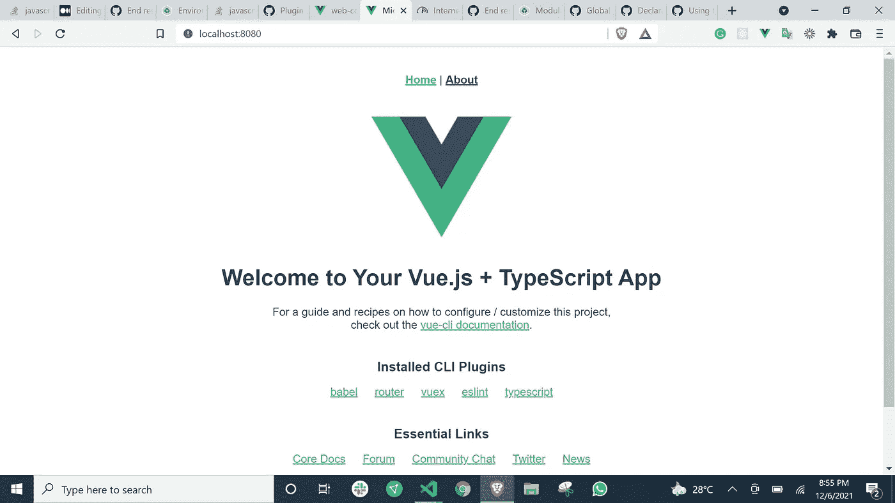

# 在 Vue 2 应用程序中实现 Webpack 的模块联合。

> 原文：<https://medium.com/geekculture/implementing-webpacks-module-federation-in-a-vue-2-application-38997c696094?source=collection_archive---------1----------------------->


Photo by [Tim Johnson](https://unsplash.com/@mangofantasy?utm_source=unsplash&utm_medium=referral&utm_content=creditCopyText) on [Unsplash](https://unsplash.com/s/photos/coupled-components?utm_source=unsplash&utm_medium=referral&utm_content=creditCopyText)

# 微前端:

微前端是一种前端架构，其中相同产品/应用的模块彼此独立地构建。

这种架构已经被证明是真正可扩展的，所以我决定在我最近的项目中使用这种架构。开发几周后，我有了一个 vue2 应用程序和一个 Gridsome 应用程序。由于这两个应用程序使用了相同的设计系统，我复制/粘贴了两个应用程序共有的组件，这是不可维护的，复制/粘贴组件违背了 [DRY 原则。我决定寻找一个更具可扩展性的解决方案，这让我选择了 Webpack 的模块联盟。](https://en.wikipedia.org/wiki/Don%27t_repeat_yourself)

对于这个演示，我们将从头到尾设置 Webpack 的模块联合。所以，系好安全带😃。

## 要求

1.  两个已经建立了 vue2 项目:我们不会在这篇博文中讨论这个。如果您在设置 vue 项目时遇到问题，请访问 [vue 文档](https://cli.vuejs.org/guide/creating-a-project.html#vue-create)。

## 装置

为了正确配置 Webpack，我们需要在项目中添加一些开发依赖项。附注:这两个项目都应该完成这些步骤。要添加开发依赖项，我们将运行以下命令:

```
yarn add webpack webpack-cli webpack-dev-server vue-loader url-loader sass-loader mini-css-extract-plugin html-webpack-plugin dart-sass css-loader -D
```

完成后，我们需要向 package.json 添加一个启动脚本。这个脚本的目标是在启动服务器时使用 Webpack-CLI，而不是 vue-cli。我们的 package.json 的脚本部分现在应该包含一个启动脚本:

```
"scripts": {"serve": "vue-cli-service serve","build": "vue-cli-service build","start": "webpack-cli serve","lint": "vue-cli-service lint"},
```

如果您运行`yarn start`命令，您会注意到有一个错误…不要烦恼…然而😏。

## 现在让我们开始…

在这篇博文中，我们有两个项目。Micro-main 是需要共享组件的项目，web-common 是包含共享组件的项目。

在这两个项目中，我们将在根目录中创建一个`webpack.config.js`文件:


The location of the webpack.config.js file in the project.

现在我们已经创建了我们的`webpack.config.js`文件，我们将用以下内容填充它:

两个应用程序的`webpack.config.js`文件应该包含下面的代码**，但是记住给两个项目不同的端口变量**。现在，如果您运行`yarn start`命令，您应该有一个满意的服务器😄。

现在让我们解释一下这里所写的重要部分。

1.  [入口点](https://webpack.js.org/concepts/entry-points/):入口点是 Webpack 用作起点的文件。默认情况下，Webpack 使用`src/index.js`作为入口点。但是为了符合 Vue 方法，我们将入口点设置为`src/main.ts`。
2.  [Output](https://webpack.js.org/concepts/output/) :该输出是我们指定在构建之后应该将我们的捆绑应用程序放在哪里的地方。默认情况下，Vue 应用程序内置在 dist 目录中，因此将 Webpack 构建放在 dist 文件夹中是正确的。
3.  [解析](https://webpack.js.org/configuration/resolve/#resolveextensions):解析模块解析方式的变化。它还有助于设置别名。在我们的用例中，我们通过在 resolve.alias 中添加`@assets`属性来添加资产文件夹的快捷方式
4.  [规则](https://webpack.js.org/concepts/loaders/):默认情况下，Webpack 只理解 Javascript 和 JSON 文件。这就是装载机的用武之地。加载器使 Webpack 能够理解其他文件，如 typescript、Vue、CSS、e.t.c .在我们的例子中，我们已经为 Vue、typescript、CSS 和 SASS 添加了加载器。
5.  [插件](https://webpack.js.org/configuration/plugins/):插件用于以多种方式定制 Webpack 构建过程。
6.  [devServer](https://webpack.js.org/configuration/dev-server/#devserver) :开发应用程序所需的配置就放在这里。

填充您的`webpack.config.js`后，导航至`http://localhost:${port}`。你会注意到这是一个没有应用程序徽标的空白页面，服务器可能正在哭泣😢。为了解决这个问题，替换`public/index.html`中的动态变量，例如:

在此之后，如果您仍然有一个空白页，请检查控制台，您可能会看到:



An error resulting from using environment variables in the router.

为了解决这个问题，我们将添加一个新插件:

在这之后，你现在可以导航到你的网站，看到一个快乐的网站👌。

## 模块联盟

我们完成了 Webpack 的设置，现在我们有了满意的服务器和一个正常工作的网站。现在，是我们实现模块联邦的时候了。

模块联盟的所有酱都包含在`ModuleFederationPlugin`中。在这部分配置中，两个代码库具有不同的配置。

The end configuration of the web_common project.

## 需要注意的几件事:

1.  ModuleFederationPlugin 是从`require("webpack").container`而不是从`require("webpack")`导入的。
2.  ModuleFederationPlugin 的`exposes`对象负责共享项目中的代码。另外，`exposes`对象的键必须是`./[KEY_NAME]`的格式。
3.  文件名可以是任何名称。但是`remoteEntry`或者`web_commonRemoteEntry`是一个很棒的名字。
4.  名称也可以是任何名称，但我会给它项目的名称。

The End configuration of the main project.

## 需要注意的几件事:

1.  `remotes`是我们添加项目远程的地方，我们从那里接收共享代码。
2.  `web_common`是我们从中接收共享代码的项目的名称。
3.  项目共享代码的远程必须是格式`[PROJECT_NAME]@[PROJECT_URL]/[PROJECT_filename]`在我们的例子中，文件名是 remoteEntry.js

为了测试实现，我们将全局导入组件。即:

Global importation of the HelloWorld component

如果您使用 typescript，您可能需要将`web_common`声明为一个模块。

现在，服务器应该很高兴了。

现在，HelloWorld 组件可以在主项目中使用了。

这是结果:



The HelloWorld component was imported from the web_common project to the main project.

## 还有一个问题…

万岁！！我们已经完成了模块联合…但是您可能已经注意到导航到另一个路径并重新加载页面会导致一个 404 错误，这会影响开发人员的体验😿。

修复方法是将 [historyApiFallback](https://webpack.js.org/configuration/dev-server/#devserverhistoryapifallback) 设置为 true。

```
// webpack.config.js
module.exports = {
  //...
  devServer: {
    historyApiFallback: true,
  },
};
```

## 结论

在这篇博文中，我给出了如何设置 Webpack 以及如何正确设置模块联合插件的一步一步的清晰步骤。如果这篇文章对您的用例不尽如人意，请随时联系我。