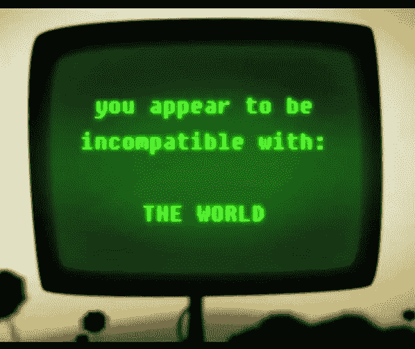
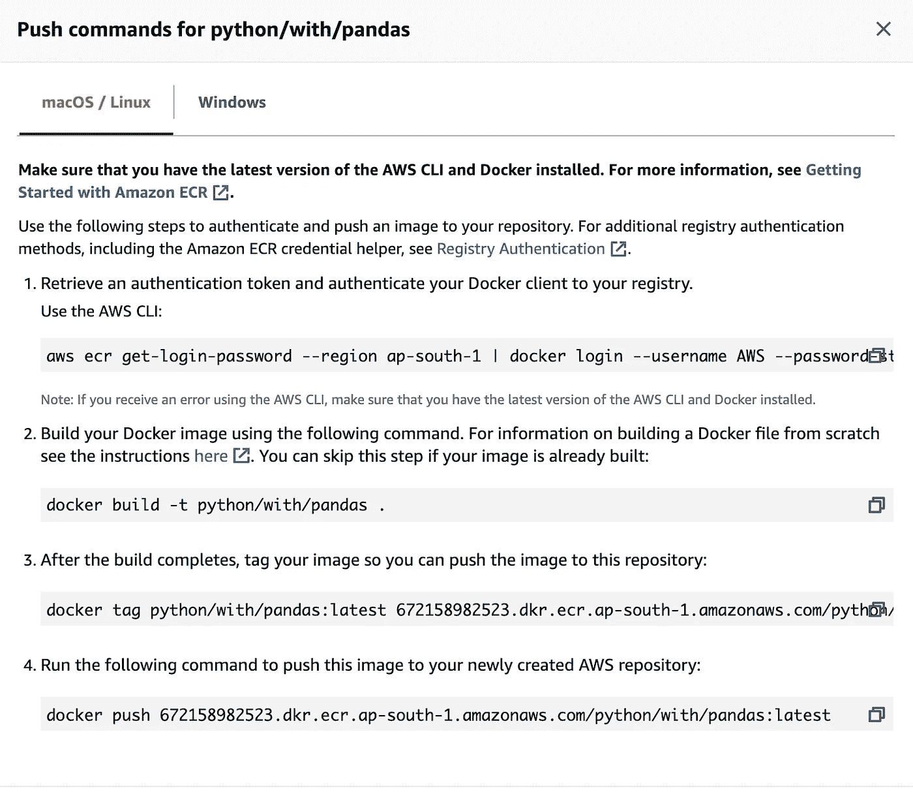
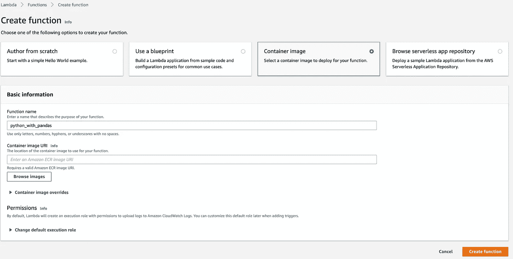
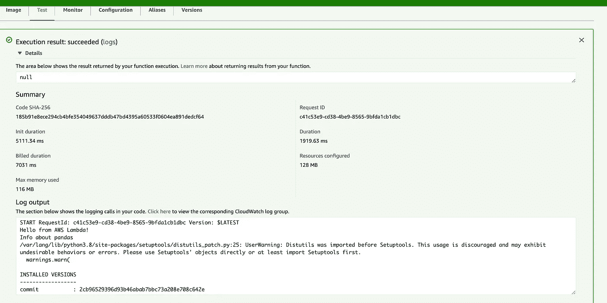

# 通过 3 个简单的步骤在 AWS Lambda 中导入熊猫

> 原文：<https://medium.com/geekculture/import-pandas-in-aws-lambda-in-3-simple-steps-4ea5f1775eb8?source=collection_archive---------7----------------------->

## 如果您在 AWS Lambda 实例中遇到了可怕的 pandas 导入错误，那么您就来对地方了。

> [错误]运行时。ImportModuleError:无法导入模块“lambda_function”:没有名为“pandas”的模块

您可能知道，AWS Lambda 中的默认 python 运行时附带了一组有限的标准库。因此，我们有责任将任何不支持的库导入 lambda 运行时，以避免*"运行时。ImportModuleError”。*

已经有一些方法可以解决这个问题，比如用依赖关系创建一个代码的 zip 文件。然后，将这个 zip 文件作为源代码上传到 Lambda 函数中。然而，这在少数情况下肯定会失败，因为您的 lambda 实例运行在不同的 Linux 版本上，并且当您在 lambda 实例上运行时，您编译的库可能不兼容。

因此，我将采取一种不同的方法，在我看来，这是一种更专业的方法来解决这个问题。这个想法是用依赖关系将你的代码 dockerize，并把它作为一个映像部署到你的 lambda 函数中。教程的其余部分如下:

1.  用您的代码和依赖项构建 docker 映像。
2.  通过 AWS CLI 将 docker 映像推送到 AWS ECR。
3.  以上面的容器图像为源创建一个 Lambda 函数。

> 虽然本教程是关于导入 pandas 的，但它实际上可以应用于导入任何其他 python 库。

# 用您的代码和依赖项构建一个 docker 映像

AWS Lambda 运行在具有不同风格的 Linux 操作系统的实例上。因此，以 Amazon Linux 为基础来构建我们的形象是有意义的。这也有助于我们在运行时克服已安装库的不兼容性。你可以在 docker hub 中找到亚马逊官方 [AWS-lambda-python](https://hub.docker.com/r/amazon/aws-lambda-python) 的基本图片。

Directory structure

在您的本地机器上，您可以创建一个具有上面所示结构的目录。app.py 的内容可能很简单:

[app code with handler](https://gist.github.com/sathviksathu/6601acff844670323416d78462fa27d6)

docker 文件是构建图像的核心，应该包含以下内容。你可能需要一点时间来理解这里发生的奇迹:

[Dockerfile contents](https://gist.github.com/sathviksathu/86387cc2fea456b9bbdf64ecd3f56b27)

1.  来自指令的**初始化新的构建阶段，并为后续指令设置基础映像。执行这条指令后，您可能会认为您实际上是在 Amazon Linux 实例中。**
2.  **COPY** 指令将您的应用程序代码和处理程序一起复制到 Lambda 环境中。
3.  **运行**指令运行您一直在等待的 pip 安装命令。这确保了安装的库对于您所在的操作系统是本机的，从而减少了任何兼容性问题。

# **将您的 Docker 图像推送到 AWS ECR**

您需要将构建的 Docker 映像推送到 AWS ECR，以便在创建 AWS Lambda 函数时可以访问它。为此，首先，您需要创建一个 AWS ECR 存储库来保存您的图像。

1.  向您的注册表验证您的 docker 客户端。

2.标记您本地构建的图像，以便能够推送它。

3.将您的标记图像放入您创建的 ECR repo 中。

Commands to push docker image to ECR

**注意:**您可能需要配置您的 AWS CLI 以避免任何授权错误。[在这里查看如何配置你的 AWS CLI](https://docs.aws.amazon.com/cli/latest/userguide/cli-chap-configure.html)。

# 创建 Lambda 函数

现在，您可以使用容器图像作为源来创建 lambda 函数。然后，您可以点击*“浏览图像”*选项，选择您在上一步中推送到 ECR 存储库中的图像。

Create Lambda function with Container image

一旦使用您的映像创建了函数，您就可以在日志输出中测试您的函数并验证 pandas 版本。

The function was executed successfully.

***欢呼。感谢阅读。我希望你今天学到了新东西。***