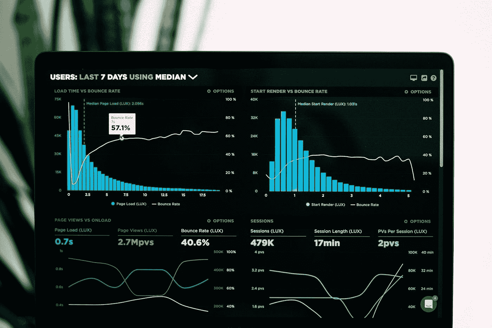
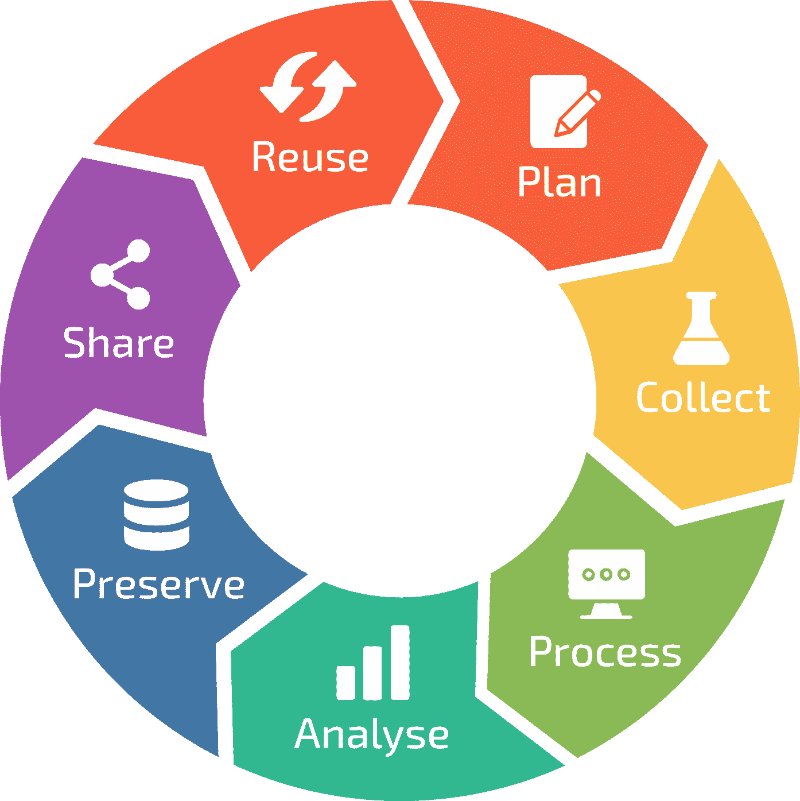
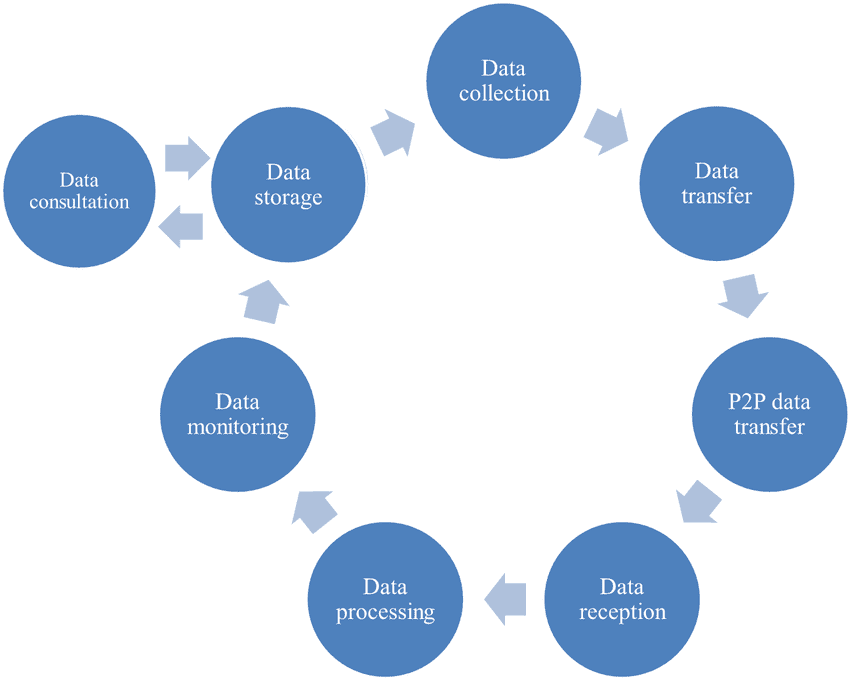

# 监控和调试对健康数据环境的重要性

> 原文：<https://medium.com/geekculture/importance-of-monitoring-and-debugging-for-healthy-data-environments-827fb9b21a8?source=collection_archive---------22----------------------->

**Photo by** [**Luke Chesser**](https://unsplash.com/@lukechesser?utm_source=unsplash&utm_medium=referral&utm_content=creditCopyText) **on** [**Unsplash**](https://unsplash.com/s/photos/big-data?utm_source=unsplash&utm_medium=referral&utm_content=creditCopyText)

在当今数字化转型时代，数据承担了新石油的角色。基于数据做出决策和采取行动的公司和组织的数量与日俱增。这种情况既有好处也有坏处。在此阶段，为了帮助您做出正确的数据驱动型决策，分析和解释的数据必须可靠且一致，这一点至关重要。

由于数据分析的性质，操作数据集、纠正错误和缺陷或插入额外数据可能需要创建新版本。因此，数据科学项目及其架构与数据生命周期管理一起进行，以便能够无缝地取得进展并易于维护。

现在，有必要深入了解什么是数据生命周期管理及其基本步骤，以了解它如何为数据分析提供健康的数据环境。

[**Data Lifecycle**](https://dynamics.folio3.com/blog/what-are-the-three-main-goals-of-data-lifecycle-management-dlm/)

# 什么是数据生命周期管理？

数据生命周期管理可以被描述为在端到端机器学习(ML)项目中应用的一组重要步骤。数据团队和类似的组织应该在项目的每个阶段参考这些步骤，以成功地管理整个过程。

# 为什么数据生命周期管理很重要？

在 [**AI 和 ML**](https://www.sas.com/en_us/insights/articles/big-data/artificial-intelligence-machine-learning-deep-learning-and-beyond.html) 时代，新技术和开源工具不断为新的技术和工具留下一席之地。由于这种快速的变化，需要一个可以监控项目每个阶段的管理系统。

通过监控和调试整个系统，数据生命周期可以作为一个管理系统发挥重要作用。它可以帮助你在 ML 项目的每一步测试获得的数据的可靠性和一致性。因此，看看数据生命周期管理的一些关键步骤可能会有所帮助。

# 数据生命周期管理的基本步骤

一般来说，所有数据生命周期管理都可以分为四个主要步骤，即:

## 数据采集

在现代数据基础设施中，新数据不断从不同的数据源流出，将这些数据迁移到分析数据库的过程称为数据采集。提醒一下，分析数据库通常用于数据团队中的数据分析项目。这个阶段也可以称为数据流或数据接收。这是第一步，但也是最重要的一步，因为这对于确保新数据不断迁移以实现一致的数据环境至关重要。这可以通过使用 [**数据编排工具**](https://segment.com/resources/data-strategy/what-is-data-orchestration/) 成功完成。

## 数据争论

在实际项目中，大部分获取的数据非常杂乱，需要转换后才能存储在分析数据库中。数据清理和预处理的所有步骤都被称为数据争论。这对于将健康的数据流入分析项目的环境是非常必要的。简而言之，在这个阶段可以应用以下预处理操作:处理空值或重复值，创建符合要求的数据模式，在分析数据库中使用的任何聚合操作，以及根据业务需求过滤数据。

## 数据有效性

正如传统软件开发方法中所实践的，在数据迁移和转换步骤完成之后，所有剩余的操作都必须被验证，以便进入下一个步骤。这个验证过程可以被认为是数据质量测试，以便更清楚地解释它。

在实践中，有多种技术可以应用于数据验证流程，但更聪明的做法是利用 [**CI/CD**](https://www.redhat.com/en/topics/devops/what-is-ci-cd) 方法作为工作流类型。通过这样做，作为部署过程的一部分，迁移的数据可以通过单元、集成和质量测试。这一阶段是最终用户面前的最后一步。所以，一切都需要天衣无缝。

[**Data Project Lifecycle**](https://www.researchgate.net/figure/The-health-data-lifecycle-within-the-architecture_fig4_325995742)

## 数据监控和调试

在最后阶段，您应该检查数据环境中的所有更改和流程，以确保基础架构中发生的所有事件都符合预期。数据团队需要利用管道中的监控和调试方法来跟踪这些变化，因为原始数据的任何修改都可能对分析项目的结果产生负面影响。

例如，假设您的数据分析团队将其客户细分项目部署到生产中。基本上，这个项目对从您的数据环境中获取的数据进行实时流处理。您开始跟踪数据环境中的所有变化，并通过 [**监控警报**](https://www.oreilly.com/library/view/effective-monitoring-and/9781449333515/ch01.html) 意识到数据中发生了一些错误和不必要的变化。您的客户细分项目可能会误导业务或运营团队。如果您没有在数据环境中实现监视和调试阶段，这种情况可能会导致组织的损失。

# 结论

每个公司都在不断地向自己的数字版本转型，这个过程在大多数时候会继续导致上述问题。因此，您应该关注有效的保护性解决方案，如针对这些问题的数据监控和调试。

我希望这篇文章对您有所帮助，并帮助您决定数据监控和调试方法对您的数据基础设施是否重要。

# 我以前的文章

*   [*智能手机价格预测与回归和网络抓取*](/i̇stanbuldatascienceacademy/smartphone-price-prediction-with-regression-and-web-scraping-c4bd6d7c62c7)
*   [*足球运动员排名分类及精简 App*](/i̇stanbuldatascienceacademy/football-player-ranking-with-classification-and-streamlit-app-9f60a9702b4)
*   [*在回归中进行并行测试*](/geekculture/conducting-parallel-testing-in-regression-e162669caafc)
*   [*实施大数据项目版本控制*](/geekculture/implementing-version-control-for-big-data-projects-fb1a205bd3a0)