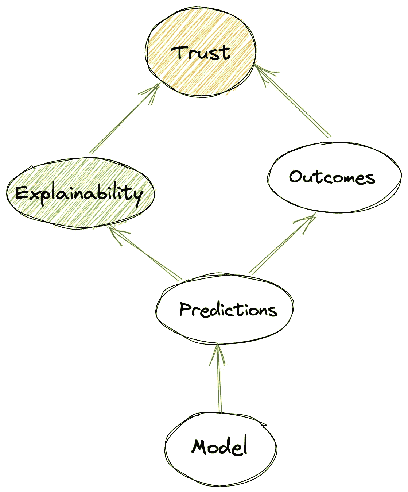
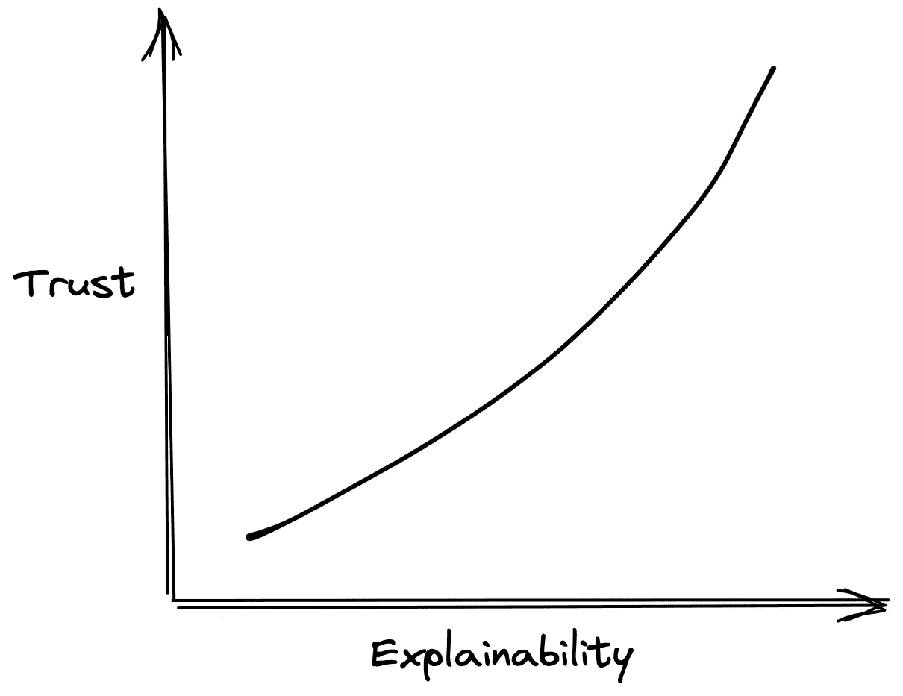
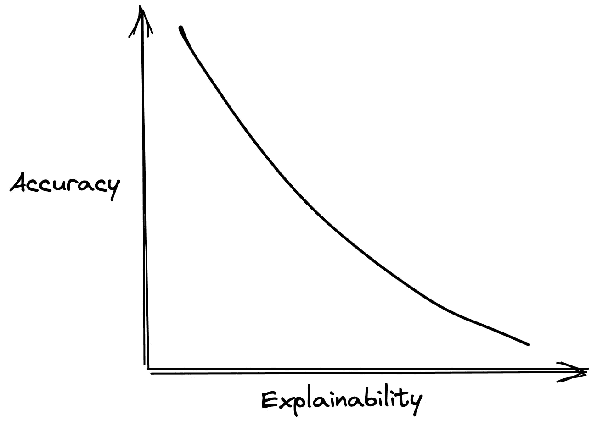

# 信任在人工智能中的重要性

> 原文：<https://medium.com/geekculture/importance-of-trust-in-ai-622b303dc91f?source=collection_archive---------55----------------------->

## 值得信赖的人工智能

可解释性和信任在决策中的作用

Photo by [Fabian Gieske](https://unsplash.com/@fbngsk?utm_source=medium&utm_medium=referral) on [Unsplash](https://unsplash.com?utm_source=medium&utm_medium=referral)

# 介绍

你相信你的投资顾问会给你提供正确的投资建议吗？

一个机器人顾问如何更有效地为你提供最佳投资建议，使用尖端人工智能优化高回报？

你的信任度是多少？

Level of trust

*   高度信任，因为它使用人工智能
*   中等程度的信任，因为它对你认识的人有效
*   信任度低，因为它是新事物

> 信任是随着时间的推移而形成的。建立信任对影响决策至关重要。

在本文中，我们将探讨信任如何在人工智能的采用中发挥重要作用，以及有助于增加这种信任的一些因素。

*是的，你是对的；在某些增强的环境中，人类的决定也应该是机器可以信任的。这是另一个话题。*

# 什么影响信任

信任是双向的；它是由两个参与实体合作构建的。同样适用于人类和机器。

对人工智能的信任取决于你是否是同一领域的专家。如果你不了解金融市场，你一定会依赖机器人顾问的专家建议，并根据结果建立信任。

然而，某个领域专家会基于模型的可解释性来建立信任。

Causal model showing how explainability causes trust

## 可解释性

一个可以解释其预测的模型可以在建立信任方面发挥很大作用。

除了解释有助于预测的重要特征，解释这些预测中的不确定性有助于做出明智的决定，从而建立信任。

[Explainability can help build trust](https://venturebeat.com/2021/02/01/confidence-uncertainty-and-trust-in-ai-affect-how-humans-make-decisions)

> “人工智能系统不仅应该是最好的。
> 
> 有时候他们应该说‘我不知道我在这里做什么，不要相信我。’这将非常重要”

但是，可解释性是以准确性为代价的。

[Accuracy vs Explainability trade-off](/@erdemkalayci/the-tradeoff-in-machine-learning-accuracy-vs-explainability-fbb13914fde2)

关于可解释性和准确性的重要性，人工智能领域正在进行[辩论](https://www.youtube.com/watch?v=93Xv8vJ2acI)。在我看来，这取决于用例，并且不是严格的二进制。有些情况下(高风险决策场景),较高水平的可解释性有助于以准确性为代价建立信任。

*尽管可解释性能建立信任，但解释过于透明会带来易受攻击的风险；从而引出了* [*AI 透明度悖论*](https://hbr.org/2019/12/the-ai-transparency-paradox) *。*

*在这个领域已经有一些* [*有趣的研究*](https://arxiv.org/abs/1911.06473) *用户对模型的信任可以通过误导性的解释来操纵。*

# 信任如何影响决策？

## 决策

> [决策智能](https://towardsdatascience.com/introduction-to-decision-intelligence-5d147ddab767)是在任何规模下将信息转化为更好行动的学科——[凯西·科济尔科夫](https://medium.com/u/2fccb851bb5e?source=post_page-----622b303dc91f--------------------------------)

决策是在人工智能建议的所有选项中选择一个选项的明智决定。因为决定是不可撤销的，所以在做出选择之前，根据对结果的影响来权衡所有选项是非常重要的。

这就是对人工智能的信任发挥关键作用的地方，因为人工智能预测的选项需要提供正确的解释和信任水平。

> 基于信任的级别，可以在人类和机器之间的不同参与级别上进行决策。

Level of trust

[Levels of Involvement in Decision making](https://www.gartner.com/smarterwithgartner/would-you-let-artificial-intelligence-make-your-pay-decisions/)

*决策自动化*要求高度的信任和可解释性，因为它们在本质上更具自主性；易受“[自动化偏差](https://databricks.com/glossary/automation-bias)”影响。

当人类和机器带来互补的领域专业知识和相互信任时，决策增强大放异彩。人工智能辅助决策的场景，其中人工智能和人类携手进行决策。点击阅读更多相关信息[。](https://arxiv.org/abs/2001.02114)

# 结论

我们讨论了信任和可解释性对信任的影响，以及决策的准确性和性能之间的权衡。

这个时候，我们不可能真的拥有天下第一。我们很少能建立一个既能提供高准确性、高解释力又高度可信的模型。

可解释性可以是用于不同目的的不同类型[，](https://hai.stanford.edu/news/should-ai-models-be-explainable-depends)

*   工程师的可解释性——模型如何产生输出
*   因果可解释性——输入产生输出的原因
*   信任诱导的可解释性——作为信任的替代

在下一篇文章中，让我们看看如何在实践中建立信任诱导的可解释性。

# 参考

*   [人们不信任 AI，我们需要改变这一点](https://towardsdatascience.com/people-dont-trust-ai-we-need-to-change-that-d1de5a4a0021)
*   [人工智能辅助决策中可信度和解释对准确性和可信度校准的影响](https://arxiv.org/abs/2001.02114)
*   [如何教会 AI 信任的价值](https://www.ey.com/en_in/digital/how-do-you-teach-ai-the-value-of-trust)？