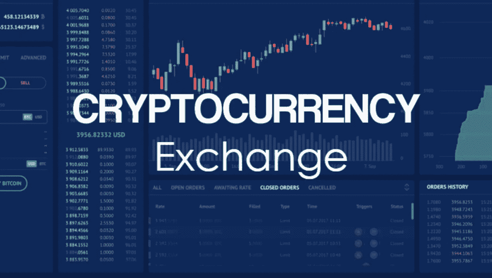

# 关于加密货币交易所发展的重要事实

> 原文：<https://medium.com/geekculture/important-facts-about-cryptocurrency-exchange-development-in-2022-899262ba58e2?source=collection_archive---------16----------------------->

我们生活在一个曾经被认为疯狂的一切现在似乎都很正常的世界里！

比如元宇宙、加密货币、太空旅游等等。，可以归为那些“疯狂”的事情。

其中，**加密货币**即虚拟货币正变得越来越主流，这将重新定义传统的金融和贸易格局。人们认为加密货币可能是建立“无纸化交易”的最佳方式之一。

比特币是最受欢迎的加密货币，价值 17，172 美元，而过去十年仅为 0.0009 美元。其他流行的加密货币包括以太坊、系绳、币安币等。

这些虚拟货币是由埃隆·马斯克、马克·库班等科技巨头推广的。甚至像沃尔玛、微软等领先的全球品牌。已经开始接受密码，这促使许多企业家投身于密码领域。

这一趋势导致了更为突出的加密货币和称为加密货币交易所的交易平台的发展。

cryptocurrency exchange development

并非所有进入在线市场的加密货币都是真实的。一些加密货币交易平台，如币安、WazirX 等。，帮助用户投资加密货币。

这些平台在过去两年中的显著增长鼓励了许多经营者涉足这个蓬勃发展的空间！

这个博客帮助初学者和企业家(他们都热衷于在 2023 年投资利润丰厚的加密交易所)深入了解加密货币交易平台的当前趋势和统计数据。

先从基础开始吧！

# 初学者的加密交换事实

# 什么是加密货币交易所，它是如何工作的？

加密货币交易平台是一个在线市场，用户可以在这里购买、出售、存储、入股、转让和交易比特币、以太坊等加密货币。

新手可以在创建账户后，按照币安、北海巨妖等加密交易平台上的说明开始交易加密货币。

# 加密货币兑换有什么好处？

加密货币交易的一些好处是去中心化、安全性、易用性、交易自由、最小交易时间、防黑客、提高流动性、巨大的投资回报率等。

# 加密交换的三种主要类型是什么？

加密货币交易所的主要类型有:

**中央加密货币交易所(CEX)平台-** 功能类似传统证券交易所。比特币基地、币安等。，都是很受欢迎的 cex。

**去中心化加密货币交易平台(DEX)——**买卖双方直接交易，无需中介。Pancakeswap、Uniswap 等。，属于这个群体。

**混合加密货币交易平台—** 下一代加密货币交易平台，利用了集中式(功能性&流动性)和分散式交易所(安全性&隐私性)的优势。

# 加密货币兑换平台如何入门？

通过 5 个简单的步骤开始加密货币交易:

*   研究加密市场并决定交易方式(直接交易、衍生交易等)。)最适合你的。
*   学习如何阅读交易图表和进行交易。
*   选择最佳的加密交换平台并创建一个帐户。
*   创建一个加密钱包，并开始添加资金。
*   继续购买加密货币，开始您的加密交易之旅。

注意:请注意定期更新自己的密码市场趋势，并在交易开始时寻求专家的建议。

# 对于初学者来说，最好的加密交换是什么？

拥有惊人的 920 万用户的比特币基地是开始加密货币交易的最佳地点，而 crypto.com 以其低费用和增强的安全性而闻名。

上述事实可能对密码爱好者开始他们的加密货币交易有很大的帮助。

如果你感兴趣的不仅仅是交易密码，请继续阅读！

# 企业家的秘密交易事实

在 2023 年启动您的加密货币交易平台可以在许多有利可图的方面让您受益，下面将根据问答进行解释。本节深入探讨了企业家如何开始他们的加密货币兑换业务。

让我们从加密货币交易的当前趋势开始。

# 加密货币交易所—统计和事实

*   全球加密货币市值约为 1.6 万亿美元。
*   全球有 500 多家加密货币交易所。
*   前 4 大加密货币交易所占全球日交易量的 79%。
*   加密货币日均交易量为 357 亿美元。
*   比特币基地是最受欢迎的加密交易平台之一，2021 年盈利 36.2 亿美元。

# 密码交易所如何赚钱？

加密交易所所有者通常从存款费、提现费、挂牌费、交易佣金、ICO 服务以及做市低于其他平台的交易价格中赚钱)。

# 创建自己的加密货币交易平台的 10 大优势

拥有加密货币交易平台的主要好处是

1.  交易费用收入
2.  资产流动性
3.  广告收入
4.  从存款或交易费用中赚取额外收入
5.  加密钱包服务的收入及其维护。
6.  场外交易的利润
7.  硬币上市的收益。
8.  建立用户群，开社区。
9.  整合基于 Defi 的贷款业务并从中获利
10.  销售基于加密的产品。

# 如何开办加密货币交易所？

通过以下简单的步骤开始您的加密创业之旅:

*   获取所需的许可证
*   获得足够的资本
*   联系最好的**加密货币交易所开发**服务商
*   与其他平台合作增加流动性
*   找一个像贝宝这样的支付处理商
*   调整最佳安全实践
*   通过 beta 测试上线
*   开始公关营销和创造品牌知名度，以增加用户群。

# 进行加密交换的成本是多少？

通常需要 5000 到 15000 美元来建立一个加密货币交易平台，以及一个具有高级功能的移动应用程序(聊天交易、bot & ITC 交易等)。)可能需要巨额投资。

从领先的加密货币交易所开发公司获得最佳报价。

# 开发一个加密交换需要多长时间？

平均而言，加密货币交易所的开发从无到有需要长达 6 个月的时间。

在白标加密交换软件的帮助下，人们可以大大缩短上市时间，开发一个功能丰富的加密交换平台只需 6-8 周。

# 2023 年投资加密货币交易所发展的提示

是时候知道在 2023 年立即推出一个强大的加密货币交换平台并将其转换为货币倍增平台的秘方了。

但首先要知道加密货币交易所发展的定义。

# 什么是加密货币交易所发展？

加密货币交易所的开发是指建立一个具有开创性功能的无与伦比的平台或应用程序，用户可以无缝地购买、出售和交易加密货币。

# 什么是白标加密货币兑换软件开发？

一个预制的加密货币交易平台，价格合理，可根据客户要求定制，帮助投资者快速推出一个全面的加密交易平台。

它最适合那些希望以一个口袋友好的预算开始加密货币兑换业务的人。

# P2P 加密货币交易所开发公司

这个小标题是对“哪里可以找到最好的加密货币兑换脚本提供商”的回答？

顶尖的 P2P **加密货币交易所开发公司**为全球公司提供端到端的加密交易所开发服务和解决方案。

借助我们的最佳加密交换脚本，我们通过提供更高级的加密货币交换来支持基于加密的创业公司。

# 为了获得最大收益，加密交换应该包括哪些功能？

**您的加密交换平台应具备的主要特性有:**

*   **迷人的用户界面**
*   一个强大的交易匹配引擎
*   **一体式钱包**
*   **KYC &反洗钱处理**
*   **多支付网关**
*   **高达 100，000 TPS**
*   **一系列受支持的资产。**
*   **场外交易期权**
*   **流动性改善**
*   贸易机器人等等。

# 美国最佳加密货币交易所开发服务

许多领先的公司提供行业最佳的加密外汇开发服务。

他们所有的加密货币交换开发服务都是可定制的。凭借他们的专业知识，任何独特的交流想法都可以在短时间内转化为实用的交流平台。

# 包扎

投资加密货币将是你在即将到来的一年中做出的最佳决定之一。

考虑到当前的加密市场趋势和不断增长的需求，加密货币兑换业务可能会在 2023 年成为一个价值百万美元的想法。

因此，如果你想投身于这个蓬勃发展的领域，我建议你不要闲逛，而是去找一家全球知名的加密货币交易所开发公司。

这些公司将

*   **分析当前的密码市场**
*   **准备一份扎实的计划**
*   **遵循敏捷开发方法**
*   **启动加密交换开发流程**
*   **执行严格的测试**
*   **推出无与伦比的平台**
*   **推广您的品牌，帮助您建立庞大的用户群**
*   **帮你实现投资回报最大化。**

与他们合作，推出一个有利可图的加密交换平台，以获取最大的利益。