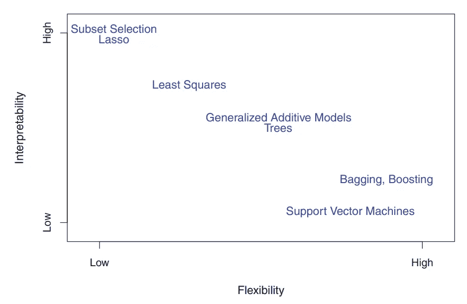
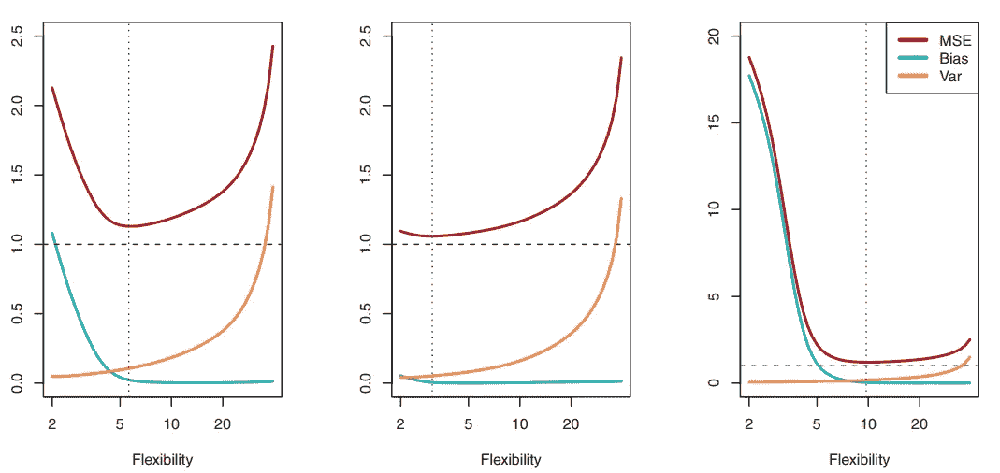

# 从《ISLR》第二章(统计学习)中了解的要点

> 原文：<https://medium.com/geekculture/important-points-to-know-from-islr-chapter-2-statistical-learning-c1cfbe8bf48c?source=collection_archive---------22----------------------->

Photo by [Franki Chamaki](https://unsplash.com/@franki?utm_source=medium&utm_medium=referral) on [Unsplash](https://unsplash.com?utm_source=medium&utm_medium=referral)

哇！刚刚找到这篇文章的精彩图片，标题为**数据有更好的想法，**是的，数据有真正的想法，为你提供进一步的行动，无论是你的业务，股票市场，金融等。
它会给你进一步思考的正确方法。甚至当我们准备工作面试时，我们也会看过去的面试问题(数据)来获得更好的想法。

让我们继续我们的主要话题，我正在读一本很棒的书“ ***【统计学习导论】*** 第二版。阅读第 2 章(统计学习)，并想分享一些我认为重要的观点，这些观点应该为任何数据科学、数据分析或机器学习的有志之士所知。

统计学习是指一套寻找黑箱函数 **f** 的方法，黑箱函数是数据点之间的关系。

*   可约误差和不可约误差
    可约误差是我们可以通过使用最合适的统计学习技术来改善(减少)的误差。然而，伴随目标值而来的不可约误差(ε)不能通过使用预测值(或标记点 X)来预测。
*   参数和非参数方法(算法)
    参数方法包括逻辑回归、朴素贝叶斯、简单神经网络等等。这些模型更容易解释，在较少的训练数据上表现良好。然而离实际功能太远的 **f.** 非参数方法包括 K 近邻、决策树、支持向量机等。当你有大量数据时，这些模型表现良好。它们更灵活，因此它们的可解释性更低。然而，它们有过度拟合训练数据的缺点。
*   一般来说，随着方法灵活性的增加，其可解释性会降低。然而，当灵活性增加时，数据过度拟合的机会也会增加。

A representation of the tradeoff between flexibility and interpretability, using different statistical learning methods.

*   监督和非监督学习
    监督学习，其中我们有预测器(标签)或对应于预测器的响应(目标),我们的目标是预测未来观察的响应。
    无监督学习，在这种情况下，我们不知道关于观察的响应。因此，我们寻求理解观察之间的关系。例如:聚类分析。
    还有第三种类型也发生在我们对某些观测值有响应(目标值)而对某些没有响应的时候，可能是由于收集响应的高成本。这种类型的学习被称为半监督学习。
*   监督学习分为回归问题和分类问题两类。
    当响应(目标)是真实值或连续值，或数量变量类型，如“工资”、“物品价格”时，这些类型的问题归类于回归问题。
    当响应(目标)的定性变量的类型(分类值)像“雄性或雌性”、“狗或猫”时，那么这些问题归类于分类问题。
    在回归和分类问题中，选择正确的灵活性水平对任何统计学习方法的成功都至关重要。
*   随着该方法灵活性的增加，均方误差(简称 MSE)单调下降。
    然而，当该方法在训练数据上给出小误差(均方误差值)而在测试数据上给出大误差时，我们可以说该模型在训练数据上过度拟合。
    为了最小化预期测试误差，我们需要选择一种统计学习方法，同时实现低方差&低偏差。如果一个方法具有低方差，那么对新数据的预测是差的，或者可以说该方法对训练数据过度拟合。

Bias (blue curve), variance (orange curve), and test MSE (red curve). The vertical dotted line indicates the flexibility level corresponding to the smallest test MSE

从上面的图中，我们可以观察到，随着统计方法灵活性的增加，偏差开始减小，比方差的增加要快。我们需要选择方差和偏差都较低的方法。

*   在分类问题中，当 K=1 时，K-最近邻(KNN)分类器具有低偏差和高方差。随着 K 的增长，该方法变得不太灵活，并且具有低方差和高偏差，分类的决策边界变成线性的。

这些是我想与社区分享的一些要点。我希望你明白这些事情，或者这篇文章帮助你修正你的概念。

敬请期待！我很快会写下一章。我还计划写一些 MySQL 的操作者，在采访中会被问到哪些问题。