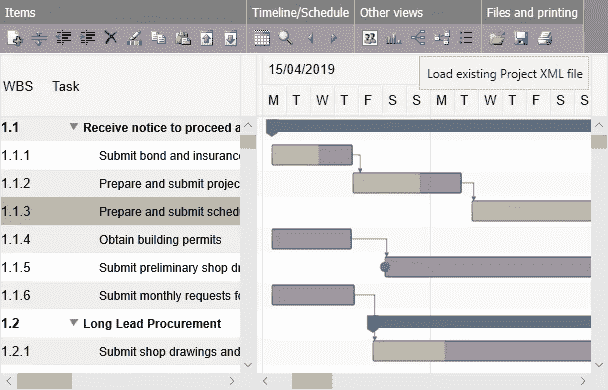

# 从 Excel 导入和导出 JavaScript 甘特图数据

> 原文：<https://medium.com/geekculture/importing-and-exporting-javascript-gantt-chart-data-from-and-to-excel-7b25304e7552?source=collection_archive---------32----------------------->

我们最近发表了一篇关于使用我们新的[项目管理框架加载和保存 Excel 文件的文章。来自 Windows 桌面应用的 Xlsx](http://nuget.org/packages/DlhSoft.ProjectManagementFramework.Xlsx) 包(当然是在 [DlhSoft 项目管理框架](https://dlhsoft.com/PMF)之上)。

但是，如果您想在支持 JavaScript 的页面(或应用程序)中导入/导出数据表，该怎么办呢？例如在 ASP 中。基于. NET 的网站。网芯 2.x，。净 5 甚至。NET 框架 4+。

别担心，我们会掩护你的。我们的[开源](https://github.com/DlhSoftTeam/ProjectManagementXlsx)库已经被开发为*。NET Standard 2.0* 库，所以它也绝对可以在那里工作。

你可能会问为什么是 Excel 表格。我们会回答说，为什么不呢？CSV 或制表符分隔的数据确实很容易导出/导入，但是——对于许多用户来说——如果您也可以直接转到 Office 文件会好得多。显然，Microsoft Office 是最常见的商业套件，几乎所有其他平台都集成并支持该套件。

你想知道细节，对吗？所以我们开始吧:

## NuGet 包

如果你只是想开始，这里是你要去的地方:

[](https://www.nuget.org/packages/DlhSoft.ProjectManagementFramework.Xlsx) [## DlhSoft。Xlsx 1.0.3

### DlhSoft 项目管理框架的 Excel 工作表适配器(Microsoft Project XML 格式的内容)

www.nuget.org](https://www.nuget.org/packages/DlhSoft.ProjectManagementFramework.Xlsx) 

## GitHub 项目

但是，如果你想进一步定制的东西，只是克隆我们的回购，而是有乐趣！

[](https://github.com/DlhSoftTeam/ProjectManagementXlsx/tree/master/ProjectManagementXlsx) [## dlhsofteam/ProjectManagementXlsx

### DlhSoft 项目管理框架的 Excel 表适配器(Microsoft Project XML 格式的内容)…

github.com](https://github.com/DlhSoftTeam/ProjectManagementXlsx/tree/master/ProjectManagementXlsx) 

## 项目 XML 格式

如上所述，我们的新工具利用了 [DlhSoft 项目管理框架](https://dlhsoft.com/PMF)，除了内联添加和删除项目之外，它还可以处理 Microsoft Project XML 格式的数据。(我们所有的甘特图组件也是如此。)

[](https://docs.microsoft.com/en-us/office-project/xml-data-interchange/project-elements-and-xml-structure?view=project-client-2016) [## 项目元素和 XML 结构

### 本节包含有关 Microsoft Office 中定义的项目元素及其子项目的信息…

docs.microsoft.com](https://docs.microsoft.com/en-us/office-project/xml-data-interchange/project-elements-and-xml-structure?view=project-client-2016) 

## 组件许可

但是不要担心:尽管你确实需要一个项目管理框架的开发许可证，你可以直接从我们的网站上免费获得一个，只要你是一个 DlhSoft 甘特图超级许可证持有者。

# 将项目 XML 与 Excel 工作表相互转换

这就是你在 Microsoft Project XML 和 Excel 文件之间转换内容的方式。

将 Excel 文件作为项目 XML 内容读取:

```
var excelBytes = File.ReadAllBytes(*sourceXlsxFilePath*);
var *projectXml* = ProjectManagementXlsx.Adapter.GetProjectXml(excelBytes);
```

要用项目 XML 字符串创建 Excel 文件:

```
var excelBytes = ProjectManagementXlsx.Adapter.GetExcelBytes(*projectXml*);                File.WriteAllBytes(*targetXlsxFilePath*, excelBytes);
```

## 内置 Excel 模板

工具生成的 Excel 表格当然需要尊重一些条件。

具体来说，假设任务数据总是在文件的第一个工作表中，并且工作表的第一行应该总是包含标题值。和实际任务域必须准确地映射到列，如下所示:

# ASP 的示例应用程序。NET 和 JavaScript

现在，让我们把所有东西放在一起，直接从浏览器中显示的甘特图数据加载并保存 Excel 表格。



这是一个使用 ASP 开发的小示例应用程序。NET Core (MVC)和一点 JavaScript，利用来自 [DlhSoft 甘特图超级库](https://dlhsoft.com/GCHL)的 [GanttChartView](https://dlhsoft.com/GCHL/GanttChartView.html) 组件作为 UI。

随意提取相关的进出口代码(见 [site.js](https://github.com/DlhSoftTeam/XlsxGanttChartWeb/blob/master/XlsxGanttChartWeb/wwwroot/js/site.js) 和 [HomeController.cs](https://github.com/DlhSoftTeam/XlsxGanttChartWeb/blob/master/XlsxGanttChartWeb/Controllers/HomeController.cs) )并根据需要进行扩展！

(同样，如果您真的需要进一步定制，请不要犹豫更新执行实际 XML-Excel 转换的[适配器](https://github.com/DlhSoftTeam/ProjectManagementXlsx/blob/master/ProjectManagementXlsx/Adapter.cs)！)

[](https://github.com/DlhSoftTeam/XlsxGanttChartWeb) [## dlhsofteam/XlsxGanttChartWeb

### 与 Excel 示例集成。NET MVC-dlhsofteam/XlsxGanttChartWeb

github.com](https://github.com/DlhSoftTeam/XlsxGanttChartWeb) 

要将甘特图数据保存为 Excel 表格，您需要从客户端获取*项目 XML* 内容，在服务器上将它转换为 Excel 字节，然后将字节下载回来。要将上传到服务器的 Excel 表格转换成 Project XML，也同样简单。只看下面的代码:

## 导出数据

从 *site.js* 文件中提取(客户端):

```
function saveXlsx() {
  let data = new FormData();
  var projectSerializer = DlhSoft.Controls.GanttChartView.ProjectSerializer.initialize(ganttChartView);
  var projectXml = projectSerializer.getXml();
  data.append('ProjectXml', projectXml);
  fetch('/Home/SaveXlsx', { method: 'POST', body: data }).then(response => response.json()).then(response => {
    var excelBase64 = response.data;
    var dataUrl = 'data:application/vnd.openxmlformats-officedocument.spreadsheetml.sheet;base64,' + excelBase64;
    const a = document.createElement('a');
    a.href = dataUrl;
    a.download = 'GanttChart.xlsx';
    a.click();
  });
}
```

从 *HomeController.cs* 文件中提取(服务器端):

```
[HttpPost]
public IActionResult SaveXlsx(ProjectXmlForm form)
{
  var excelBytes = ProjectManagementXlsx.Adapter.GetExcelBytes(form.ProjectXml);
  return Ok(new { data = Convert.ToBase64String(excelBytes) });
}
```

## 导入数据

从 *site.js* 文件中提取(客户端):

```
function loadXlsx() {
  let data = new FormData();
  var fileInput = document.getElementById('xlsxFileInput');
  let file = fileInput.files[0];
  if (!file) {
    alert('Select a file first.');
    return;
  }
  data.append('file', file);
  fetch('/Home/LoadXlsx', { method: 'POST', body: data }).then(response => response.json()).then(response => {
    var projectXml = response.data;
    var projectSerializer = DlhSoft.Controls.GanttChartView.ProjectSerializer.initialize(ganttChartView);
    projectSerializer.loadXml(projectXml);
  });
}
```

从 *HomeController.cs* 文件中提取(服务器端):

```
[HttpPost]
public IActionResult LoadXlsx(IFormFile file)
{
  using (var stream = file.OpenReadStream()) {
    byte[] excelBytes = new byte[file.Length];
    stream.Read(excelBytes, 0, excelBytes.Length);
    var projectXml = ProjectManagementXlsx.Adapter.GetProjectXml(excelBytes);
    return Ok(new { data = projectXml });
  }
}
```