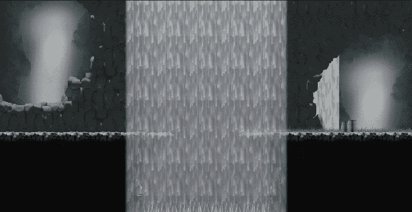
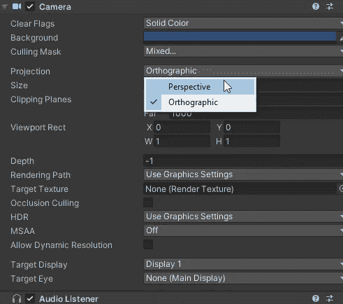
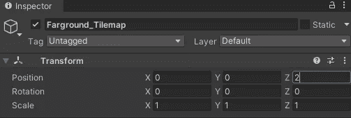
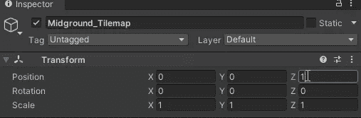

# 使用视差效果改善背景真实感和沉浸感

> 原文：<https://medium.com/geekculture/improve-background-realism-and-immersion-with-a-parallax-effect-c90500ec150?source=collection_archive---------27----------------------->

**目标**:给更远的磁贴添加视差效果

我们在 tilemaps 上作画，tilemaps 应该代表离相机或视点给定距离处的景观层。布都显得平淡， **2D 式的**。这是因为我们缺少**视差**效果:换句话说，如果我们移动相机，一切都保持不变，而不是根据深度移动一个量。

要达到这个效果，需要几个简单的步骤。

首先，你必须改变主相机中的**投影**选项，从正投影变为**透视**。然后，您可以调整相机的 z 位置和 FOV，以获得您最喜欢的缩放级别。

下一步将是**推动**磁贴沿着 z 轴进一步移动**。与其他景观相比，景观越远，z 值越高。没有必要使用巨大的数字，我把 1 和 2，但也许甚至更小的数字就可以了。这样，当 tilemaps 被有效地推回时，视差效应将被放大。**

这就是结果。你可以注意到当移动相机时瀑布和洞穴是如何移动的…想想如果有足够大的绘画关卡会有多酷！

如果你喜欢，就鼓掌吧！看看我的游戏或者给我买杯咖啡:感谢每一种支持！！

