# 使用复数改进神经网络

> 原文：<https://medium.com/geekculture/improve-neural-networks-by-using-complex-numbers-5e142b8931e6?source=collection_archive---------0----------------------->

## 复杂函数能否成为计算机视觉的下一个突破口？

最近，我的 LinkedIn 网络中有人与我分享了这篇非常有趣的论文。标题为“ [CoShNet:使用剪切波的混合复值神经网络](https://arxiv.org/abs/2208.06882)”的论文提出了在混合神经网络中使用复函数。如果你对这些话感到困惑，不要担心，我也是。在本文中，我将解释混合神经网络的思想，以及如何使用它们来改进传统的卷积神经网络。然后我们将讨论如何使用复杂函数来进一步提高这些模型的性能。这将会非常有趣。

> 由此产生的网络称为复杂剪切波网络(CoShNet)。在时尚-MNIST 上对 ResNet-50 和 Resnet-18 进行了测试，**分别获得 92.2%和 90.7%和 91.8%**。与 11.18m 的 ResNet-18 相比，提议的网络具有 49.9k 的参数，并且使用的**比触发器**少 52 倍。最后，我们在**下训练了 20 个历元，而 ResNet 需要 200 个历元**，并且**不需要任何超参数调整也不需要正则化**。
> 
> -如果你在找理由对这个想法感到兴奋。

# 理解卷积神经网络

卷积神经网络从一开始就是计算机视觉的架构。[其实 CNN 的根基都比我老](http://yann.lecun.com/exdb/publis/pdf/lecun-89e.pdf)。CNN 实际上是为视觉而建的。

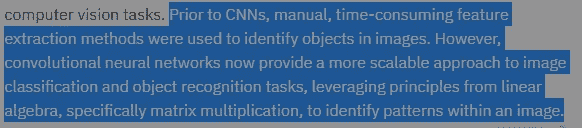

The feature extraction is the true CNN revolution. Taken from [IBM’s Writeup on ConvNets](https://www.ibm.com/cloud/learn/convolutional-neural-networks)

那么 CNN 有什么好的呢？卷积神经网络背后的主要思想是，它们逐段遍历图像，并从中提取主要特征。CNN 的早期层通常提取更原始的特征，例如边缘和颜色。然而，添加更多的层允许以非常高的细节分辨率提取特征。

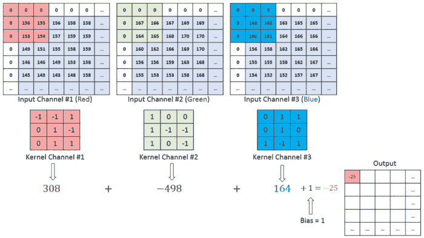

CNNs use the sliding window technique to build their feature maps. As you can see, Good Machine Learning requires good software engineering. [Image Source](https://towardsdatascience.com/a-comprehensive-guide-to-convolutional-neural-networks-the-eli5-way-3bd2b1164a53)

[本文将更详细地介绍 CNN。](https://towardsdatascience.com/a-comprehensive-guide-to-convolutional-neural-networks-the-eli5-way-3bd2b1164a53)对于我们的目的来说，有一件事很重要:**CNN 一直是计算机视觉的首选，主要是因为它们能够构建特征地图。**即使随着《视觉变形金刚》的崛起，CNN 依然保持强势(前提是你使用下面给出的技术实现管道现代化)。

 [## 脸书·艾和加州大学伯克利分校与变形金刚开战

### 随着围绕 GPT3、DALLE、PaLM 和更多产品的疯狂炒作，现在是报道本文的最佳时机。

medium.com](/geekculture/facebook-ai-picks-a-fight-with-transformers-5e0f511b4383) 

到目前为止，一切顺利。那么有什么问题呢？他们的方法有一个问题。卷积(构建特征地图)会变得非常昂贵。

# 进入混合神经网络

如果你学过一点计算机科学(你在 ML 应该学得很好)，你会对特征映射过程有所了解。真的很贵。你必须多次滑动窗户。正如我们已经说过的，早期的图层只提取原始特征。高分辨率的特征只在较晚的层次上被发现。这是一些真正聪明的人看到机会的地方。*如果我们做一些数学运算，找到一个可以帮助我们直接发现一些低级特征的函数，会怎么样？*通过这种方式，我们无需通过昂贵的早期卷积即可发现特征-

> 在混合神经网络中，昂贵的卷积层被参数大大减少的不可训练的固定变换所取代。

如果你能找到一个好的函数，那么你就大大减少了你的计算开销。我们有一些很棒的功能可以做到这一点。**事实证明复杂的功能更有效**。看看下面的图片和结果的差异。

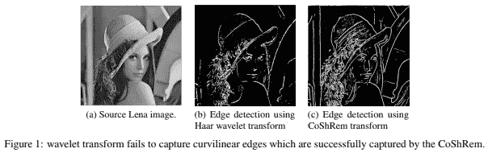

这张图片是进入下一部分的完美过渡。现在让我们来谈谈复杂函数给我们的神经网络带来的所有优势，以及它们最初为什么工作得如此好。其中一些可能非常数学化，但如果你有这种感觉，请确保你闭上眼睛，想想 Twitter 上的深度学习兄弟告诉你的机器学习不需要数学。**真正的机器学习是让大模型过度适应整洁的数据，而不是这种技术数学的东西(涉及大量实验)**。

 [## 为什么机器学习需要数学

### 以及你需要多少才能做好机器学习

medium.com](/geekculture/why-you-need-math-for-machine-learning-d9aca2437ee8) 

让我们来看看混合网络中的复函数(特别是复剪切波函数)。

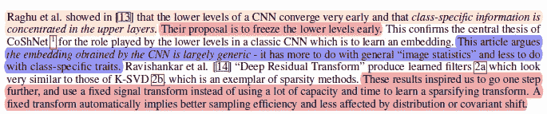

The basic idea behind Hybrid NNs and this paper

# 惊人的 CoSh 网络

在我进入细节之前，这里简要介绍一下这个网络可以完成的一些惊人的事情。这应该告诉你为什么我要报道这个想法(并希望说明为什么我花我的周末去阅读随机的 ML 论文)。

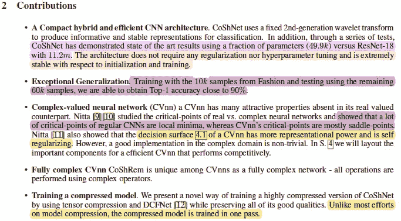

你已经知道我对这些结果非常兴奋。使用数学构建的经济高效的 ML 解决方案？一个概括得很好的？光是打这个我就开始兴奋了。然而，真正让我印象深刻的是这个网络对噪音和干扰的适应能力。这是我开始写作以来一直在关注的事情，作为一种应对方式，这些结果非常令人兴奋。

 [## 研究人员发现对抗性干扰起作用的可能原因

### 这是一篇有趣的论文

medium.com](/mlearning-ai/researchers-discover-possible-reason-why-adversarial-perturbation-works-f65e64d9eb7) 

看看这张图，他们用干净的和被扰乱的数据集的排列来测试网络。结果非常稳定，尤其是考虑到相对较小的训练数据集。我通常期望从更大的数据集获得这种健壮性。

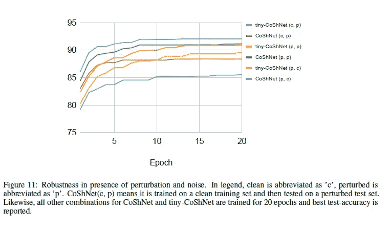

樊伯英碍事，为什么会这样？这能这么管用的原因是什么？这是侥幸，还是有什么关于复变函数的东西非常好用？

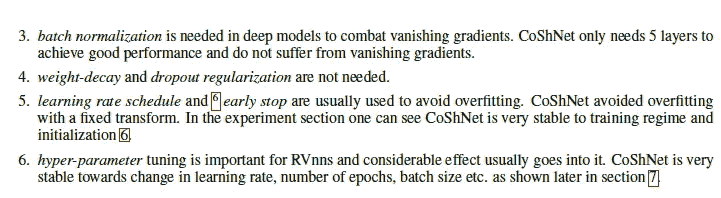

If we can understand what makes these amazing results tick, we can create much better solutions.

让我们继续讨论为什么复杂函数可能是深度学习的下一个飞跃。

> 这与最近的一篇论文形成鲜明对比[41]”..联合优化架构和培训程序的必要性:..相同的培训程序不足以比较不同架构的优点。”这与人们想要的正好相反——针对不同数据集和模型的简单可靠的训练程序。
> 
> —作者表明调优和昂贵的搜索并不是唯一的方法。

# 复杂函数的神奇性质

有一些非常有趣的属性使复杂的神经网络变得特殊。首先，我们来谈谈决策边界。复杂的神经元创造了以下界限-

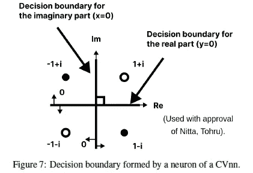

这没什么奇怪的。然而，这带来了一些有趣的属性，尤其是在泛化的情况下。据作者称-

> CVnn 的决策边界由两个正交相交的超曲面组成(图 7 ),并将决策区域分成四个相等的部分。此外，3 层 CVnn 的决策边界几乎保持正交[27]。这种正交性提高了通用性。**例如，不能用单个实神经元解决的几个问题(如 Xor ),可以用单个复值神经元利用正交特性解决**

下一个突出的对我来说是鞍点的存在。鞍点**T3 出现在多变量函数中。**它们是函数既不达到局部最大值也不达到局部最小值的临界点。****

[Image Source](http://www.cheerml.com/saddle-points)

为什么这很重要？在鞍点，损失函数的导数仍然等于 0。然而，正如作者所言，“*具有随机初始值的 SGD 可以很大程度上避免鞍点[29] [30]，但不是局部最小值。这种行为可能是允许更快收敛的原因，因为算法不会陷入局部最小值。这种方法为集成[随机重启以采样更大的搜索空间](https://youtu.be/iq1IIIvNfUU)提供了非常相似的好处。*作者甚至提到这种协同网络不需要数据扩充来达到稳定嵌入(相对于扰动)*。*

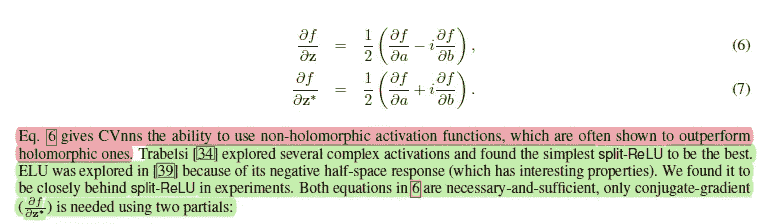

If you have experience with split-ReLU, let me know.

这两个属性的作用方向是相同的，它们允许网络用更少的资源完成更多的工作。

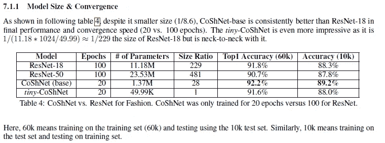

最后一个属性值得单独列出。进入相位一致性的时间，以及它如何帮助对抗鲁棒性。

# 相位一致性

在电子信号中，**相位是波形周期**上时间点(瞬间)位置的定义。*相位也可以是具有相同频率* ( [源](https://www.quora.com/What-is-the-phase-of-the-EM-waves))的波之间相对位移的表达式。这个视频提供了一个视觉表现。相位在信号处理中非常重要。

如果扰动后相位保持稳定，那么我们就可以提取稳定的特征。这与我之前分享的麻省理工学院关于为什么会发生扰动的分析论文非常吻合。" *CoShRem 可以提取对比度不变的稳定特征——边缘、脊和斑点。在图 6.b 中，我们可以看到利用相位一致性对图像中的关键特征进行了稳定和鲁棒的定位(不受噪声和对比度变化的影响)。*”

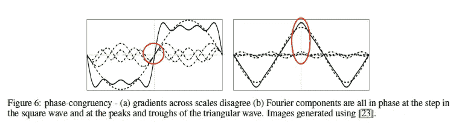

Gradients fluctuate wildly across scale but phase remains very stable at critical parts of the image. This makes phase a great base for detecting important features.

当涉及到检测扰动应用的图像中的特征(和它们的大小)时，这非常有效。

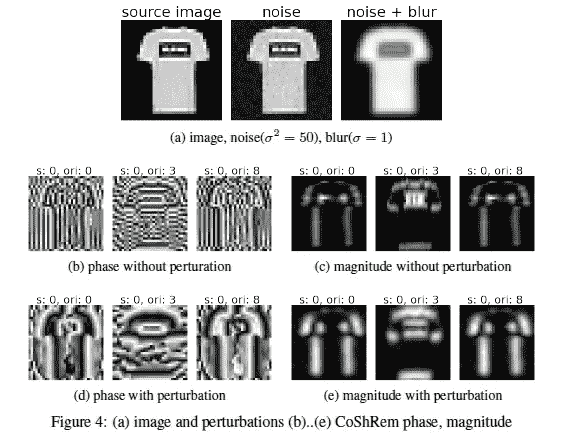

“Fig 4 shows despite the considerable perturbations (blurring and Gaussian noise), CoShRem remain stable to most of the characteristic edges and ridges (two step discontinuity in close proximity).”

这种阶段一致性在创建健壮的模型方面创造了奇迹。我有兴趣看看这种性能如何对抗更专业的敌对网络(如一个像素的攻击)。这将是对稳健性的真正考验。

我想就此谈更多，但很多都与信号处理有关。我对此一无所知。我知道足够的数学知识来浏览和理解主要的思想/推导，但我不完全有信心理解关于相位和复小波的一些细节。如果你有任何关于这个话题的经验/资源，请在评论中留下。我很乐意向你学习。

在这篇文章之后，我将更深入地研究复杂函数和分析，因为它看起来非常强大。期待更多关于复杂函数如何在网络中使用的细节/想法。如果您有任何问题/澄清，您可以联系 [Manny Ko](https://www.linkedin.com/in/manchorko/) 。他是苹果公司的首席工程师，也是本文的作者之一。他和我分享了这篇文章，他对这个话题的了解肯定比我多。

如果你喜欢这篇文章，你会喜欢我的每日电子邮件简讯[技术变得简单](https://codinginterviewsmadesimple.substack.com/)。它涵盖了算法设计、数学、人工智能、数据科学、最近的技术事件、软件工程等主题，让你成为更好的开发人员。 [**我目前正在进行一整年的八折优惠，一定要去看看。**](https://codinginterviewsmadesimple.substack.com/subscribe?coupon=1e0532f2) 使用此折扣会降低价格-

***每月 800 印度卢比(10 美元)→ 533 印度卢比(8 美元)***

***每年 8000 印度卢比(100 美元)→6400 印度卢比(80 美元)***

[你可以在这里了解更多关于时事通讯的信息](https://codinginterviewsmadesimple.substack.com/about)

# 向我伸出手

使用下面的链接查看我的其他内容，了解更多关于辅导的信息，或者只是打个招呼。另外，查看免费的罗宾汉推荐链接。我们都得到一个免费的股票(你不用放任何钱)，对你没有任何风险。**所以不使用它只是在损失免费的钱。**

为了帮助我了解您[请填写此调查(匿名)](https://forms.gle/7MfQmKhEhyBTMDUD7)

查看我在 Medium 上的其他文章。https://rb.gy/zn1aiu

我的 YouTube:[https://rb.gy/88iwdd](https://rb.gy/88iwdd)

在 LinkedIn 上联系我。我们来连线:[https://rb.gy/m5ok2y](https://rb.gy/f7ltuj)

我的 insta gram:[https://rb.gy/gmvuy9](https://rb.gy/gmvuy9)

我的推特:[https://twitter.com/Machine01776819](https://twitter.com/Machine01776819)

如果你想在科技领域发展事业:[https://codinginterviewsmadesimple.substack.com/](https://codinginterviewsmadesimple.substack.com/)

获得罗宾汉的免费股票:[https://join.robinhood.com/fnud75](https://join.robinhood.com/fnud75/)