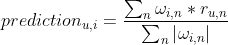
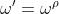
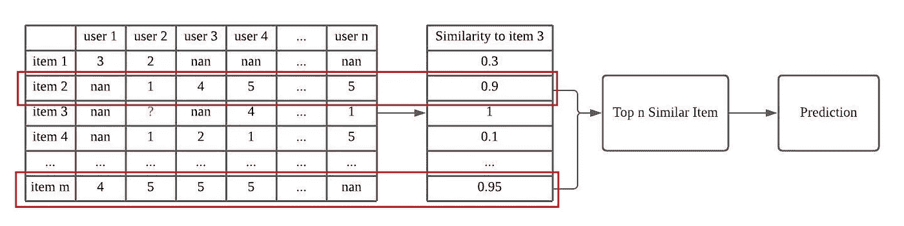
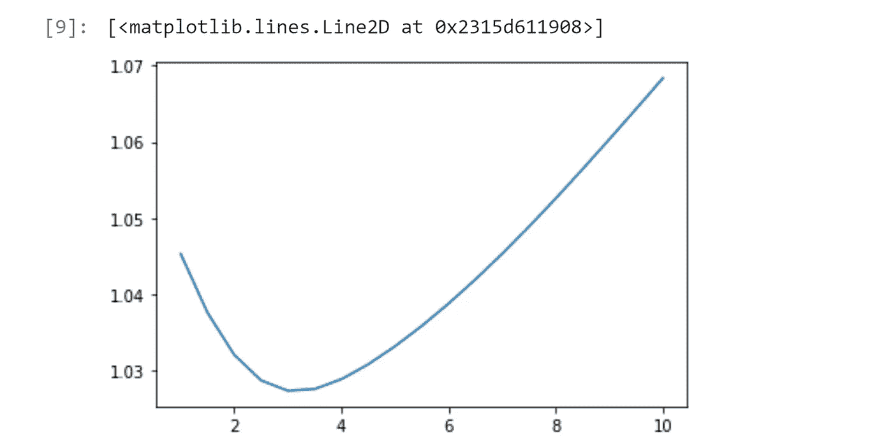
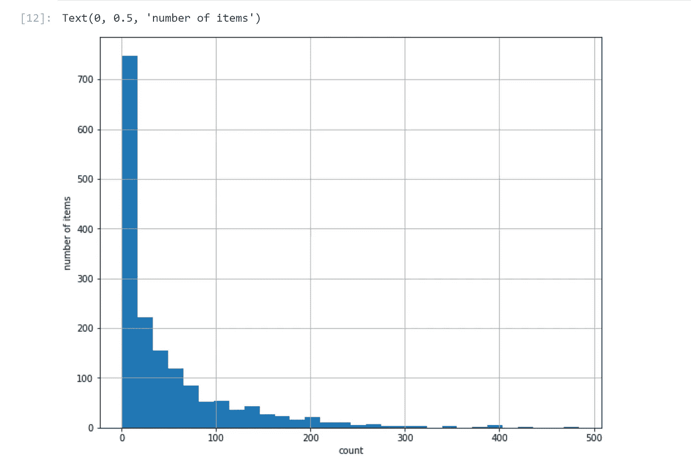
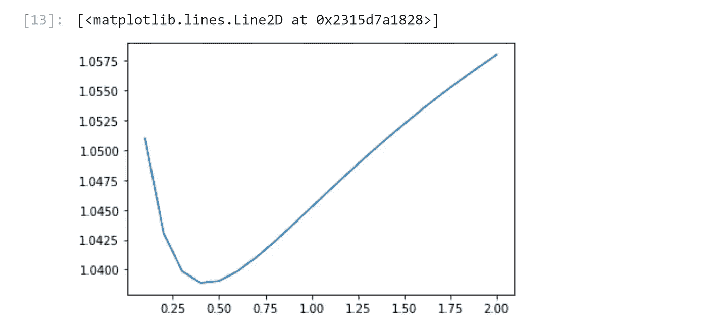

# 改进项目-项目协同过滤

> 原文：<https://medium.com/geekculture/improve-the-item-item-collaborative-filtering-bf74e18fd7d1?source=collection_archive---------27----------------------->


Photo by [Ian Schneider](https://unsplash.com/@goian?utm_source=medium&utm_medium=referral) on [Unsplash](https://unsplash.com?utm_source=medium&utm_medium=referral)

基于项目的模型在推荐系统中得到了广泛的实现，但是仅仅实现基于项目的模型是不够的。通常，我们需要在模型上进行更多的探索，并结合一些**特征工程技术**和**用户行为分析**。在这个例子中，我们将继续上一篇文章，探索更多基于项目的模型扩展。

Github 链接:[https://github . com/Chiang 9/re commendation _ system _ py spark/blob/main/Item _ based _ cf/Extensions _ of _ Item-based _ model . ipynb](https://github.com/chiang9/Recommendation_system_pyspark/blob/main/Item_based_cf/Extensions_of_Item-based_model.ipynb)

请查看之前的帖子，

[](/geekculture/overview-of-item-item-collaborative-filtering-recommendation-system-64ee15b24bb8) [## 项目-项目协同过滤推荐系统综述

### 协同过滤广泛应用于推荐系统的构建。基于内存的方法主要有两种…

medium.com](/geekculture/overview-of-item-item-collaborative-filtering-recommendation-system-64ee15b24bb8) 

# 概述

我们将使用以下公式进行预测



在这个例子中，我们将介绍 3 种方法来改进基于项目的推荐系统。

# 方法

## 1.前 n 个类似项目

在最初的版本中，我们采用所有共同评价的用户-项目评价对来进行预测。为了改进我们的模型，我们可以只取前 n 个相似的项目来进行预测。

这种方法的思想是消除低相似性等级项目对预测的影响。

## 2.案例放大

为了增加高相似性项目影响的权重，我们可以使用下面的等式来放大权重，使得



其中 p 大于 1。

在基于项目的模型中，权重是项目-项目对之间的相似性。我们将能够增强高相似性影响并惩罚低相似性项目。

## 3.默认投票

默认投票有很多方法。在本例中，我们将更改评分少于 n 的项目的权重。我们将需要从数据方面进行更多的探索，以确定 n 值。

# 我们开始吧

首先，我们从上一篇文章中提取代码，并创建 **compute_rmse** 函数来简化我们的模型评估。

```
1.0452369678411928
```

# 1.前 n 个类似项目

**compute_prediction_v1** 只考虑 *top_n* 相似项，进行预测。



top_n similar items image by author

接下来，我们可以通过更改参数 **top_n** 来调整模型。在我们的数据集中，17 似乎返回最佳 RMSE。然而，在这个例子中，我们没有采用**交叉验证**。实际上，在训练超参数时，**交叉验证**是必不可少的。


```
**************** 
best model: 
top_n = 17 
rmse = 1.0253540271872705 
****************
```

# 2.案例放大

在这种方法中，我们在方法 1 的基础上进一步增强了模型。 **compute_prediction_v2** 取参数， *top_n* 和 *amp* ，其中 *amp* 指公式中的数字 *n* 。


接下来，我们调整模型并在图表中可视化。正如我们从图表中看到的，如果我们接受所有数据，3.0 效果最好，如果我们更改 *top_n* 值，它可能会有所不同。



```
****************
best model:
amp = 3.0
rmse = 1.0273477985136776
****************
```

# 3.默认投票

在本例中，我们将更改获得 n 个以上评分的项目的权重。因为我们正在编辑权重，所以我们可以简单地改变相似性矩阵。

## 数据集探索

在我们开始定义超参数之前，我们应该看一下数据集。正如我们从下图中看到的，大多数商品的评分都低于 100 分。



number of rating per item received

我们将*阈值*定义为 100。



```
****************
best model:
amp = 0.4
rmse = 1.0388958637215613
****************
```

# **结论**

有很多方法可以扩展基于记忆的模型。在这里，我们只演示 3 种方法来提高模型的准确性。为了获得更好的模型，我们可以将上述方法和其他模型结合起来，构建一个混合推荐系统。