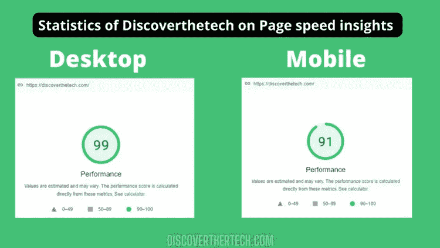
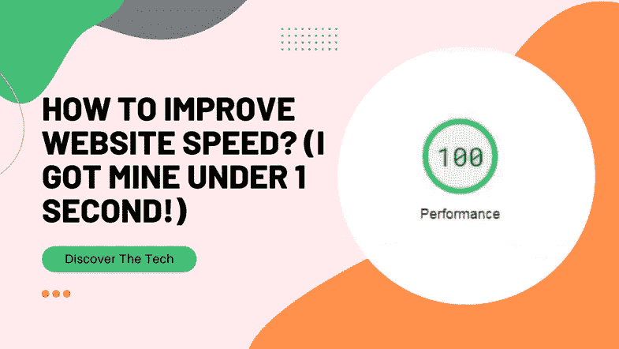
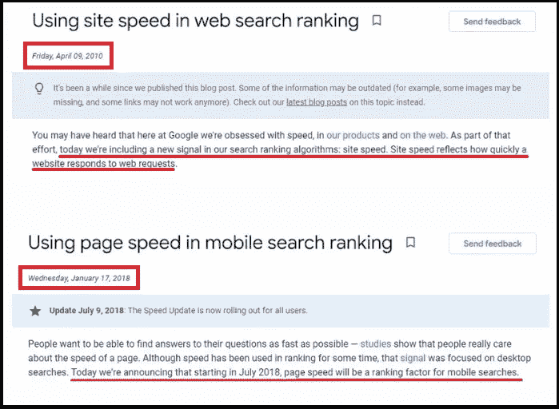
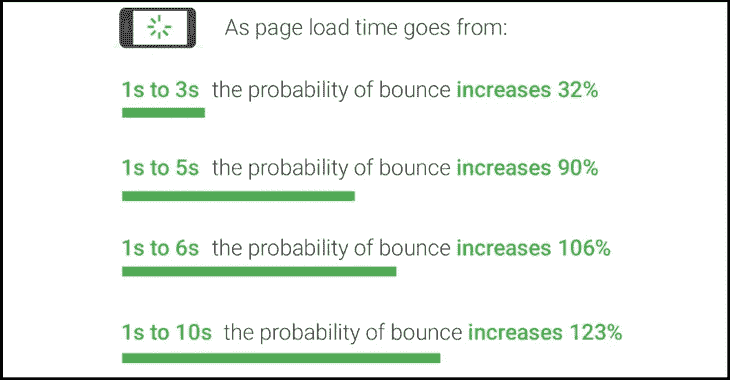
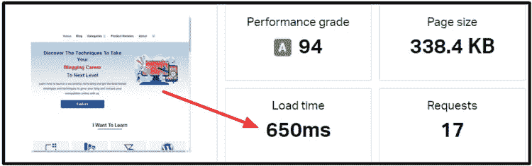
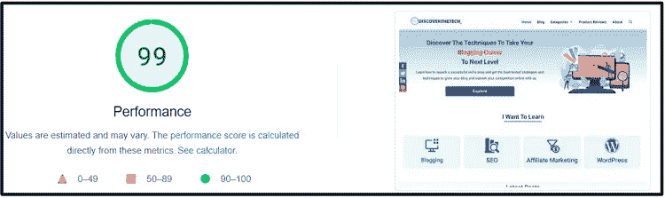
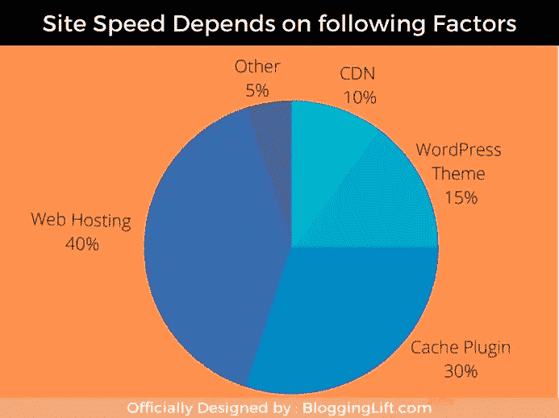
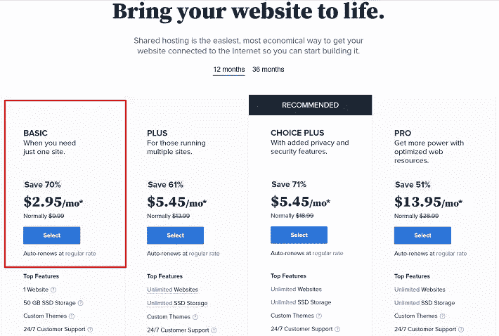
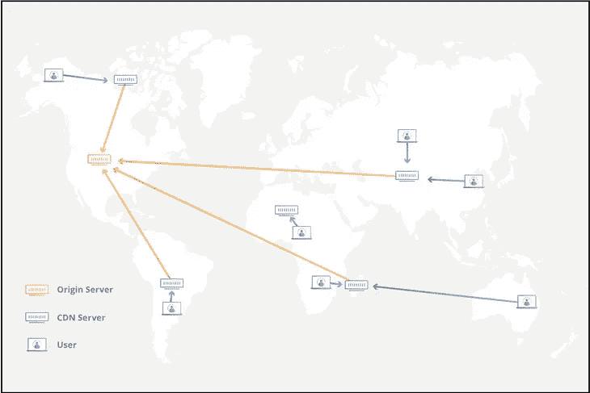

# 我如何让我的网站加载时间不到 1 秒

> 原文：<https://medium.com/geekculture/improve-website-speed-a2204677a1c?source=collection_archive---------15----------------------->

提高页面加载速度是网站成功的一个非常重要的因素。

我明白你的文件、照片和视频对你的网站至关重要；但是，这会导致页面加载缓慢。

如果你不能提高网站速度，不要担心；我支持你。

即使你没有任何**编码知识**，你也可以通过缩小 CSS 和 JS、压缩图像、利用缓存浏览和其他技术来轻松提高网站速度。

网页速度是网站成功的重要因素。

如果你的网站性能很差，优化所有其他 SEO 元素将不会帮助你。

根据 Kissmetrics 的研究，页面加载延迟一秒钟会导致转化率损失 7%，页面浏览量减少 11%，客户满意度下降 16%。

**这难道不是一个重大损失吗？**

在这篇文章中，我将向你展示如何通过使用一些策略来提高 WordPress 网站的速度，这些策略允许我的网站在不需要任何编码语言的情况下在 1 秒钟之内加载。

看看下面我的网站上分享的指标-

我的站点速度评分桌面 99，移动 91；我是怎么得到的？

我运用了什么策略产生了如此不可思议的结果？

我会揭露一切，这样你也可以提高你的网站加载速度。

那么，我们开始吧。

# 什么是页面速度？

2010 年 4 月，谷歌官方确认[页面速度是排名因素](https://developers.google.com/search/blog/2018/01/using-page-speed-in-mobile-search)。

大多数人对一个页面和一个网站的速度之间的差异感到困惑。

主要区别在于网站速度是以单个网站的平均页面速度来衡量的。

网站的页面速度依赖于图片、视频、脚本和内容等开发因素。

这篇文章将着眼于每个因素并进行调整，以提高网站速度和转化率。

# 为什么页面速度真的很重要？

从根本上说，页面速度至关重要，因为访问者首先注意到的是网站的速度。

谷歌的两篇博客，一篇来自 2010 年 4 月 9 日，另一篇来自 2018 年 1 月 17 日，都在明确强调页面速度的重要性。

因为它现在是一个排名因素，我们必须始终牢记，我们的网站速度应该始终保持和表现良好，以实现谷歌排名。

如果你的 WordPress 网站速度很慢，将会导致更少的访问者和更差的转化率，即使你的内容是独一无二的，并且经过了很好的优化。

**你知道吗？**

> 根据谷歌 2018 年的研究，移动端的平均页面速度为 15.3 秒，然而，推荐速度仅为 3 秒。

如果你能把你的页面加载时间减少到推荐的水平，这对你的网站来说是非常好的。

页面速度至关重要，原因如下:

*   为了更好的搜索引擎优化
*   为了改善用户体验

# 为了更好的搜索引擎优化和转换

你知道吗？Radware 领导的一项审查表明，在线商业行业最伟大的故事之一沃尔玛的加载时间在 1 到 4 秒之间时，变化率急剧下降。

下面的陈述清楚地表明每秒的页面速度都很重要。

根据 [Google/SOASTA](https://www.thinkwithgoogle.com/marketing-strategies/app-and-mobile/mobile-page-speed-new-industry-benchmarks/) 在 2017 年进行的一项研究，加载时间超过 3 秒的网站会使跳出率提高 90%以上。

提高网站速度有助于 T2 SEO，因为你的页面速度是访问者的第一印象。

良好的页面速度也有助于提高转化率。

以下统计数据证明:

*   当沃尔玛进一步开发其加载时间时，其转换率每秒钟增长 2%。
*   Mobify 通过每 100ms 的额外开发获得了 1.11%的扩展转化率。
*   通过将加载时间缩短 0.85 秒，库克获得了 7%的扩展转化率。

# 为了改善用户体验

假设你需要购买一件物品。

你选择了两家商店；他们以相似的价格向你提供该商品；然而，第一个在 1 天内交付您的项目，其他人在 3 天内交付。

你会选择哪家商店？你会当场选第一个，对吧？

它进一步提供了速度对于改善整体用户体验的重要性。

这就是你如何通过提高你的站点速度来进一步提高你的博客用户体验和转化率。

提高页面性能改善了用户体验，导致订阅量上升，这意味着更多的收入。

# 惊人的工具来检查您的网站速度

互联网上有各种各样的网站可以监控你网站的速度，但只有三种被广泛使用:

1.  GTmetrix。
2.  Pingdom。
3.  谷歌页面速度洞察。

所有这些工具都是完全免费的。

## GTmetrix

它是由主要的云咨询公司之一 **Carbon60** 开发的一个免费工具。

该网站于 2009 年推出，目前已有超过 90 万注册用户。那可是纽约的一大块地方。

它使用灯塔审计工具分析网站的速度。它提供了一份关于你的网站运行状况的详细报告。

有多个地方可以测试页面速度，默认为加拿大温哥华。

转到[gtmetrix.com](https://gtmetrix.com/)，在点击分析按钮之前，将你的网站地址粘贴到分析性能框中。

以下是 GT Metrix 为帮助您检查和提高网站速度而提供的一些详细信息

*   配乐表演
*   分数结构
*   网络生命指数评级
*   互动时间到了
*   装载时
*   满载时间

在查看了 GTmetrix 的结果后，我想了一些提高我的 WordPress 网站速度的方法。

所以我开始了解 W3total cache 插件，并为我的网站设置了它。它有各种各样的选择，但它不适合我。然后我在谷歌上查找加快我的 WordPress 网站速度的方法。

偶然看到 [WP rocket](https://discoverthetech.com/recommends/wp-rocket/) 作为知名营销博客推荐的选项。

在我的博客上安装和设置后，我的博客页面速度大幅提高，我的页面加载时间减少了 65%以上，在 GTmetrix 上的加载时间只有**668 毫秒**，如图所示。

该插件将帮助您消除降低页面速度的问题，您还可以使用[GTMetrix Speed Apparatus Guide](https://winningwp.com/gtmetrix-speed-test/)来学习如何使用 gt metrix 并解释它提供的细节。

## Pingdom

拥有超过 70 个投票点的 Pingdom 是一个伟大的工具，其免费计划中有 7 个不同的投票点，足以疯狂地分析你的网站的速度。

一个有用的特性是它可以显示页面的完整尺寸。你的页面大小是影响网站速度的一个重要因素。

> 页面越小=网站加载速度越快

为了更好的用户体验，你可以使用这个工具跟踪你的站点的正常运行时间、性能和交互。

转到[tools.pingdom.com](https://tools.pingdom.com/)，将你网站的网址粘贴到分析框中，选择你所在的地区，然后点击开始测试。

这将显示以下结果，可用于提高网站的速度:

*   你网站的等级表现。
*   页面的大小。
*   装载时间。
*   查询次数。

在那下面，你会发现改善页面性能选项，它会建议一些技术来改善你的网站的加载时间。

看看我的加载时间，只有 650 毫秒。你觉得很神奇吗？不要担心，我将向您展示我是如何轻松实现这个结果的。

# 谷歌页面速度洞察

页面速度洞察(PSI)是 2013 年发布的谷歌产品。

当你在里面分析你的站点时，会产生很多指标，比如第一次内容丰富的绘画、最大内容丰富的绘画、速度指数和其他页面速度标准。

将您网站的 URL 复制并粘贴到搜索框中，然后单击分析以获得您的站点报告。

在我看来，谷歌 PSI 非常棒，因为它是谷歌自己的官方产品，并且随着所用时间的不同，显示每个错误的方式也不同。它们是:

1.  第一痛内容评分。
2.  现在是互动时间。
3.  阻断时间。
4.  诊断和提高速度的建议。

在 Google page speed insights 上获得 99 分可能更难，但是如果你遵循我下面列出的策略，你肯定会得到 100 分。

如果你的网站得分在 90-100 分之间，它被认为是好的。然而，任何低于这个分数的都意味着你的网站速度很低，你需要做一些改变来提高你的页面加载速度。

# 无需任何编码知识，提高网站速度的 9 个经验证的技巧

你知道吗？

网站速度最关键的方面是什么？

有五个主要方面影响网站速度。它们如下:

1.  虚拟主机:40%
2.  缓存插件:30%
3.  WordPress 主题:15%
4.  加拿大元:10%
5.  其他:5%

上面列出的五个参数会显著影响站点速度。我们将在本帖中讨论每个因素。

为了进一步提高站点速度，请按照我演示的技巧，用 1 秒钟或更少的时间来堆叠我的站点。

# 1.使用速度优化的虚拟主机

原始数据显示，你的主机占你网站速度的 40%。

如果你的主机服务很差，你可能会失去大量的访问，因为客户更喜欢加载速度快的网站。

大多数新来者经常选择便宜的主机服务，这进一步导致你的博客用户体验差，因此没有结果。

你应该始终选择一个良好的速度优化的虚拟主机，这是一个完美的金钱价值。

现在的问题是，**我应该使用哪种托管服务**？

好的主机有哪些要领？

它会让我的网站加载更快吗？符合我网站的标准吗？

Bluehost 有你所有的答案。

还有很多其他的托管选择；然而，Bluehost 为预算有限的网站提供了高性能的服务器。

看看这篇详细的 [Bluehost 评论](https://discoverthetech.com/bluehost-hosting-review-2020with-pros-and-cons/)，了解 Bluehost 托管的所有利弊。

# 2.优化你的博客图片

图像对于博客文章来说是必不可少的，因为它们将信息存储在信息图表中，使材料更具可读性，并为读者节省时间。

然而，如果你的图片没有优化，你的网站将加载缓慢，你的转化率和访客率将受到影响。

但是我怎样才能让我的照片更加优化呢？有没有插件或者压缩它们的方法？

你可以选择使用插件或者压缩你的数据。但是，在压缩之前，请使用正确的格式。

PNG、JPEG 和 Webp 是谷歌支持的仅有的三种格式。

*   高分辨率的 PNG 图像适合图片较少的小型网站。
*   **JPEG** 图像平衡良好，比 png 小，但质量有所下降。
*   **WebP** 照片基于无损压缩，但部分浏览器不支持。

我建议您的网站使用 PNG 图像，并将其转换为 WebP 格式，因为这将降低图像的大小，同时保持其质量。

你也可以使用类似于 **WebP Express** 的插件，以 WebP 的形式向你的访问者展示你的图片。

您可以使用 Canva 或 Photoshop 来调整图像大小以适应浏览器。建议尺寸为 750×320 像素。

正如我之前所说，WebP 不被一些浏览器支持，比如 Internet Explorer。因此，如果任何用户从该浏览器访问您的网站，他将得到一个错误的图像，从而破坏用户体验。

但是这里有一个解决方案。

您可以为支持 WebP 图像的浏览器显示 WebP 图像，对于不支持 WebP 图像的浏览器，请使用默认的图像格式，如 png 或 jpg。

现在，怎么做呢？

因此，你可以使用 [Imagify](https://wordpress.org/plugins/imagify/) 插件以不同的压缩级别压缩你的博客图像，它还可以免费自动将你的 png 和 jpg 图像转换成 WebP 格式。

每月最高**20MB**免费，之后收费。(大多数网站的要求都低于此)

我们也使用 **Imagify** 来压缩我们的博客图片，并将它们转换成 WebP。

# 3.使用缓存插件

获取一个缓存插件来提高你的网站速度。缓存是一种技术，插件制作你的完整站点的副本，并提供缓存版本来加速你的 WordPress 站点。

W3 total cache、 **WP rocket(推荐)**，以及其他缓存插件可用于 WordPress。

正如你所看到的，WP rocket 是值得推荐的，因为它提供了一个网站在缓存过程中所需要的一切，比如减少 HTTPS 请求，缩小 JS，HTML，CSS 等等。

在我看来，Lazyload 是这个插件最好的特性。其他插件不会给你提供延迟加载功能，但是 WP rocket 会。

如果你正在使用任何其他缓存插件，你需要安装任何其他插件，如 **A3 Lazy Load** ，以便在你的网站上使用 Lazy Load 功能。

我还尝试在我的网站上对 W3Total Cache 的高级版本进行 A/B 测试，但它提供的结果并不那么吸引人。

另一方面，WP 火箭取得了令人难以置信的成绩。

WP rocket 以其令人难以置信的功能和出色的用户界面给客户留下了深刻的印象，其中包括:

*   页面缓存。
*   用 GZIP 压缩。
*   预压。
*   电子商务的优化。
*   浏览器中的缓存。
*   全世界 99%的浏览器都是兼容的。
*   数据库清理。
*   减少了等待时间。
*   可用性。
*   Cloudflare 和 Sucuri 的集成。

要提高你网站的页面加载速度，首先切换到 Bluehost，在你的网站上安装 WP Rocket 插件。

一个站点许可证只需**49**美元，三个站点只需**99**美元，每年在**无限量网站**上使用**249**美元，即可获得 WP Rocket。

[**现在就让你的网站负荷像火箭一样**](https://discoverthetech.com/recommends/wp-rocket/) 。

并立即获得令人难以置信的效果。

# 4.使用速度优化的轻量级 WordPress 主题

网上有几百万个免费主题可供选择，但你用的是最轻的那个吗？

你可能想知道，什么是轻量级优化主题？

简单来说，轻量级主题具有以下特征:

*   正确有效地编码。
*   没有病毒和恶意软件。
*   可以获得技术援助和定期更新。

如果这些特性出现在一个主题中，它很可能是轻量级的和优化的。

最好的主题是:

1.  [**生成出版社溢价**](https://discoverthetech.com/recommends/generatepress/) (推荐)。
2.  阿斯特拉
3.  卡登斯

我们的第一个推荐是 GeneratePress，因为它是目前 web 上最轻量级的主题，大小不到 30 KB，具有许多定制功能和易于使用的界面。

GeneratePress Premium 每年只需花费**59 美元**，它还有一个终身定价，只需一次性支付**249 美元**就可以在多达 500 个网站上使用，并且有一个巨大的 **30 天退款保证**，如上图所示。

# 5.使用 CDN 服务

术语“内容交付网络”是指您的媒体材料(如照片、文件和视频)托管在另一台服务器上，并提供给您的网站。

如果你向全世界的人提供你的内容，你应该使用 CDN。

它保留了您的网站的副本，减少了延迟。假设一个用户从另一个国家访问你的网站。在这种情况下，它将从离他最近的可用位置向他提供结果。

根据 Venture Harbor 的一项研究，CDN 可以将你的速度提高 10-20%。

使用 CDN 的一些好处如下:

1.  减少您的带宽使用。
2.  使信息更加方便用户。
3.  增强网站的安全性。

应该用哪个 CDN？

有没有提供免费内容的网络？

[Cloudflare](https://www.cloudflare.com/) 是最佳的全球 CDN 网络。它不仅有助于加快您的网站，而且有助于增强安全性，DDos 保护，并提供免费的 SSL 集成。

你也可以使用它设置速度优化，比如 Brotli 压缩，管理你的 DNS，**都是免费的**。

# 6.删除不必要的主题和插件

博主们有时想让他们的网站看起来漂亮，在他们的网站上安装许多无用的插件。

我相信你可能曾经犯过这个写博客的错误。

你知道吗？

你添加的插件越多，你收到的服务器请求就越多，这会降低你网站的速度，导致你排名下降。

你应该只使用那些对你的网站真正必要的插件。你可以找到许多在一个插件中提供多种功能的插件。

例如，如果你正在使用 WP Rocket，你不需要为 lazyload 特性安装一个不同的插件，因为它是一个内置的特性。

我建议为你的 WordPress 站点安装不超过 **20 个插件**。

你应该移除像 Jetpack 和 Disqus 评论系统这样的插件，因为它们占用了大量的 CPU。

安装 **p3profile 插件**，查看哪些插件使用了大量 CPU。它将为你提供一份关于插件 CPU 使用率的全面报告。

你可以很容易地删除不必要的插件，提高你的 WordPress 网站的速度。

**注意:**如果你安装了多个主题，你的网站速度可能会提高，这是不安全的。请按照以下步骤删除它们:-

1.  导航到外观。
2.  选择主题。
3.  选择无用的主题。
4.  请移除它。

如果你仔细地遵循上面的步骤，你的网页的加载速度将会提高。

# 7.缩小和合并文件

HTML、CSS、Javascript 和其他编程语言文件组成了一个网站。

其中一些没有价值的脚本对你的网站来说是不必要的，但是会占用你的服务器空间，降低网站速度。

缩小并合并它们可能会提高你的 WordPress 网站的速度。

我知道你担心移除它看起来像是你需要有为它编码的知识。

不要担心，因为你可以使用 **Wp Rocket** 插件来缩小你的 CSS 和 javascript 文件，只需要点击几下鼠标。

这些是缩小和合并你的文件的方法

1.  进入你的 WordPress 仪表盘，前往 WP Rocket settings。
2.  然后点击文件优化。
3.  现在，勾选你想要的选项，比如缩小文件，结合 CSS 和 javascript，然后点击保存按钮。

因此，您的文件优化是在不需要任何编码知识的情况下完成的。

# 8.启用延迟加载

要提高网站速度，使用 lazyload。也称为按需加载。

惰性加载是一种策略，当图像一出现在访问者的屏幕上就显示给他们。

网页通常会一次载入内容中的所有照片，这会降低网站速度。Lazyload 在这种情况下很有用，因为它阻止图像被批量加载，而是只在用户滚动到图像时才单独加载。

它很有用，可以提高网站速度，尤其是在移动设备上。

许多插件，比如 WP Rocket，可以在你的站点上实现延迟加载。您可以使用的其他一些插件有:

1.  A3 懒人装
2.  自动优化
3.  Smush 延迟加载

如果你想启用延迟加载，我推荐使用 WP rocket premium 版本，因为我不推荐使用额外的插件来延迟加载。

# 9.移除瞬变和数据库清理

你知道吗？

在幕后，每个 CMS 都使用一个数据库服务器，其中大多数使用 MySQL、MariaDB 或 SQL Server。如果你有一个缓慢的数据库，你的网站将会变慢。

WordPress 建立在 MySQL 数据库上，被大多数博客作者使用。随着您添加、删除和编辑内容，数据库的大小会不断增长，因此必须对其进行维护。

按照下面概述的步骤进行维护:

1.  删除任何额外的帖子修订(每次保存帖子时保存在数据库中的帖子版本)。
2.  删除所有垃圾评论。
3.  移除任何不需要的表格。
4.  改进桌子。
5.  删除瞬变。

定期执行以下所有行动，以减少您的数据库，从而优化您的网站速度。

你可以使用 WP Rocket 或者 **Wp-optimize** 来优化你的数据库和瞬态清理。

# 主要学习内容

在 SEO 领域，页面速度是一个必须定期维护的重要方面。

这不是一次性的工作。

当一个网站越来越受欢迎时，定期检查它的速度是很重要的。(特别是对于你的热门页面，这意味着该页面正在获得高流量和高排名)

通过在需要时采取行动来提高网站速度。

使用缓存插件来提高页面的加载性能，降低数据库、图片、文件和视频的大小。你也可以限制在你的网站上使用重定向来优化你的网站速度。

最后但同样重要的是，保持你的 CMS、主题和插件的更新，因为更新的版本更有可能提高速度。

如果你喜欢这篇文章，不要忘记与你的朋友分享，如果你对这个话题有任何疑问，请在评论区提问。

*原载于 2022 年 5 月 17 日***。**