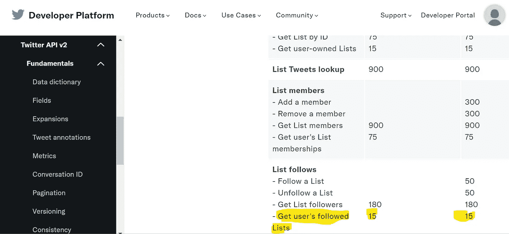
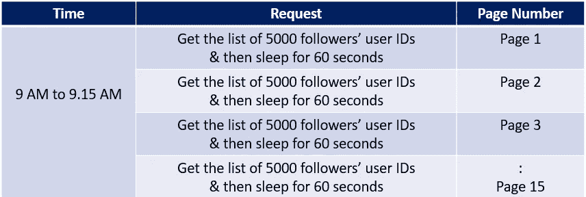

# 使用 Python 的 Twitter 营销

> 原文：<https://medium.com/geekculture/improve-your-twitter-marketing-campaigns-using-this-simple-hack-9c45dc5472c4?source=collection_archive---------11----------------------->

使用 Python 在 Twitter 上自动发送直接消息，节省时间

# **概述**

试图通过 **Twitter 营销**推广业务的初创公司和代理机构通常很难让自己被人看到。获得你的目标受众，获得足够的兴趣和**参与度**有时可能看起来有些牵强。

**Social Media Marketing (by Canva)**

除此之外，还有人工工作，其中需要识别正确的受众，并将 DMs(直接消息)一个接一个地发送给 1000 个 Twitter 用户。如果有更好的方法来减少一些手动工作量呢？如果有一种方法可以自动将 DMs 发送给一系列受众，那对您的营销活动不是很好吗？此外，该解决方案还将对社交媒体影响者有用，使他们能够及时地向其追随者分享有针对性的帖子和消息。

**你将需要什么**

1.  Python 3 及以上版本(如果你是 Python 新手，可以看看这个课程- [人人编程(Python 入门)| Coursera](https://www.coursera.org/learn/python) )
2.  你选择的 python 笔记本(我的偏好是 Jupyter 和 Visual Studio Code (VSCode))。
3.  Twitter API-(查看此处了解更多— [Twitter API 文档| Docs | Twitter 开发者平台](https://developer.twitter.com/en/docs/twitter-api))

**解决方案**

Schematic — Sending Direct Messages to specific users/Twitter Marketing (Note: Includes icons from [Flaticon](https://www.flaticon.com/) and [Vecteezy](https://www.vecteezy.com/))

Twitter 提供了一个 API，其中包含了非常有用的功能。Python 提供了两个非常有用的包，将有助于这个过程——Tweepy 和 Twython。这两个库都有各种处理 Twitter 消息的函数。它们相辅相成。在这段代码中，使用了两个库中的特定函数。

**设置认证**

您可能知道，Twitter API 有 15 分钟的速率限制。下面阅读更多内容。每个函数都有自己的速率限制。

 [## 费率限制

### 每天都有成千上万的开发者向 Twitter API 发出请求。为了帮助管理这些数量庞大的…

developer.twitter.com](https://developer.twitter.com/en/docs/twitter-api/rate-limits) 

根据上面的 URL，显然速率限制是由端点决定的。根据手头的用例，我们需要查找用户的关注列表-

让我们说，你正在寻找检索用户' XYZ '的追随者。表 1.0 显示了按照代码片段所做的事情

Table 1.0

“时间”库对于处理速率限制很有用，在这种情况下，您可以让 API 在速率窗口之后休眠，然后在下一个速率窗口恢复。

最后一部分——向追随者发送直接信息——

您肯定可以将它封装在一个函数中，并以列表的形式传递接收方用户 id。

**潜在的限制和建议**

Twitter API v1.0 提供了一种确定收件人是否启用了 DMs 的方法。然而，Twitter API v1.0 版有这个特性。以下网址提供了更多信息。

对此的一个解决方案是利用 API v.10 来检查接收方是否启用了 DMs。下面是一个网址

[https://Twitter community . com/t/how-to-know-if-user-has-enabled-direct-message-if-you-want-send-direct-message-to-non follower-using-Twitter 4j/142957](https://twittercommunity.com/t/how-to-know-if-user-has-enabled-direct-message-if-you-want-to-send-direct-message-to-nonfollower-using-twitter4j/142957)

**结束语**

上述方法可以大大减少时间，以促进你的营销活动。您可以确定您的目标受众，并有效提高您的产品/服务的参与度。如果你是一名社交媒体影响者，你也可以利用这一点来宣传自己的品牌。