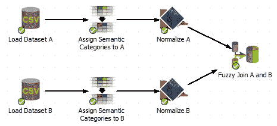

# 通过模糊连接的数据集成

> 原文：<https://medium.com/geekculture/improving-how-mixed-sources-of-data-are-accurately-merged-together-through-the-use-of-fuzzy-joins-64e0ab7812d0?source=collection_archive---------1----------------------->

## 混合不同来源的数据

在我们的日常工作中，我们经常需要将两个或多个数据集合并成一个。这种类型的操作称为**连接**，当每个记录包含两个数据集中的唯一 ID 时，这种操作非常简单。但是，在许多情况下，数据集使用不同的方法创建唯一键，因此不匹配或根本没有唯一键。在这些情况下，传统的连接操作是不够的。例如，我们有许多项目涉及对个人的分析。一个数据集可以来自一个源，例如包含该人的医疗数据的医院，而另一个数据集可以来自另一个源，例如包含保单信息的保险公司。这两个机构不太可能共享相同的记录保存系统，在该系统中，真实世界的个人在两个数据集中被给予相同的唯一键，因此我们的连接数据的默认方法将不起作用。为了分析这样的数据，我们需要一种更先进的连接记录的方法。

# 正常化

当我们需要比较存储为字符串数据的实体时，我们通常需要考虑字符串的许多不同部分。例如，假设我们检查数据中的以下姓名:史蒂文·约翰逊和史蒂夫·迈克尔·约翰逊。

当我们，作为人类，比较这些实体时，我们不会直接将每个字符串作为一个整体进行比较。相反，我们比较子字符串。“史蒂文”被比作“史蒂夫”，“M”被比作“迈克尔”，“约翰逊”被比作“约翰逊”。我们这样做是因为我们认识到名字不是一个完整的东西，而是由更小的属性组成的——在本例中是名、中间名和姓。从逻辑上讲，将这些子字符串放在一起比较比将整个字符串进行比较更有意义。“史蒂文·M·约翰逊”作为一个整体可能与“史蒂夫·迈克尔·约翰逊”不太相似(无论我们如何定义)，但各个部分也相差不远。

这个将实体解构为更多原子组件的过程被称为**规范化**，是字符串比较和模糊匹配中的一个重要步骤。它允许计算机在比较字符串时做出有根据的评估，因此我们只比较彼此直接相关的子字符串。

# 模糊连接

A fuzzy join performed in PolyAnalyst

数据规范化后，我们可以应用模糊连接。结果是我们连接了共享数据中某个属性的对象。例如，对于以前的医疗和保险数据集，定义属性是构成个人的属性，如姓名、电话号码、地址和出生日期。请注意，这些属性并不总是被假定为唯一的，因为许多人可能有相同的姓名或出生日期。此外，这些属性很少具有完全正常的形式，因为相同的名称可以以各种方式拼写，并且地址具有一些在一些记录保存系统中可能不存在的组成部分。

尽管如此，通过抽象和规范化数据，然后构造等价类而不是相等类，模糊连接可以基于该“模糊”信息链接对应于相同实体的记录。一个数据集中的一个人在另一个数据集中可能有不同的拼写，如果有足够的补充信息，模糊连接能够识别这两个实际上是相同的。

模糊连接允许我们处理大量的新问题，这些问题通常涉及来自多个数据源的数据集，没有唯一的键属性。它在医疗、保险、银行和政府部门都有应用，在这些部门中，我们经常要处理模糊的实体，如人和地点。

*原载于 2018 年 5 月 21 日*[*【https://www.megaputer.com】*](https://www.megaputer.com/fuzzy-join-importing-mixed-sources/)*。*