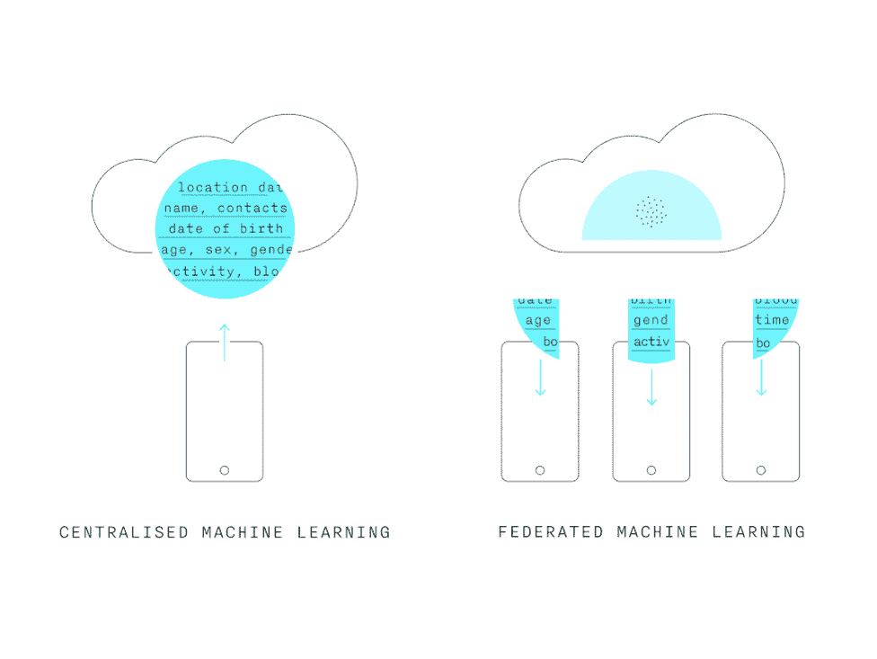
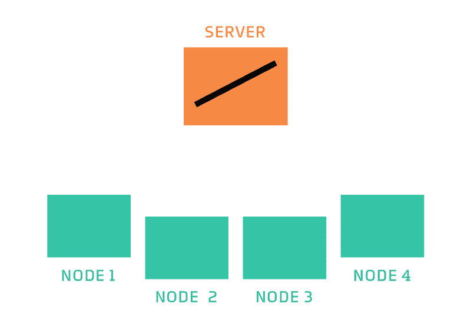
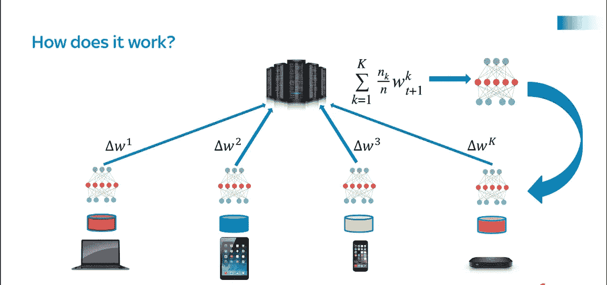

# 改进机器学习过程以保护数据隐私

> 原文：<https://medium.com/geekculture/improving-machine-learning-model-by-also-preserving-privacy-data-25d955ed518f?source=collection_archive---------20----------------------->

## 联合学习

## 联合学习如何保护数据隐私

image is via *Tianchen Liu on* Federated Learning Process

大数据已经无处不在。我们所做的任何活动都会产生数据，这些数据可以被提取为有用的东西。例如，我们可以根据智能手机上跟踪的体育活动来改进我们的健康管理活动，或者我们可以在智能手机上发短信时更快地输入文本。这些数据或查询是需要保留的许多因素之一，同时我们希望将它们用于前面提到的机器学习用例。数据隐私最近一直是大型科技公司的一个大问题。有人担心大型科技公司如何收集和使用这些数据。为了解决这个问题，有一个持续开发的框架，它能够在维护称为**联邦学习的机器学习模型的同时保护数据隐私。**

**联邦学习简介**

在训练机器学习模型的传统方式中，我们将数据和机器学习模型托管在相同的设备上或集中机器学习。然而，联合学习学习用数据训练机器学习模型的不同方式。不是将数据发送到服务器进行训练，而是将来自服务器的模型发送到每个设备。

The difference between centralized ML and Federated Learning

> 那么，ML 模型如何学习数据呢？

source is via Cloudera blog [http://vision.cloudera.com/wp-content/uploads/2018/11/2018-10-31-181344-federated_learning_animated_labeled.gif](https://blog.cloudera.com/federated-learning-machine-learning-decentralized-data/)

ML 模型确实为可用设备(上面可视化中的节点)训练数据，无论它是处于空闲模式/插入还是未使用，因此用户没有意识到数据已经由设备上的机器学习模型训练。然后，已经训练了数据的设备的子集将汇总结果发送到服务器，同时还保持数据隐私。这项技术在维护数据隐私方面取得了突破，多年来，在收集和使用用户数据时，数据隐私一直是一个问题。幸运的是，Google 开发了一个 TensorFlow 联合学习 API，当使用 TensorFlow 构建机器学习应用程序时，我们可以使用它来实现联合学习。对 TensorFlow 的实现感兴趣的人可以看看**的实现代码**。

 [## 谷歌联合实验室

### 编辑描述

colab.research.google.com](https://colab.research.google.com/github/tensorflow/federated/blob/master/docs/tutorials/federated_learning_for_text_generation.ipynb) 

此外，谷歌在学习用户输入数据的基础上开发了 Gboard 打字，这样几个句子就可以用来预测谷歌地图上的完整地址。你可以看到如下可视化。这种预测不是首先将数据发送到服务器以获得更好的预测，而是机器学习模型已经学习了数据来预测它。这确实是维护数据隐私的一个突破。

Gboard Implementation on Federated Learning

**数学中的联邦学习**

Math in Federated Learning

联合学习确实训练每个设备上的数据，并且通过使用诸如 SGD 或 Adam 优化器(在神经网络达到收敛的情况下)之类的优化器来聚集结果以更新全局模型，其中更新的参数/权重将再次用于训练每个设备上的数据。这个过程被一次又一次地重复，以改进基于问题的度量。

**结论**

联合学习是在各种机器学习项目中实施的一个好主意。保护数据隐私的想法可以确保机器学习项目在更广泛的行业中的易用性，如医药、物流、电信和保险。我还看到了一些可用于实现联合学习的框架，这意味着该框架的存在将为开发机器学习应用程序带来更光明的未来，同时还能维护数据隐私。如果你在基于联邦学习主题的 [**Github**](https://github.com/topics/federated-learning) 上查一下，这个项目有很多明星。

参考资料:

*   [保护隐私的机器学习实用安全聚合](https://eprint.iacr.org/2017/281.pdf)
*   [联合学习:基于分散数据的机器学习(Google I/O’19)](https://www.youtube.com/watch?v=89BGjQYA0uE)
*   [大规模联合学习:系统设计](https://arxiv.org/abs/1902.01046)

# 感谢您的阅读！

*真的很感谢！*🤗*如果你喜欢这个帖子并想看更多，可以考虑* [***关注我***](https://naiborhujosua.medium.com/) *。我发布与机器学习和深度学习相关的主题。我尽量让我的帖子简单而精确，总是提供可视化和模拟。*

**Josua Naiborhu** 是一名业务发展分析师，后来变成了一名自学成才的机器学习工程师。他的兴趣包括**统计学习、预测建模和可解释机器学习**。他喜欢跑步，这教会他不要放弃做任何事情，即使是在实施机器学习生命周期(MLOps)的时候。除了追求他对机器学习的热情，他还热衷于投资印度尼西亚证券交易所和加密货币。他一直在跑 2015 年**雅加达马拉松和 2019 年**大阪马拉松的全程马拉松。他的下一个梦想是参加波士顿马拉松赛、TCS 纽约市马拉松赛和维珍货币伦敦马拉松赛。

*你可以在* ***LinkedIn*** *，****Twitter****，G****it hub****，****【Kaggle】****上与他联系或者直接在他的* ***个人网站上与他联系。***