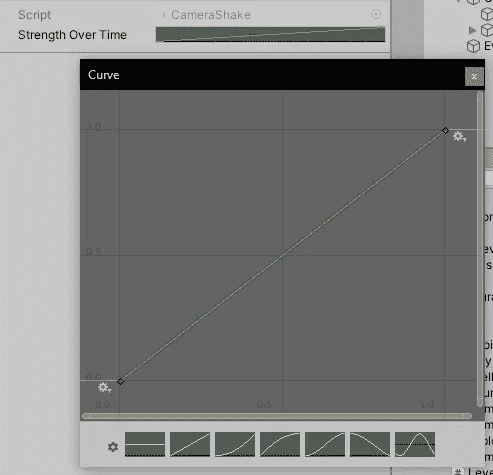
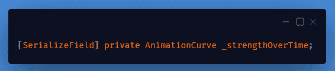
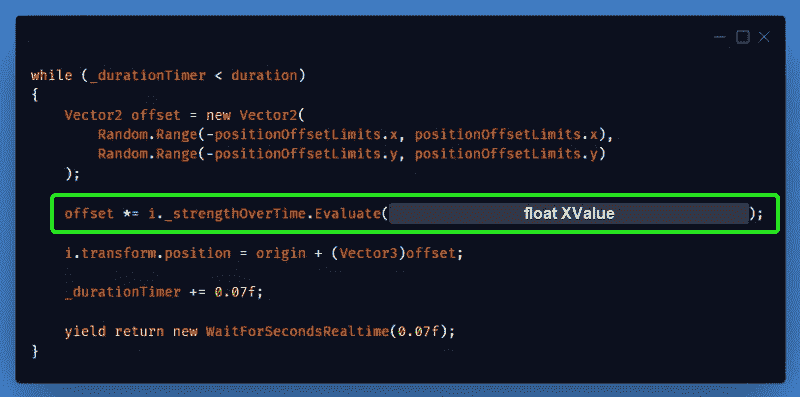
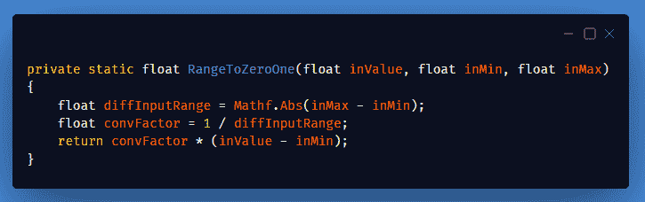
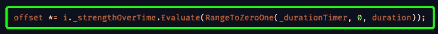
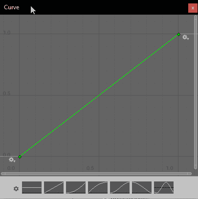
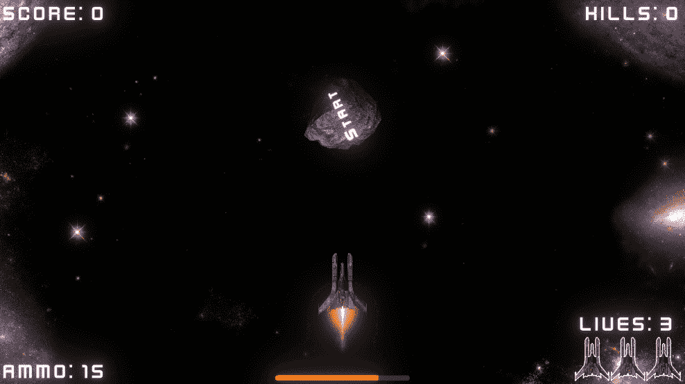

# 用动画曲线改善相机抖动！

> 原文：<https://medium.com/geekculture/improving-the-camera-shake-with-an-animation-curve-db76bc618760?source=collection_archive---------18----------------------->

从[我的最后一个帖子](https://vintay.medium.com/making-the-camera-shake-in-unity-515752ad654d)开始，该效果目前在整个持续时间内具有相同的强度。我想扩展一下，从中等强度开始，然后达到最大强度，然后在整个过程中慢慢达到零强度。

有很多方法我可以做到这一点，但我将使用一个非常有用的东西称为“**动画曲线**”。这是一种你可能在 Unity 动画中见过的可变类型。

An AnimationCurve variable, shown in the Inspector

这允许我基于 X 值设置 Y 值。过一会儿你会更明白这一点。

首先，我将在脚本中添加一个变量。

并在循环中添加一行，该行将基于 X 值将随机偏移乘以动画曲线的 Y 值。

" ***Evaluate()*** "当给定一个 X 值作为参数时，从曲线返回 Y 值。所以我需要传入当前的" ***_durationTimer*** "作为 x。

> 但是有个问题！

我的效果持续时间不恒定。它是在我调用 StartShaking 函数时设置的。因此，除非我只将 duration 设置为 1，否则将会导致错误，因为动画曲线(默认情况下)从 0 变为 1。

解决方法是将“***_ duration timer***”和“ ***duration*** ”转换为 0 和 1 之间的值，而不考虑原来的持续时间。

This converts a value in a ?->? range into a value in a 0->1 range

现在，我可以将动画曲线设置为我想要的任何形状，每当播放效果时，偏移强度都会反映出来。

Change the Y value along the X value

## 经过一些调整，我们得到了这个:

It’s a bit hard to see, but the effect strength gets lower as the effect goes on

**看起来很棒！希望你喜欢这个功能指南！**