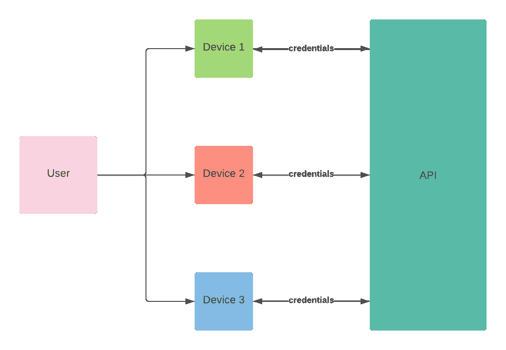
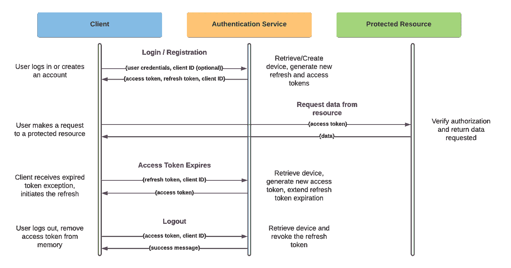
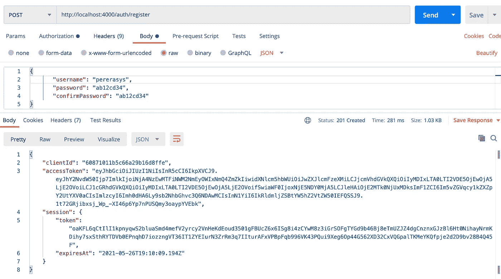
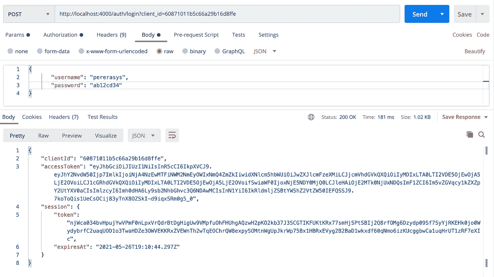
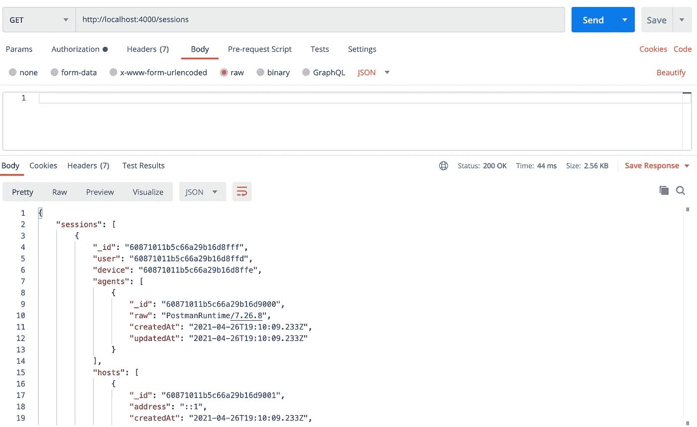
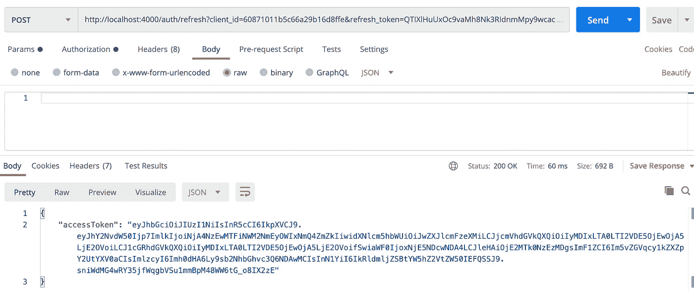
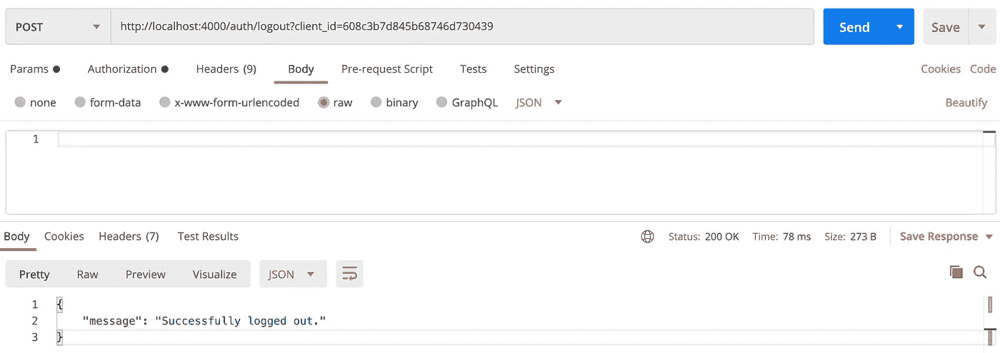

# 通过适当的设备管理提高用户安全性和身份验证策略(NodeJS 示例)

> 原文：<https://medium.com/geekculture/improving-user-security-and-authentication-strategies-with-proper-device-management-nodejs-4e6e5b53e108?source=collection_archive---------18----------------------->



# **简介**

任何现代身份认证策略的一个主要组成部分是对用户设备的管理。由于不同形式的无状态授权允许同时从浏览器和本机客户端进行访问，因此了解哪个设备正在访问资源对于应用程序功能和用户安全至关重要。

在本文中，我们将讨论一种可能的身份验证策略，然后演示如何用 NodeJS REST API 实现它。

# 认证策略

我们将讨论使用可刷新的 JWT 来维护跨多种设备的身份认证。本例中讨论了两种类型的令牌:短期访问令牌(JWT)和长期刷新令牌。访问令牌可用于证明对任何服务器资源的授权，刷新令牌可用于在到期时创建更多访问令牌。

这种策略确保了如果访问令牌被破坏，对用户安全的影响会由于其短暂的寿命而减轻。



Authorization Flow

当用户登录或创建帐户时，我们会记录所使用的设备，并创建一个存储有设备相关信息的刷新令牌。这些令牌具有很长的生命周期，需要安全地存储在客户端上。

虽然提供的代码示例将在响应正文中返回所有令牌和客户机 id，但我喜欢使用的策略是将刷新令牌存储在签名的 HTTPOnly cookie(浏览器客户机)或加密的密钥存储库中(本机客户机)。浏览器客户端通常被认为是“不可信的”，因此使用 HTTPOnly cookie 可以确保任何客户端 Javascript 都无法访问这个令牌。本机客户端更安全，允许代码访问令牌应该是安全的。

JWT 访问令牌的寿命非常短，在本例中只有 15 分钟，可以保存在内存中，并在应用程序刷新或重新访问时替换。

# 设备管理

我们之前讨论过不同设备的管理对于用户的安全是如何至关重要的。在上图中，您可能已经注意到客户端 id 在客户端和身份验证服务之间传递，以允许识别正在使用的设备。

虽然这种策略的好处是让服务器知道哪个设备正在访问资源，但它也允许我们通过跟踪设备信息(如浏览器类型、设备平台、操作系统等)来提高用户的安全性，这些信息来自一个名为 User-Agent 的 HTTP 头。通过收集这些信息，我们可以在使用新设备时提醒用户，并提供系统信息来帮助他们识别受损的凭据。

检测新设备何时被使用是一项简单的任务:在客户端，您可以在身份验证会话之间保存客户端 id，并在每次后续登录时重用它们。当然，当用户清除他们的 cookies(或本地存储)时，该客户端 ID 将会消失，但是在这种事件发生后，将系统视为新设备是可以接受的。

# 代码示例

我已经创建了一个简单的 REST API 来演示这种授权策略。在本文的其余部分，我将深入研究这个实现，但是如果您不愿意跟随，可以随意浏览这个库。

[](https://github.com/pererasys/nodejs-device-auth) [## pererasys/nodejs-device-auth

### 一个 NodeJS REST API，具有基本的设备管理功能和使用可刷新的持久认证策略…

github.com](https://github.com/pererasys/nodejs-device-auth) 

# 入门指南

我们将跳过项目设置，直接构建我们的认证服务，使事情变得更简单。

要开始，请运行以下命令。这将从 Github 存储库中克隆 starter-template 分支。

```
git clone -b 2-docker [https://github.com/pererasys/nodejs-device-auth.git](https://github.com/pererasys/nodejs-device-auth.git)
```

## 概观

您会注意到我们正在使用 Docker，所以大部分配置已经为您完成了。我们将使用 MongoDB 来存储用户和设备，使用 ExpressJS 来创建一个简单的 REST API。虽然这种策略可以用任何技术栈来实现，但是我选择了这些工具，因为它们简化了开发过程。

## 设置

要开始，我们需要安装一些依赖项。

NodeJS / NPM

[](https://www.npmjs.com/get-npm) [## npm

### 编辑描述

www.npmjs.com](https://www.npmjs.com/get-npm) 

纱线包装经理

 [## 2 -安装

### 在下面的迁移指南中，我们已经收集了从 Yarn 1 移植过来时有用的建议。看一看，然后…

yarnpkg.com](https://yarnpkg.com/getting-started/install) 

若要安装项目级依赖项，请运行以下命令。

```
yarn install
```

## 启动数据库

要启动数据库，您需要安装 Docker 和 docker-compose。

[](https://docs.docker.com/compose/install/) [## 安装 Docker 撰写

### 预计阅读时间:7 分钟您可以在 macOS、Windows 和 64 位 Linux 上运行 Compose。码头工人写作靠…

docs.docker.com](https://docs.docker.com/compose/install/) 

已经提供了一个组合文件，不需要任何配置，所以要启动数据库，可以运行下面的命令。

```
docker-compose up -d mongodb
```

## 启动服务器

如果你看一下 *package.json* 的内部，你会注意到我已经定义了一些脚本来简化开发过程。

若要在开发环境中启动服务器，请运行以下命令。

```
yarn start:dev
```

这将使用 Nodemon 启动服务器，node mon 是一个跟踪文件更改以热重新加载 Javascript 环境的工具，并使开发过程变得更加容易。

如果您导航到 [http://localhost:4000，](http://localhost:4000,)服务器应该响应“Hello world！”。

# 登录和注册

让我们从安装一些不包含在 starter 模板中的附加依赖项开始。

```
yarn add bcrypt body-parser express-jwt jsonwebtoken rand-token
```

因为这个项目使用 typescript，我们还需要安装一些类型定义。

```
yarn add -D @types/bcrypt @types/express-jwt @types/jsonwebtoken
```

首先，我们需要创建我们的数据库模型。在 *src* 目录下，创建一个名为 *models* 的子目录。我们将从在 *models/user.ts* 中定义一个简单的用户模型开始。

我们的用户模型非常简单，但是对于这个例子来说是可以的。接下来，我们将定义设备和会话模型。

请注意，设备模型是空的，这是因为我们实际上只需要跟踪 ID。我们希望在使用新设备时进行识别，因此即使在撤销身份验证会话后，客户端也将保留设备 ID。我们无法将会话和用户与特定设备直接关联，因为多个帐户可能会使用同一个设备。

*注意:将会话存储为数组属性也是不明智的，因为与设备相关联的会话数量是无限的，这最终会导致数据库和 API 的内存问题。*

您还会注意到，用户代理和 IP 地址存储在会话中，而不是设备中。这是因为我们希望在发现更改时识别活动会话。要将这些更改与设备本身相关联，只需查询与设备相关联的会话。

在开始定义我们的服务之前，我们需要更新我们的应用程序设置并创建一些定制的 Express 中间件。

在 *settings.ts* 中，复制粘贴以下内容。

接下来，在 *src* 目录中创建一个名为 *middleware.ts* 的文件。

现在，我们准备开始编写基本身份验证特性的逻辑。

我们可以从建立我们的*服务*目录开始。我们将需要几个文件来完成这个部分，所以继续配置您的工作空间以匹配下面的结构。

```
src--- models--- --- user.ts--- --- device.ts--- --- session.ts--- services--- --- utils.ts--- --- index.ts--- --- auth.ts--- app.ts--- server.ts--- middleware.ts--- settings.tsdocker-compose.ymlpackage.json...
```

在 *utils.ts* 中，我们将定义一些将在整个项目中使用的基本错误。

现在让我们在 *auth.ts* 中定义我们的认证服务。

在 *services/index.ts* 中，我们将简单地导出 *auth.ts* 和 *utils.ts* 的内容。

让我们分解身份验证服务，以了解它是如何实现上图所示的策略的。

当用户登录时，我们调用 ***login*** 方法，并提供用户的凭证以及一些关于客户端的信息。如果我们找到一个具有给定用户名的用户，我们会尝试 ***验证*** 用户，确保他们提供了正确的密码。在验证用户名和密码时，我们返回由***get credentials***生成的凭证。该响应包括客户端 ID、访问令牌和关于刷新令牌的信息。

注册非常类似，只是我们可以跳过身份验证，在创建新的用户文档后立即生成新的凭证。

我们现在准备继续构建我们的 REST API。

创建一个名为 *controllers.ts* 的文件，粘贴以下内容。

请注意，有一个名为“client”的新请求属性。这是由我们之前定义的定制中间件添加的，包括客户机 ID(如果提供的话)、用户的 IP 地址和原始的用户代理头。

在我们能够创建我们的路由之前，我们需要添加一些定制的中间件到 *middleware.ts* 。

这个中间件将在路由器级别用于设置权限。例如，为了访问登录和注册端点，我们希望用户未经身份验证(尚未登录)。

创建一个名为 *routes.ts* 的文件，我们可以为我们的控制器创建端点。

此时，您的工作区应该看起来有点像这样:

```
src--- models--- --- user.ts--- --- device.ts--- --- session.ts--- services--- --- utils.ts--- --- index.ts--- --- auth.ts--- app.ts--- server.ts--- middleware.ts--- controllers.ts--- routes.ts--- settings.tsdocker-compose.ymlpackage.json...
```

最后，我们将通过配置我们的定制中间件并添加 ***登录*** 和 ***注册*** 端点来完成 Express 应用程序的设置。

更新 *app.ts* 以匹配以下内容。

我们的 API 现在应该有三个端点。

```
GET /sessions
RESPONSE 200 - { sessions }POST /auth/register
PARAMS { client_id (optional) }
BODY { username, password, confirmPassword }
RESPONSE 201 - {
  clientId,
  accessToken,
  session: {
    token,
    expiresAt
  }
}POST /auth/login
PARAMS { client_id (optional) }
BODY { username, password }
RESPONSE 200 - {
  clientId,
  accessToken,
  session: {
    token,
    expiresAt
  }
}
```



Registration



Login from the same device (client_id query param)



All sessions

# 刷新访问令牌

构建身份验证服务的下一步是添加创建新访问令牌的功能。

导航到 *services* 目录，并通过添加以下类方法来更新认证服务。

这里，我们将客户机 ID 和刷新令牌视为会话文档上的复合索引。如果会话过期，我们撤销会话并抛出一个异常，否则，我们返回一个为会话用户签名的新 JWT。

现在，我们需要将刷新端点添加到 Express 应用程序中。为此，我们创建一个新的控制器，并在身份验证路由器中定义端点。

我们现在应该能够使用注册或登录时收到的会话令牌和客户机 ID 来刷新访问令牌。

```
POST /auth/refresh
PARAMS { client_id, refresh_token}
RESPONSE 200 - {
  accessToken
}
```



Refresh access token

# 注销

首先，让我们将逻辑添加到身份验证服务中。

注销的逻辑相当简单。用户提供他们的访问令牌和客户端 ID，我们从该特定设备查询活动的身份认证会话。因为我们不能假设只有一个活动会话，可能是撤销之前的会话时出错，所以我们必须撤销该设备上的所有活动会话。

接下来，我们需要定义 API 控制器和端点。

```
POST /auth/logout
PARAMS { client_id }
RESPONSE 200 - {
  message
}
```



Logout user

# 结论

至此，您有了一个简单的 REST API，它使用前面讨论的策略实现了基本的身份验证功能。虽然我们在这个例子中没有涉及 API 开发的某些方面(验证、安全性等)。)，您应该对实现该策略所需的基本身份验证原则有一个相当好的理解。

欢迎提出任何问题或想法，谢谢阅读！

[](https://github.com/pererasys/nodejs-device-auth) [## pererasys/nodejs-device-auth

### 一个 NodeJS REST API，具有基本的设备管理功能和使用可刷新的持久认证策略…

github.com](https://github.com/pererasys/nodejs-device-auth)