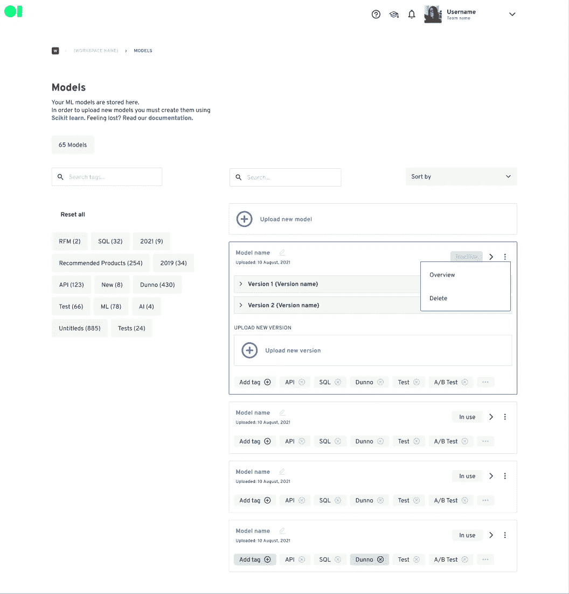
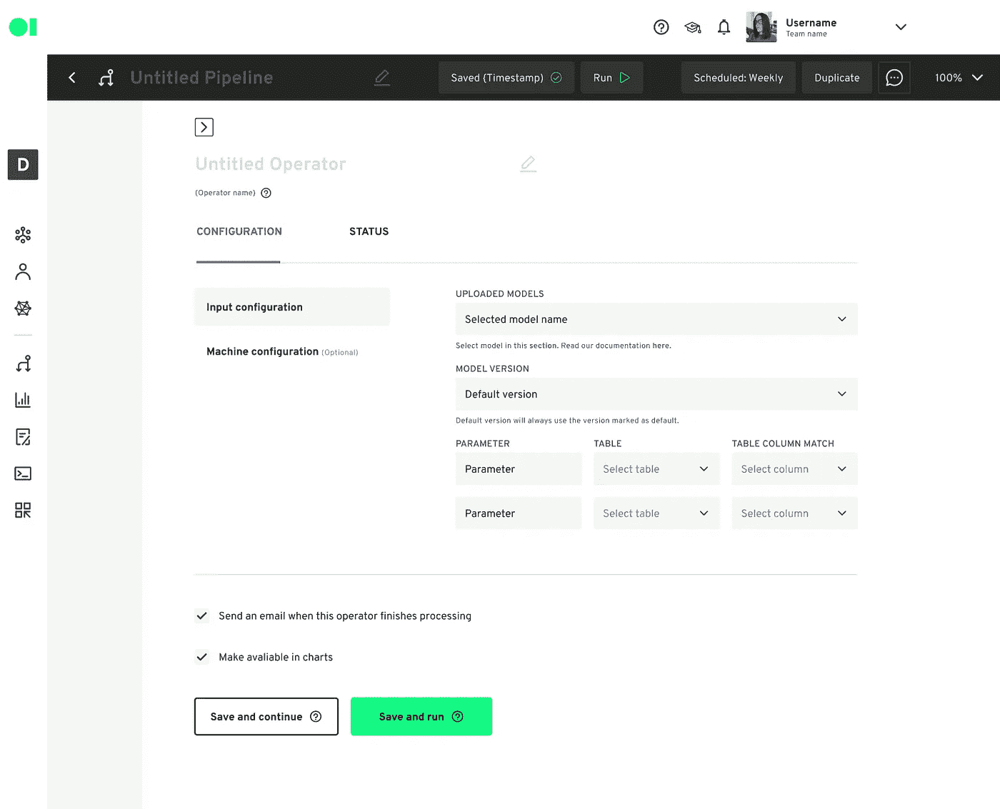
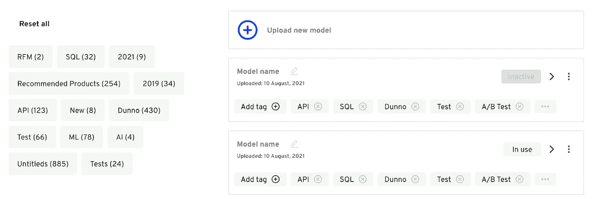
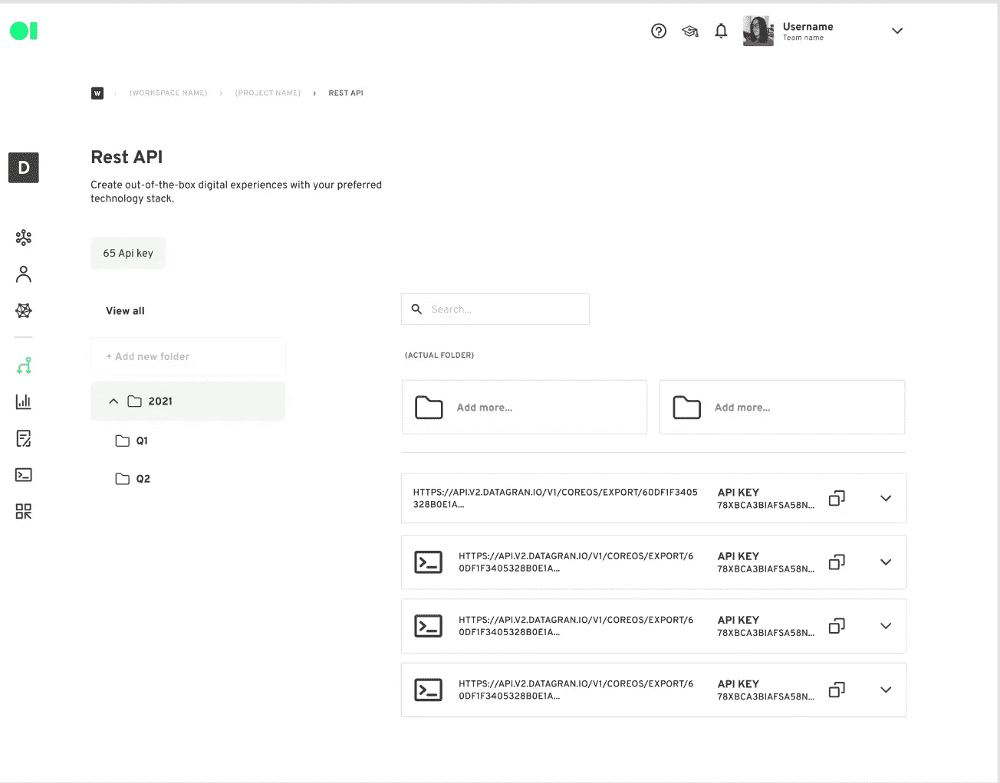

# 改进数据科学中的版本控制

> 原文：<https://medium.com/geekculture/improving-version-control-in-data-science-b0a3a7be9608?source=collection_archive---------31----------------------->

[Unsplash](https://unsplash.com/photos/aaTidmhupEw)

如果你是一名数据科学家，你很可能患有缺乏版本控制综合症。因此，您最终会得到许多 Jupiter 笔记本，它们只是同一主项目的不同版本。但是，这个问题也延伸到了 API。一旦您决定部署一个模型，您永远不知道您应该使用什么 API 以及它对应什么。

最终，版本控制成为了大型或小型组织的一大难题。

当然，首先想到的是 GitHub 或 GitLab，尽管这解决了大部分问题，但并没有解决所有问题。

首先，你不知道目前生产中使用的是什么型号。不知道这一点会造成数据科学和 XOPs 之间的脱节。了解更多关于 [XOPs](https://blog.datagran.io/posts/xops-and-how-to-quickly-demonstrate-business-value-in-your-organization) 的信息。理想情况下，您可以实时了解模型的版本以及模型将数据发送到哪里。

第二，尽管您已经整齐地组织了您的模型版本，但是在生产中从最新版本转移到旧版本可能是具有挑战性的。这种分离要求数据科学家删除提交或上传最新版本，然后手动将模型交付给 XOPs 团队。

第三，Github 不是与业务部门协作的好朋友。很少有团队知道如何使用 Github 和访问每个模型的描述。理解模型做什么，它需要什么参数，以及它的最终目标是至关重要的。

第四，在 Github 或 GitLab 上无法实现 API 组织。组织和寻找 API 开始成为公司头疼的事情。了解每个 API 的用途并猜测实际生产中的 API 是绝对必要的。

我们花了很多时间思考如何解决所有这些问题。以下是我们如何帮助您和您的组织在数据科学领域实现版本控制的一步一步的步骤:

1.  **模型上传和版本控制:**我们构建了一个特性，让您选择和上传模型。此外，您可以向其添加版本。此外，您可以随时决定更改默认版本，并向您的模型版本添加注释。此外，您可以查看模型是否在使用中。有了这种可见性，您就可以清楚地了解当前正在运行的模型。

‍

1.  **在生产中选择您的模型版本:**在我们的 Pipelines 工具中，当选择了模型操作符时，您可以选择您想要投入生产的版本。您可以根据自己的需要选择不同的版本。

‍

1.  标签:你可以用标签来组织你的模型。这样，随着模型数量的增加，您可以快速定位您的模型和版本。

‍

1.  **API:**当您使用我们的 API exporter 或 SQL API 创建 API 时，您可以创建标记来组织它们并快速定位它们。这样，您的 API 使用规模团队将能够按照目标、业务单元等等来管理 API。

‍

‍

随着数据分析的发展，我们的目标是确保随着新挑战的出现，数据团队和其他组织之间的差距越来越小。有了我们的工具集，团队可以完全控制他们的建模和数据工作流，同时在几分钟内向利益相关者交付切实的结果。