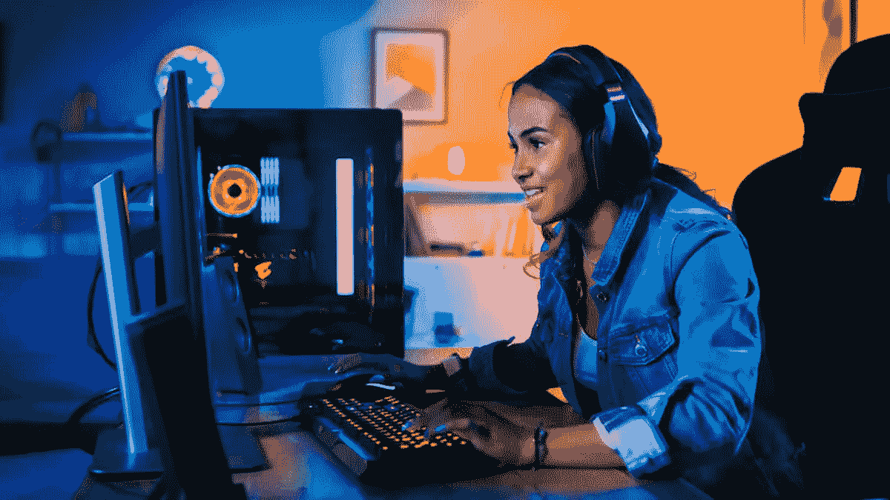
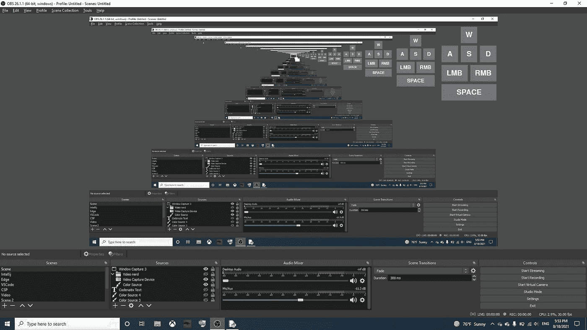

# 使用 Python 改进视频录制

> 原文：<https://medium.com/geekculture/improving-video-recordings-with-python-fb3f31cdc794?source=collection_archive---------31----------------------->

独特的 Python X OBS 协作

任何在生活中看过足够多视频游戏 YouTubers 的人可能都知道 WASD 的按键设置。人们会在他们的屏幕上显示他们正在按的键，特别是 WASD 键，还有 LMB、人民币、空格，也许还有 Shift。

虽然我主要是在《我的世界》的录音中看到这一点，但它在其他场景中也非常有用。在本文中，我的目标是涵盖 3 个主题:

1.  为什么你应该使用这个
2.  PyGame 中的代码
3.  在 OBS 中设置它
4.  更多应用

## 为什么应该使用这个:

使用 Python x OBS 有很大的威力。一旦你完成这个项目，你应该有能力做几乎任何与 OBS 显示相关的事情。你可以高亮显示屏幕上的东西，添加自定义水印(就像我在视频中做的那样)，通常让 OBS 对正在发生的事情更加敏感。我最喜欢的一个应用是设置 pygame 在后台运行，并在击键时播放声音效果。

可能性是无限的。如果你以任何你想的方式使用这篇文章中展示的简单技巧，你的录音会变得更好。

事不宜迟，让我们直接进入代码。

## 代码位

首先要做的是创建一个名为`wasdkey.pyw`的文件或类似的东西。确保扩展名为“pyw”这将允许您双击文件来运行它。

首先，我要展示代码，然后我会分解它。如果您不关心代码为什么工作(您应该关心，因为如果您了解如何操作它，它会变得更加强大),那么您可以直接跳到在 OBS 中设置它。

**分解:** 首先，我们需要我们的进口。我们将使用 PyGame 作为实际的 GUI，然后使用一些 win32api 来设置透明度和检测击键，即使窗口不在焦点上。

首先，pip 安装您需要的软件包:

`pip install pywin32`

然后，将它们导入文件:

接下来，我们设置 pygame，以及我们将要使用的颜色。暗褐色是背景色，所以任何暗褐色的东西都是透明的。

在这之后，我们用 win32gui 在一堆复杂的代码中设置背景透明。

接下来，我们再次使用 win32api 检查某个键是否被按下。“key”中的值通常是字母的顺序(大写字母)

所以，如果你按下`a`，那么你将调用`isKeyPressed(ord('A'))`

第 26 到 42 行简单地配置了文本和文本的位置，所以这是所有基本的 pygame。

第 45 到 74 行也发生了同样的事情。然而，设置鼠标按键非常困难。尝试使用`isKeyPressed(someNumber)`，其中 someNumber 是 1 到 32 之间的一个数字。检查当你按下鼠标左键和右键时会发生什么。每台电脑都不一样。对我来说，LMB 就是`0x01=1`，人民币就是 win32con 认为的 LMB。

代码的其余部分非常简单。

## 在 OBS 中设置它

首先，在文件资源管理器中双击打开文件。按下`⊞ Win` + `Tab ↹`，然后拖动标签到一个新窗口。确保此窗口中没有其他内容。

现在，在 OBS 中(不是在上面的同一个窗口中)，创建一个新场景，并向 sources 选项卡添加一个显示捕获。确保选择整个显示屏。然后，添加 WASDKey (python pygame)的窗口截图。然后，右键单击窗口捕获，并选择过滤器。为绿色屏幕添加滤镜，并将颜色自定义为棕褐色。现在背景在 OBS 中是透明的。

如果一切正确，OBS 应该看起来像:

## 更多应用:

PyGame x OBS 有很多应用，如果你停下来想一想，我肯定你会找到一些。

例如，假设在录音时，您想让屏幕在您按下`CTRL+SHIFT+1`时高亮显示您的鼠标。然后，只需检测所有按钮何时被同时按下，并在鼠标位置周围添加一个黄色圆圈。你可以使用[这个](https://stackoverflow.com/a/50454340)来确保屏幕全屏，并获得鼠标的 X 和 Y 位置。使用之前的透明技术，只需将 pygame 窗口覆盖到 OBS 上，就大功告成了！

***学到了新东西？留下一些掌声让我知道！***

***有什么有趣的想法可以和 PyGame + OBS 搭配使用？或者有什么问题吗？请在评论中告诉我！***