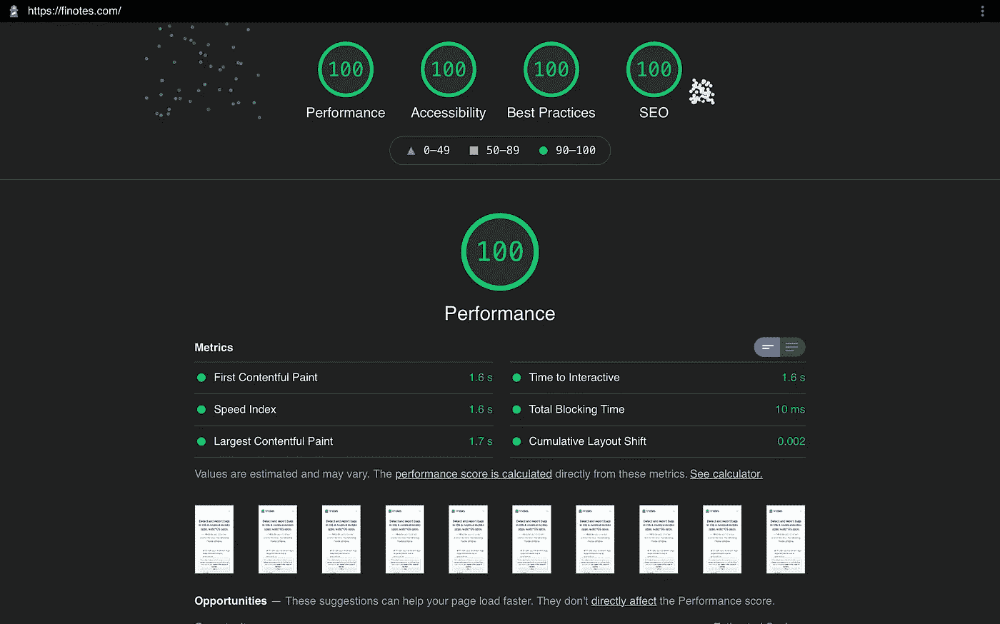
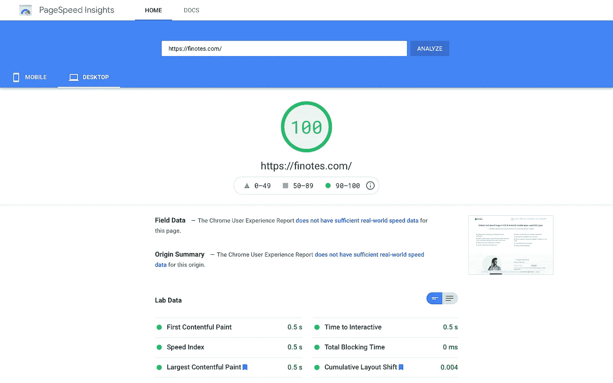
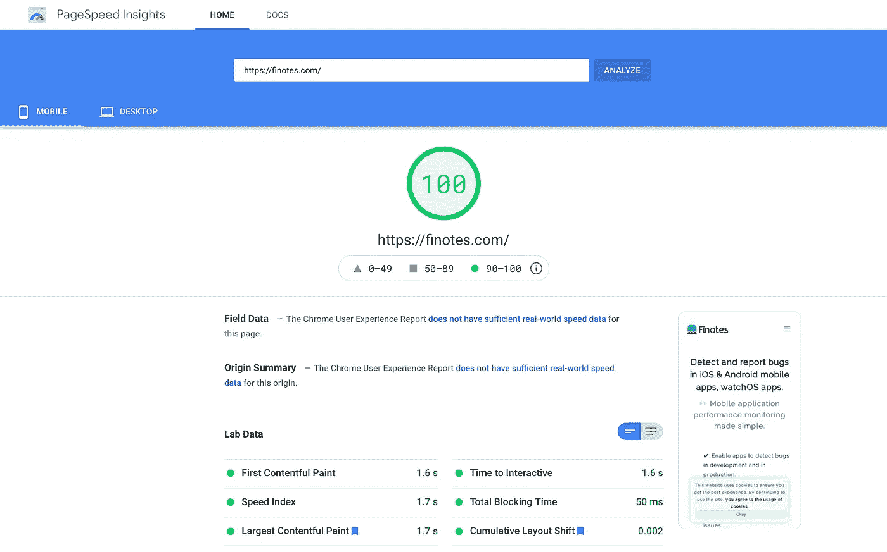
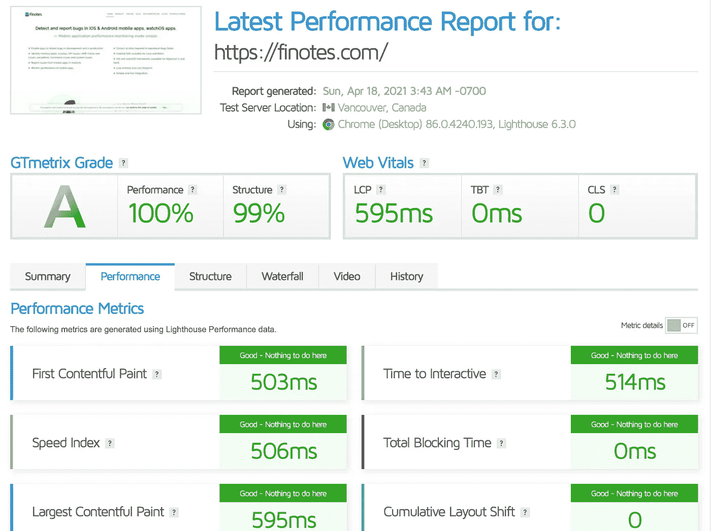

# 提高网站性能，以及如何在 Lighthouse 和 Pagespeed 报告中获得 100 分

> 原文：<https://medium.com/geekculture/improving-website-performance-and-how-to-get-a-score-of-100-in-lighthouse-pagespeed-reports-cb4b8e1e8934?source=collection_archive---------18----------------------->

这个周末我花了几个小时试图优化 finotes.com。目标是实现一个体面的表现和灯塔报告中的搜索引擎优化得分。

Finotes.com 是一个简单的产品网站，最初是用 Wordpress 建立的。虽然 wordpress 是一个优秀的网站建设框架，但我们认为我们的不需要 Wordpress 提供的大部分功能。此外，它需要更多的时间和精力来优化性能。当然我们不是 Wordpress 专家。

所以我们把 https://blog.finotes.com 的博客[移到了 Wix。finotes.com 网站是用 HTML、CSS、Javascript、Bootstrap 和 JQuery 重建的。没错，就是做网站的老办法。](https://blog.finotes.com)

这个周末我决定专注于得到一个好的灯塔分数。以下是我做过的重要事情。

# 1.组合所有 CSS 文件

在我们的例子中，我们有定制的 CSS 和 Bootstrap。将两者合并成一个 CSS 文件，第一部分是引导代码，接下来是自定义 CSS。这样，您就可以不断地将自定义 CSS 添加到文件的末尾。

HTTP 请求数减少一个。

# 2.组合所有 Javascript 文件

我们使用 JQuery、一些与 Bootstrap 相关的脚本和自定义脚本。将这三部分合并成一个文件，第一部分是 JQuery，第二部分是 Bootstrap，最后是自定义脚本。

HTTP 请求的数量又减少了两个。

# 3.为图标使用 SVG 精灵

我们的网站使用 54 个 SVG 图标来表示各种项目。我们将它们组合在一起创建了一个 SVG 精灵。这有助于减少获取图标所需的大量 http 请求。网上有许多精灵创造者。我们使用了 [https://svgsprit.es](https://svgsprit.es) 。

# 4.图像的延迟加载

当滚动条到达图像附近时，所有的图像都被缓慢加载。这有助于减少初始加载时间和网络传输。

# 5.最小化脚本和 CSS 文件，GZIP

我们缩小了 Javascript 文件和 CSS 文件。这节省了大量带宽。所有的内容都被压缩了。

# 6.延迟加载第三方脚本，直到访问者接受 cookie 策略

我们使用谷歌分析(通过谷歌标签管理器)，谷歌 reCaptcha V3 和 [Chatwoot](https://chatwoot.com) 。所有的都是一加载就用 cookies。因此，只有在访问者接受 cookie 策略后才加载它们是有意义的。我们确保所有这样的脚本都以这样的方式加载。这有助于减少初始加载时间和初始脚本执行时间。

# 7.没有复杂的框架

除了 Bootstrap 和 JQuery，[finotes.com](https://finotes.com)没有基于任何网站框架。这意味着该网站是轻量级的。我知道这可能不适用于大多数网站，因为使用普通的 HTML、CSS 和 javascript 进行构建有其自身的挑战，尤其是如果它是一个复杂的网站。

# 8.坚持 HTML 5 规范并遵循最佳实践

这一点非常重要。据我们所知，我们坚持 HTML5 规范。这包括图像的适当 alt 标签，确保可访问性并遵循最佳实践。如果你在开始优化工作之前看一下 lighthouse 的报告，你会有一个想法。

# 性能提升，在《灯塔报告》中获得了完美的 *100* 。

结果出乎我们的意料。性能提高了，网站现在只需几分之一秒就可以加载。以下是来自各种网站性能分析工具的报告。

1.  **灯塔报告 100 分**

Lighthouse report of Finotes.com. Scored 100 for all parameters — Performance, Accessibility, Best Practices and SEO

**2。桌面在页面速度上得了 100 分**

Pagespeed score for desktop version of finotes.com

**3。在 Pagespeed 中获得 100 分**

Pagespeed score for mobile version of finotes.com

**4。GTMetrix 中的 A 级**

GTMetrix score for finotes.com

# 结论

我不是 SEO 或网站表现方面的专家。但如果说我从这次活动中学到了什么，那就是我们不需要成为一体。专注于标准和规范将有助于提高网站的性能和搜索引擎优化得分。

去吧。很好玩。