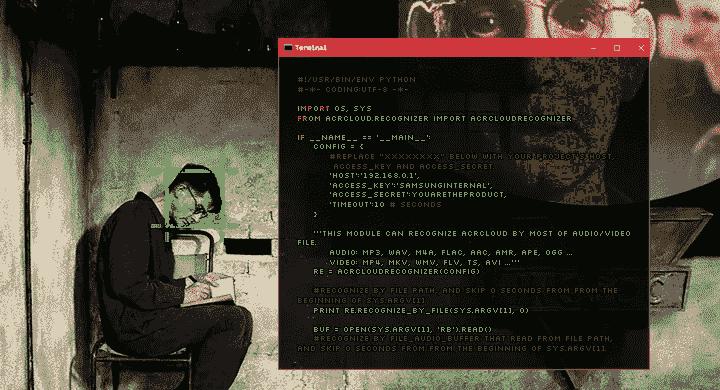

# 在 21 世纪，电视看着你！(以及如何避免)

> 原文：<https://medium.com/geekculture/in-21st-century-tv-watches-you-and-how-to-avoid-it-c68d1712a10a?source=collection_archive---------56----------------------->

## 这就像有一个史塔西特工在你的客厅！

一台搭载最新技术的 70 英寸 4k 智能电视，售价不到 500 美元，有没有想过它为什么这么便宜？大多数公司不能从电视销售中收回成本；他们通过[出售他们收集的关于你和你的行为的信息](https://www.theverge.com/2019/1/7/18172397/airplay-2-homekit-vizio-tv-bill-baxter-interview-vergecast-ces-2019)来掩盖真相。

智能电视收集了大量的用户个人数据，许多在智能电视上运行的第三方应用程序也是如此。几乎不可能知道这些数据最终去了哪里，因为它们经常被[卖给第三方](https://www.bitidentify.com/blog/in-21st-century-tv-watches-you/#)，甚至转卖给第三方。

由于智能电视一直连接到互联网，它们很容易成为黑客的攻击目标。当黑客入侵智能电视时，他可以使用内置麦克风记录附近发生的所有对话，甚至可以使用内置摄像头进行记录。美国联邦调查局甚至向消费者发出警告，告诉他们禁用内置摄像头和麦克风。

# 禁用摄像头和麦克风

一些较旧的智能电视型号仍有内置摄像头，但出于隐私考虑，新型号已将其移除。卧室里电视上的摄像头很容易被黑客攻击，一切都可以用声音记录下来。

如果无法禁用相机槽设置，建议在镜头上贴一小片胶带。至于麦克风，建议也将其禁用，这通常可以在设置中完成，查找并禁用所有与语音控制/音频指导相关的内容。

# 什么是 ACR？

[自动内容识别(ACR)](https://en.wikipedia.org/wiki/Automatic_content_recognition) 是大多数智能电视都尝试识别您正在播放的内容的技术。它通过分析屏幕上显示的每个像素来工作，可以识别你正在播放的每个广告、电视节目或电影，而不管其来源。

智能电视拥有 ACR 的官方原因是，它使智能电视能够根据用户以前观看的内容推荐用户可能喜欢的电视节目。ACR 存在的真正原因是因为用户[数据等于金钱](https://www.mordorintelligence.com/industry-reports/automatic-content-recognition-market)；所收集的数据要么被制造商用于定向广告，要么被出售给第三方。在现实中，你不知道你的数据将如何被使用，或者被谁使用。

# 我如何禁用它？

大多数型号的智能电视都可以关闭 ACR，但每个制造商甚至每个型号的设置看起来都不一样。以下是针对大型制造商的指南:

# 水平规ˌ水准仪(Level Gauge)

新型号:

1.  在主菜单屏幕的右上方，点击**设置**图标。
2.  点击**所有设置**，然后点击**通用**选项。
3.  向下滚动，找到选项 **Live Plus** 并将其禁用。

旧型号:

1.  在**下找到**用户协议**选项关于这台电视**选项。
2.  禁用:**使用条款**、**隐私政策**、**查看信息**和**个性化广告**。

# 索尼

2015–2017 年非安卓电视:

1.  在遥控器上，按下 **Home** 按钮。
2.  选择**设置**，然后选择**首选项。**
3.  选择**设置**，然后选择**网络。**
4.  选择**桑巴互动电视**，然后选择**设置。**
5.  禁用**桑巴电视。**

Android 电视设备:

1.  在遥控器上，按下 **Home** 按钮。
2.  转到**设置**，然后转到**初始设置。**
3.  同意**索尼 Bravia 政策**然后找到**桑巴电视**关掉。
4.  转到**设置**，然后转到**关于。**
5.  找到广告，然后关闭**广告个性化。**

(可能也需要)

1.  找到广告，然后关闭**广告个性化。**
2.  按下**清除缓存**然后**强制停止**然后禁用。

禁用内置 Chromecast 的数据收集:

1.  在智能手机上，打开 **Google Home 应用。**
2.  转到**菜单**，然后从**设备中选择您的电视。**
3.  点击三点菜单，然后转到**设置。**
4.  关闭**发送 Chromecast 设备使用数据和崩溃报告。**

2014 年非安卓电视:

1.  在遥控器上，按下 **Home 按钮。**
2.  选择**设置**，然后选择**网络。**
3.  选择**桑巴互动电视。**
4.  禁用**桑巴电视。**

# 三星电子

搭载 Tizen 的新机型:

1.  转到**设置**然后**支持**然后条款&策略。
2.  关闭**查看信息服务**、**基于兴趣的广告**和**语音识别服务。**
3.  在支持下，关闭**在线远程管理。**

带有智能集线器的旧型号:

1.  转到 Smart Hub 然后**设置**然后**支持**然后**条款&策略。**
2.  关闭 **SyncPlus** 和**营销**和**语音识别服务。**

# 罗库

许多品牌使用 Roku 电视平台，这些品牌包括: **Element、海信、日立、Insignia、JVC、飞利浦、RCA、三洋、夏普、TCL 和西屋。**

Roku 电视台:

1.  转到设置，然后智能电视体验。
2.  关闭电视输入的使用信息。
3.  转到广告并选中限制广告跟踪复选框。

Roku 流媒体播放器:

与电视相同的方法应该可行，但您不能完全禁用数据收集。

# 维齐奥

带 SmartCast 的新型号:

1.  转到**系统**，然后**重置&管理。**
2.  关闭**查看数据。**

禁用内置 Chromecast 的数据收集:

1.  在你的智能手机上打开 **Google Home 应用。**
2.  进入**菜单**，然后从**设备中选择您的电视。**
3.  点击三点菜单，然后转到**设置。**
4.  关闭**发送 Chromecast 设备使用数据和崩溃报告。**

旧型号:

1.  转到**系统**，然后**重置&管理。**
2.  关闭**智能互动**或**查看数据**

# 亚马逊 Fire 电视版

(某些东芝和 Insignia 电视内置了 Fire TV)

1.  转到**设置**，然后转到**应用。**
2.  关闭**收集 App** 和**无线使用数据。**
3.  返回**设置**然后**首选项。**
4.  向下滚动到**广告 ID** 并禁用**基于互联网的广告。**

# 小米

1.  转到**设置。**
2.  禁用**用户协议信息**和**帮助我们改进我们的设备。**

# 瓦努阿图

1.  进入**设置**，然后进入**系统偏好设置。**
2.  选择**桑巴互动电视**，然后将其禁用。

# 记住

更新电视上的软件后，您可能需要重新输入这些设置。

# 我找不到电视的设置？

查看您的电视手册，并在谷歌搜索中找到型号；应该是这样的:“索尼 KD-65XG7005 禁用 ACR。”它应该给你一个很好的起点来找到相关的设置。禁用所有间谍功能的最简单方法是不要将电视连接到互联网。找到 WiFi 设置并禁用 WiFi(如果可能),或者断开与 WiFi 网络的连接并禁用自动连接。这当然会删除电视上的所有流媒体和应用功能。

原文可以在 Bitidentify 的博客上找到:[https://www . bit identify . com/Blog/in-21 世纪-tv-watches-you/](https://www.bitidentify.com/blog/in-21st-century-tv-watches-you/)