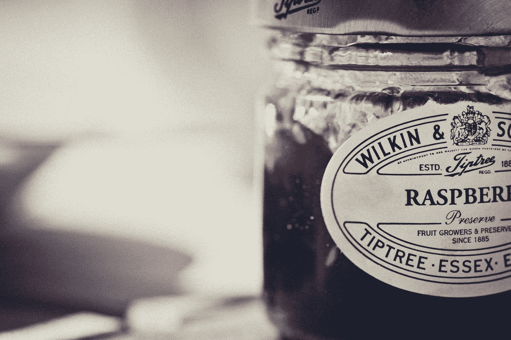
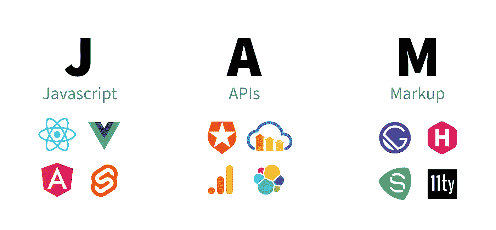

# 在 JAMStack 的困境中

> 原文：<https://medium.com/geekculture/in-a-jam-about-jamstack-c4fcfb33175c?source=collection_archive---------21----------------------->

Photo credit to Torsten Dettlaff at Pexels

尽管我很感激有这么多的软件开发资源供我使用，但我不得不说，你学得越深，你就越会意识到你知道的是多么少。

例证:我参加了一个虚拟活动，或者可能是一个视频教程。有人顺便提到了“JAMStack”。当我的兴趣被激起时，我不禁象征性地对着天空挥了挥拳头。没有更多的缩写！

什么是 JAMStack，学习什么是“JAMStack”会帮助我成长为一名开发人员吗？

答案是响亮的**是**。

关于这一点，让我们深入了解什么是 JAMStack，为什么这个缩写会出现，以及 JAMStack 站点的一些例子。

## 什么是 JAMStack？

JAMStack 代表 JavaScript、API 和标记。这是一个软件架构的术语。

JAMStack 被用来描述静态网站的转变。在互联网的早期，大多数网站都是使用硬编码的 HTML 和 CSS 构建的。科尔比·法约克是 [Snipcart](https://snipcart.com/blog/jamstack) 的撰稿人，他说“随着网络的发展，网络技术变得成熟，看到复杂而强大的服务器端解决方案出现”，这“导致了像 [WordPress](https://wordpress.org/) 这样的项目”。然而，“开发人员希望以一种更高性能的方式交付静态内容，与典型的多服务器解决方案相比，移动部分更少，需要的维护更少。”这导致了贾姆斯塔克。

**对 JAMStack 有什么好处？**

根据 Colby Fayock 的说法，JAMStack 有很多好处，这次是针对 freeCodeCamp:

> 速度
> 
> 费用
> 
> 可量测性
> 
> 维护
> 
> 安全性

从观察和例子来看，使用这种架构创建一个网站是相当容易的。React、Vue 和 Angular 是非常流行的前端库。API 也非常受欢迎，并且根据后端框架和 API 本身，可以很容易地使用。正如 [Fayock](https://www.freecodecamp.org/news/what-is-the-jamstack-and-how-do-i-host-my-website-on-it/) 所言，标记“是关键部分”并且“HTML 需要静态呈现，这基本上意味着不能从服务器动态呈现”。幸运的是，像 Next.js 和 Gatsby 这样的框架为我们处理了标记。

澄清一下，你不需要 JavaScript 和 API。Fayock 说“只要你提供的 HTML 文件不需要在请求时在服务器上编译，你就有了一个 JAMStack 网站。”

Jam is good, but keep in mind that JAMStack may not always be the optimal solution for you and your team.

## 有什么不好的地方吗？

JAMStack 的缺点是它将前端与应用程序的其余部分分开。例如，如果你用 Wordpress 建立了你的网站，Wordpress 会为你处理整个应用程序。这使得它成为网站创建和托管的热门选择。使用 JAMStack 只关注前端，所以您需要将后端(如果有)部署到另一个站点:Heroku、Netlify、Firebase 等。

我特别喜欢来自[grid Haus](https://www.gridhaus.com/blog/jamstack-modern-web-architecture-in-digestible-terms)的 Lerk jam stack 示例:

> 想象一下——传统的 CMS 就像一辆单人餐车。主人自己处理厨房的所有工作，如催货、准备、烹饪、上菜等。
> 
> 另一方面，JAMStack 架构有不同的人员负责每项任务。一名厨师负责配料和准备，另一名厨师负责烹饪。

## 例子

JAMStack web 应用程序的一些示例如下:

[屠夫的箱子](https://www.butcherbox.com/)

[邮递员](https://www.postman.com/)

[freeCodeCamp](https://www.freecodecamp.org/)

[不可能的食物](https://impossiblefoods.com/)

更多示例，请查看 [JAMStack Showcase](https://jamstack.org/examples/) 。

我希望你觉得这篇文章很有见地。对于那些经验丰富的人来说，我希望这篇文章是一个很好的复习。对于该领域的新手:现在你已经知道 JAMStack 是什么了，下次你想给你的开发伙伴留下深刻印象时，你可以把这个缩写词添加到你的词汇表中。

请在下面找到额外阅读和研究的链接，感谢您的阅读。

## 资源

[https://dev.to/strapi/what-is-the-JAMStack-2jjb](https://dev.to/strapi/what-is-the-jamstack-2jjb)

 [## JAMstack WTF

### 以下提示将帮助您充分利用堆栈中的精华。内容交付网络，因为所有的标记和…

jamstack.wtf](https://jamstack.wtf/)  [## agarrharr/awesome-静态-网站-服务

### 静态网站服务的精选列表。灵感来自令人敬畏的名单。SoundCloud -音频托管与…

github.com](https://github.com/agarrharr/awesome-static-website-services)  [## 2021 年的 Jamstack:为什么(以及如何)开始

### 大约 6 年前，我们发表了第一篇关于 Jamstack 的文章。当时，它还处于起步阶段。既然这样…

snipcart.com](https://snipcart.com/blog/jamstack)  [## 什么是 JAMstack？

### “互联网的未来”在于由客户端 JavaScript、API 和标记支持的高速静态端。

alexsanchezdesigns.medium.com](https://alexsanchezdesigns.medium.com/what-the-hell-is-jamstack-5ef002963f26)  [## Jamstack 展示和示例| Jamstack

### 查看各种 Jamstack-drive web 属性和示例的展示。获得构建下一个的灵感…

jamstack.org](https://jamstack.org/examples/)  [## JAMStack:通俗易懂的现代 Web 架构

### 虽然这看起来集中在技术堆栈上，但是分离责任和…

www.gridhaus.com](https://www.gridhaus.com/blog/jamstack-modern-web-architecture-in-digestible-terms)