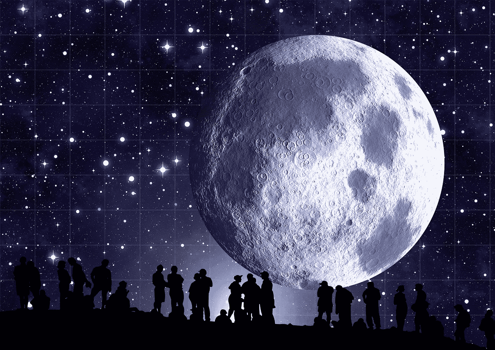

# 在数据科学中，我们用数据解决人们的问题。我们仍然需要理解人们

> 原文：<https://medium.com/geekculture/in-data-science-we-are-solving-people-problems-with-data-we-still-need-to-understand-people-f6f7fb161ab2?source=collection_archive---------13----------------------->

## 为什么数据科学需要人文科学

Image by [Gerd Altmann](https://pixabay.com/users/geralt-9301/?utm_source=link-attribution&utm_medium=referral&utm_campaign=image&utm_content=62282) from [Pixabay](https://pixabay.com/?utm_source=link-attribution&utm_medium=referral&utm_campaign=image&utm_content=62282)

月亮位于地平线上，强加给自己。我过去常常盯着看，想知道为什么这个天体从坠落的地球的遥远的线后爬出来时看起来那么大。我不禁注意到，当它爬上天空的时候…