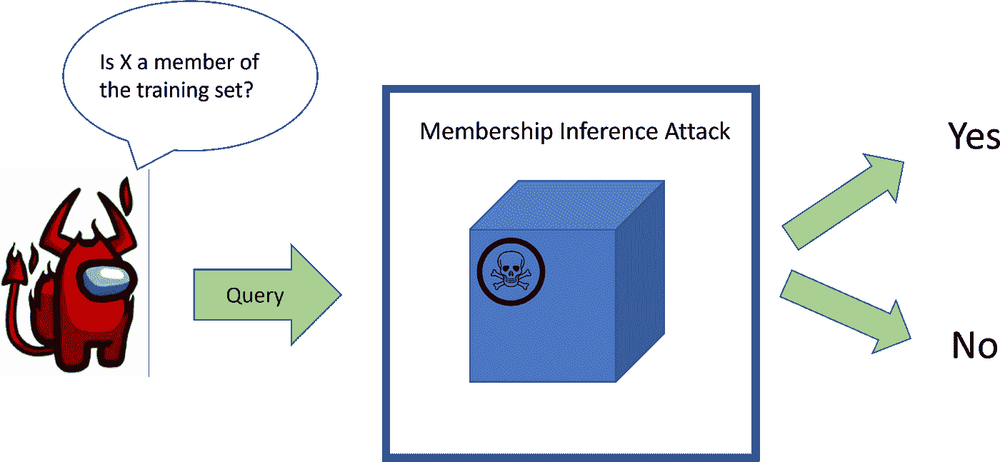
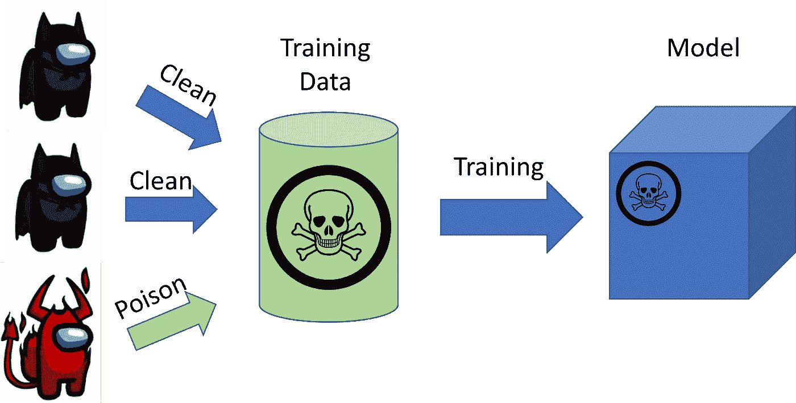

# 在毒药中，有真理

> 原文：<https://medium.com/geekculture/in-poison-there-is-truth-63029bbc4e41?source=collection_archive---------14----------------------->

## 机器学习中的数据中毒与隐私

Photo by [Zbynek Burival](https://unsplash.com/@zburival?utm_source=medium&utm_medium=referral) on [Unsplash](https://unsplash.com?utm_source=medium&utm_medium=referral)

“数据是新的石油”是数据科学家兼企业高管 Clive Humby 在 2006 年提出的。[1]近二十年后，现代机器学习(ML)模型依赖于海量数据，尤其是这些模型中涉及深度学习的一个子类。这些模型对数据的渴求似乎是合理的。毕竟，一般来说，更多的数据会提供更多的信息，理论规定这些信息会使模型更好地完成指定的任务(正式名称为目标函数)。

有些人甚至进一步进行了这种比较。另一位名叫麦可尔·柏默的企业高管评论道，“如果数据未经提炼(就像石油一样)，就无法真正得到利用”。[1]这个观察，同样，有道理。ML 模型只需要与其任务相关的信息。其他的都是无关的噪音。举个简单的例子，考虑一个试图区分狗和鹿的算法。如果有包含猫图像的训练数据，则必须通过移除那些猫图像来改进训练数据。

但是就像石油一样，自工业革命开始以来，一种易燃和有毒的物质可能并且已经造成了环境破坏(例如石油泄漏)，**数据只有在用于其预期目的时才是有用的**。但是这不是已经很明显了吗？难道数据不是用来提高 ML 模型的性能的吗？数据怎么可能是其他的，即“易燃和有毒”的？

Photo by Mary Rose Xenikakis. Photo is public domain and taken from [4]

我的学士论文研究的正是这个问题。我考虑过如何让数据对 ML 模型有害。具体来说，我设计了两种方法来使数据中包含的信息对深度学习模型的隐私有害。但是如何将有害的数据引入到模型中呢？我考虑了多方贡献数据来训练单个模型的情况。以此类推，假设每家公司都是炼油厂的工人，石油代表他们的数据。然后，只需要一个恶意的工人破坏炼油厂，危及一小部分，甚至整个供应。

让我们回溯到开始来建立一些背景。机器学习模型对数据进行训练，是为了学习和提高自己。任何与此相反的训练数据，即以某种相关方式损害模型的数据，都被称为有害数据。故意插入有毒数据被称为**数据中毒**。一种常见的训练形式是监督学习，其中每个数据点都有一个附带的标签。这是我们将在本文中考虑的培训形式。当训练完成后，生成的模型被部署到现实世界中执行其任务，这涉及到在给定从未见过的数据的情况下产生预测(&无标签)。

此外，破坏/损害模型的隐私本质上意味着通过与模型交互来获取关于模型被训练的训练数据的信息。该信息可以是关于特定训练数据的任何属性。出于我们的目的，由于这是标准的操作定义，我们关注于通过与模型交互来获取查询数据的成员信息。具体来说，给定一个经过训练的模型，我们与它进行交互，以确定我们感兴趣的数据点是否是用于训练该模型的训练数据的一部分。这被称为成员推理，这样做的方法被称为**成员推理攻击(MIAs)** 。

Overview of a Membership Inference given a data point X. The Membership Inference Attack (MIA) is the blue rectangle and interacts with the trained model. Setup is the same for both poisoned and unpoisoned models. Image taken from my thesis (unpublished). Red character taken from [3].

那么模型训练和成员推理攻击有什么关系呢？我介绍的方法是数据中毒方法，插入特定的数据点来改进 MIAs。当我说改进 mia 时，我的意思是这些中毒方法使模型更容易受到 mia 的攻击。正如上面所暗示的，我研究了协作训练方案，多方共享数据来训练单个模型。我假设这些团体中至少有一方，称为对手，想要破坏模型的隐私以获得关于另一方数据的信息。

Overview of a collaborative training scheme. Multiple participants contribute their data, with the adversary contributing poisoned data. The resulting model is poisoned. Image is also from my thesis, and characters also taken from [3].

第一种中毒方法称为**标签翻转攻击**，旨在改善特定数据点的 MIA。顾名思义，对手用相应的错误标签将感兴趣的数据点引入训练集。就是这样。就这么简单。事实上，*很简单*。实验表明，它将 MIA 提高了几个数量级。第二种中毒方法被称为**变节攻击**，这是标签翻转攻击的扩展，旨在尽可能多地提高 MIA。在我的例子中，我用它来改进特定目标类数据的 MIA。虽然它不如标签翻转攻击有效，但对手不需要感兴趣的确切数据点。他们只需要将他们的数据误标到与目标类相同的标签上。

那么贴错标签如何改善 MIAs 呢？我们可以将成员推理重新定义为一个记忆游戏。当在模型上执行 MIA 时，它实质上是询问它是否“记得”数据点是否来自它的训练集。贴错标签会让一个模型更多地记住那个数据点(“我以前从没见过长得像飞机的猫。”)，这类似于人类如何更好地记住一个新奇的经历，而不是一个具体但重复的经历。当一个人错误地标注了一个数据，而实际数据是训练集的一部分时，在 MIA 下的模型可以指示“我已经在数据集中用不同的标注看到这个数据两次了，所以实际数据确实是训练集的一部分！”。当实际数据不在集合中时，会出现相反的指示。请注意，这是对为什么贴错标签会改善 mia 的过度简化。请看[2]的正式解释。

# 重新思考我们在分享敏感数据时如何保护隐私

这些结果起初对我来说很有趣，因为它们很简单，但当我想到它们的含义时，它们变得令人担忧。通常没有太多数据的多个组织依靠协作训练方案来训练模型。一个这样的例子是联合学习，其目标是通过确保数据不离开相应的所有者/参与者的机器来保护参与者的训练数据对其他参与者的隐私。然而，这些方案假设在训练集中没有中毒数据。虽然我没有直接在联邦学习设置上进行实验，但中毒方法似乎仍然会改进 MIAs，因为它们只依赖于它们包含在训练集中的假设；数据位于何处并不重要。总之，就像拥有一个炼油厂，却没有任何手段来检查管道是否正常工作或石油是否在它应该在的地方，看起来我们当前的协作训练设置在这些新的中毒攻击面前是**脆弱** **和脆弱**。

举例来说，在合作训练计划中，当对手想要知道另一个参与者的数据时，你只需要看看医疗保健。随着医疗保健行业越来越多地采用 ML 来实现个性化治疗、加速诊断和自动化常规程序，将 ML 应用于治疗罕见疾病面临着公开的挑战。数据不足的私人医疗保健公司/医院被迫合作创建一个解决罕见疾病的共享模型。[英特尔已经为美国的 Penn Medicine group 医院完成了这项工作，以分析脑瘤。](https://www.pennmedicine.org/news/news-releases/2020/july/new-machine-learning-method-allows-hospitals-to-share-patient-data-privately)这一方案并非只针对罕见疾病。[一群西班牙医院实施了一项新冠肺炎研究计划](https://aibusiness.com/document.asp?doc_id=769739)。危险在于，竞争可能会鼓励公司利用中毒攻击来侵犯其他公司的数据隐私。一家公司发现某个病人的数据被另一家公司用于训练模型，可以辩称后一家公司*未能*保护该病人的隐私。随之而来的可能是诉讼或者更糟的敲诈。

# 从大数据到好(&大)数据

由于中毒方法依赖于简单的错误标记行为，无论是由人还是由机器标记数据集时几乎总是会发生这种情况，因此寻找错误标记的数据是消除这种中毒的简单方法。然而，对于协作训练方案，尤其是那些声称保护隐私的方案，数据只有所有者知道，因此不能被验证是干净的。当训练数据本身是私有的时，未来的研究需要开发监管方法。这个问题看起来真的很难，我敢打赌，重新设计/彻底检查现有的合作训练方案，去除所有训练数据都是可信的这一假设，会更容易。对于一般的 ML 从业者来说，这是另一个提醒，我们必须意识到数据集的质量。投毒不仅仅是为了损害模型的预测精度。事实上，投毒并不是必须的(如果有的话，我们的方法几乎不改变少量目标的总精度)。我们证明它甚至可以破坏模型和受影响数据的隐私。**隐私重要时下毒也重要。**

> 如果你对中毒方法的技术细节感兴趣:不幸的是，我还没有发表我的论文，但我与谷歌大脑和俄勒冈州立大学的一个团队合作，共同撰写了一篇同行评审的论文，作为我论文的直接产物。它将出现在 2022 年计算机器协会计算机和通信安全会议(ACM CCS)上。你可以在这里找到我们的预印本【2】[。它包括标签翻转攻击和类似于叛徒攻击的攻击。它还包括对(无监督的)语言模型应用攻击。](https://arxiv.org/abs/2204.00032)

[1]新 J. [为什么人们仍然认为数据是新的石油？](https://datainnovation.org/2018/01/why-do-people-still-think-data-is-the-new-oil/) (2018)，数据创新中心

[2]特拉梅尔等。艾尔。[真相血清:毒害机器学习模型揭露其秘密](https://arxiv.org/abs/2204.00032) (2022)，Arxiv

[3]coolguyyysk。 [18 个美国自定义字符，你可以在没有版权的情况下使用](https://www.reddit.com/r/AmongUs/comments/k70367/18_custom_among_us_characters_that_you_can_use/) (2020)，Reddit

[4] Xenikakis， [M .科威特消防队员](https://commons.wikimedia.org/wiki/Category:Oil_well_fires#/media/File:US_Navy_030328-M-0000X-005_Kuwaiti_firefighters_fight_to_secure_a_burning_oil_well_in_the_Rumaila_oilfields.jpg) (2003 年)，维基共享资源。