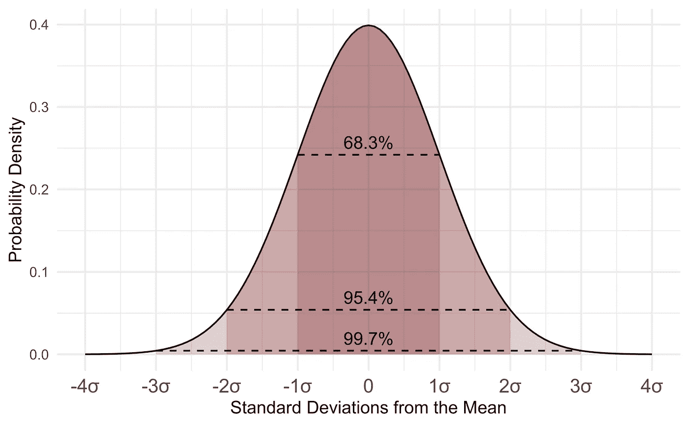
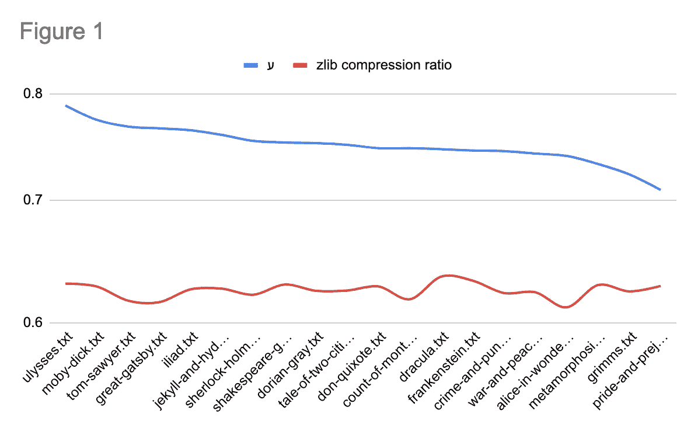

# 我可能发明了一个全新的数学和计算机科学分支

> 原文：<https://medium.com/geekculture/in-which-i-probably-invented-a-whole-new-branch-of-mathematics-and-computer-science-fbfa6e224631?source=collection_archive---------8----------------------->



From [Wikipedia](https://en.wikipedia.org/wiki/Statistics#/media/File:Standard_Normal_Distribution.png).

正如 Sammy L 在 1993 年曾经说过的那样:*抓紧你们的屁股*。我希望你点击这个链接是为了寻找内容，因为我将要以迄今为止做梦也想不到的规模发表演讲。

有一天我在读关于随机性的书(就像一个人做的那样)，当我偶然发现这个说法，我引用一下，“*一个真正随机的字符串不能用一个更短的字符串*来表示。”现在，忠实的读者们，你们知道我只是一个*假的*计算机科学家，所以我的颈须不包含这种特殊的半咀嚼的食物。坦率地说:我不知道这种说法是否属实。我强烈怀疑它不是——至少，不是在如此慷慨的条件下。当我们这样做的时候，还有一个额外的问题，谚语使用了术语“真正随机”,而没有解释随机和真正随机之间的区别。

不管这种说法是真是假，我觉得有必要根据这些可能不完全正确的假设进行一个快速实验。这个想法很简单:如果压缩告诉我们一些关于字符串随机性的有用信息，那么我们可以测量一个作者的“随机性”吗？

很蠢，对吧？

如果不清楚:是的，你上当了！这篇文章主要是关于我尝试一个愚蠢的想法，用一个半错误的前提来半证明一个文学猜想。

# 实验

这总共花了 20 分钟(比写这篇文章还少)，所以不要因为我尝试了一个愚蠢的想法就对我评头论足。

首先，我从古腾堡计划下载了 20 本经典书籍。接下来，我编写了一个脚本，它获取每个[语料库](https://en.wikipedia.org/wiki/Text_corpus)，并用 [zlib](https://zlib.net/) 对其进行压缩。[脚本](https://github.com/thegoldenmule/book-randomness)还生成一个与每本书长度相同的“随机”字符串，并压缩该字符串。然后，我比较压缩的书和压缩的字符串，输出一个标量，我谦虚地称之为“Jordan 的标量”。因为我是这个精致标量的发明者，并开始挑选它的定义，我用希伯来字符“ayin”或ע‎.来表示约旦的标量它看起来很酷，让我看起来很聪明。我还认为，可能所有的希腊字符都被真正的数学所占据，而希腊人无论如何都可以抛弃它。

# 假设

这是我选择的书单:

```
Alice in WonderlandThe Count of Monte CristoMoby DickPride and PrejudiceSherlock HolmesA Tale of Two CitiesUlyssesFrankensteinDraculaThe Shakespeare Garden ClubA Picture of Dorian GreyCrime and PunishmentWar and PeaceGrimm's Fairy TalesThe Great GatsbyThe IliadJekyll and HydeThe MetamorphosisThe Adventures of Tom SawyerDon Quixote
```

我知道，很好的选择。这些书的长度各不相同(*战争与和平*的长度是*莎士比亚花园俱乐部*的 88 倍)，这就是为什么ע‎必须通过压缩与书相同长度的字符串来归一化。来吧，伙计们，这是统计学 101-这是我唯一上过的统计学课…大约 15 年前…我想我得了个 b。

现在我知道你在想什么:“得了吧，ע‎很可能对所有的书都是一样的，或者在统计学上是不相关的”，但是——哈！除非你是一个没有读过《哈利·波特》*和*尤利西斯的平民。*我的*假设，因为我不是一个文学平民，而*有*读过《哈利波特》(但显然还是没有《尤利西斯》)，是那 20 本书里，《尤利西斯》会是最随机的。我听说过第 18 集的故事，[著名的没有标点符号](http://www.online-literature.com/james_joyce/ulysses/18/)，读起来像一个 [Lorem Ipsum 生成器](https://loremipsum.io/)。

在名单的底部——我真的不知道。这些经典中哪一个是最不随机的？

# 结果呢

令人震惊。如果你没有坐下来，我建议你至少戴上护膝，因为关于这个肥缺的传说比 ipsum 的还要多。信不信由你，事实上有一个明显的赢家:



你能相信吗？获胜者——最随机的书，*被假设为*，现在根据上面ע‎的定义来衡量——实际上是尤利西斯。

美味的肉汁我难以置信。

排在榜单末尾的是简·奥斯汀的《傲慢与偏见》,这起初令人惊讶，但考虑到榜单上的其他书籍，可能就没那么令人惊讶了。

# 外卖

这里的要点是，你应该*总是*花必要的 20 分钟写一个愚蠢想法的愚蠢脚本，给你一个可能毫无意义的结果。毕竟你不做，谁会做？？？